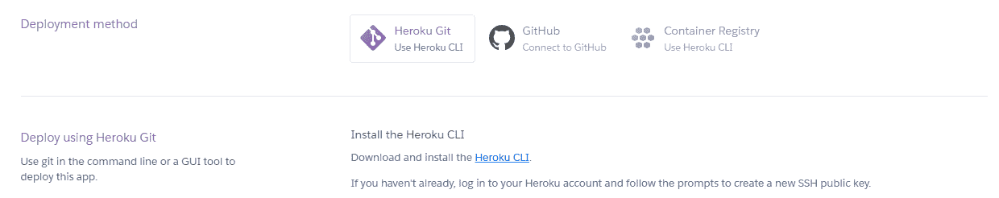

# 使用 Streamlit 的 EDA Web 应用程序

> 原文：<https://medium.com/analytics-vidhya/among-us-eda-web-application-using-streamlit-3f1a0bd0b8d6?source=collection_archive---------10----------------------->

大家好！我们继续我们的项目，关注来自谷歌的游戏用户评分和评论(见“我们的项目部分”来先睹为快我们以前的项目)。在本次会议中，我们将把我们的[前一个项目](https://www.linkedin.com/posts/rickynauvaldy_among-us-google-play-store-rating-exploratory-activity-6730014182701432832-OY6o)的结果包装到一个 web 应用程序中，并对其进行部署，使其更容易被访问。

如果你错过了，在我们[之前的项目](https://rickynauvaldy.medium.com/among-us-google-play-store-rating-exploratory-data-analysis-e9ee8b419344)中，我们从《我们中间》游戏的谷歌 Play 商店用户评分和评论中做了一个简单的探索性数据分析(EDA)。这些数据是从 9 月 22 日到 10 月 20 日的谷歌 Play 商店用户对美国游戏的评价和评论中删除的。

我们之前的[项目](https://rickynauvaldy.medium.com/among-us-google-play-store-rating-exploratory-data-analysis-e9ee8b419344)的分析和图形制作是以 Jupyter Notebook 为平台使用 Python 完成的。虽然使用 [Jupyter Notebook](https://jupyter.org/) 来探索数据很好，但对于那些更喜欢最终产品而不是过程的非程序员来说，很难访问它。基于这个问题，选择之一是创建一个包含所有需要的最终结果的 web 应用程序。有趣的是，它提出了另一个复杂的问题，因为创建一个 web 应用程序并不容易。幸运的是，我们听说了 [Streamlit](https://www.streamlit.io/) ，这是一个开源库，可以轻松地将 Python 代码转换成 web 应用程序。

# Streamlit 入门

正如 Streamlit 主页所说，它提供了“构建和共享数据应用程序的最快方式，在几分钟内将数据脚本转换为可共享的 web 应用程序，全部用 Python 编写，全部免费，不需要前端体验”。对它感兴趣，我们试一试。即使我们真的很想把 Streamlit 和 Jupyter Notebook 一起用，但还是没有运气做到。相反，我们使用原生 Python 和 [Visual Studio 代码](https://code.visualstudio.com/)作为代码编辑器。在这里先睹为快我们创造了([http://project-streamlit.herokuapp.com/](http://project-streamlit.herokuapp.com/))。

让我们将代码分成三个版本:入门版、基础版和高级版。

## 介绍

作为介绍，让我们使用 Streamlit 创建一个非常简单的 web 应用程序，代码不到 10 行(或者 15 行，如果我们希望代码更容易阅读的话)。我们从安装 Streamlit 包开始。从您的终端(或 CMD，或 PowerShell)，只需执行`pip install streamlit`。之后，我们创建一个项目文件夹(可能在你想要的任何地方)并创建一个 Python 文件(例如`app_basic.py`)。

在文件中，通过添加`import streamlit as st`导入 streamlit 包。假设我们想制作一个“主页”。我们可以在 Python 和 Streamlit 中做到这一点，方法是定义一个包含页面中所有必需组件的函数。我们经常使用的一些 Streamlit 功能有`streamlit.title()`、`streamlit.header()`和`streamlit.markdown()`。正如函数所建议的，调用`streamlit.title()`创建页面标题，`streamlit.subheader()`用于页面标题副标题，`streamlit.markdown()`用于在页面中创建段落。对于命名约定，最好根据页面的用途来命名函数。

创建主页功能

虽然您可以通过添加`if __name__ == '__main__':`并在代码中调用`home()`函数来直接运行它，但我们希望通过将它包装在`main()`函数中来使它更具可伸缩性。总之，我们需要使用 Streamlit 创建一个简单的 web 应用程序，这几行代码如下:

app_intro.py 的完整代码

让我们尝试在本地主机上运行应用程序(即只有您可以访问它)。要运行它，打开终端，并导航到`app_intro.py`的项目文件夹。执行`streamlit run <your-application-name>.py`或本例中的`streamlit run app_intro.py`。瞧啊。您的(可能是)第一个 Streamlit web 应用程序已经启动并运行了！


当您成功运行 Streamlit 文件时，您会看到这样的通知。跟随 [http://localhost:8501](http://localhost:8501) 链接。


您的(可能是)第一个 Streamlit web 应用程序已经启动并运行

## 基础

我们现在想要实现我们之前的项目，以便在我们的 Streamlit web 应用程序中可用。你可能想继续使用相同的文件作为介绍版本，或者你可能想从头开始，你可以自由选择。基本上，我们将复制以前项目的一些部分，并将其调整为在 web 应用程序中显示。

我们首先导入使用 Streamlit 所需的包，以及我们在之前的项目中创建图表时使用的包:

导入必要的包

仍然与前一个项目相同，我们将希望读取 Excel 文件并将其存储为 DataFrame `df`。

正在读取 XLSX 文件

假设我们希望有两个菜单:“主页”(我们在 *intro* 中创建的那个)和“仪表板”(我们希望将图表放入其中的那个)。要创建导航栏，我们可以使用 Streamlit 提供的`streamlit.sidebar.selectbox()`。我们可能还想让页面的标题与我们在侧边栏上创建的菜单相同。如果是这样，我们就需要将`streamlit.sidebar.selectbox()`设置成一个变量，并将其传递给页面函数(即`home(main_mode)`)。

用侧边栏和模式选择修改主功能

我们将稍微修改一下我们之前的 home 函数，这样它将接受一个变量(即`main_mode`)，并在`streamlit.title()`中使用它。

具有模式选择和来自模式的标题的主页功能修改

对于仪表板，我们创建了一个名为`dashboard()`(基于页面目的命名)的新函数，它接受一个变量`mode`。由于我们已经加载了 DataFrame `df`，我们可以使用它并以 Streamlit 方式呈现它。让我们首先创建一个`df.head()`表，显示数据帧的前 5 个数据。

使用 streamlit.table()在 streamlit 中创建表


我们的网站显示侧栏和数据框表

继续讨论`dashboard()`函数，在绘制评级分布图时，我们使用`streamlit.plotly_chart()`而不是像 Jupyter Notebook 中那样使用`fig.show()`，因为它是 Streamlit 的一个函数，接收 plotly 图表并以 Streamlit 的方式绘制。

绘制流线图


评级分布图，基本上与我们在之前的项目中创建的相同

在绘制“一段时间内的用户评级”时，情况也是如此:

绘制图表绘制一段时间内用户评分的简化方式


用户评级随时间变化的图表，基本上与我们在以前的项目中创建的相同

因此，整个`dashboard()`函数将如下所示:

完整的仪表板功能

## 先进的

这与创建图形或图表或数据分析有些无关，但你们中的一些人可能想知道是否有可能在 Streamlit 中实现自定义的 HTML 和 CSS。虽然这是可能的，但我们认为这有点复杂，或者可能只是我们还没有探索太多。请让我们知道你是否有改进我们所做的事情的建议。

听起来很简单，我们试图把我们的个人形象展示在网络上。以下是我们取得的成果:


将图像放入 Streamlit 网站

虽然我们设法做到了，但我们觉得代码有点乱，应该管理得更好。出于研究目的，我们分享了我们所做的。

修改主要是在主代码中加入了`home()`函数和一个附加物。我们定义了`image_path`,以便在图像路径发生变化时更容易维护。

```
image_path = drive_path + 'images/'
```

我们还发现 Streamlit 不能照原样读取图像，我们必须将其编码为 Base64 才能读取图像。在我们通过在导入包部分添加`import base64`来导入库之后，我们创建一个函数`image_to_base64()`来实现代码的可重用性。

我们转换我们团队成员的每张图片，供以后的 html 使用。

我们可以通过调用带有 HTML 代码段参数的`streamlit.markdown()`函数来使用我们的定制 HTML，并将`unsafe_allow_html`设置为`True`。为了提高代码的可读性，我们将 HTML 代码存储在一个变量中，并结合 f 字符串格式，通过将`img`标签中的`src`设置为`src=”data:image/jpg;base64,{avatar_imam}`来获取我们的图像资源。接下来的 6 个成员的其他图像会重复这些内容。

为了让事情顺利进行，我们还必须导入 CSS 和 JavaScript 文件。我们将它包装在一个易于调用的函数中。

并且我们调用了`main()`函数中的函数。

全部完成！我们的图像现在在网上显示得很漂亮。

# 部署到 Heroku

在本地主机上创建了 Streamlit Python 应用程序之后，现在我们尝试通过互联网部署我们的应用程序。部署我们的应用程序的最简单的方法之一是使用 Heroku。它是一个平台即服务(PaaS ),使开发人员能够完全在云中构建、运行和操作应用程序。它易于使用，而且是免费的！

我们首先在[https://www.heroku.com/](https://www.heroku.com/)创建一个 Heroku 账户(或者登录，如果你已经有一个的话)。登录我们的帐户后，我们可以单击“New”按钮，然后单击“Create New App”来部署我们的应用程序。


Heroku 仪表板

我们输入项目名称和我们希望部署应用程序的区域。假设我们将项目命名为“project-streamlit ”,并使用“美国”地区。点击“创建应用程序”制作项目。在本帖中,“project-streamlit”应用程序名称不可用，因为我们已经为该项目使用了该名称。


Heroku 需要几个文件来完成部署，例如 Python 文件本身(例如 app_advanced.py)、Procfile 文件、需求文件和设置文件，我们必须创建这些文件。我们可以使用我们的编辑器(Visual Studio 代码)来制作这个文件。在我们的编辑器上写下`web:sh setup.sh && streamlit run <python-file>`并保存为文件名为 **Procfile** 的文件。在我们的例子中，

创建名为“setup.sh”的安装文件，并编写

最后，我们在编辑器上创建一个新文件，列出我们在应用程序中使用的所有重要包，并将其保存为 **requirements.txt.**

有了这 4 个文件之后，我们就可以部署我们的应用程序了。Heroku 给出了两种部署方案:将我们的 Git 帐户连接到 Heroku，或者使用 Heroku CLI。我们将从网站上演示 Heroku CLI 的使用。Heroku CLI 用于将我们的本地主机连接到 Git，并获取 SSH 公钥以在 Heroku 中部署应用程序。



Heroku 的部署方法选择

在我们的终端(或 Conda 提示符)`heroku login`上写，将我们的本地主机连接到我们的 Heroku 账户。


执行“heroku 登录”的命令行说明

登录后，我们可以按照 heroku 中的步骤在 git 上初始化一个新的存储库。


我们可以按照这些步骤部署我们的应用程序。

1.  写`git add .`
2.  写`git commit -m “First try to deploy application”`(或任何信息性消息)
3.  编写`git push heroku HEAD:master` 并等待处理
4.  如果一切都完成了，我们可以通过编写`**heroku open**`来打开我们的应用程序

瞧啊。我们的应用程序已经部署在 Heroku 上。我们可以访问 https:// <app-name>.herokuapp.com/(或者在我们的情况下[https://project-streamlit.herokuapp.com/](https://project-streamlit.herokuapp.com/))来检查您部署的应用程序。</app-name>

# 结论

我们展示了一种使用 Python 和 Streamlit 创建 web 应用程序的简单方法。我们首先创建了一个简单的 Streamlit web 应用程序，然后使用我们之前的 EDA(谷歌 Play 商店用户评分和评论)作为要放在 web 中的对象，然后在 Streamlit 中实现自定义 HTML 和 CSS。我们还分享了在 Heroku 部署这个项目，这样网络上的任何人都可以访问它，你可以在这里查看。关于 Streamlit，我们还有很多需要学习的地方，但就目前而言，我们对目前的进展感到满意。

# 评论

*   请在此找到这篇文章[使用的源代码。](https://github.com/imbhaskara/project_streamlit)
*   如果您在部署前测试时使用 Anaconda 作为 Python 编译器，您可能会得到一条错误消息`DLL load failed while importing ft2font`。根据我们所做的，我们通过卸载并重新安装`matplotlib`来解决这个错误。您可以通过在终端中执行`pip unistall matplotlib`，然后执行`pip install matplotlib`来实现。
*   您可能会注意到，选项卡中显示的应用程序的标题与项目文件名相同(例如`app_advanced.py`)。因此，请确保您的文件命名正确，如果您想使用空格分隔的标题，请确保在运行 Streamlit(即`streamlit run "Among Us.py"`)时在文件名周围使用双引号。


选项卡上的标题与文件名相同


根据需要进行更改，但在运行 Streamlit 时，请确保在文件名周围使用双引号来分隔标题

*   这篇文章是我和[伊玛目巴斯卡拉](/@imbhaskara)联合撰写的，所以我们将在我们双方的媒体上发表这个故事。也请在这里找到[他的故事](/@imbhaskara/among-us-eda-web-application-using-streamlit-f0dbf88c574d)，如果你不介意，支持我们俩:D
*   随时与我们讨论任何事情:)

## 我们的项目

1.  [美国谷歌 Play 商店用户评分可视化使用 Tableau](https://www.linkedin.com/posts/rickynauvaldy_me-and-some-colleagues-who-graduated-from-activity-6726391392807088128-mYXB) ( [来源](https://public.tableau.com/profile/rahman.firmansyah#!/vizhome/Winthisdatapt_1/Dashboard1))
2.  [美国谷歌 Play 商店评级探索性数据分析使用 Python](https://www.linkedin.com/posts/rickynauvaldy_among-us-google-play-store-rating-exploratory-activity-6730014182701432832-OY6o) ( [来源](https://github.com/rickynauvaldy/eda_among_us)
3.  [美国 EDA Web 应用使用 Streamlit](/@imbhaskara/among-us-eda-web-application-using-streamlit-f0dbf88c574d) ( [来源](https://github.com/imbhaskara/project_streamlit))

## 我们的团队


上图，从左至右:[伊玛目巴斯卡拉](https://www.linkedin.com/in/imam-bhaskara)、[里基·瑙瓦尔迪·鲁利普特拉](https://www.linkedin.com/in/rickynauvaldy/)、[拉赫曼·菲尔曼西亚](https://www.linkedin.com/in/rahman-firmansyah-79283512b)
下图，从左至右:[卡娅·普特拉](https://www.linkedin.com/in/cahyaputera/)、[温娜塔·西亚普特拉](https://www.linkedin.com/in/winata-syahputra/)、[穆哈马德·特奥·希布兰](https://www.linkedin.com/in/teokhibran/)、[阿诺·P](https://www.linkedin.com/in/arnold-p/)