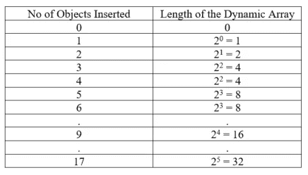
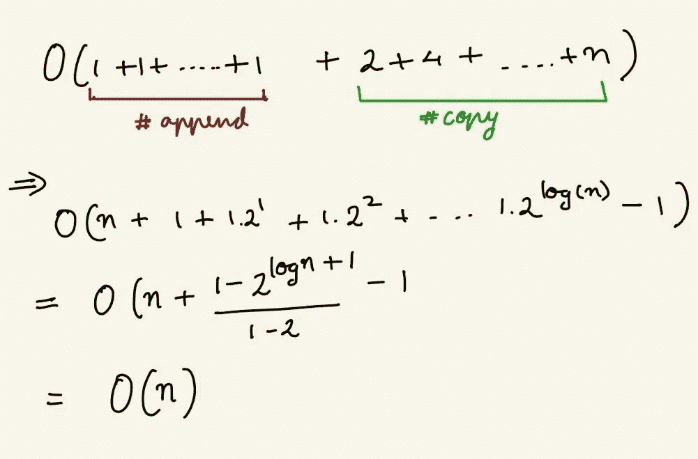
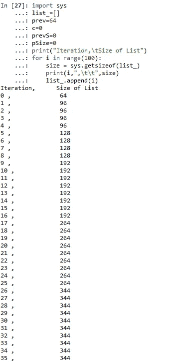
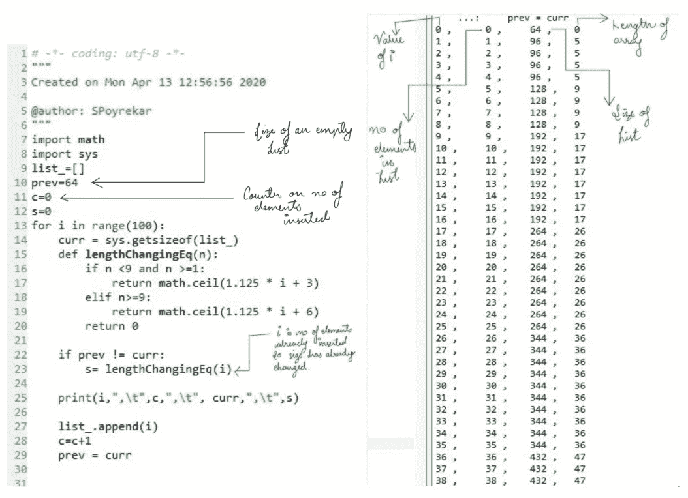
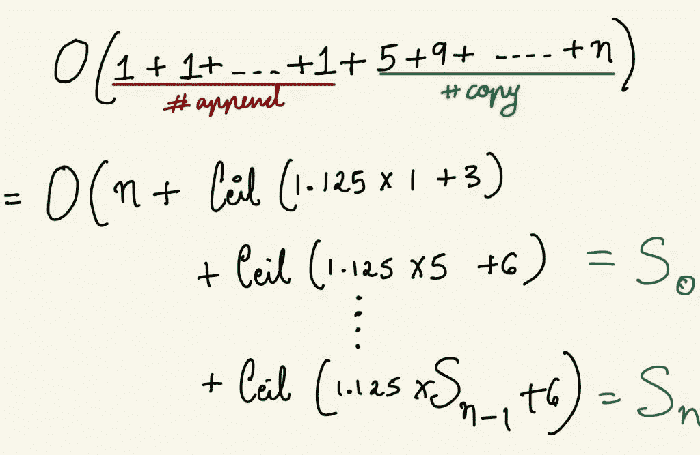
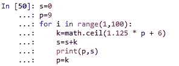
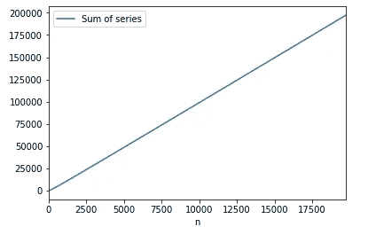

# python 列表的分期运行时分析

> 原文：<https://medium.com/analytics-vidhya/amortized-runtime-analysis-for-python-lists-35e935e290db?source=collection_archive---------17----------------------->

图片来源:真实 Python

今天，在阅读时间复杂性时，我决定关注 python 内部的工作方式。这让我*摊销时间复杂度*以及 Python 的‘list’如何以 O(1)时间计算其插入和删除操作。

如果您熟悉 python，您会知道 python 允许您创建一个列表，而无需在初始化时定义其长度。在大多数编程语言中，如 Java、C/C++等。必须指定数组的长度。

那么 python 如何在没有明确指定长度的情况下创建一个列表呢？是一个无限长的数组吗？

> 列表不是无限存储的数组。

众所周知，在列表中插入一个元素的运行时间复杂度是 O(1)时间。这是不是意味着一个链表有无限的存储块？无限大小的数组在计算上将是昂贵的。想象一下，您的系统为一个列表提供了大量的存储空间，这样它就永远不会耗尽存储空间。

> Python 的“列表”是一种类似数组的数据结构，提供动态调整大小。

列表根据需要调整自身大小，同时仍然提供 O(1)访问。在大多数编程语言中，这是通过在满时将数组的大小加倍来实现的。例如，对于大多数编程语言，动态数组的长度将表现如下。

**将 n 个项目复制到一个新数组的时间复杂度为 O(n)**

由于这种情况很少发生，即当数组长度改变时，插入的最坏情况时间复杂度为 O(n)。

> 那么插入的平均时间复杂度是多少

让我们计算一下将 n 个对象追加到一个动态数组的时间复杂度。

将“n”个对象追加到动态数组的时间复杂度将是时间复杂度简单地为 O(1)的所有情况(*追加*)以及时间复杂度为 O(n)的所有这些罕见事件(*复制*)

> 所以时间复杂度可以写成如下

在动态数组中插入“n”个对象的平均开销是 O(n ),因此一次插入的平均开销是 O(1)。

我们现在可以说，附加一个项目运行在 O(n)中，即平均线性时间。这被称为摊余时间复杂度。因此，分析整个操作(插入 n 个对象)而不是单独分析一个操作的方法称为摊销分析。

## 在 Python 中调整列表的大小

我写了下面的代码来检查 Python 列表在哪里加倍了它的大小。代码将 100 个对象追加到一个列表中，并在每一步计算其大小*(这有助于确定动态数组的长度)*。

图:代码“Python 列表的大小翻倍”

正如我们所见，List *list_* 在 i=0，1，5，9，17，26 时改变其大小……这与当数组长度达到 2 的幂时加倍的等式不同。相反，Python 的等式是

长度= ceil(1.125 * n + 3)当 n ≥1 && n <9

length = ceil(1.125 * n + 6) when n ≥9

This equation is applied only when *n >列表长度*即 n =1，5，9，17，..使用新值 5，9，17，26，…

> 那么插入的平均时间复杂度是多少

类似于上面的等式，将‘n’个对象附加到动态数组的时间复杂度将是时间复杂度简单地为 O(1)的所有情况(*附加*)以及时间复杂度为 O(n)的所有这些罕见事件(*复制*)

> 时间复杂度可以写成如下形式

我试着解方程的第二部分，如果不假设 Ceil(x) ~ x，就找不到具体的数学证明。所以我模拟了上面的操作。

我绘制了“n”对 n 的 Sum os 系列图

等式的第二部分近似收敛到 10 *n。这使得我们在列表中插入 O(11n)的时间复杂度，这仅仅是插入 n 个对象的 O(n)次。

> 通过摊销分析，Python 中的 list.append 取 O(1)。

仅供参考:以 2 的幂将大小加倍的动态数组稍微快一些。