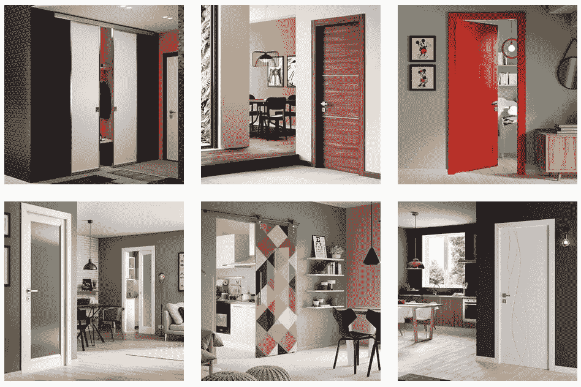
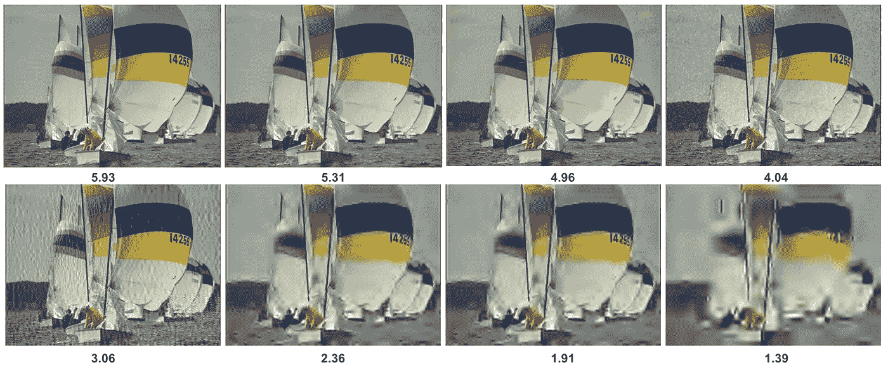

# Instagram 帖子 A/B 测试的人工智能方法

> 原文：<https://medium.com/analytics-vidhya/an-ai-approach-for-a-b-testing-on-instagram-posts-1ccbfa261925?source=collection_archive---------33----------------------->

在过去的几年里，Instagram 的受欢迎程度经历了急剧上升，因为它目前拥有约 5 亿活跃的每日用户。公众人物、有影响力的人和品牌对最大化他们的知名度和他们帖子的病毒式传播感兴趣。考虑到这一点，本文通过对我最近进行的一个案例研究的探索，介绍了一种机器学习方法来估计一篇帖子的潜在影响。首先，让我们将一篇帖子的受欢迎程度定义为点赞数与关注数之比(即一篇帖子的点赞数除以用户的关注数)。

本案例研究考虑了' *Leroy Merlin* '品牌，特别是 *Leroy Merlin Italy* 、 *Leroy Merlin Brasil* 和*Leroy Merlin France；*因此，其**目标**是使用神经网络来评估 Leroy Merlin 账户发布的帖子的受欢迎程度。

# 步伐

以下是将在接下来的部分中探讨的步骤。

1.  Instagram 数据抓取
2.  情感分析
3.  映象分析
4.  培训和绩效评估

为了使神经网络能够提供良好的结果，必须用合适的数据集对其进行训练。因此，前三个步骤专门用于收集和分析将形成数据集的数据。最后，在最后一步中，数据集用于训练神经网络并估计帖子的流行度。代码是用 python 编写的，还有一些基本的库，我将在下一节中引用。

# Instagram 数据抓取

自 2018 年以来，Instagram 一直强烈限制通过 API 访问其数据；加上这个限制，每个用户每小时的调用次数从 5000 次减少到了 200 次，这对于我的目的来说是不够的。为了实现我的目标，我需要上千个帖子的信息；所以我必须实现一个网页抓取器。

对于每篇帖子，我都考虑并下载了以下内容:

1.  描述
2.  喜欢的数量
3.  标签覆盖率(Instagram 用户分享的带有描述中使用的标签的帖子总数)
4.  出版日期和时间
5.  图像共享

我用来实现这个的 Python 库是: [Selenium WebDriver](https://selenium-python.readthedocs.io/) 获取网页， [Beautiful Soup](https://www.crummy.com/software/BeautifulSoup/bs4/doc/) 抓取网页，以及 [Pandas](https://pandas.pydata.org/docs/) 创建一个数据框架。

# 情感分析

图像描述是帖子的重要特征；因此，我决定分析它的情绪，以获得一个区分积极、消极或中性极性的度量，从而假设极性可以影响用户的反应。为了进行分析，我采用了一种基于词典的方法(没有考虑监督或半监督方法等其他技术，因为描述的上下文可能变化很大)。

我选择的词典是 AFINN，它是一个英文术语列表，用介于-5(负面情绪)和+5(正面情绪)之间的整数值进行人工排名。在计算分数之前，我使用谷歌的 API 将原文翻译成英文:帖子的描述由基本句子和短句组成，所以我假设翻译不会影响极性。

[在这里](https://pypi.org/project/afinn/)你可以找到 Python 库来使用 AFINN。

# 映象分析

图片在 Instagram 帖子中起着重要作用。然而，由于图像的主观性质，量化图像的质量和美感并不是一项简单的任务。

为了完成这个任务我考虑了 [*NIMA:神经影像评估*](https://ai.googleblog.com/2017/12/introducing-nima-neural-image-assessment.html) *。*它包括基于不同数据集训练两个卷积神经网络: [TID2013](http://www.ponomarenko.info/tid2013.htm) 用于图像的技术评估，以及 [AVA](http://refbase.cvc.uab.es/files/MMP2012a.pdf) 用于美学评估。出于我的目的，我选择了 TID2013 上训练的模型，因为 AVA 的模型可以处罚门、椅子或 DIY 工具的照片，因为它们的审美很低，但对 *Leroy Merlin 的追随者来说仍然很有趣。*

勒罗伊·梅林邮报

模型的输出是介于 1(坏图像)和 10(完美图像)之间的分数。

使用 NIMA 对来自 [TID2013](http://www.ponomarenko.info/tid2013.htm) 数据集的一些示例进行排序。预测的 NIMA 分数显示在每个图像的下方。

我使用了 idealo.de 的一个实现，因为他们成功地使用 NIMA 为他们的酒店价格比较门户网站排列了数百万张酒店照片。

# 最终数据集和培训

为了创建最终的数据集，我考虑了从 2018 年到 2019 年 9 月的帖子。我没有考虑更老的帖子，因为 Instagram 不显示关注者数量的历史数据，所以我无法计算过去喜欢与关注者的目标比例。

创建数据集的帖子的功能如下:

1.  帖子描述中的字符数
2.  标签数量
3.  标签覆盖率
4.  时间空档
5.  星期几
6.  自上一篇文章发表以来的时间
7.  描述的情感分数
8.  图像分数
9.  目标:每个关注者的点赞数

职位总数为 1478 个(意大利 Leroy Merlin 290 个，法国 Leroy Merlin 625 个，巴西 Leroy Merlin 563 个)。不考虑包含视频的帖子。

我将数据集划分如下:75%用于训练集，15%用于测试集，我训练了一个基于多层感知器模型的神经网络，其中:输入层是帖子的特征，有 6 个隐藏层，分别由 128、64、32、16、8、4 个神经元组成，以 *Relu* 作为激活函数，一个神经元作为输出层，以线性激活函数来估计喜欢数与追随者数的比率。
作为优化函数，我选择了 Adam:梯度随机下降法的扩展。

## 表演

为了评估模型的性能，我计算了决定系数 R:

**结果:**

如你所见，该系数的值接近于 0，这是因为估计每个关注者的点赞率是一项非常困难的任务，但考虑到 5%的误差，我获得了 75%的准确率。此外，在分析真实结果和预测结果之间的差异时，我注意到网络往往会低估真实的点赞数。为了突出这种趋势，我从预测中减去了 5%,这使我能够将结果解释为将收到帖子的喜欢的下限，准确率为 85%。

**注意:**提出的模型只是一个起点，在未来的工作中还可以做出许多改进，例如收集更多的帖子或应用 k-fold 交叉验证，比较更多的模型，分析喜欢的数量和评论。最后一节，我建议类似的作品可以从中汲取灵感。

# A/B 测试模型的应用

这个模型可能是自动化 A/B 测试的一个很好的营销解决方案:如果你输入两个与相同主题相关的帖子，但具有不同的特征，如图像或标签，你可以估计这两个帖子中哪一个在喜欢方面更成功。

# 类似的研究

*   "[insta gram 上图片和视频的人气预测](https://ieeexplore.ieee.org/document/8387246)"；作者:Alireza Zohourian，Hedieh Sajedi，Arefeh Yavary
*   "[调查 Instagram 内容用户参与度影响因素的综合框架](https://ieeexplore.ieee.org/document/8780511)"；
    作者:Harits Muhammad，Faishal Wahiduddin，Nur Fitriah Ayuning Budi，Achmad Nizar Hidayanto
*   "[用机器学习的方法来分析和预测带有图片的推文的流行度](https://link.springer.com/chapter/10.1007/978-3-030-02131-3_49)"；
    作者:Nimish Joseph，Amir Sultan，Arpan Kumar Kar，P. Vigneswara Ilavarasan
*   "[衡量社交媒体影响者指数——来自脸书、Twitter 和 Instagram 的见解](https://www.sciencedirect.com/science/article/abs/pii/S0969698919300128)"；作者:Anuja Arora，Shivam Bansal，Chandrashekhar Kandpal，Reema Aswani，YogeshDwivedi
*   "[随机森林利用帖子相关和用户相关特征进行社交媒体流行度预测](https://dl.acm.org/doi/10.1145/3240508.3266439)"；
    作者:黄飞涛，陈军红，林泽航，，康