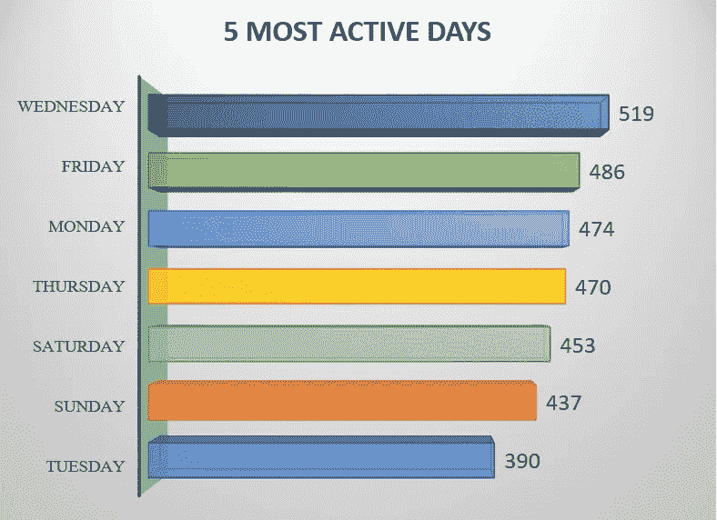
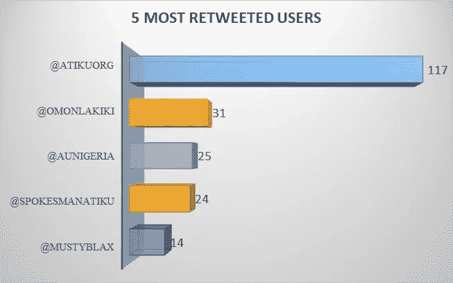

# 用 MS Excel 分析一个 Twitter 用户的每日推文

> 原文：<https://medium.com/analytics-vidhya/an-analysis-of-daily-tweets-of-a-twitter-user-with-ms-excel-a5695c13245c?source=collection_archive---------27----------------------->

使用了一个 6 年的数据集，其中包含了一个匿名 Twitter 用户(X 先生)的 tweets 活动，这个数据集是由我的 LinkedIn 连接在他的帖子上提供的:Paschal Chukwuemeka Amah(注:他经常丢弃数据集，以使数据爱好者忙碌起来并接受挑战)。

我知道你可能想看一看数据集，更好的办法是拿到它并尝试一些东西。对吗？ [*在这里获取数据集*](https://drive.google.com/file/d/13uaPvE2wzB-6zO1ZYkxA5jI1JzdnCEEF/view?usp=sharing) **⬅️**

**使用 MS Excel 分析 Twitter 用户的每日推文**

本文中的这个仪表板提供了以下问题的答案:

**1。**平均来说，他们一天发多少条微博？
**2。**他们用什么设备发微博？
**3。**受试者发微博最活跃的前 5 天。
**4。他们在一天中的前 5 个小时发什么微博？
**5。**他们转发帖子最多的是哪 5 个人，每个人转发了多少条？
**6。**推文数量和转发数量。
**7。他们在几月几日发了最多的微博，发了多少条？
**8。**使用最多的 10 个标签是什么？****

> ***日均推文***

在 2014 年，推特低于平均水平，而其他年份则大大高于平均水平。此外，据观察，2016 年记录了迄今为止最高的推文。

> D ***用来发微博的设备！***

**从甜甜圈图中可以很明显地看出，iPhone 最常被用来发推文，占使用设备总数的 96%** 。

> ***最活跃天数***

**周三**在一周中有最高的推文活动，其次是周五和周一，而周二记录的推文数量最少。

> ***前 5 小时***

到早上 7 点，推文达到高峰，可能是因为个人还没有恢复工作或生意，学校还没有上课。到上午 8 点和 11 点以后，由于用户忙于一天的事务，推文数量迅速减少。然后到了下午 5 点到 7 点，推文数量再次增加。

> ***被转发最多的推特用户***

**政治**会谈及其争议肯定是 *@atikuorg* 推文比其他推文获得更多关注和转发的原因。LOL。

> ***推文总数&转推***

> ***日&月推文数量最高***

> ***十大标签***

这是我从数据中得到的所有见解，但这还不是全部。您可以研究这些数据，自己找出更多信息。

如果你有，请与我分享😁

你可以在*[*LinkedIn*](https://www.linkedin.com/in/kolawole-alabi-35654b85/)*上找到我。**

**在*仪表盘(Excel 文件)中可以*找到* [*这里*](https://drive.google.com/file/d/1TBsjW-wBVVoS9HFu56plcMDNZMhvrgtl/view?usp=sharing)*

*感谢您的阅读。*