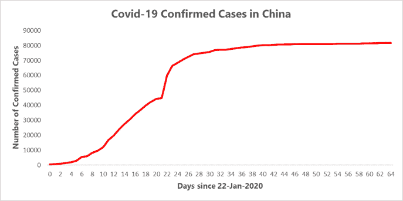
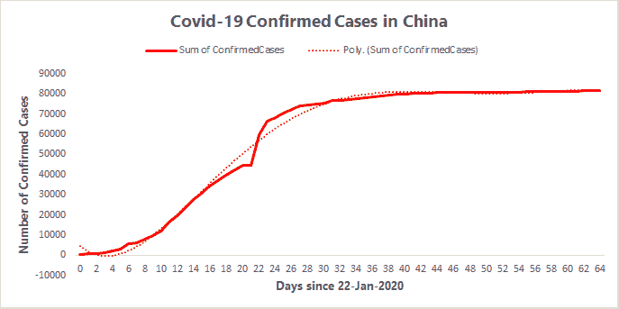
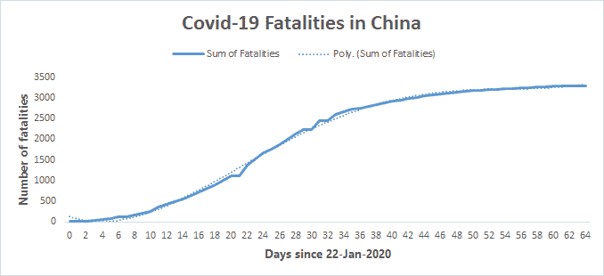
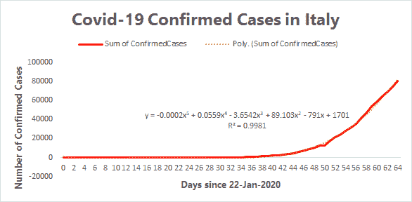
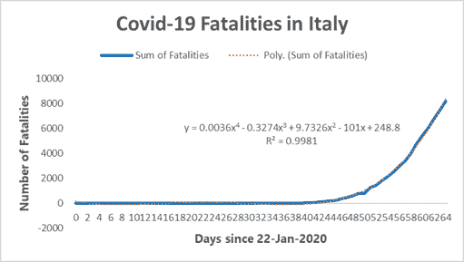
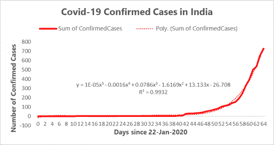
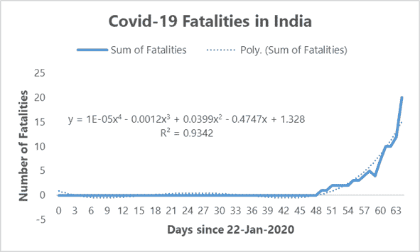
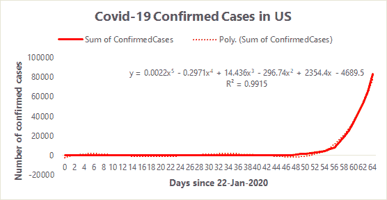
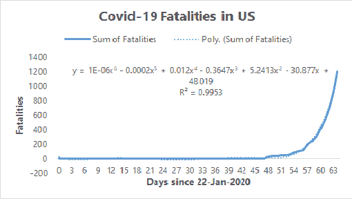

# 用曲线拟合预测电晕扩散的尝试

> 原文：<https://medium.com/analytics-vidhya/an-attempt-to-predict-corona-spread-using-curve-fitting-f5954cff5e?source=collection_archive---------19----------------------->

Viktor Forgacs 在 [Unsplash](https://unsplash.com?utm_source=medium&utm_medium=referral) 上拍摄的照片

冠状病毒或新冠肺炎是最近困扰人类的疫情病毒。它是否是人工制造的，或者是自然界的一种奇特现象，或者是自然界恢复平衡的一种手段，我们不得而知。我们也不知道病毒传播的速度有多快，也不知道什么时候会结束。

因此，我决定使用一种简单的方法——曲线拟合来拟合累积电晕确诊病例和死亡人数的多项式方程。

我用 Microsoft Excel 绘制了冠状病毒在各国的传播情况，然后用 Microsoft Excel 的趋势线功能拟合了一个多项式方程。这个练习的数据来自于 [Kaggle](https://www.kaggle.com/c/covid19-global-forecasting-week-2/overview) ，它也在进行同样的竞赛。我对中国、意大利、印度和美国进行了这样的研究(汇总国家层面的数据，然后拟合一条曲线)。

首先让我们看看中国。

当我们用 Excel 绘制趋势线时，

该曲线的方程式如下所示

y =-0.0016×5+0.3116×4–22.452×3+655.91×2–4450.9 x+8330.9

R 平方值为 0.9932。

有趣的是，这是一个五阶多项式。

当我们看死亡人数时，

有趣的是，这是一个四阶多项式，等式为

y = 0.0014×4–0.2183×3+10.288×2–85.324 x+205.12

R 平方值为 0.9981。

**意大利**

这也是一个 R 平方为 0.9981 的五阶多项式。

谈到死亡，我们再次看到一个四阶多项式。

**印度**

印度和上面没什么区别。这是确诊病例和死亡人数的图表。

五阶多项式拟合该曲线。

**美国**

美国的情况略有不同。确诊病例是五阶多项式，而死亡病例是六阶多项式。

**结论**

除了中国的数据之外，大多数国家都显示出上升的趋势，看来这条曲线要变成 S 型曲线并趋于平缓还有一段时间。

希望随着更多数据的出现，可以开发更好的模型来预测传播并确定传播的原因。