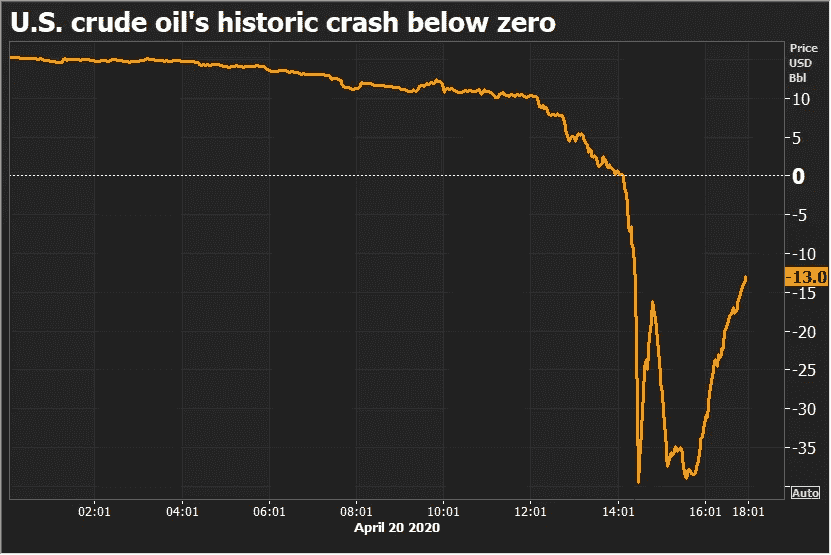
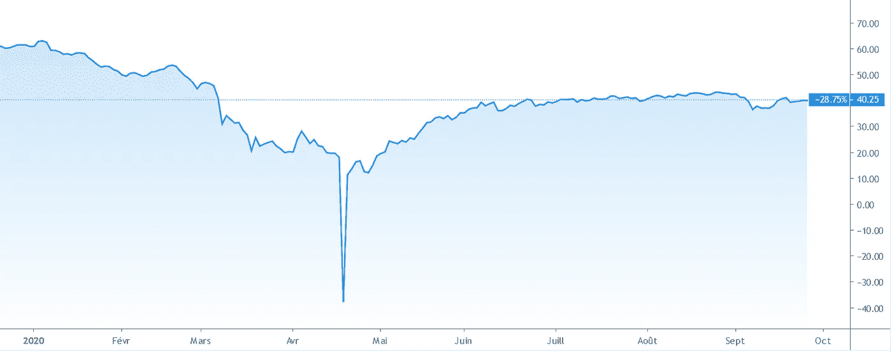
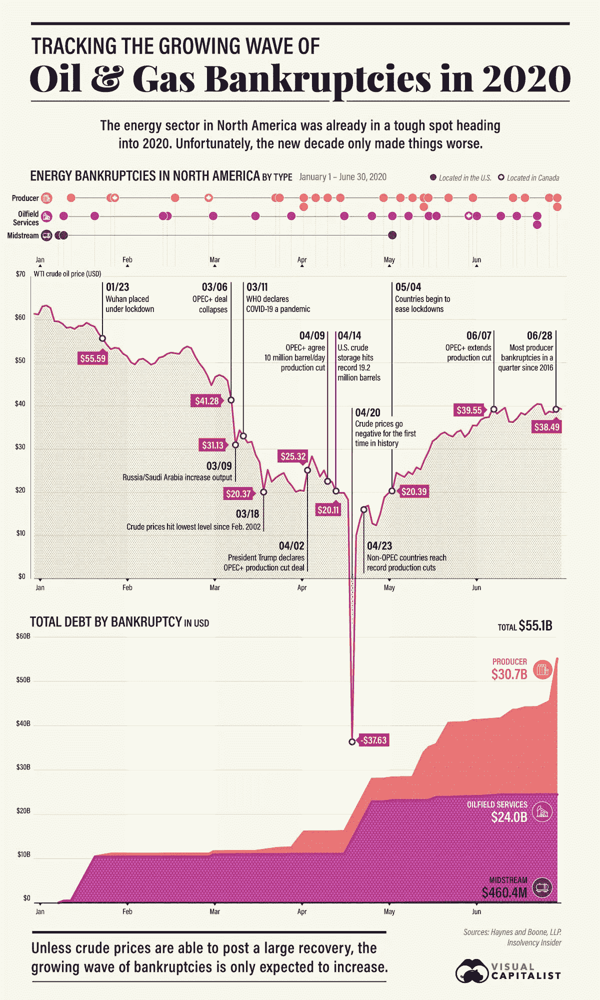
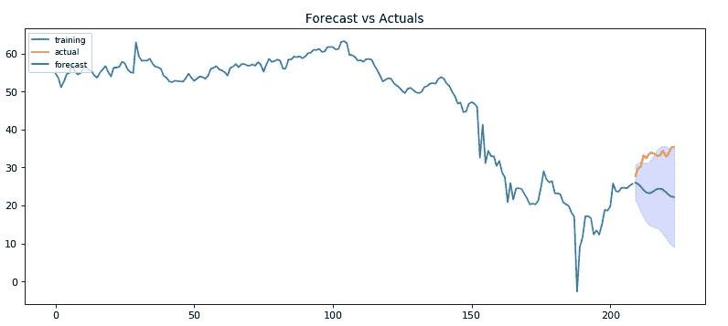
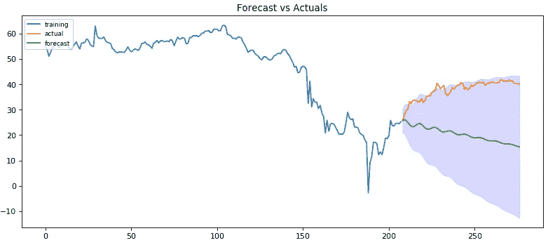
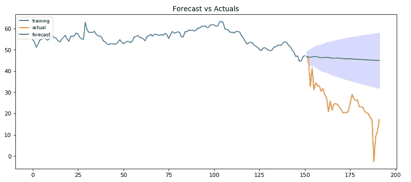
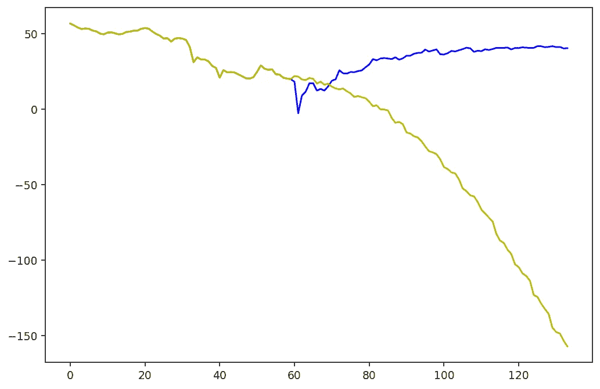
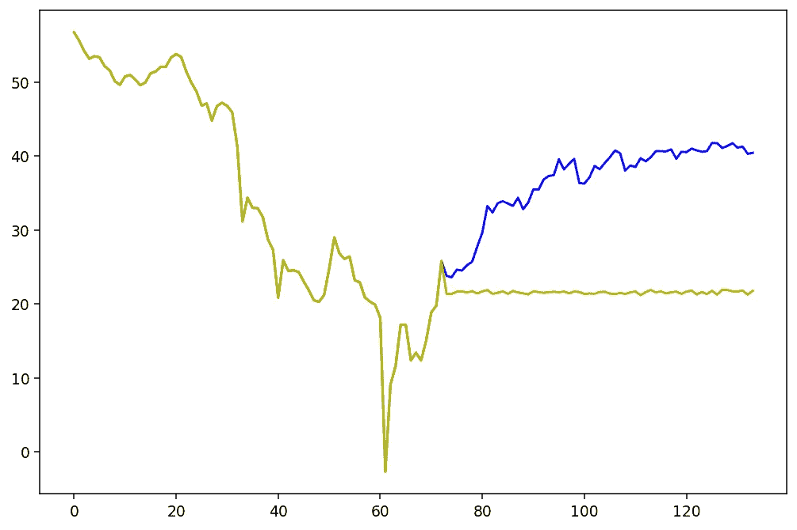
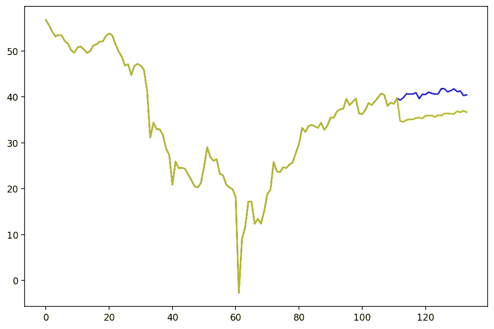

# 全球危机期间预测石油期货价格的尝试

> 原文：<https://medium.com/analytics-vidhya/an-attempt-to-predict-oil-futures-prices-during-a-global-crisis-a08aa3e23350?source=collection_archive---------14----------------------->

今年尤其令人惊讶和动荡。在不到 10 个月的时间里，我们目睹了一种未知疾病的爆发，这种疾病停止了全球经济，并使世界重新陷入衰退。工人和学生被迫适应并在家工作。在相对较短的时间内，重大的转变戏剧性地改变了我们的现代社会。这种前所未有的情况为更好地理解这些变化背后的关键驱动因素留下了大量的研究空间。作为帝国理工学院最后一年的交换生，我们在今年夏天进行了一个与定量金融相关的研究项目。学生总是从过去的事件中学习，尤其是以前的危机往往是我们学习最多的时期。今年的金融市场是一个教科书式的案例。事实上，它们在 2020 年 1 月经历了历史高点，然后在 3 月跌至 2008 年以来的最低水平。与此同时，油价卷入了一场激烈的价格战，除了导致全球需求下降之外，还导致 4 月 21 日 WTI 期货价格下跌。

在与 MyDataModels 的合作中，我们领导了一个项目，重点是 2020 年第三季度和第四季度石油期货的预测以及 WTI 期货与新冠肺炎价差的相关性。一方面，预测首先是根据时间序列模型 ARIMA 开发的，然后是 MyDataModels 提供的机器学习。

石油价格战和 COVID19:一杯爆炸性鸡尾酒

今年 3 月，世界上最大的石油生产国石油输出国组织和俄国本应重新谈判他们在全球范围内的石油生产协议。今年早些时候，在一月份，新冠肺炎开始在中国蔓延，并迅速蔓延到整个亚洲。这种病毒长期以来被发达国家低估，特别是在欧洲和美国，其他过去的大流行如 SRAS 被认为是类似的。我们目睹了一个与我们作为西方人所期待的完全不同的场景。随着欧洲国家受到病毒的严重打击，政府对其人口实施了严格的限制，为全面封锁铺平了道路。

我们的世界几乎完全依赖石油来维持我们无限增长的引擎运转。因此，黑金一直被认为是一种重要的资源，价格相对较高，几乎完全会随着其生产商周围的政治气候而波动。另一方面，需求冲击从未被视为对油价的威胁。在封锁期间，人们几乎没有理由使用他们的汽车，飞机旅行被禁止以控制病毒，货物运输在全球范围内大幅放缓，石油消费本应消失。注意到这一点后，石油输出国组织领导人沙特试图加快与俄罗斯的协议谈判，以降低石油产量，从而抵御即将到来的危机。另一方面，俄罗斯认为这种方法只会让美国竞争对手页岩生产商受益，因此拒绝了这笔交易。这是理性下台，把王冠让给个人主义和利己主义的时候。作为回应，沙特阿拉伯对俄罗斯发动了一场油价价格战，将日产量提高了 260 万桶，尽管未来几个月全球对石油的需求将会减少。3 月 13 日，也就是市场崩溃的 3 天前，英国《金融时报》发布了一段解释价格战的短片，让人们了解了当时人们的预期:“现在怎么办？油价有所回升，但没人知道情况会变得多糟。主要的石油公司正在为长期的低价做准备。[……]石油市场再次为最坏的情况做准备。”事实果真如此吗？

图 1:2019 年 12 月以来的 WTI 期货价格，来源雅虎财经。

1 中的图表显示了与沙特阿拉伯和俄罗斯之间的价格战有关的 3 月至 4 月的经济低迷。4 月 2 日，美国总统唐纳德·特朗普向沙特阿拉伯施压，要求其与俄罗斯达成减产协议，以防止油价继续下跌，因为这对美国石油生产商的损害将是致命的。4 月 9 日，石油生产商之间签署了一项协议。他们同意将日产量减少 1000 万桶(这是油价暴跌前的最高水平)。将于 5 月交割的石油期货(4 月 21 日到期)进入了非常高的期货溢价状态，其价格高于交割时商品的实际预期价格。由于不存在的石油需求以及不堪重负的储存能力，5 月 WTI 期货价格在 4 月 20 日成为负数。在打击石油市场的所有金融危机中，这一次是教科书式的案例，它是导致死胡同的外部因素的混合。特别要指出两件事:第一，储存能力是建立在一个永远不会完全停止的预期活动之上的。当产能满了，石油不仅不值钱，而且对生产者来说是净损失，因为它必须被扔掉。第二，与之前的石油危机相反，当时投资者正在建立石油储备，以等待价格再次上涨，封锁阻止了这种行动。甚至对这些产品的投机都是不可能的，这使得 WTI 期货成为一种负担。

为什么瞄准 2020 年下半年预测油价？

今年 3 月，我们目睹了一种我们的社会不习惯的行为:缺乏控制导致的恐慌。大多数发达国家的政府过去和现在都没有比关闭整个经济以防止病毒传播更好的解决方案。全世界的卫生系统都无法承受几乎瞬间发生的患者流中的高冲击。此外，医院的专业人员必须小心谨慎，不要让自己感染病毒。随着实体经济在今年消失了两个月，许多公司也将面临问题。如下图 2 所示，人们已经注意到高额债务，尤其是遭受石油危机重创的产油国。

图 2:能源行业的破产。

我们对当前问题的看法是，当每一家卫生公司都在竞相将疫苗商业化时，世界却在停滞不前。因此，由于封锁近一年对任何国家来说都是不可持续的，我们预计在夏季会有一段时间限制会放松。因此，我们预计这些国家的 COVID 19 病例随后会出现新的上升，导致可能再次考虑封锁的情况(现在我们又到了欧洲！).在这种情况下，我们可能会再次处于石油可能处于困境的境地。

与此同时，市场金融在很大程度上依赖于定价假设，即大多数投资者共享大量信息来指导他们的决策。因此，金融产品的价格应该反映所有公开的信息。我们当时认为，最直观的新冠肺炎结果应该已经反映在金融产品中，尤其是石油。

石油期货预测实践；

这个项目旨在对油价进行三种不同的分析。首先，我们想使用时间序列 ARIMA 模型，用 1 年的数据(收盘时，来自雅虎财经)预测去年 4 月 WTI 期货的崩盘。这里的想法不是创造一个神奇的模型，而是看看是否有一个短期趋势可以给出一个下降趋势的暗示，其来源不同于价格战。ARIMA 模型是一类帮助预测未来数据点的模型。它的优点是提供的预测依赖于它们过去的值以及它们的滞后误差。这种组合提供了更可靠的预测。此外，这是一个特别适合于非平稳数据集的模型，更适合于此类假设为假的危机时刻。其次，我们用同样的模型对 2020 年下半年进行了预测，看看市场是否有意无意地预测到了石油的第二波困难时期。我们在这一部分的结果没有多少稳健性，因为这个模型不够复杂，不足以理解市场的所有复杂性。此外，时间序列模型也分担了过于看重最近的过去值的负担。最近一次戏剧性的下跌，如市场崩盘，将对短期预测产生太大影响。人们可以考虑改进这项研究，增加一个随着时间和病毒传播而变化的非恒定权重因子。此外，人们可以添加虚拟变量，以关注特定事件(如破产、IPO 流产等)中的行业。

最后，当我们面对时间序列模型预测的不一致性时，我们希望使用更复杂的模型和其他变量，以便更好地理解石油期货背后的运动。MyDataModels 的产品 TADA 是一种机器学习算法，旨在对小数据集执行。在我们专注于短时间窗进行研究的情况下，这种特异性是一个理想的优势。作为一种输入，我们考虑了从 1 月 22 日起每天不同国家的新冠肺炎病例数的变化(由约翰霍普金斯大学提供)。我们按地理区域收集数据:欧洲、中东、北美、南美、亚洲和大洋洲。此外，我们还考虑了同一时期的 VIX 指数，以代表投资者对每天全球形势的看法。恐惧指数通常被认为是趋势反转的指标，因为当市场变得看跌或波动时，它会增加。我们向 TADA 提供了干净的数据，以便预测 WTI 价格，它应该选择最能解释我们所考虑期间油价变动的输入数据。为了测试算法的准确性以及我们获得的结果背后的合理性，我们决定为训练集设置不同的时间窗口:从 1 月 22 日到 3 月的崩溃，然后到 4 月的崩溃，最后从 1 月到 7 月。正如所料，随着训练集规模的增加，解释变量的选择变得更加合理。

另一方面，我们也注意到，像时间序列模型一样，训练集的规模不足以让 TADA 在预测中不要过多考虑最近的撞车事故。在本文的最后，在图 3 至图 5 和图 6 至图 8 中，我们提供了通过我们的模型计算出的一些估计值。首先，两个模型之间的一个主要区别是结果的稳健性。在 ARIMA，预测曲线过于平滑，甚至无法逼近 WTI 价格的走势，而 TADA 似乎在预测中融入了随机行为。ARIMA 和 TADA 非常依赖于过去的结果，并且非常重视过去的短期数据。在 ARIMA，这种趋势较弱，但在所有预测中都存在。例如，在图 3 中，我们看到从 8 月 4 日到 19 日的价格预测实际上是向下倾斜的，而同期的实际价格是上升的。在 TADA 的例子中，算法对最近的数据进行加权，图 6 完美地指出了这一点。如果价格下跌，那么模型预测价格会持续下跌至∞。即使在图 7 和图 8 中，我们也可以看到碰撞的影响在算法的预测中仍然占很大比重。在我们看来，我们假设 TADA 已经被建造来以不同于金融模型的生物/基因模型适当地运转。我们相信，除了修改我们无法访问的源代码之外，我们可以通过改进输入数据来解决或至少软化这个问题。例如，可以尝试实现一个时变系数，该系数应该对短期趋势增加较少的权重，并尝试向 TADA 显示长期趋势。换句话说，我们可以在模型中加入一种势头趋势过滤器，帮助我们改进预测。此外，图 8 提供了有希望的结果，因为与图 4 相反，这次预测与实际价格方向相同。

图 3:ARIMA 从 8 月 4 日开始的 15 天预测

图 4:训练集结束后，崩溃，预测与 ARIMA 模型

图 5:训练集在崩溃前结束，用 ARIMA 模型预测

图 6:训练集在崩溃前结束，用 TADA 模型预测

图 7:泰宁集崩盘后不久结束，用 TADA 模型预测

图 8:训练集在崩溃后很久才结束，用 TADA 模型预测

可以进一步改进的浅显研究

一个月前，欧洲国家再次开始对公共场所、餐馆、酒吧和健身房实施限制。德国和英国等国家对来自法国和西班牙等国家的游客实施了限制。大多数欧洲国家现在处于严格的宵禁或封锁状态。我们在三月份想象的情况是可以想象的，这突出了我们工作背后的直觉。然而，我们低估了各国政府维持经济以尽可能减轻即将到来的经济危机的意愿。从这个意义上来说，我们认为石油需求会出现新的负面冲击，但直到现在，世界还是设法避免了这种冲击。

这个项目是我们在帝国理工学院的学年完成的一部分，但是我们采取的方法可以改进，我们相信，可以提供有趣的结果。这个主题也让我们相信我们可以分解信息对金融市场的影响。例如，3 月 16 日，市场对新冠肺炎对发达经济体的影响进行了定价。我们可以进一步研究对一些公司股票价格的影响。尤其是科技股，从今年 3 月到现在的反弹突显出一种转变，即现在众所周知的传统实体经济向虚拟经济的转变。随着企业债务水平达到令人担忧的水平，许多企业很有可能在未来几个月面临破产。预测是至关重要的，尤其是在小数据集上，它们的灵活性将提高我们对未来肯定会遇到的危机的适应性。TADA 是一个理想的例子，它展示了在这方面进一步发展的潜力。

您可以通过以下链接找到完整的论文:

https://www . scribd . com/document/485636939/Prediction-of-Oil-Futures-Prices-Benjamin-Claverie