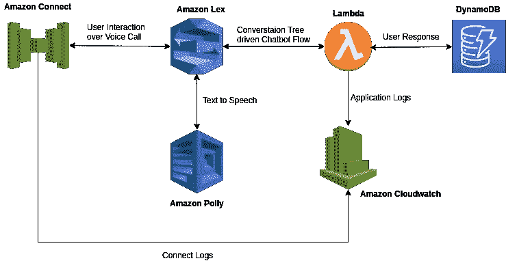

# 一个自动语音呼叫聊天机器人📲(第 3 部分):如何使用 AWS Lambda 函数驱动 Amazon Lex Bot

> 原文：<https://medium.com/analytics-vidhya/an-automated-voice-calling-chatbot-part-3-how-to-drive-amazon-lex-bot-using-an-aws-lambda-59273c17e82d?source=collection_archive---------4----------------------->



这篇博客是系列博客的继续，在这些博客中，我描述了我如何通过语音呼叫实现聊天机器人来自动化单调的呼叫。你可以在这里找到[](/@abhi3072/an-automated-voice-calling-bot-using-amazon-lex-amazon-connect-amazon-polly-and-aws-lambda-1b72bf1e8f71)*的完整实现概述。*

*这将详细说明我如何使用一个 **AWS Lambda** 函数来驱动我的聊天机器人中的对话流，该聊天机器人使用 **Amazon Lex 构建。***

# *为什么需要使用自定义逻辑来驱动 lex 聊天机器人？😐*

*如果聊天机器人是个性化的，并为用户提供相关的上下文，那么它会更有效，使用 Amazon Lex 实现开箱即用将意味着您将错过每个用户的个性化位，因为在执行槽填充操作时，您只能针对每个槽配置通用话语。这就是自定义逻辑派上用场的地方，因为使用它，您可以通过利用根据每个用户的上下文解析的占位符属性，轻松地将用户的上下文个性化并嵌入到聊天机器人中。*

*除了自定义逻辑带来的个性化方面，我使用它的整个灵感是制作一个更通用的个性化聊天机器人框架，它可以在各种用例中重用，而无需对 Amazon Lex Bot 或驱动它的自定义逻辑进行任何修改。这有助于避免为每个用例创建一个独特的 Amazon Lex Bot 和 AWS Lambda 对，因为您可以很好地利用单个对。*

# *好吧！我知道为什么需要定制逻辑，但是我如何将它与我的 Amazon Lex Bot 集成在一起？😕*

*嗯，这很简单，amazon lex bot 中的每个 intent 都有两个 Lambda 挂钩，一个执行**初始化和验证**，另一个执行 intent 的**实现**动作。*

## *这两个挂钩有什么不同？*

*不同之处在于当这些钩子被执行时，一个**初始化和验证**钩子随着每个用户响应被执行，而**实现**钩子仅在一个意图被实现并且一个后实现动作被执行之后被执行。*

## *那么，哪一个是驱动我们的定制逻辑的更好的选择呢？*

*由于每个用户响应都要调用定制逻辑，这意味着我们应该使用**初始化和验证** lambda 钩子来驱动我们的 Amazon Lex Bot 定制逻辑。*

## *我们如何在 Lambda 函数中接收请求？*

*该请求以 Amazon Lex 指定的 JSON 格式作为 Lambda 事件接收。格式如下所示。*

```
*{
  "messageVersion": "1.0",
  "invocationSource": "DialogCodeHook",
  "userId": "user_id",
  "sessionAttributes": {
    "attribute1" : "attribute_value_1"
    "attribute2" : "attribute_value_2"
    "attribute3" : "attribute_value_3"
  },
  "bot": {
    "name": "BotName",
    "alias": "$LATEST",
    "version": "$LATEST"
  },
  "outputDialogMode": "Speech",
  "currentIntent": {
    "name": "IntentName",
    "slots": {
      "slot1" : "slot_value_1"
      "slot2" : "slot_value_2"
      "slot3" : "slot_value_3"
    },
    "confirmationStatus": "None"
  }
}*
```

*正如你在上面看到的，请求有 3 个主要部分，**会话属性**、**当前意图元数据**和**用户元数据**。这些共同构成了 Amazon Lex Bot 的对话上下文*

## *我们现在如何从 Lambda 响应来指示机器人必须执行某个动作？*

*这里的想法是以 Amazon Lex 能够理解的格式返回一个响应，我们基本上有两个动作需要从我们的自定义逻辑中执行，这两个动作表示 Amazon Lex。*

1.  *请亚马逊 Lex 引出一个特定的槽。*
2.  *请 Amazon Lex 将意向标记为已实现。*

*这两个动作都可以通过返回 Amazon Lex 定义的特定响应结构来实现。响应以 JSON 的形式发送回来，结构如下。*

*要引出特定的槽:*

```
*{
 "sessionAttributes": {
 "attribute1" : "attribute_value_1"
 "attribute2" : "attribute_value_2"
 "attribute3" : "attribute_value_3"
 },
 "dialogAction": {
 "type": "ElicitSlot",
 "intentName": "intent_name",
 "slots": {
 "slot1" : "slot_value_1"
 "slot2" : "slot_value_2"
 "slot3" : "slot_value_3"
 },
 "slotToElicit": "slot_to_elicit",
 "message": "message",
 "responseCard": null
}
}*
```

*实现一个意图:*

```
*{
 "sessionAttributes": {
 "attribute1" : "attribute_value_1"
 "attribute2" : "attribute_value_2"
 "attribute3" : "attribute_value_3"
}
"dialogAction": {
    "type": "Close",
    "fulfillmentState": "Fulfilled",
    "message": "message"
}
}*
```

# *好吧！我现在明白了如何将我们的定制逻辑与 Amazon Lex 集成在一起，但是你不是也提到了你编写的定制逻辑是通用的吗？😮*

*是的，为此我创建了一个小框架，可以处理多种用例。我基本上是通过实现一个对话树来实现这一点的，该对话树将根据当前用户上下文和用户响应来决定要引出的下一个响应和要执行的动作。*

*这个想法基本上是有一个会话节点树，它将基于用户的当前上下文和用户在最近的响应中填充的槽来遍历。*

*每个会话节点将由以下属性组成:*

1.  *当前插槽的提示*
2.  *失败提示*
3.  *触发动作*
4.  *插槽值和子会话节点之间的映射*
5.  *要引出的插槽的名称*

*这里的想法是，当到达时，每个会话节点将执行一个**触发动作**，并基于为该会话节点中的当前槽定义的**提示**请求引出一个**槽**。定义的提示包含在一个< speak/ >标签中，这样我们就可以使用 SSML 来配置 **Amazon Polly** 合成这些提示。*

*当用户响应该会话节点时，将填充一个**槽值**，然后基于该槽值遍历下一个会话节点。该槽中的每个槽值将对应于由当前会话节点持有的槽值到子节点的**映射中指定的子会话节点。***

*这样，通过将每个对话表示为一个对话树，就可以概括出驱动聊天机器人的逻辑。*

*要检查会话树的实现以及一些示例会话树配置，请越过 [***这里***](https://github.com/abhinavrohatgi30/an-automated-voice-calling-chatbot/tree/master/lambda/bot/chatbot-configs) 。*

# *酷！但是你也说过你可以个性化聊天机器人，你是怎么做到的？😮*

*是的，正如我之前提到的，个性化可以通过在会话树的每个节点的话语/提示中添加占位符属性来实现，这些属性可以在运行时使用用户的上下文来解析。*

*我通过使用 DynamoDB 数据库实现了这一点，在调用用户之前，我将特定于用户的元数据存储在数据库中，在运行时，我编写的框架会缓慢地获取元数据并个性化我的话语/提示。*

*您可以在存储库 [***这里***](https://github.com/abhinavrohatgi30/an-automated-voice-calling-chatbot/tree/master/lambda/bot/chatbot-configs) 中的对话树配置示例中找到这个。*

*一旦您实现了上述 AWS Lambda 函数，您现在就有了一个可用于驱动 Amazon Lex Bot 的自定义逻辑，在本系列的下一部分中，我们将了解如何将这个 Amazon Lex Bot 与 Amazon Connect 实例集成，以向用户发出出站呼叫并处理来自用户的入站呼叫！*

*敬请期待，并提供一个 ***鼓掌*👏如果你喜欢这个博客！***

*[第 1 部分:用例及架构的简要概述](/@abhi3072/an-automated-voice-calling-bot-using-amazon-lex-amazon-connect-amazon-polly-and-aws-lambda-1b72bf1e8f71)*

*[第 2 部分:如何创建 Amazon Lex Bot](/@abhi3072/an-automated-voice-calling-chatbot-part-2-how-to-create-the-chatbot-in-amazon-lex-ba4a2907e537)*

*[第 4 部分:使用 Amazon Connect 和 Amazon Lex](/@abhi3072/an-automated-voice-calling-chatbot-part-4-using-amazon-connect-with-amazon-lex-bfe5f680dbb9)*