# 一种简单的 web 抓取技术——用 Python 实现交互式 web 图表

> 原文：<https://medium.com/analytics-vidhya/an-easy-technique-for-web-scraping-an-interactive-web-chart-38f5f945ca63?source=collection_archive---------1----------------------->

你浏览一个带有交互式图表的动态网站，它有你下一个数据项目所需的所有数据。你应该如何进行网页抓取？

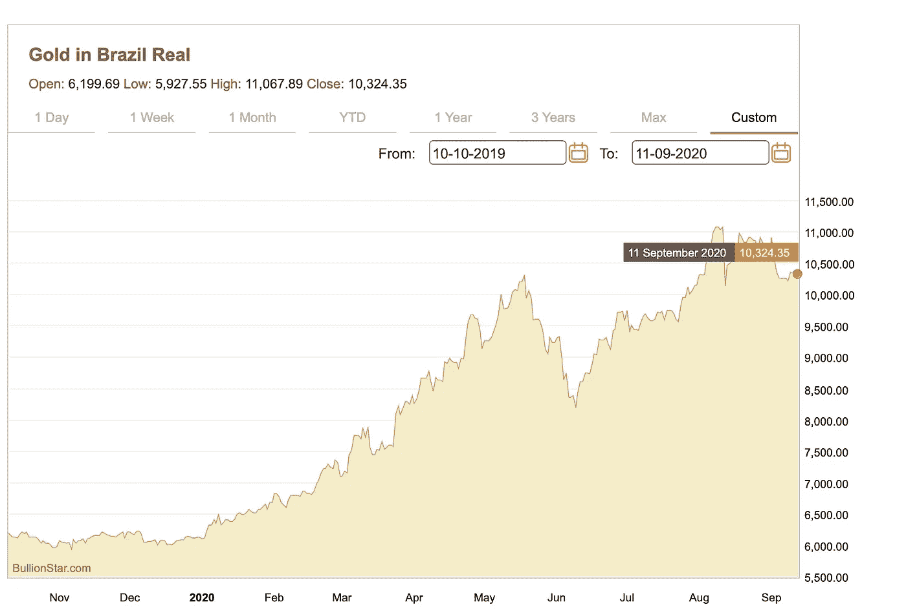

对于这个过程，您只需要两个库

1.  **请求**库
2.  **pandas.io.json** 库→ json_normalize

这个过程的关键是在深入研究 HTML 之前探索网站的网络选项卡。

对于本文，巴西雷亚尔的黄金价格将从 bullionstar.com****刮出，日期在 2019 年 1 月 1 日至 2020 年 11 月 9 日之间。****

## ******步骤******

1.  ****右键单击并单击检查****

****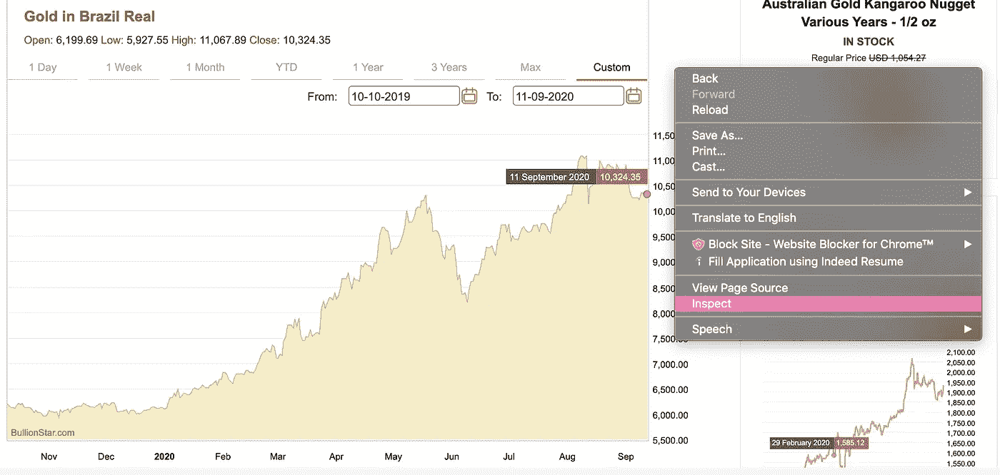****

****2.重新加载页面并单击网络选项卡****

****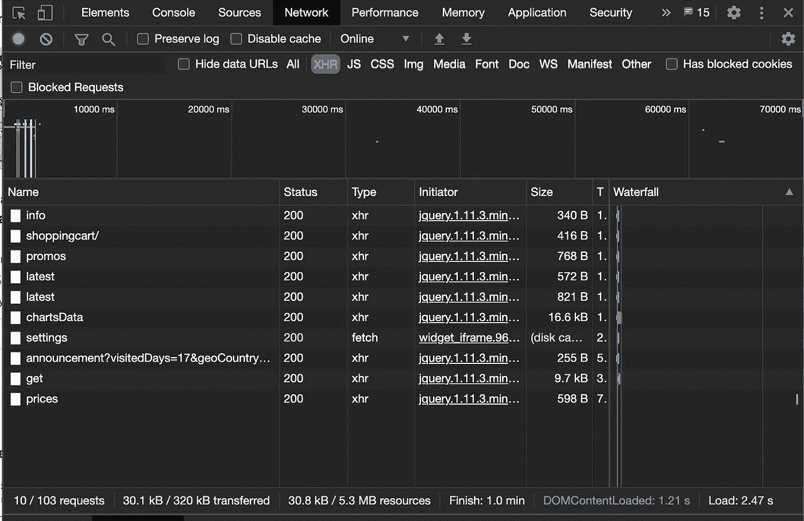****

****3.这是需要锻炼你的调查技巧的部分！****

****确保单击 XHR 选项卡，它是一个 API，以对象的形式在 web 浏览器和 web 服务器之间传输数据****

****在 XHR 选项卡中，通过查看预览选项卡，浏览不同的对象以查看是否包含 web 图表数据。****

****经过一番挖掘，我能够在预览选项卡下的" **chartsData** "对象中找到 web 图表**数据系列**。****

****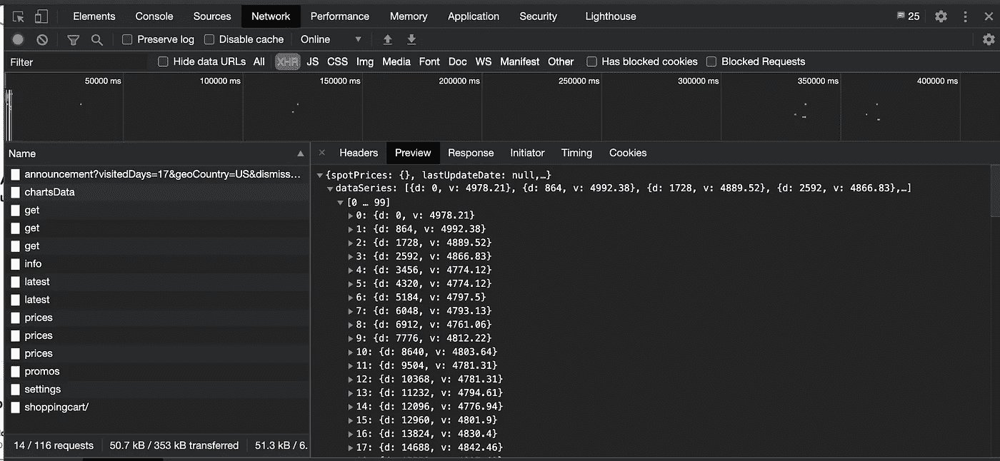****

****4.现在让我们回到**标题**选项卡，找到请求方法所需的**四个参数******

****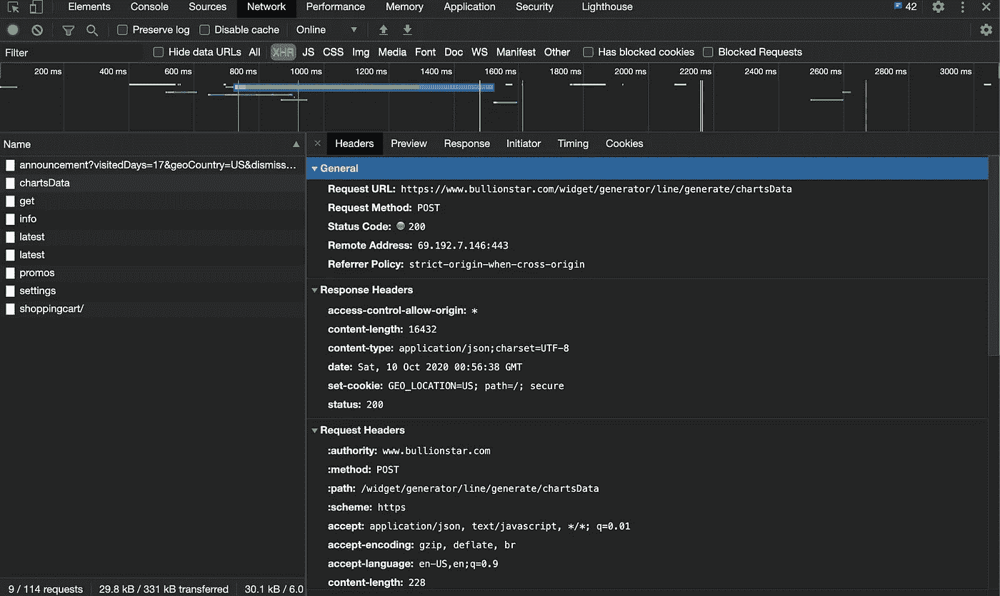****

****请求 URL: 请求的 URL****

****[https://www . bullionstar . com/widget/generator/line/generate/charts data](https://www.bullionstar.com/widget/generator/line/generate/chartsData)****

******b .请求方法:**用于向服务器发送数据，以创建/更新资源****

****邮政****

******c.Headers:** 发送到指定 URL 的 HTTP 头的字典****

****用户代理:****

****Mozilla/5.0(麦金塔；英特尔 Mac OS X 10 _ 14 _ 6)apple WebKit/537.36(KHTML，像壁虎一样)Chrome/85 . 0 . 4183 . 121 Safari/537.36****

******d .表格数据:******

****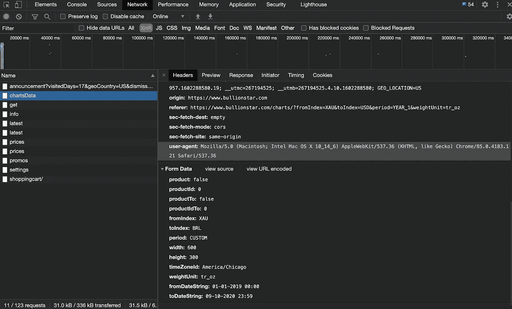****

****5.现在让我们跳入 python 并开始编码****

******一个**。导入相关库****

******b.** 指定 URL 变量****

******c**利用。获取()以提取 cookies****

****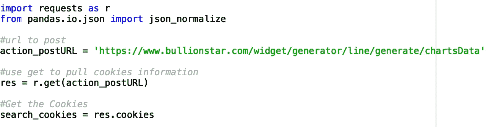****

******d.** 为表单数据和标题指定变量，如下所示****

****将所有四个参数传递给 r.post()****

****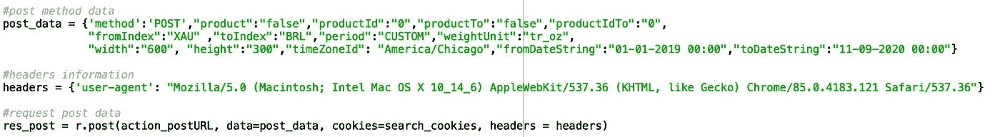****

******f.** 将数据拉成 json()格式****

******g.** 归一化提取的数据，调出特定的数据序列****

****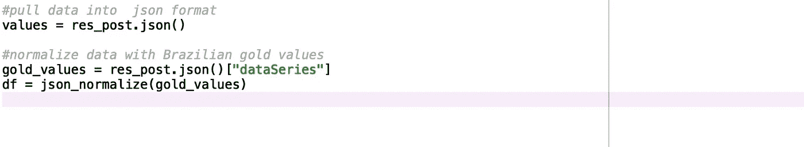********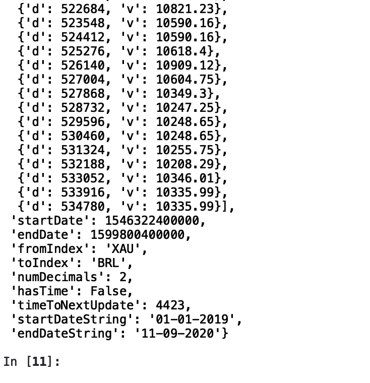****

****运行“值”变量后，巴西雷亚尔的最近 10 个黄金价格快照****

****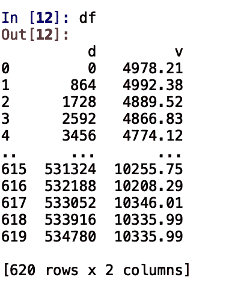****

****标准化的 JSON 格式数据现在位于数据框中****

****现在您可以继续保存到一个 CSV 文件，或者为您的数据项目做进一步的 ETL 工作！****

******注意:**这不是一个尺寸适合所有人，一些网页可能需要。get()或者使用 Beautifulsoup 库甚至 selenium，但是要明白，通过探索这种技术，您可以减少只使用几个库来废弃交互式图表所需的时间。****

****如果你喜欢这篇文章，请在 [Linkedin](https://www.linkedin.com/in/toyosibamidele/) 上关注我，并订阅我的 [Youtube](https://www.youtube.com/watch?v=jAPcbeBjjoE) 频道。****

****我目前正在攻读数据科学硕士学位，并且正在尝试从能源行业转向技术，请给予我支持并提供有用的提示。****