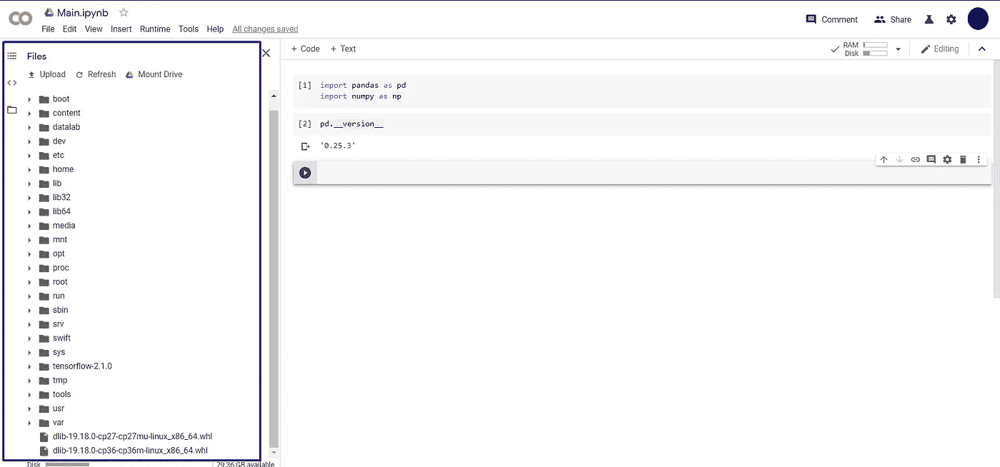
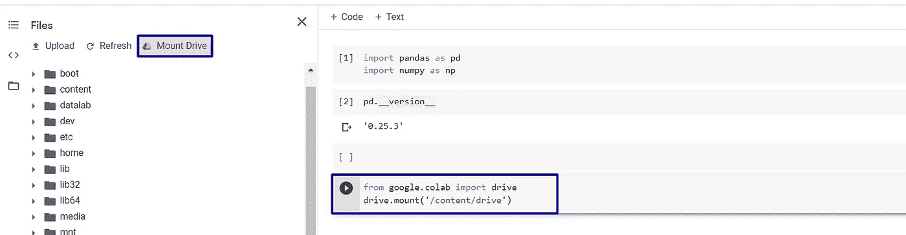

# 使用 Google 生态系统创建云同步数据科学项目的简单方法。

> 原文：<https://medium.com/analytics-vidhya/an-easy-way-to-create-your-portable-data-science-project-environment-46a2c2ec889a?source=collection_archive---------14----------------------->

使用 [**Colab**](https://colab.research.google.com/) 和[**Google Drive**](https://www.google.com/drive/)**几个步骤，你就可以从任何 **PC** 上访问、编辑、同步和开发你的数据科学项目。**

****

**将要讨论的系统架构**

**本文将介绍一个简单步骤的演示，以创建您的基本数据科学项目环境，并使其与云解决方案同步，如 **Google Colab** 和 **Google Drive、**，这样您就可以随时使用任何计算机访问您的项目，而不仅限于您的 **PC** 。**

## **1-创建您的项目主目录**

**第一步是创建包含所有要同步的项目的目录。**

****

**主项目/包含项目目录的结构**

## ****2-** 本地安装 Google Drive**

**从这里的[下载驱动程序，选择**个人**选项。](https://www.google.com/drive/download/)**

****

## **3-同步项目文件**

**它会要求**用你的谷歌账户登录**，然后你必须选择你想要同步的文件夹，所以我们会在最后添加我们的项目主文件夹，点击**确定**。**

****

**注意所有项目文件夹上的绿色“✔”标记，这意味着同步完成。**

****

**现在让我们检查我们的**在线**驱动器…**

****

**它是本地文件和文件夹的副本**

**不幸的是，因为 **Colab** 只能与**我的驱动器**一起工作，而不能与**计算机**一起工作，所以我们接下来要做的是"**添加到我的驱动器**"的把戏，它创建了**链接**引用到你的项目和**不复制文件**到**我的驱动器**。**

****

**科拉布喜欢“我的动力”:D**

****

**现在你在网上或本地做的任何改变..它会自动同步。**

> **N **注意**，如果你使用 **Jupyter** 创建你的 **(ipynb)** ，那么项目脚本将不在你的项目文件夹中，而是在 **Jupyter 本地服务器文件夹**中，所以你也需要同步它。**

## **4-打开(。ipynb)文件与 Colab**

****

**给你..**

****

**Colab 虚拟机**

**正如你看到的 **Colab** 上传你的**(。ipynb)** 到一个**虚拟机。**它只用到了**(。ipynb)** 文件，而没有其他类似**数据**的文件。**

****5-在 Colab 上安装 Google Drive****

**我们希望将我们的驱动器带到该虚拟机。**

****

**使用单元格左上角的“ **Play** ”按钮或按( **Ctrl+Enter** )运行该单元格，然后按照下一个。**

****

**允许 Colab 访问您的 Google Drive 帐户，并复制提供的授权代码以插入必填字段，然后( **Ctrl+Enter** )运行单元。**

**让我们检查路径(" **/content/drive** ")**

****

## **6- **发展然后拯救****

**首先，我们需要设置一些代码块来帮助我们，以防我们在本地或云环境中。**

****

**然后**保存**..就这样，现在你有了一个可访问的数据科学项目。**

**如果您有任何反馈，请在下面留下您的回复，这样我们就可以了解我们错过了什么。**

**你可以关注我的 LinkedIn，那里也有很酷的帖子😁。**

**谢谢..**