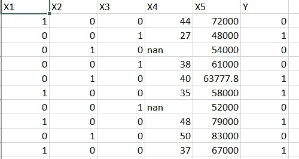

# 一种处理缺失数据的有效方法。

> 原文：<https://medium.com/analytics-vidhya/an-efficient-approach-to-handle-missing-data-1ff73d5cfe3d?source=collection_archive---------21----------------------->

大多数可用的真实数据集都有缺失条目。因此，为了在这样的数据集上应用机器学习算法，我们需要处理其中的缺失值。

对于许多与数据科学有关的项目，工程师们花费大量的时间对数据进行预处理，而处理缺失值是为算法准备数据的关键步骤。

这种情况通常是由于手动数据输入程序、设备错误和不正确的测量造成的。

首先，让我们更多地了解这些缺失的价值观。有三种缺失值，即-

*   ***【完全随机缺失】(MCAR)***-如果导致任何特定数据项缺失的事件独立于感兴趣的可观察变量和不可观察参数，并且完全随机发生，则数据集中的值可能完全随机缺失(MCAR)。当有人忘记在特定的单元格中输入数据，或者有人懒得填写数据时，就会发生这种情况，在这里没有什么严重的。MCAR 意味着数据的缺失和任何观察到的或缺失的值之间没有关系。
*   ***随机缺失(MAR)***——当缺失与特定变量有关，但与有缺失数据的变量的值无关时发生。这方面的一个例子是意外遗漏了问卷上的一个答案。这意味着数据的缺失可以通过数据集中的其他要素来预测
*   ***【非随机缺失(MNAR)***-*这是由于特定原因而缺失的数据(即缺失的变量值与其缺失的原因有关)。这方面的一个例子是，如果问卷上的某个问题被具有某些特征的参与者有意跳过。数据缺失的事实与未观察到的数据有关，即我们没有的数据，缺失与我们没有考虑的因素有关。*

*现在让我们讨论一下处理缺失值的最常见方法，以及与它们相关的问题。*

*   ***什么都不做** —这是最简单的方法，有一些算法(比如 XGboost。)来处理丢失的值。而如果有丢失的数据，许多算法会抛出错误。因此，如果您使用的算法可以自动处理丢失的值，那么请继续。*
*   ***取缺失值所在列的平均值**替换缺失值。*
*   ***取缺失值所在列的中值**替换缺失值*
*   ***取缺失值所在列的**方式替换缺失值*
*   ***通过输入零或常数值**来代替丢失的值。*

*这些方法似乎很容易使用，但它们可能不是准确预测的最佳选择。*

*虽然所有这些方法都易于实现，并且适用于小数据集，但是如果数据集很大，就会产生一些影响。*

*   *它们不考虑数据集中要素之间的相关性，仅在列级别工作。*
*   *它可以使数据偏差(通过零和常量值)。*
*   *不给出准确的结果。*
*   *可能不代表正确的数据形式(例如，如果使用平均值进行估算，整数列可能会有浮点值)*

**

*现在让我们讨论一下，如果数据集中有缺失值，需要做些什么来获得相对更准确的结果。为了说明这一点，我们考虑以下数据集。*

**

*首先，让我们导入库和数据集。*

**

*现在，让我们按如下方式划分数据集*

*‘x’—包含没有缺失值的所有数据条目。*

*Y' —包含缺少(nan)值的列。*

*‘x _ missing _ rows’—包含含有‘nan’的数据条目(行)。*

**

*在这个例子中，我们应用了随机森林回归，因为它给出了非常好的结果，但是你可以用你喜欢的任何其他算法来尝试。*

**

*在我们的例子中，缺少的值是-*

**

***参考文献—***

*[https://www . slide share . net/akaniazeezolamide/missing-data-and-causes](https://www.slideshare.net/akanniazeezolamide/missing-data-and-causes)*

*[https://medium . com/@ danberdov/types-of-missing-data-902120 fa 4248](/@danberdov/types-of-missing-data-902120fa4248)*

*我希望这篇文章对您有所帮助，并且现在您已经知道了在处理缺失数据时所面临的问题以及如何有效地解决它们。*