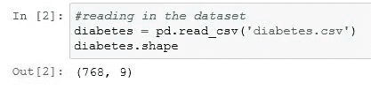
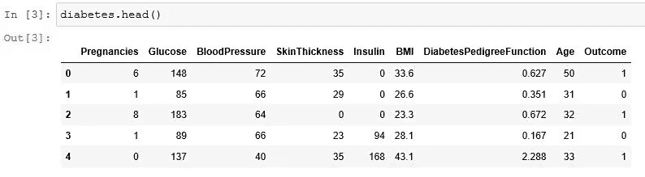
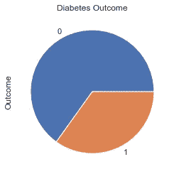
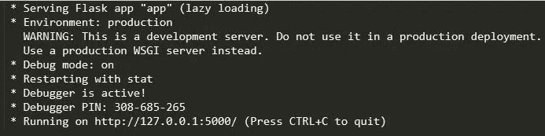
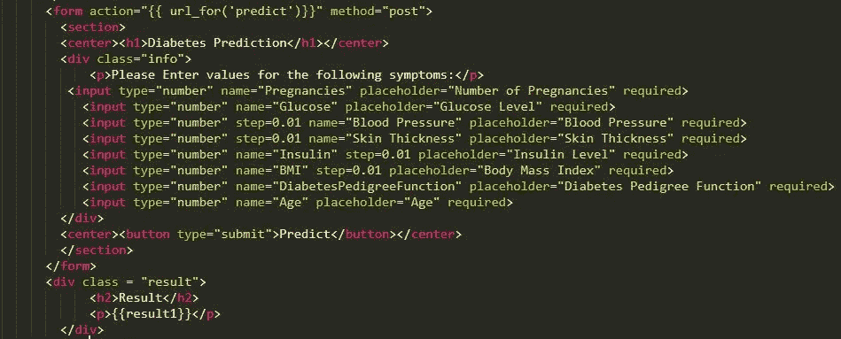

# 一个关于糖尿病的端到端数据科学项目

> 原文：<https://medium.com/analytics-vidhya/an-end-to-end-data-science-project-on-diabetes-9a70c8368d2a?source=collection_archive---------5----------------------->


## 建立线性回归机器学习模型，使用 Flask 部署，然后部署到 Heroku

# **建立线性回归机器学习模型**

下面是如何做到这一点的一步一步的过程；

*   导入库
*   数据收集
*   探索性数据分析
*   数据清理
*   建立模型
*   评估指标

## 导入库

我使用 Jupyter Notebook 作为集成开发环境(IDE)。所需的库有:numpy，pandas，matplotlib，pickle 或 joblib 和 scikit-learn。这些都预装在最新版本的 [Anaconda](https://www.anaconda.com/distribution/) 中。如果你没有这些库，你可以 *pip 安装*或者*更新 conda。*

## 数据收集

用于该模型的数据集是 [Pima Indians 糖尿病数据集](https://www.kaggle.com/uciml/pima-indians-diabetes-database)，它由几个医学预测变量和一个目标变量——结果——组成。预测变量包括患者的怀孕次数、体重指数、胰岛素水平、葡萄糖水平、糖尿病谱系功能、血压、皮肤厚度和年龄。

为了读入数据集，使用以下代码:

```
diabetes = pd.read_csv(‘diabetes.csv’)
```

数据集被命名为*“糖尿病”*

## 探索性数据分析

根据[维基百科](https://en.wikipedia.org/wiki/Exploratory_data_analysis)，**探索性数据分析** ( **EDA** )是一种[分析](https://en.wikipedia.org/wiki/Data_analysis) [数据集](https://en.wikipedia.org/wiki/Data_set)以总结其主要特征的方法，通常采用可视化方法。探索性数据分析(EDA)在构建机器学习模型中非常重要，因为它有助于获得关于数据集的更多见解。

*   若要了解数据集中的行数和列数，请运行以下代码。

```
diabetes.shape()
```

当您运行这段代码时，它显示数据集有 9 行 768 列。



糖尿病.形状()

*   接下来，您会想知道您的数据集看起来像什么，运行以下代码；*(将打印出数据集中的前五个数据)*

```
diabetes.head()
```



糖尿病. head()

## 数据清理

从上图可以看到有些值是 0 就像病人的皮肤厚度*(可能吗？，病人能瘦到什么程度？).这可能是一个疏忽或什么的。*我们来清理一下数据；

*这个代码，将用该列的平均值替换数据。*

*   让我们绘制一个图表，从行*“结果”*中知道有多少人被检测为阳性或阴性。0 表示负，1 表示正。

```
diabetes[‘Outcome’].value_counts().plot(kind=’pie’).set_title(‘Diabetes Outcome’)
```



你可以在这里找到更多剧情[。](https://github.com/KemmieKemy/Diabetes-Prediction-Web-Application/blob/master/Diabetes%20Prediction%20-%20Linear%20Regression.ipynb)

## 建立机器学习模型

有各种各样的算法可以使用，但我使用线性回归算法，因为它是初学者友好的，往往有很高的准确率。

*   **拆分数据** : **a** 将包含 1 到 8 列，而 **b** 将只包含结果。下面的代码基本上就是这么做的。

```
#split data
a = diabetes.iloc[:, 0:8]
b = diabetes.iloc[:, 8]
a_train, a_test, b_train, b_test = train_test_split(a, b, random_state=0,test_size=0.2)
```

*   **特征缩放:**用训练集拟合数据。

```
#Standardize the data - Feature Scaling
sc_a = StandardScaler()
a_train = sc_a.fit_transform(a_train)
a_test = sc_a.transform(a_test)
```

*   **定义模型** —逻辑回归模型

```
#define the model
model=LogisticRegression()
model.fit(a_train,b_train)
b_pred=model.predict(a_test)
```

*   保存模型

```
pickle.dump(model,open('model.pkl','wb'))
```

## 评估指标

通过检查准确性分数、F1 分数等来评估您的模型。

> *准确度分数是我们的模型正确预测的分数*
> 
> *F1 得分是准确率和召回率的加权平均值。因此，这个分数同时考虑了误报和漏报。*

```
print(accuracy_score(b_test, b_pred))
print(f1_score(b_test, b_pred))
```

现在，你已经建立了模型。你是怎么给非技术类的朋友看的？这就是考虑使用 Flask 部署到 Web 页面的地方。

# **在网页 Flask App 上部署机器学习模型**

*   首先，您需要创建一个 HTML 或 CSS 网页来从用户那里获取值*(以表单的形式)*，这个文件应该命名为 index.html 或者您可以获取在线模板。
*   接下来，创建一个 python 文件“app.py”，键入下面的代码；

```
from flask import Flask, request, render_template
import pickle
import numpy as npapp = Flask(__name__)[@app](http://twitter.com/app).route(‘/’)
def hello():
 return render_template(‘index.html’)if __name__ == "__main__":
    app.run(debug=True)
```

当您运行该程序时，输出应该如下所示，从而创建 localhost:5000 来指向您的 web 页面。



*   为了发现患者患糖尿病的概率，需要进行一些必要的计算；*(在****return render _ template(' index . html ')****和****if _ _ name _ _ = = " _ _ main _ _ ":****)*

```
# prediction function 
[@app](http://twitter.com/app).route(‘/predict’, methods = [‘POST’]) 
def predict(): 
 A = [float(x) for x in request.form.values()]
 model_probability = model.predict_proba([A])
 prediction = “Probability of this user having Diabetes is %0.2f”%model_probability[0][1]
 return render_template(‘index.html’, result = prediction)
```

*   通过在浏览器上键入 localhost:5000 来再次运行 flask 应用程序，以测试该应用程序。

*请注意，您的网页的表单名称应该与用于构建模型的数据集中的列名称相对应，如下所示；*



HTML 代码

> 注意，如果不告诉你的朋友安装 flask、pickle、numpy 等程序，你就不能和他们分享你的 Web 应用程序。这就是 Heroku 的用武之地。

# 将 Flask 应用程序部署到 Heroku

为此，你需要下载并安装 [Heroku 工具箱](https://www.google.com/url?sa=t&rct=j&q=&esrc=s&source=web&cd=13&cad=rja&uact=8&ved=2ahUKEwjn9LaD6LjoAhXl4IUKHURKChMQFjAMegQIBRAB&url=https%3A%2F%2Ftoolbelt.herokuapp.com%2Fdownload%2Fwindows&usg=AOvVaw2qfdqGlMQjLmQnz5_1TISK)和 [git](https://git-scm.com/download/win) 。

*   打开命令提示符，将目录更改为包含 Flask 应用程序的文件夹。
*   通过键入*下面的代码，在那个目录中创建一个虚拟环境；(如果已经完成，请跳过这一步)。*

```
virtualenv env
```

*   激活虚拟环境

```
env\Scripts\activate
```

*   在环境*(一次一个)*中安装**砂箱**和**喷枪**

```
pip install flask
pip install gunicorn
```

*   在 Sublime IDE 中，创建一个文件，命名为 ***。gitignore*** 并在其中键入****env*****(这只是在将 App 部署到 git 时忽略了环境文件)。***
*   **同样在 Sublime IDE 中，创建一个名为 ***Procfile*** 的文件，并键入**web:gunicorn*name _ of _ flask _ app*:app***(这告诉 Heroku 您想要使用 guni corn 运行 web 应用程序)。***
*   **使用下面的代码创建一个需求文件，列出应用程序的所有依赖项**

```
**pip freeze > requirements.txt**
```

*   **现在，您将经历上传到 git 存储库的正常过程；*(一步一个脚印)***

```
**git init
git add .
git commit “First Commit”**
```

*   **要创建 Heroku 应用程序，请键入 ***Heroku 创建*** 和 ***Heroku 打开*** 以打开 Heroku 应用程序。**
*   **要个性化这个 Heroku App，把文件推送到 git 库；**

```
**git push heroku master**
```

**这是我的 GitHub 资源库的链接:**

**[](https://github.com/KemmieKemy/Diabetes-Prediction-Web-Application) [## 糖尿病预测网络应用

### 通过在 GitHub 上创建帐户，为 KemmieKemy/糖尿病预测网络应用程序的开发做出贡献。

github.com](https://github.com/KemmieKemy/Diabetes-Prediction-Web-Application) 

我希望你喜欢这个教程，如果你在这个过程中遇到任何挑战，请在 Twitter 上直接给我发消息，或者在下面的回复框中发表评论。

## 资源

*   [数据请求](https://app.dataquest.io/course/machine-learning-fundamentals)
*   [Youtube](https://www.youtube.com/watch?v=UbCWoMf80PY)
*   [博客 Exsilio](https://blog.exsilio.com/all/accuracy-precision-recall-f1-score-interpretation-of-performance-measures/)**