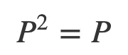

# 数据科学的切入点

> 原文：<https://medium.com/analytics-vidhya/an-entry-point-to-data-science-vector-projections-with-r-and-c-34ff2e5d608c?source=collection_archive---------11----------------------->

## 向量投影(使用 R 和 C++)

# 入口点

矢量投影的想法并不新鲜，也不先进。这是你在线性代数课程中甚至在高中学到的东西。矢量投影本身并不性感。尽管如此，这个主题仍然是进入数据科学的绝佳入口，原因有三:

## 1.直觉的

它是直观的，因为一旦你在头脑中建立了抽象的形象，你总是可以回到它。在某种程度上，这是数学对现实世界进行抽象的完美例子。

## 2.在许多应用中立即有用

紧随其后的应用包括

*   [QR](https://en.wikipedia.org/wiki/QR_decomposition) 、[特征值](https://en.wikipedia.org/wiki/Eigendecomposition_of_a_matrix)和 [SVD](https://en.wikipedia.org/wiki/Singular_value_decomposition) 矩阵分解。
*   [最小二乘法](https://en.wikipedia.org/wiki/Least_squares)，线性回归，多元线性回归。
*   降维，[主成分分析](https://en.wikipedia.org/wiki/Principal_component_analysis)， [MDS](https://en.wikipedia.org/wiki/Multidimensional_scaling) 。

这些是我计划在以后的文章中探讨的一些话题。

## 3.一个不错的编程练习

如果你是一个有经验的 R 用户，并且你编写的函数被其他 R 函数调用了成百上千次，那么也许你已经考虑过学习如何使用 Rcpp 用 C++扩展/优化你的 R 代码。这是我个人一直在做的事情，我发现用 C++实现简单的函数是一个非常好的练习。

# 议程

1.  复习向量投影(一点数学和直觉)。
2.  在 R 中实现并检查数学。
3.  用 C++实现并以 r 为基准。
4.  后续步骤

# 概念

Martino Pietropoli 在 [Unsplash](https://unsplash.com?utm_source=medium&utm_medium=referral) 上拍摄的照片

想象一下站在街上，太阳在你的头顶上。看着地面，你会看到你的影子被投射到地面上。通过这种方式，你身体的 3D 形状被投射到地面的 2D 表面上。这就是投影背后的想法。你的影子是你的身体，但它在地上。换句话说，它是在地面的*方向*上。同理，想象你身体的影子在你旁边的建筑上。仍然是你的 2D 投影，但是现在在不同的*方向*。现在取两个抽象矢量`a`和`u`，想象将`a`的影子投射到`u`上。你得到的是一个方向为`u`的矢量。这个向量就是所谓的`a`到`u`的投影。

# 公式

有两种方法可以计算投影。第一步是找到与`u`相乘的正确标量。第二步是找到与`a`相乘的正确矩阵。这个矩阵叫做投影矩阵，它很特别。当您将`a`投影到单个向量或整个平面/超平面时，可以计算出该投影矩阵。

## 乘以一个标量:

以下表达式给出了`a`到`u`的投影。

## 乘以投影矩阵:

或者，我们可以为`u`找到一个投影矩阵`P`，并找到如下投影:

在哪里

U 可以是只有一列的矩阵。

# 用 R 计算

让我们首先看一个例子，如何在 R 中计算投影，并检查两种方法是否产生相同的结果。让我们从标准正态分布中生成两个长度为`4`的小随机向量。

[此处代码可用](https://bdshaff.github.io/blog/2020-01-28-vector-projections/)

使用第一种方法，我们简单地计算一个标量，并将其应用到我们要投影的向量上。这是我们从`a`到`u`的投影。

[此处代码可用](https://bdshaff.github.io/blog/2020-01-28-vector-projections/)

使用第二种方法，我们首先计算投影矩阵`Pmat`，然后将其应用于`a`以获得投影。要做到这一点，我们可以定义一个只有一列的矩阵，然后应用上面的公式。这是矩阵的样子:

[此处提供代码](https://bdshaff.github.io/blog/2020-01-28-vector-projections/)

这是我们之前得到的同样的投影向量:

[此处提供代码](https://bdshaff.github.io/blog/2020-01-28-vector-projections/)

# 性能

我们计算了`a`到`u`的投影，但是我们如何检查这实际上是一个投影，以及它的特殊之处？要看到这一点，我们可以看看几个重要的属性，并检查它们。

说那个

和

[此处代码可用](https://bdshaff.github.io/blog/2020-01-28-vector-projections/)

## 1.方向

首先要检查的是，我们计算的投影与我们将`a`投影到的矢量`u`方向相同。

其中`c`是某个常量向量。

[此处代码可用](https://bdshaff.github.io/blog/2020-01-28-vector-projections/)

如你所见，这是真的。

## 2.正交性

如果我们将`a`投影到`u`上，那么矢量`e`应该与`u`和投影成 90 度。我们可以通过计算`e`和`u`或`v`的点积来检查这一点，并检查它是否为 0。

[此处代码可用](https://bdshaff.github.io/blog/2020-01-28-vector-projections/)

这也证实了。

## `3\. `P`` 是幂等的

这是一个很酷的特性，据说如果你将投影`v`投影到`u`上，那么你将得到相同的投影矢量`v`。算术地

[此处代码可用](https://bdshaff.github.io/blog/2020-01-28-vector-projections/)

我们看到这是正确的，并且意味着 Pa=PPa=Pv=v。

# 一点编程

在实践中，R 对于与数据分析相关的任何事情都是极好的。但是在某些情况下，通过 Rcpp 用 C++扩展时，它可以变得更加强大。正如我们将在未来看到的，投影函数是一个完美的例子。在这里，我用 R 和 C++实现了相同的函数，并在不同长度的向量上比较了它们。

## R 函数

[此处代码可用](https://bdshaff.github.io/blog/2020-01-28-vector-projections/)

## C++函数

[此处提供代码](https://bdshaff.github.io/blog/2020-01-28-vector-projections/)

正如你所看到的，R 函数要简洁得多，只需要 30 秒就可以写完。C++比较长但不算太差。最终，它们会产生完全相同的结果。

[此处提供代码](https://bdshaff.github.io/blog/2020-01-28-vector-projections/)

# 标杆管理

我来做三个对比。1st 将查看我们所查看的长度为`4`的原始小向量的基准。第二个将查看相同的基准，但是是长度为`2000`的向量。最后，我们将看看这两个函数如何缩放从`4`到`1,000,000.`的向量长度

## 小矢量

[此处代码可用](https://bdshaff.github.io/blog/2020-01-28-vector-projections/)

看起来 C++版本不值得在这种情况下使用，因为我们在 R 中调用它，当我们使用 Rcpp 时会有一些开销。也就是说，我们在这里看着`nanoseconds`，所以实际上没有什么不同。

## 更大的向量

[此处提供代码](https://bdshaff.github.io/blog/2020-01-28-vector-projections/)

在这里，我们清楚地看到，C++平均快了大约 3 倍。尽管如此，我们仍然在考虑`microseconds`，所以如果我们必须这样做一次，R 是完全足够的。

## 缩放至更大的向量

为了查看这两个函数随着向量大小的增长而扩展的程度，我们可以编写一个函数，它将采用两个向量，并返回使用两个版本计算投影所花费的时间。

[此处提供代码](https://bdshaff.github.io/blog/2020-01-28-vector-projections/)

现在生成一个向量长度序列和向量对本身，我们可以应用 R 和 C++函数，并再次绘制它们的执行时间向量长度。

[此处提供代码](https://bdshaff.github.io/blog/2020-01-28-vector-projections/)

从图中我们可以看到，随着向量长度的增长，性能的差异确实在增长。这意味着与 R 函数相比，我们的 C++函数将变得越来越高效。

你可以想象，如果我们需要依次计算大向量的投影，时间差会变得很大。

# 后续步骤

[Gram–Schmidt 过程](https://en.wikipedia.org/wiki/Gram%E2%80%93Schmidt_process) —一种寻找与原始向量组跨越相同空间的正交向量组的方法。

[QR 矩阵分解](https://en.wikipedia.org/wiki/QR_decomposition) —矩阵表示为正交矩阵`Q`和上三角矩阵`R`的乘积。这种分解可以用来找到[最小二乘](https://en.wikipedia.org/wiki/Least_squares)解，这对回归分析显然是重要的。

# 学习资源

麻省理工学院开放课程线性代数课程——本课程的第二单元更详细地讲述了这个主题，并且有更多的数学知识。视频讲座非常棒，所以如果你想要更多的数学知识，这是一个好地方。

[R 和 C++](https://adv-r.hadley.nz/rcpp.html) — [高级 R 书](https://adv-r.hadley.nz/rcpp.html)的 Ch 25 是对 Rcpp 的完美介绍，如果你想学习如何用 C++扩展 R，也是一个很好的资源。我可以推荐的另一个资源是 DataCamp 课程[用 Rcpp](https://www.datacamp.com/courses/optimizing-r-code-with-rcpp) 优化 R 代码，这是我最喜欢的学习 R 的方法。