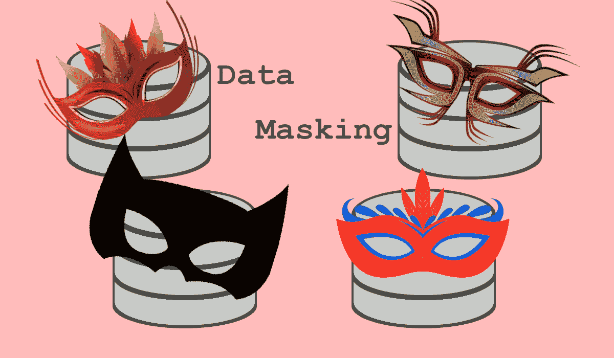
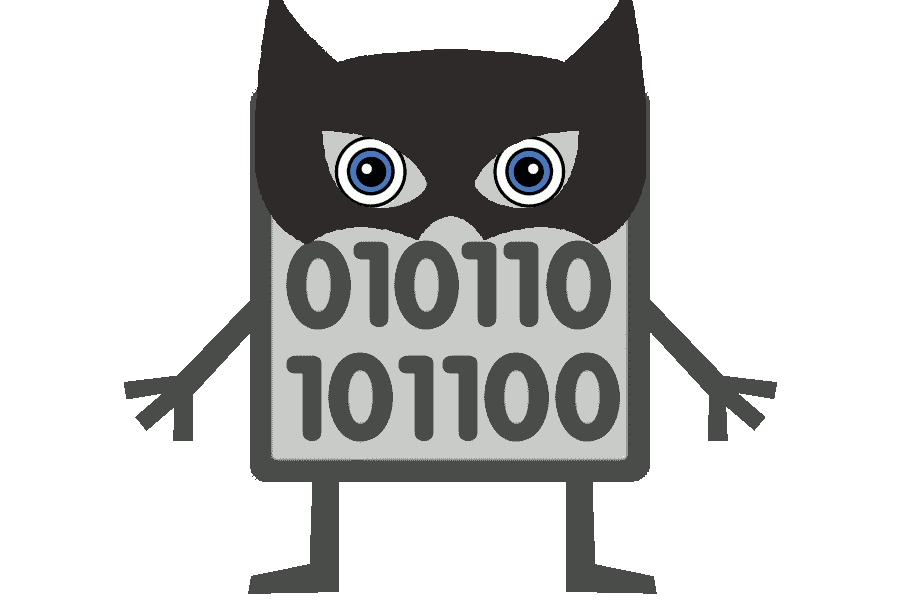
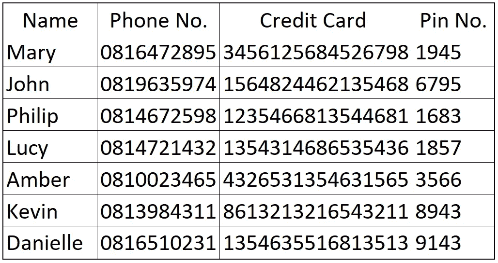
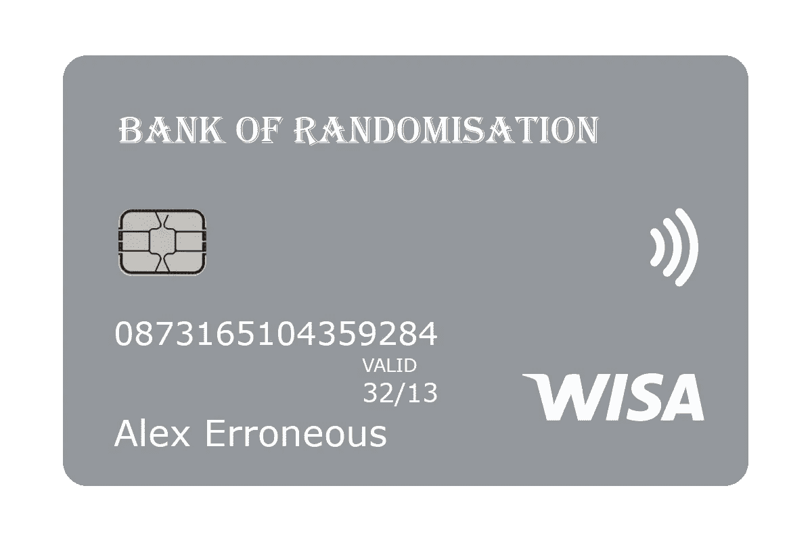
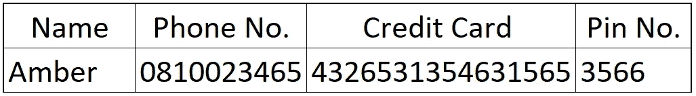

# 数据屏蔽

> 原文：<https://medium.com/analytics-vidhya/an-essential-guide-to-data-masking-ee32dffc204d?source=collection_archive---------10----------------------->

数据屏蔽，这是一个非常好的工具。通过提供真实的测试数据集，它允许您对系统进行更准确的测试，并且在您需要为非生产用途提供数据的情况下，它降低了数据泄露的风险。在这两种情况下，它降低了所需的存储量，因为不需要提供整个数据集。但是它到底是什么呢？

让我从一个简单的问题开始:当你想到一个戴着面具的人时，你的想象力向你展示了什么？漫画人物？一个罪犯？万圣节的恶作剧还是招待？在所有这些情况下，戴口罩意味着什么？从根本上来说，不管是谁，都是同一个人，只是他们要么看起来有点不一样，要么完全认不出来(一副眼镜和一个不同的发型能做的事情太神奇了)。这个想法与数据屏蔽并无二致。

数据屏蔽获取您拥有的数据，将它逐列(或作为一组列)分解，并根据您提供的规则隐藏数据的真正含义。这些规则可以非常具体和精确，或者可以是在设定的界限内随机替换的声明。在执行数据屏蔽时，有几种常用的方法可以使用。

# 方法

## **洗牌——**

洗牌是最直接的方法之一，但如果在真空中，在错误的数据集上进行，则存在很高的潜在安全风险。这只是简单地获取已经在列中的值并交换它们。

为了能够在这里给出更好的例子，让我们画出一个快速表来充当我们的示例“数据库”。下面是一个完全由人和他们的信用卡信息组成的表格。对于我运行的每个例子，我都会回头引用它。

示例数据库表

因此，如果我们要在这张桌子上执行洗牌，我们可以使用“Pin 号”列并洗牌。因此，我们将在各行之间随机重新分配引脚号。例如，玛丽的个人识别码可以从底部一行的“1945”更改为“9143”。仅仅洗牌就暴露了大量*敏感信息。鉴于这个数据集的规模很小，如果它被任何恶意的人发现，他们可以通过一些简单的尝试和错误很容易地找出哪个 pin 号码属于哪个人。由于尝试次数太多，他们可能会导致信用卡被银行冻结，但他们只需要获得一个权利就可以制造麻烦。*

正如我们所见，洗牌本身并不是一个好方法。就个人而言，我不认为它非常有用，除非它被用在无关紧要的数据上。如果数据真的无关紧要，即使洗牌也可能会超出必要的范围。

## F **格式保持随机化—**

格式保留随机化将是我首选的数据屏蔽方法之一。使用这种方法，我们选择列，检查存在什么类型的数据，并用类似的随机数据替换它。这保留了数据长度，字母和数字的位置，以及字符是大写还是小写！

例如，如果我们再次对“Pin 号”列执行此操作，我们会看到由数字 0-9 组成的四位数。所以我们会用一个随机的四位数来代替它们。这比到处交换要安全得多。这一次，玛丽的密码从“1945”变成了“9993”，或者类似的随机数字。对于该列中的每一个其他行，也将进行同样的操作。

这种方法的一个局限来自于名字之类的东西，在这种情况下，随机化远非理想。让我们以“菲利普”为例。我们有一个 6 字单词，以大写开头。这很容易给我们类似于“Qlxraw”的东西。据我所知，我无意冒犯，这不是一个名字。这是一个我相信洗牌会有用的例子，当然是在其他列上使用的其他方法。

## 条件掩蔽—

条件屏蔽可能是数据屏蔽最重要的种类之一。它允许随机化掩蔽，很像格式保持随机化，但同时遵守某些条件。当涉及到信用卡/借记卡信息或个人身份号码时，可以看出这一点的重要性。这些通常包括特定的字母子集，或基于其位置具有特定象征意义的数字。简单地将这些随机化会导致没有意义的数据，并且在测试环境中没有任何用处。

回头看看我们的例子，让我们采取琥珀的行。为了方便起见，我在下面展示一下。

如果我们把数字加起来，我们会看到她的信用卡号是 16 位，这是信用卡/借记卡号最常见的长度。开头的“4”表示这是一张 Visa 卡。如果这需要在屏蔽数据中保持一致，那么保持签证格式就很重要。

信用卡号开头的一个简单的一位数标识符可能看起来没什么。但是，对于其他行业和发卡机构，最多使用前五位数字来标识发卡机构。当屏蔽这些值时，这极大地限制了可用的随机性程度。

## 复合掩蔽—

复合掩码允许您将列作为组进行掩码。这样做可以确保一些数据集在屏蔽后保持一致。虽然没有在上面的表格中显示，但让我们以地址的概念为例。我们不会去远到一条路和门牌号码，但让我们选择:

我们只有部分正确的地址。如果您正在考虑这种形式的屏蔽，那么您的应用或测试环境可能需要一个真实的地址。所以随机化是行不通的，因为正如我们所见，它会产生无意义的单词。洗牌也不行，因为我怀疑像“德国奥布的 Dún Laoghaire”这样的地方是否存在(如果我们假设上面的表不止一个条目)。

所以我们所拥有的是类似于条件掩蔽的东西。但是条件是放在一组列上，而不是只放在一列上。这意味着我们可以把相对复杂的东西比如地址，屏蔽掉，让它保持真实。

# 拿走

虽然它可能不是一个关键工具，但取决于您的企业处理哪种数据，数据屏蔽非常重要。如果出于非生产原因需要使用任何信息，它可以保护您、您的客户(如果您存储他们的数据)以及您的业务。

如果你认为数据屏蔽对你有用，或者更广泛的数据库工具对你有用，考虑试用一下 [Oracle 免费云试用版](http://bit.ly/OCTrialLink)。

如果你有任何问题、意见或想在 LinkedIn 上联系，你可以在 https://www.linkedin.com/in/hugh-gallagher/[联系](https://www.linkedin.com/in/hugh-gallagher/)

> **所有观点均为本人观点，不代表甲骨文**

# 来源

 [## 数据屏蔽和子集设置指南

### 数据屏蔽和子集化指南 Oracle 数据屏蔽和子集化简介本章介绍基础知识…

docs.oracle.com](https://docs.oracle.com/en/database/oracle/oracle-database/12.2/dmksb/introduction-to-oracle-data-maksing-and-subsetting.html#GUID-7F8CA7CB-4675-47EC-AC0D-81AFE6C523B1)  [## 信用卡/借记卡编号背后的数学原理

### 所有信用卡和借记卡上都印有数字(一般为 16 位)。这表示一个唯一的帐号…

medium.com](/@ma.juber/mathematics-behind-credit-debit-card-numbering-340bf68d27d2)