# 使用 NLP 和深度学习检测和打击神经假新闻

> 原文：<https://medium.com/analytics-vidhya/an-exhaustive-guide-to-detecting-and-fighting-neural-fake-news-using-nlp-70550f3f4ecc?source=collection_archive---------19----------------------->

假新闻是目前我们社会的一个主要问题。

它与数据驱动时代的兴起齐头并进，考虑到我们每秒钟生成的庞大数据量，这不是巧合！


那么机器学习在这其中起到了什么作用呢？

我相信你一定听说过一种机器学习技术，它可以生成模仿名人的虚假视频。

同样，自然语言处理(NLP)技术正被用于生成假新闻——这是一种被称为“神经假新闻”的概念。

这加剧了他们被利用来进行宣传和制造社会混乱的风险。

# 什么是神经假新闻？

神经假新闻是使用基于神经网络的模型生成的任何假新闻。或者更正式地定义它:

> 神经假新闻是一种有针对性的宣传，它密切模仿由神经网络生成的真实新闻的风格。

下面是 [OpenAI 的 GPT-2 模型](https://www.analyticsvidhya.com/blog/2019/07/openai-gpt2-text-generator-python/?utm_source=blog&utm_medium=exhaustive-guide-detecting-fighting-neural-fake-news-nlp)产生的神经假新闻的一个例子:

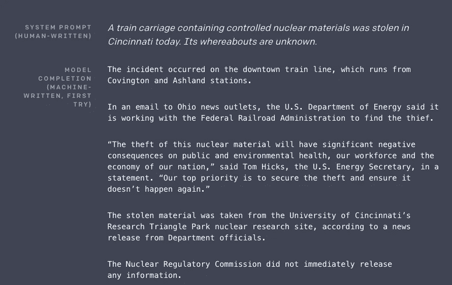

“系统提示”是人给模型的输入，“模型完成”是 GPT-2 模型产生的文本。

你是不是凭直觉猜到后半部分是机器写的？

现在，如果我告诉你，GPT-2 模型是任何人都可以免费下载和运行的呢？这正是研究界所关心的，也是我决定写这篇文章的原因。

# 大型语言模型如何被误用生成神经假新闻？

[语言建模](https://www.analyticsvidhya.com/blog/2019/08/comprehensive-guide-language-model-nlp-python-code/?utm_source=blog&utm_medium=exhaustive-guide-detecting-fighting-neural-fake-news-nlp)是一种 [NLP](https://courses.analyticsvidhya.com/courses/natural-language-processing-nlp?utm_source=blog&utm_medium=exhaustive-guide-detecting-fighting-neural-fake-news-nlp) 技术，模型通过理解句子本身的上下文来学习预测句子中的下一个单词或缺失的单词。以谷歌搜索为例:


这是一个语言模型运行的例子。

> 通过让模型预测句子中的下一个单词或缺失的单词，我们让模型学习语言本身的复杂性。

该模型能够理解语法如何工作，不同的写作风格等。这就是模型如何能够生成一段在未经训练的人看来可信的文本。

这里有一些非常强大的最先进的语言模型，它们非常擅长生成文本:Google 的 BERT，OpenAI 的 GPT-2 模型和 AllenNLP 的 Grover。

# 如何检测神经假新闻？

我们如何检测或判断一条新闻是否是假的？目前，有三种主要的方法来处理神经假新闻，并显示出良好的效果。

# 一.事实核查

检验网上传播的新闻是真是假的最基本的方法是什么？

我们可以简单地谷歌一下，参考值得信赖的新闻网站，并核实它们是否有相同或相似的故事。

尽管这一步看起来像是常识，但它实际上是确定一条新闻真实性的最有效的方法之一。

# 二。使用 GLTR (HarvardNLP)的统计分析

GLTR 或 **G** iant **L** 语言模型 **T** est **R** oom 是由哈佛大学和麻省理工学院-IBM 沃森实验室的杰出人士设计的工具。

> *GLTR 用于识别机器生成文本的主要方法是通过对给定文本进行统计分析和可视化的巧妙结合。*

以下是 GLTR 界面的外观:

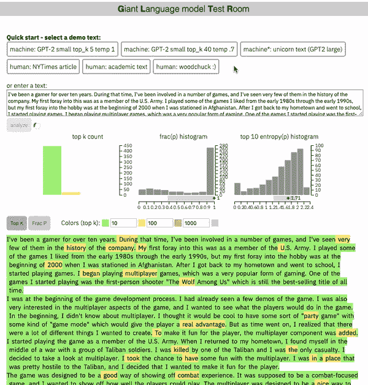

GLTR 检测生成文本的中心思想是使用与最初生成文本相同(或相似)的模型。

原因很简单，语言模型直接生成的单词来自概率分布,而概率分布是语言模型从训练数据中学习而来的。

并且因为我们已经知道用于从给定的概率分布中采样单词的技术，例如最大采样等。我们可以很容易地交叉检查给定文本中的单词是否遵循特定的分布。

如果确实如此，并且在给定的文本中有多个这样的单词，那么这将基本上确认它是机器生成的。

让我们在一个例子上运行 GLTR 来理解这个概念！

# 安装 GLTR

在我们可以使用 GLTR 之前，我们需要在我们的系统上安装它。首先克隆项目的 GitHub 存储库:

```
git clone [https://github.com/HendrikStrobelt/detecting-fake-text.git](https://github.com/HendrikStrobelt/detecting-fake-text.git)
```

一旦您克隆了存储库，将 cd 放入其中并进行 pip 安装:

```
cd detecting-fake-text && pip install -r requirements.txt
```

接下来，下载预先训练好的语言模型。您可以通过运行服务器来实现:

```
python server.py
```

GLTR 目前支持两种模型——BERT 和 GPT-2。你可以在两者之间选择；如果没有给出选项，则使用 GPT-2:

```
python server.py --model BERT
```

这将开始在您的机器上下载相应的预训练模型。如果你的网络连接很慢，给它一些时间。

一切准备就绪后，服务器将从 5001 端口启动，您可以直接进入[*http://localhost:5001*](http://localhost:5001)进行访问:

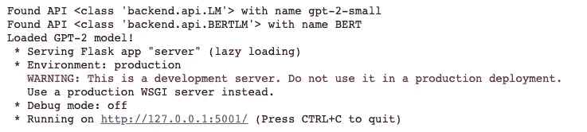

# GLTR 是如何工作的？

假设我们有下面这段文字。我们要检查它是否是由像 GPT-2 这样的语言模型生成的:

```
How much wood would a woodchuck chuck if a woodchuck could chuck wood?
```

GLTR 将接受这一输入，并分析 GPT-2 对输入的每个位置的预测。

请记住，语言模型的输出是模型知道的所有单词的排名。因此，根据 GPT-2，我们将很快能够看到输入文本的每个单词的排名。

如果我们对每个单词进行颜色编码，根据它的排名是前 10 名为绿色，前 100 名为黄色，前 1000 名为红色，我们会得到这样的输出:

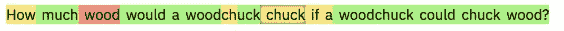

现在，我们可以直观地看到每个单词根据 GPT-2 的概率有多大

如果你需要更多的信息，你可以把鼠标悬停在一个单词上，比如“木头”。您将看到一个小框，其中显示了该职位的前 5 个预测单词及其概率:

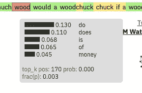

在这一点上，我强烈建议你使用 GLTR 来尝试不同的文本，包括人类生成的和机器生成的。工具本身已经提供了几个例子:

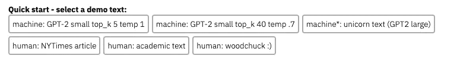

你会注意到，当你转向真实文本时，**红色**和**紫色**单词，即**不太可能**或**罕见**预测的数量会增加。

此外，GLTR 显示了三个不同的直方图，其中包含了整个文本的聚合信息(查看下图以供参考):

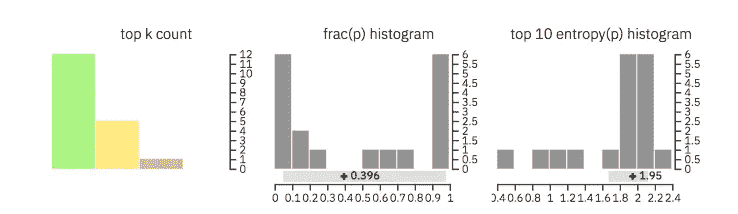

**下面是这些直方图的帮助:**

*   前两个直方图有助于理解输入文本中的单词是否是从分布的顶部采样的(对于机器生成的文本来说是这样)
*   最后一个直方图说明了单词的上下文对于检测系统是否是已知的，因为它(非常)确定其下一个预测

很聪明，对吧？通过结合这些多种可视化和概率分布的知识，GLTR 模型可以用作理解和识别机器生成文本的有效取证工具。

以下是作者关于 GLTR 成功的报道:

> *“在一项人类受试者研究中，我们表明，GLTR 提供的标注方案在没有任何预先训练的情况下，将虚假文本的人类检测率从****54%****提高到****72%****。”——格尔曼等人。艾尔*

你可以在原研究论文中阅读更多关于 GLTR [的内容。](https://arxiv.org/pdf/1906.04043.pdf)

# 三。利用模型检测神经假新闻

GLTR 相当令人印象深刻，因为它使用概率分布和可视化的简单知识来检测神经假新闻。但是如果我们能做得更好呢？

> *如果我们可以训练一个大模型来预测一段文字是不是神经假新闻呢？*

这正是我们将在本节中学习的内容！

# a) GPT-2 探测器模型

GPT-2 探测器模型是一个[罗伯塔](https://arxiv.org/pdf/1907.11692.pdf)(BERT 的一种变体)模型，它已经被微调以预测给定的一段文本是否是通过使用 GPT-2 生成的(作为一个简单的分类问题)。

让我们看看它的实际效果吧！

# 安装 GPT-2 探测器模型

这种探测器模型的安装步骤非常简单，就像 GLTR 一样。

我们首先需要克隆存储库:

```
git clone [https://github.com/openai/gpt-2-output-dataset.git](https://github.com/openai/gpt-2-output-dataset.git)
```

再次，光盘到它和做 *pip* 安装:

```
cd gpt-2-output-dataset/ && pip install -r requirements.txt
```

接下来，我们需要下载预先训练好的语言模型。通过运行以下命令来完成此操作:

```
wget [https://storage.googleapis.com/gpt-2/detector-models/v1/detector-base.pt](https://storage.googleapis.com/gpt-2/detector-models/v1/detector-base.pt)
```

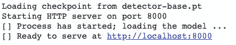

# 识别神经假新闻

让我们用 GPT-2 生成的一段文本来测试这个模型:

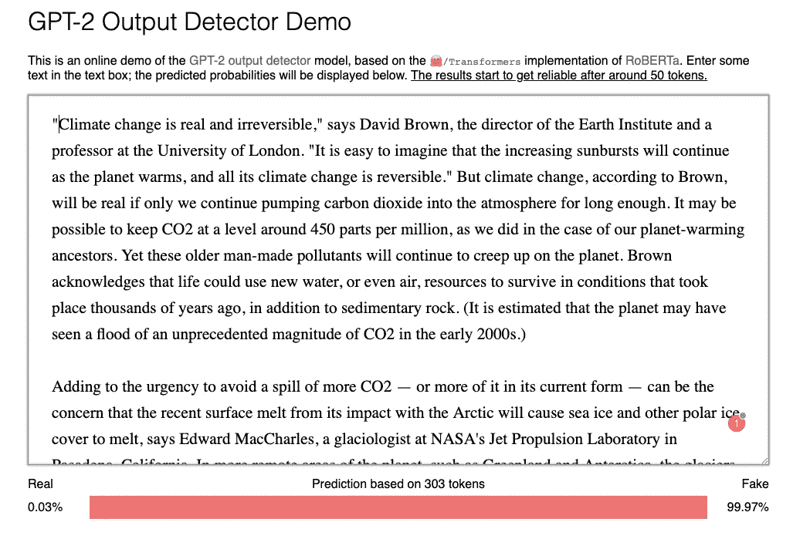

**正如你所看到的，尽管文本看起来非常令人信服和连贯，但模型立即以 99.97%的准确率将其归类为“假的”。**

这是一个非常有趣的工具，我建议你继续尝试不同的生成和非生成文本的例子，看看它的表现如何！

在我的例子中，我注意到这个模型只在识别由 GPT-2 模型生成的文本时有效。

# 格罗弗公司

在本文讨论的所有工具中，AllenNLP 的 Grover 是我最喜欢的工具。

**它能够识别由多种类型的大量语言模型生成的一段文本，而不像 GLTR 和 GPT-2 检测器模型那样局限于特定的模型。**

根据作者的说法，检测一段文本为神经假新闻的最佳方法是使用一个模型，该模型本身就是一个可以生成此类文本的生成器。用他们自己的话说:

> *“生成器最熟悉的***与自己的* ***习惯*******怪癖*** *，以及* ***特质*** *，以及那些来自类似 AI 模型的，特别是那些基于类似数据训练的，即公开可获得的消息。”泽勒斯等人。艾尔***

**乍听起来有些违反直觉，不是吗？**

**为了创造一个能够 ***检测*** 神经假新闻的模型，他们先行一步，开发了一个真正擅长 ***首先生成*** 这样假新闻的模型！**

**听起来很疯狂，但背后有科学逻辑。**

# **那么格罗弗是如何工作的呢？**

**Grover 将检测神经假新闻的任务定义为一个对抗性的游戏，有两个模型作为参与者。这是它的意思:**

*   **设置中有两个**模块**用于检测生成的文本**
*   ****对抗性**模式的目标是制造假新闻，这些假新闻可以像病毒一样传播，或者对人类和**验证者**模式都有足够的说服力**
*   ****验证器**对给定文本的真伪进行分类:**

****

*   **用于**验证者**的训练数据由无限的真实新闻故事组成，但是只有一些来自特定对手的假新闻故事**
*   **这样做是为了复制真实世界的场景，在真实世界中，对手提供的假新闻数量与真实新闻相比要少得多**

**随着验证者模型变得更好，对抗者模型也变得更好。**

## **神经假新闻的条件生成**

**神经假新闻最明显的特性之一是，它通常是“有针对性”的内容，如 clickbait 或宣传。大多数语言模型如 BERT 等。不要让我们创造受控制的一代。欢迎—格罗弗。**

> ***Grover 支持“受控”文本生成。***

**但是这些参数是什么呢？考虑新闻文章——有助于定义新闻文章的结构参数是什么？以下是格罗弗的作者认为生成一篇文章所必需的一些参数:**

*   ****域:**文章发表的地方，间接影响风格**
*   ****日期:**出版日期**
*   ****作者:**作者姓名**
*   ****标题:**文章的标题，这影响到正文的生成**
*   ****正文:**文章的正文**

**结合所有这些参数，我们可以通过联合概率分布来对文章建模:**

**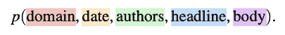**

**现在，我不会过多地探究这是如何实现的底层数学，因为这超出了本文的范围。但是为了让您对整个生成过程有一个大致的了解，这里有一个示意图:**

**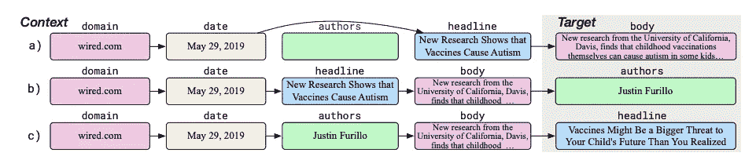**

**下面是正在发生的事情:**

*   **在行 a)中，主体是从部分上下文生成的(缺少作者字段)**
*   **在 b)中，模型生成作者**
*   **在 c)中，模型使用新的世代将提供的标题重新生成为更真实的标题**

## **架构和数据集**

**Grover 使用与 GPT2 相同的架构:**

*   **有 3 种型号。最小的模型 Grover-Base 有 12 层和 1.24 亿个参数，与 GPT 和伯特-Base 相当**
*   **下一个模型，Grover-Large，有 24 层和 3.55 亿个参数，与 BERT-Large 相当**
*   **最大的模型 Grover-Mega 有 48 层和 15 亿个参数，与 GPT2 相当**

**用于训练 Grover 的数据集是由 Grover 的作者自己创建的。**

# **安装 Grover**

**你可以按照[安装说明](https://github.com/rowanz/grover)来安装 Grover，并在你自己的机器上运行它的生成器和检测器工具。记住型号尺寸巨大(46.2G 压缩！)所以在你的系统上安装它可能是一个挑战。**

**这就是为什么我们将使用可用的在线检测器和生成器工具。**

# **使用 Grover 进行生成和检测**

**您可以通过以下链接访问该工具:**

```
**[https://grover.allenai.org/](https://grover.allenai.org/)**
```

**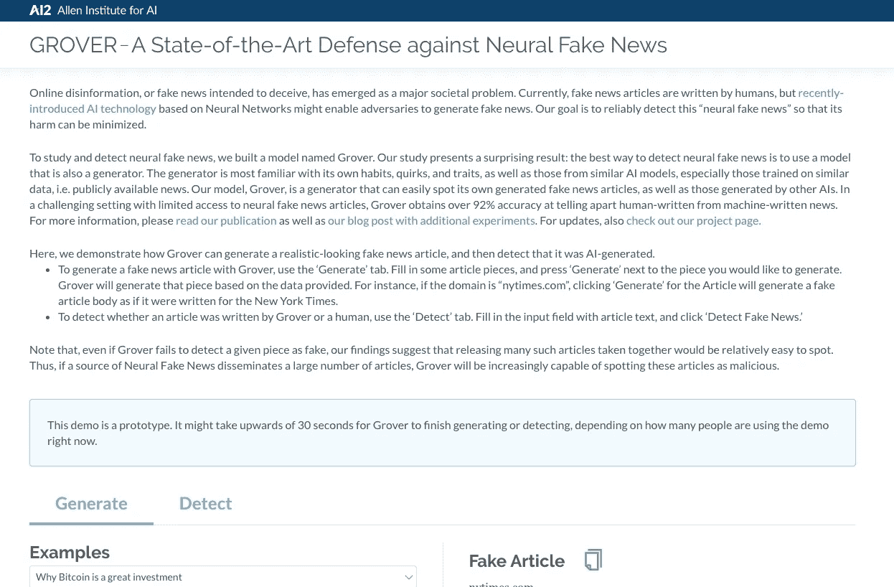**

**您可以尝试使用 Generate 选项，看看 Grover 生成神经假新闻的能力有多强。由于我们有兴趣检查 Grover 的检测能力，让我们前往“检测”选项卡(或转到以下链接):**

```
**[https://grover.allenai.org/detect](https://grover.allenai.org/detect)**
```

## **案例研究 1:**

**我们要测试的这段文本与我们之前看到的 GPT-2 协议生成的文本相同:**

**当你点击“检测假新闻”按钮时，你会注意到格罗弗非常容易地识别出这是机器生成的:**

****

## **案例研究 2:**

**我们要测试的下一篇文章来自纽约时报:**

**你会发现格罗弗确实能够辨认出这是人写的:**

****

## **案例研究 3:**

**这些都是简单的例子。如果我给它一段技术性的文字呢？就像分析网站 Vidhya 的一篇文章中的解释？**

**对于上面的文字，Grover 失败了，因为它没有受过这类技术文章的训练:**

****

**但正是在这里，GPT-2 探测器模型大放异彩，因为它在各种各样的网页上进行了训练(800 万！).**

**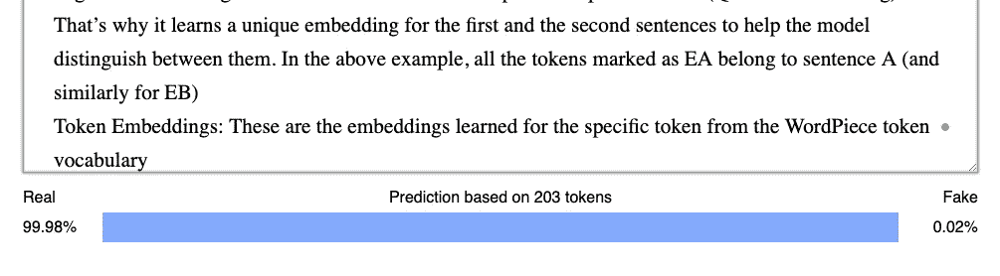**

**这表明没有一种工具是完美的，你必须根据你要检测的文本类型来选择使用哪一种。**

## **案例研究 4:**

**她是我们将做的最后一个实验。我们将测试机器生成的新闻，这些新闻不是“假的”，而只是自动化新闻生成的一个例子。这篇文章摘自**华盛顿邮报**，它使用一个程序自动更新分数:**

**现在，这里有趣的事情是 GPT-2 探测器模型说它根本不是机器生成的新闻:**

**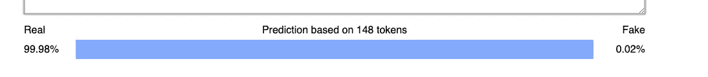**

**但与此同时，Grover 能够以稍低的概率识别出它是机器编写的文本(但它仍然能够识别出它！):**

****

**现在，不管你是否认为这是“假”新闻，事实是它是由一台机器产生的。你将如何对这类文本进行分类将取决于你的目标和你的项目想要达到的目标。**

> ***简而言之，检测神经假新闻的最佳方式是综合使用所有这些工具，并得出一个比较结论。***

# **当前假新闻检测技术的局限性**

**显而易见，目前的检测技术并不完美，它们还有发展的空间。麻省理工学院最近对现有的检测神经假新闻的方法进行了一项研究，他们的一些发现令人大开眼界。**

> **这项研究的主要结果是现有的方法，如 GLTR、Grover 等。用来检测神经假新闻是不完整的。**

**这是因为仅仅发现一段文本是否是“机器生成的”是不够的，**在自动完成、文本摘要**等工具的帮助下，可能有一段合法的新闻是机器生成的。**

**例如，著名的写作应用程序**在语法上**使用某种形式的 [GPT-2 来帮助纠正文本中的语法错误](https://arxiv.org/pdf/1906.01733.pdf)。**

**这种情况的另一个例子是本文前一节的案例研究#4 ，其中一个**程序**被《华盛顿邮报》用来自动生成体育更新。**

**反之亦然，可能存在被攻击者轻微破坏/修改的**人类书写文本，其将被现有方法分类为非神经假新闻。****

**下图总结了探测器模型的上述困境:**

**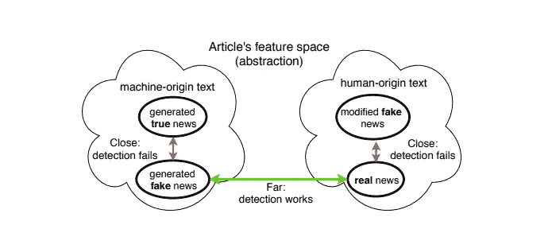**

**我不会深入细节，但作者进行了多次实验来得出这些结论，你可以[阅读他们非常有趣的论文来了解更多](https://arxiv.org/pdf/1908.09805.pdf)。**

> ***这些结果使作者得出结论，为了定义/检测神经假新闻我们不得不考虑* ***【真实性】*** *而不是* ***出处(来源，不管是机器写的还是人类写的)。*****

**我认为这是一个让我们大开眼界的发现。**

# **未来的研究方向是什么？**

**在处理神经假新闻问题的方向上迈出了一步，当[剑桥大学和亚马逊去年发布 FEVER](https://arxiv.org/pdf/1803.05355.pdf) 时，这是世界上最大的事实核查数据集，可用于训练神经网络来检测假新闻。**

**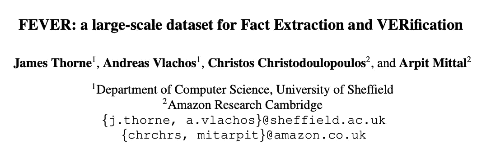**

**尽管当发烧被同一个麻省理工小组(Schuster 等人)分析时。al)，他们发现它有某些偏见，这使得神经网络更容易通过使用文本中的模式来检测虚假文本。**

**当他们纠正数据集中的一些偏差时，他们发现模型的准确性如预期的那样下降了。**

**然后，他们在 GitHub 上开源了经过修正的数据集 [Fever Symmetric，作为其他研究人员测试其模型的基准，我认为这对于积极试图解决神经假新闻问题的研究社区来说是一个很好的举措。](https://github.com/TalSchuster/FeverSymmetric)**

**如果你有兴趣了解更多关于他们的方法和实验，请随意阅读他们的原创论文[去偏见事实验证模型](https://arxiv.org/pdf/1908.05267.pdf)。**

***因此，我认为创建大规模无偏数据集是未来研究方向的良好开端。***

> ***这和过去几年我们在 NLP (GLUE，SQUAD)和 CV (ImageNet)中看到的一样。***

**除此之外，还有一些我们可以进一步探索的方向:**

1.  **我们需要在这个方向上进行进一步的研究，**改进现有的工具**，不仅针对数据集，而且在**真实世界的环境中**对它们进行更多的验证。**
2.  **发烧数据集的发布是一个受欢迎的举措，它将有利于我们探索和**建立更多这样的数据集**。**
3.  **通过模型发现文本的准确性是一个具有挑战性的问题。因此，这方面的进一步研究是受欢迎的。**
4.  **正如 Grover 和 GLTR 的作者正确提到的，我们需要通过在未来发布大型语言模型，如 GPT-2、Grover 等，来继续研究社区的开放性。**

**你以前处理过假新闻的问题吗？有没有尝试过建立一个识别神经假新闻的模型？**

**你认为在考虑未来发展方向时，我们还需要关注其他领域吗？请在下面的评论中告诉我！**

***原载于 2019 年 12 月 16 日*[*https://www.analyticsvidhya.com*](https://www.analyticsvidhya.com/blog/2019/12/detect-fight-neural-fake-news-nlp/)*。***