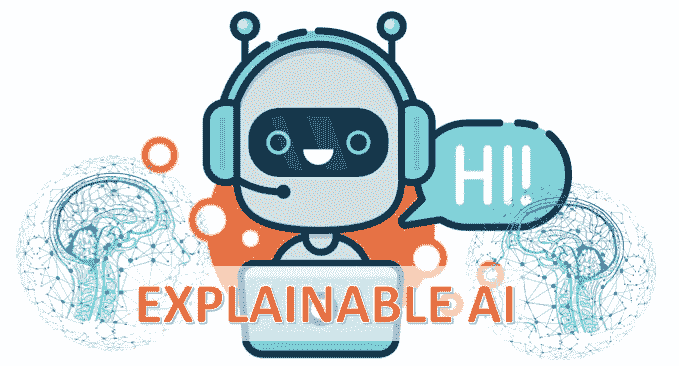

# 对可解释人工智能的一种解释

> 原文：<https://medium.com/analytics-vidhya/an-explanation-for-explainable-ai-xai-d56ae3dacd13?source=collection_archive---------2----------------------->

人工智能(AI)已经融入到我们生活的方方面面。当你浏览网页时，一个由高级自然语言处理(NLP)支持的聊天机器人会弹出来帮助你。语音识别系统可以验证您的身份以解锁您的帐户。无人驾驶飞机或无人驾驶汽车可以服务于操作或人类无法进入的区域。机器学习(ML)预测被用于各种决策制定。一个…