# IMBD 和烂番茄电影产业数据的探索性分析

> 原文：<https://medium.com/analytics-vidhya/an-exploratory-analysis-of-movie-industry-data-from-imbd-and-rotten-tomatoes-fcbf0bf6924c?source=collection_archive---------7----------------------->

完整的 Python 代码可以在 [GitHub](https://github.com/AvonleaFisher/dsc-mod-1-project-v2-1-onl01-dtsc-ft-070620) 上获得。

# 介绍

顶级电影有哪些共同的特质？来自电影业两个主要来源的数据——IMBD 和烂番茄——也许能够回答这个问题。在这个探索性分析中，我考虑了电影的运行时间和类型如何与它们的盈利能力相关，并查看了不同内容评级中正面和负面评论的分布。无论你是一个想赚大钱的明星导演，还是像我一样碰巧喜欢电影的数据呆子，请继续读下去:这是给你的。

# IMBD 的数据

本次分析中使用的最终 IMBD 数据来自两个数据集。一个包含关于电影总价值的信息:

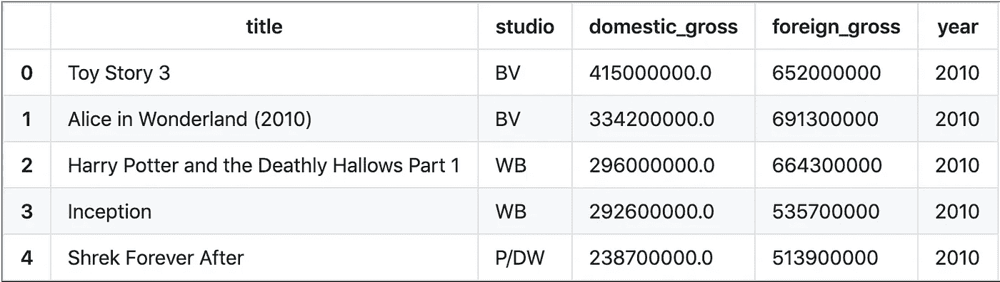

另一个包含电影的类型和运行时间:

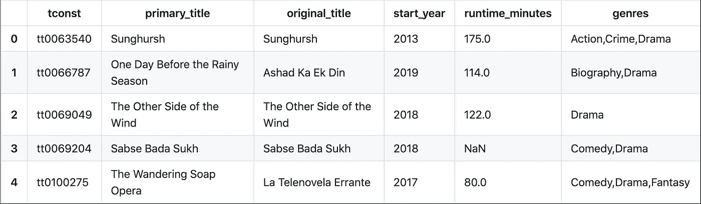

为了简化分析，我合并了这两个数据集的标题列，去掉了所有多余的列:

然而，事实证明，合并后的数据集中有几十部电影有着相同的标题！通过删除年份列没有相同值的行，我大大降低了在同一行中有两部不同电影的数据的可能性。

最后，我删除了 foreign_gross 列，该列包含大量缺失值和一些其他具有 NA 值的单元格。这给我留下了一个干净的数据框架，没有不必要的数据，没有丢失的数据，以及 1852 部电影的样本大小。

# 烂番茄的数据

我还合并了来自烂番茄的两个数据集，但幸运的是，数据集包含了对应于相同电影的匹配 id。一个数据集保存电影评论，包括它们的状态“新鲜”或“腐烂”，另一个保存电影的基本信息。在用上面使用的相同方法合并数据并将其子集化到相关列之后，我得到了下面的数据结构:

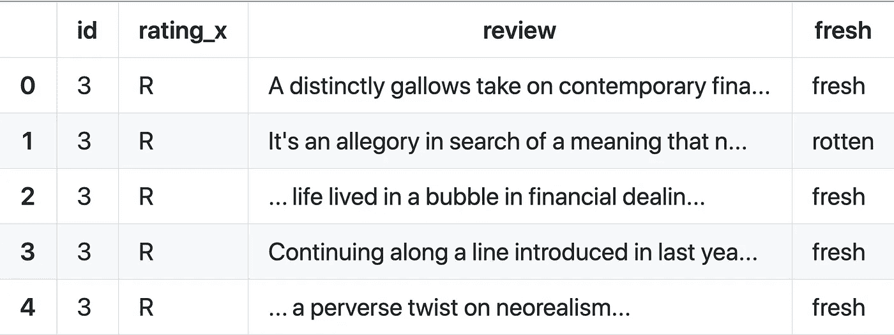

为了将 RT 数据转换成最终形式，我编写了一个函数来计算给定内容评级的“新鲜”和“糟糕”评论的频率，然后将该函数应用于每个评级:

我将结果列表转换为一个数据框，并编写了一个 for 循环来将评论计数转换为评论总数的百分比:

这导致了我的最终 RT 数据框架，它显示了每个评级的新鲜和腐烂评论的百分比:

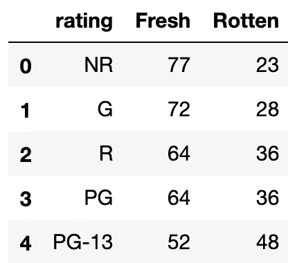

# 分析和可视化

**流派分布**

作为探索性分析的第一步，我感兴趣的是将电影行业的类型分布可视化。使用我的干净的 IMBD 数据，我为这些类型创建了一个频率字典:

然后，我使用 matplotlib 在条形图上绘制流派频率:

现在我们有了:数据集中最常见的流派及其出现频率的图表。戏剧、喜剧、动作和冒险是电影业最常见的类型。

**国内总产值**

一个流派的流行并不一定表明它在这个行业的成功，那么国内的总值呢？我为总总值制作了频率字典，并将其转换为数据框架:

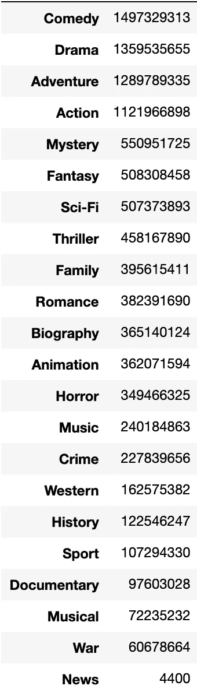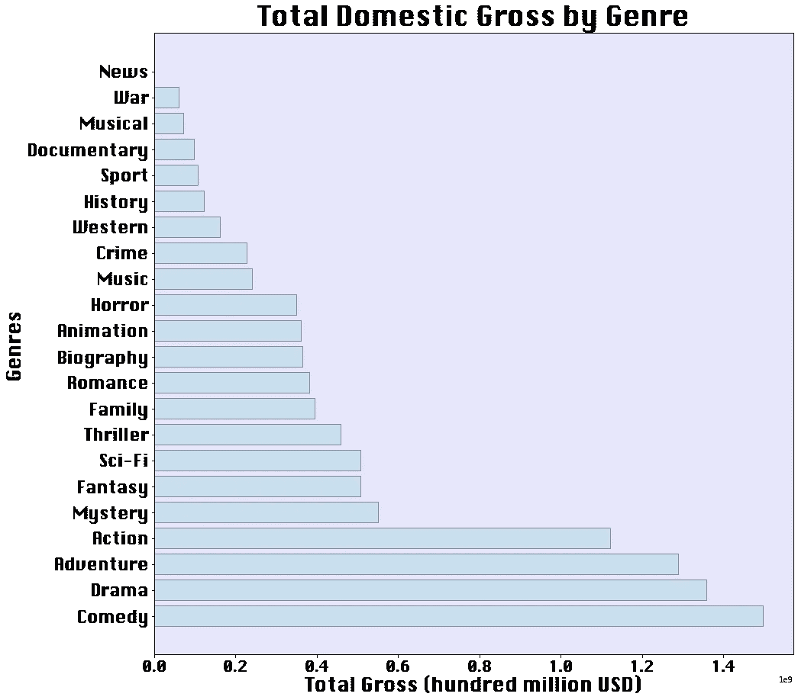

不出所料，这张图与上面的体裁频率图非常相似。我们预计最常见的类型也将有最高的总价值。然而，在这张图表中，喜剧胜过戏剧，冒险胜过动作片。神秘、科幻和幻想都已经上升到图表中的最高位置之一！这些差异可以用平均总值的差异来解释，我们现在就来看看。

为了计算平均值，我展开了“国内总量”数据框，将“流派”下每个列表中的每个流派变成了一个不同的行，并保持所有其他行值不变。然后，我将数据按流派分组，并调用“describe”函数为“domestic_gross”列生成描述性统计数据。最后，我对数据进行了过滤，只包含平均值和流派，并按照平均值从高到低排序:

使用 seaborn 和 matplotlib，我创建了下面的散点图，它传达了关于流派的平均总值和频率的信息:

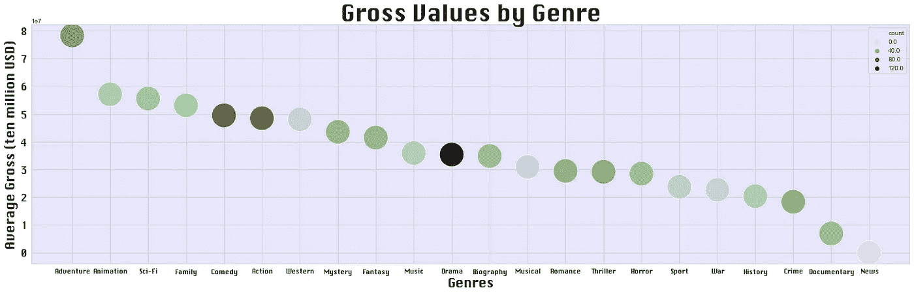

动画、科幻和家庭不是最常见的类型。然而，就平均总价值而言，除了冒险，这些都是表现最好的类型。西部片也是一种非常罕见的类型，尽管它在 y 轴上有相对较高的位置。在有人做更细致的分析之前，我会把这归功于传奇人物昆汀·塔伦蒂诺。

如果您只对票房收入最高的电影类型的平均和总分布感兴趣，此图提供了对该数据子集的详细了解:

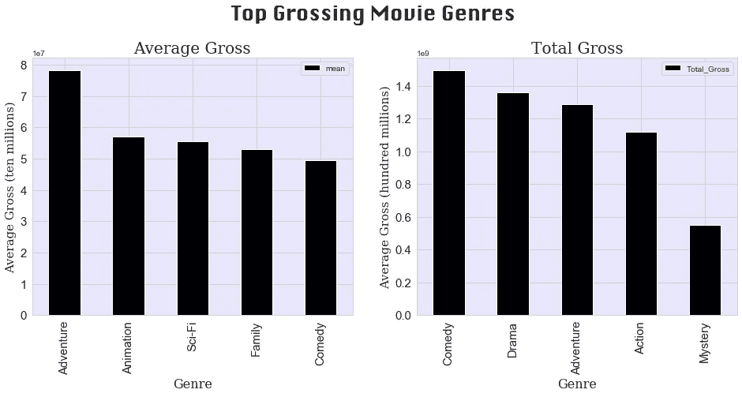

**新鲜的还是腐烂的？按内容分级分布评论**

为了可视化烂番茄评分的分布，我将数据从“最新鲜”到“最不新鲜”排序，然后绘制在一个条形图上。

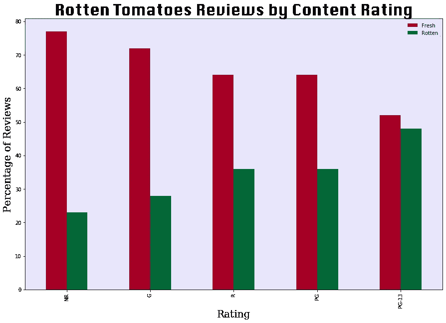

可能是儿童主宰了烂番茄影评界，但未分级和 G 级电影显然是赢家。也许 PG-13 电影既不健康也不令人不安，不足以达到珍贵的“新鲜”状态。

**运行时间和国内总值**

没有人喜欢坐着看完 4 个小时的电影，也许《指环王》是个例外。不知何故，我们仍然可以轻松地狂饮 8 小时的网飞系列，但我跑题了。同样，要制作一部令人印象深刻的短片来真正赚钱也很难。那么电影运行时的“最佳点”是什么呢？我创建了一个线性模型图，将放映时间和国内总价值之间的关系可视化，过滤掉不到一小时的电影。

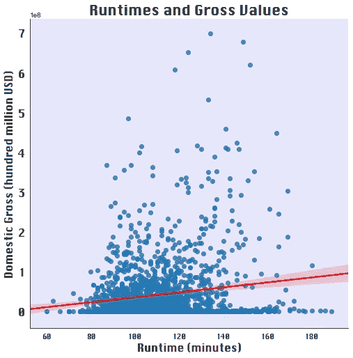

没有一部票房最高的电影落在运行时间轴的两端，但它们似乎比许多电影的情节都长。下面的方框图给出了所有电影与票房最高的电影的更好的对比。

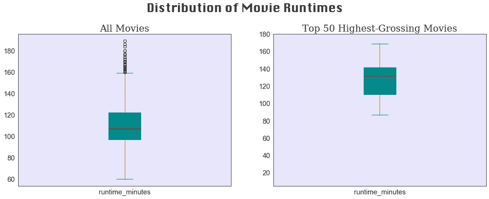

正如我们所看到的，大多数票房最高的电影都在 110 到 140 分钟之间。这部票房最高的电影的平均时长为 127 分钟。

# 结论

如果你想成为一名百万富翁电影制作人，考虑创作一部 127 分钟的未分级或 G 级西部冒险片。就平均国内总价值和评论家评论而言，这些类型的电影在美国电影业中表现最为成功。