# 使用 R(机器学习算法，GLM)进行医疗保健数据分析的广泛指南

> 原文：<https://medium.com/analytics-vidhya/an-extensive-guide-for-health-care-data-analysis-using-r-machine-learning-algorithms-glm-1959eba2e6ab?source=collection_archive---------8----------------------->

**本文是关于糖尿病数据的详细基础模型分析，包括以下分析:**

1.  **数据探索(数据分布推断、单变量数据分析、双样本 t 检验)**
2.  数据相关性分析

**3。特征选择(使用逻辑回归)**

**4。离群点检测(使用主成分图)**

**5。基本参数调整(CV，复杂性参数)**

**6。数据建模**

基本 GLM(在 AIC 的基础上增加了所有功能，去掉了一些功能)

逻辑回归

决策图表

朴素贝叶斯

参考:[https://rb.gy/xej8wd](https://rb.gy/xej8wd)

**基础 EDA**

数据可以从[https://www.kaggle.com/uciml/pima-indians-diabetes-database](https://www.kaggle.com/uciml/pima-indians-diabetes-database)下载

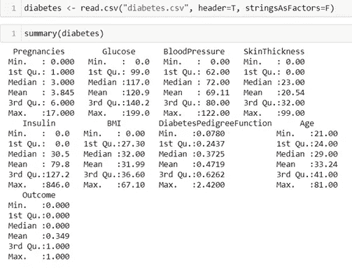

# 单变量分析

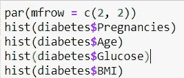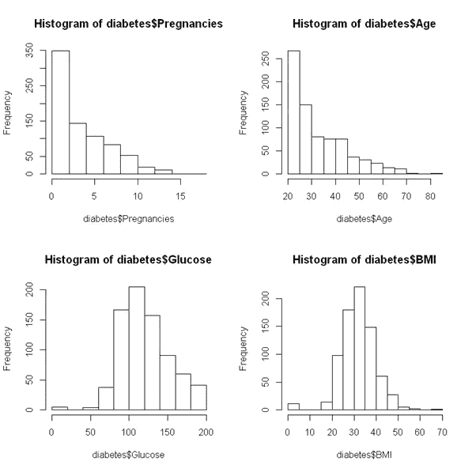

从这些分布图中，

年龄和怀孕次数不符合预期的正态分布，因为潜在人群也不应该符合正态分布。

葡萄糖水平和身体质量指数遵循正态分布。

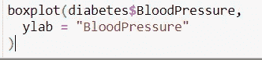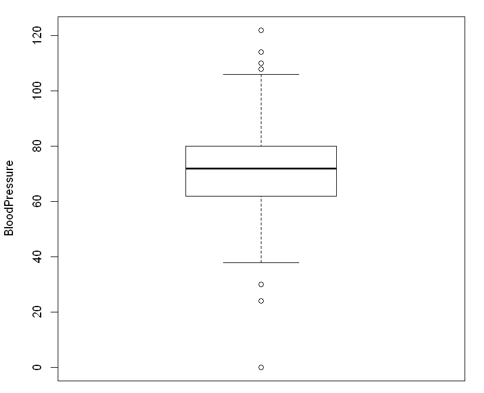

# 葡萄糖对糖尿病的影响

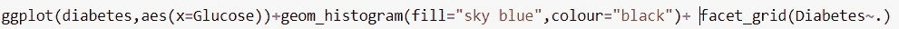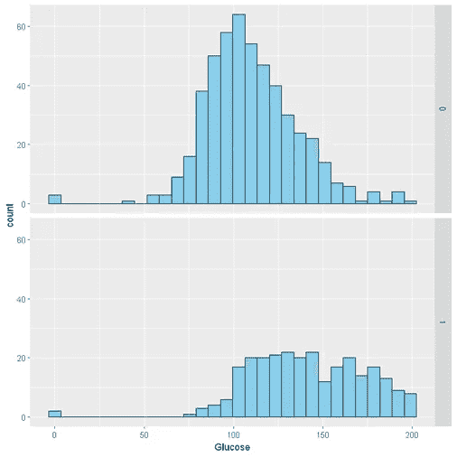

制定一个假设，以评估阳性和阴性组之间葡萄糖水平的平均差异。

**条件**

个人是相互独立的

这里分布是偏斜的，但是样本大于 30

两组都是相互独立的，并且样本量少于总体的 10%

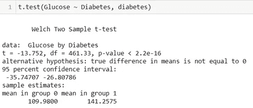

p 值为< critical values of 0.05, so we reject the null hypothesis for the alternate hypothesis. We can say that we are, 95 % confident, that the average glucose levels for individuals with diabetes is >非糖尿病人。

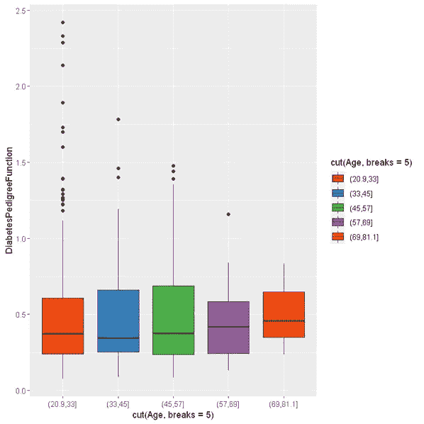

**胰岛素与葡萄糖基于糖尿病的结果**

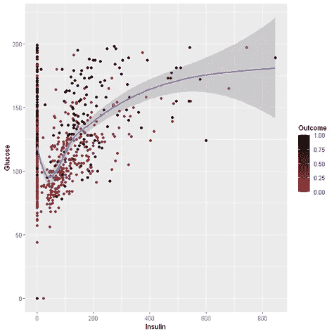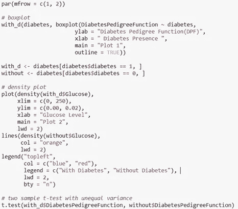

**韦尔奇两样本 t 检验**

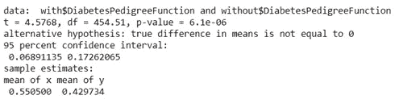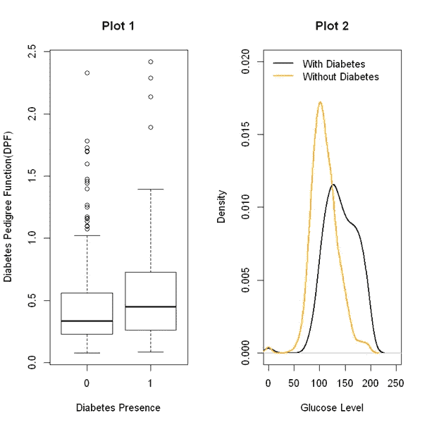

从图 2 来看，对于没有糖尿病的人，分布向左移动。

这表明没有糖尿病的人通常血糖水平较低。

**各变量之间的相关性**

所有列的散布矩阵

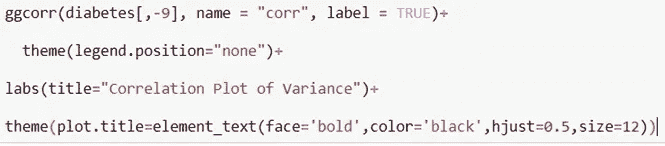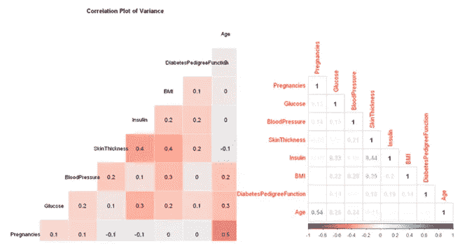

妊娠、年龄、胰岛素、皮肤厚度有较高的相关性。

**拟合逻辑回归以评估预测因素的重要性**

*   用链接函数“概率单位”拟合 GLM(一般线性模型)
*   目标变量“糖尿病”估计为二项式分布

这是一个通用的实现—没有对数据的假设

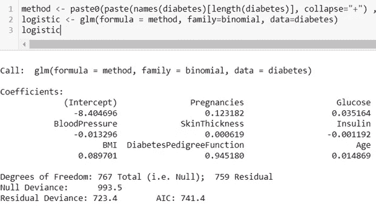

# 从 GLM 模型中筛选最重要的预测因子

*   提取 N 个最重要的 GLM 系数

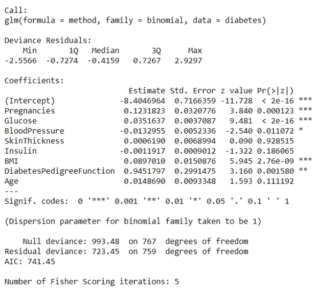

*   **逻辑回归为:**

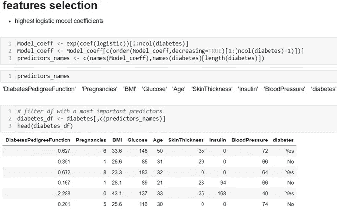

**异常值检测**

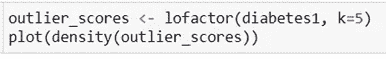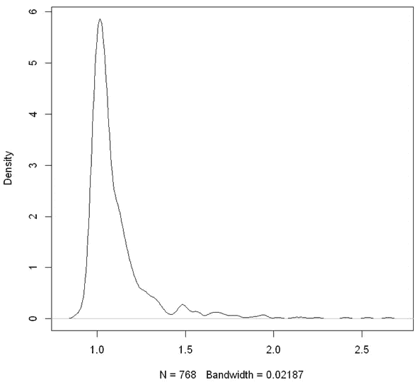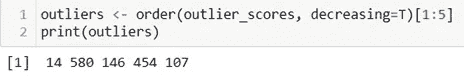

# 输出中获得的五个异常值是从糖尿病数据集导出的糖尿病 1 数据中的行号。

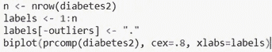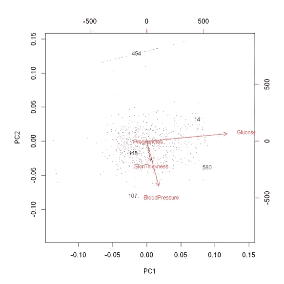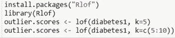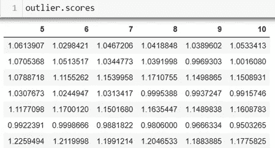

**数据建模**

1.  **所有变量的基本 GLM**

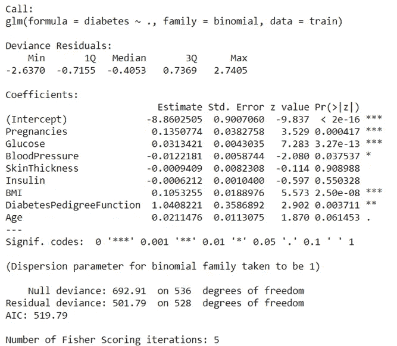

结果表明，三头肌 _ 皮肤、血清 _ 胰岛素和年龄变量没有统计学意义。p _ values > 0.01，因此我们可以通过移除它来进行实验。

# **逻辑模型**

输入:解释变量 xk，并提供带有参数βk 的预测 p

logit 变换将 p 的值约束到区间[0，1]。

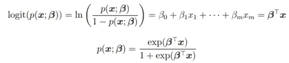

βk 表示特征的对数概率 xk 表示当预测值 xk 增加时，阳性结果(即 logit 变换)概率的对数增加了多少。

模型的可能性如下:

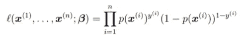

Y^i =受试者 I 的结果

最大化似然=最大化对数似然(模型)

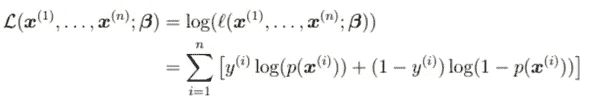

上述方程对于逻辑回归是非线性的，并且其最小化通常通过迭代重新加权最小二乘法在数值上完成

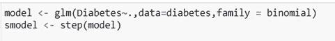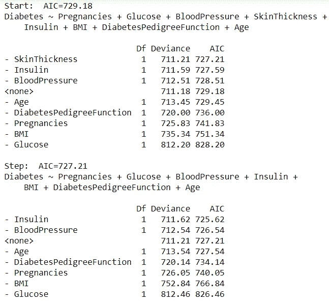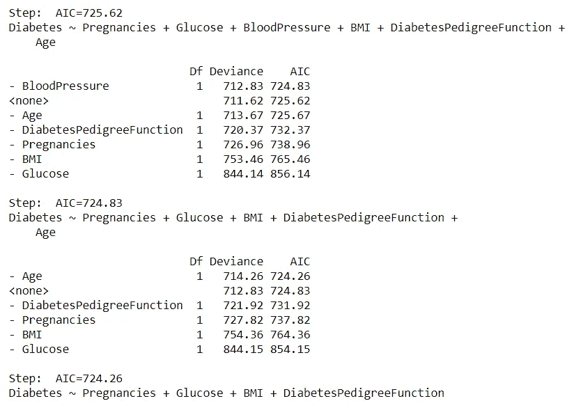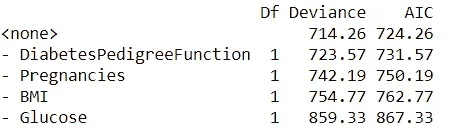

## 选择 AIC 作为最终模型，该模型是从具有最低 AIC 值 584.68 的逻辑回归模型生成的选择。

# **初始参数整定**

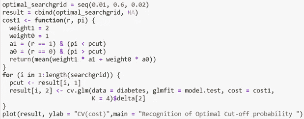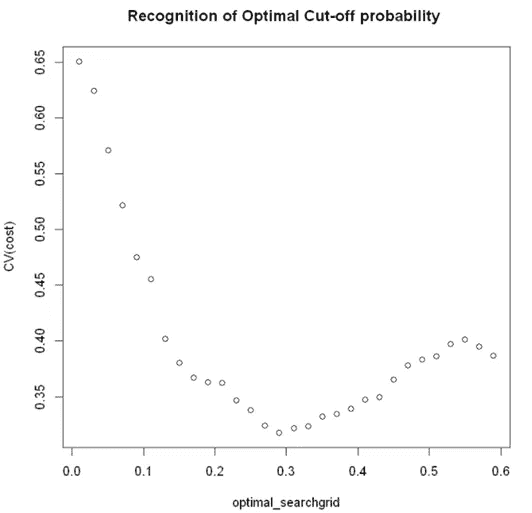

**从该图中，交叉验证成本 pcut 0.28 被选为最佳截止概率，CV 成本为 0.3370。**

**树< - rpart(糖尿病~)。，数据=糖尿病，方法= "类")**

**rpart.plot(树)**

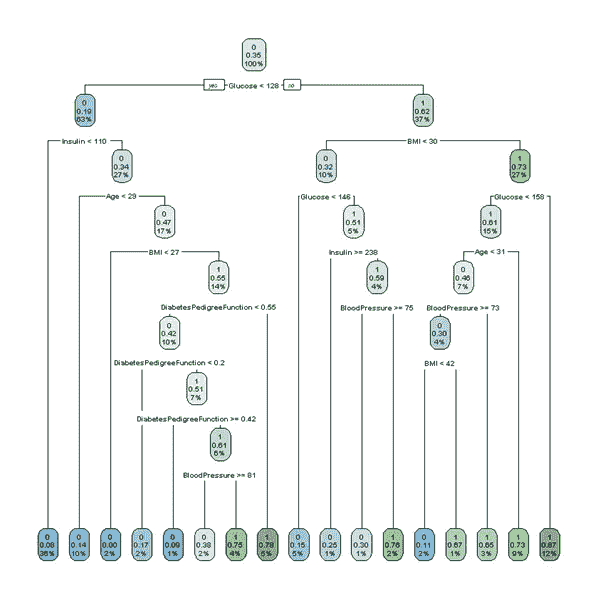

**plotcp(树)**

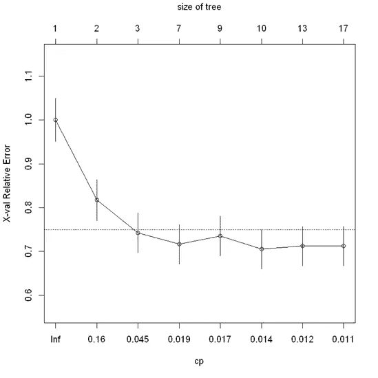

**复杂度参数**

使用相对误差与复杂度参数的参考来调整上述树。从上图 Cp 值为 0.016，决策树被修剪。最终的决策树

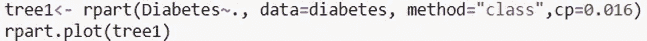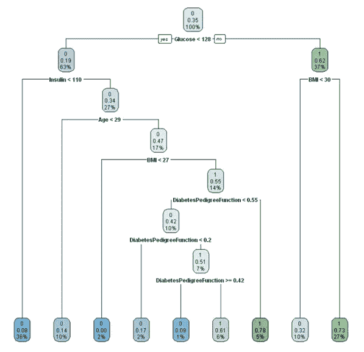

如果 CP 值较低，树会变大。cp = 1 将不会提供有助于修剪树的树。更高的复杂度参数会导致过度修剪的树。

**通过移除 3 个特征的第二模型-**

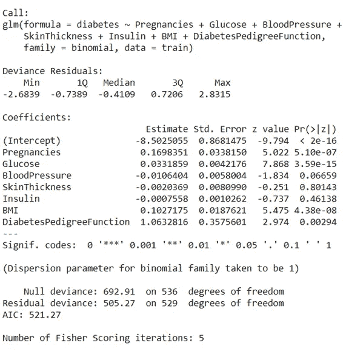

par(m flow = c(2，2))

绘图(glm_m2)

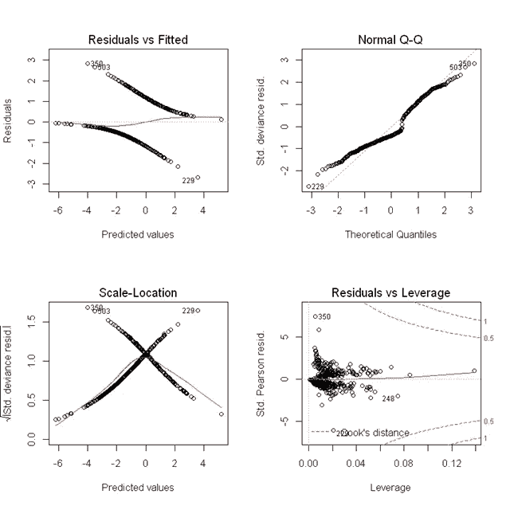

1.**残差与拟合值**；这里 y=0 的虚线表示拟合线。拟合线上的点表示零残差。上面的点有正的残差，同样下面的点有负的残差。。红线表示平滑的高次多项式曲线，提供了残余运动模式背后的概念。这里的残差具有对数模式，因此我们得到了一个很好的模型。

2.**正态 Q-Q 图:**通常，正态 Q-Q 图用于检查我们的残差是否遵循正态分布。如果点紧密地沿着虚线，残差被称为是正态分布的。

在我们的例子中，除了在 229、350 和 503 处的观察之外，残差点紧密地跟随虚线，因此该模型残差通过了正态性检验。

3.**比例-位置图:**表示预测值范围内的点的分布。

假设:

-方差应在整个预测值范围内合理相等(同质方差)

因此，这条水平红线被设置为理想值，它表示残差在整个预测值范围内具有一致的方差。随着残差相互扩散，红色扩散线上升。在这种情况下，数据是同质的，即具有**均匀方差**。

4.**残差 vs 杠杆图**:

**影响**:观察的影响可以定义为如果排除该观察，预测的分数会改变多少。库克的距离

**杠杆**:观察值的杠杆定义为预测变量上的观察值与预测变量的平均值相差多少。**观察的杠杆作用越大，该点在影响方面的潜力就越大**。

在我们的图中，红色虚线是厨师的距离，我们感兴趣的区域是右上角或右下角虚线之外的区域。如果任何一点落在该区域，我们说如果我们排除该点，观察具有高杠杆作用或具有影响我们模型的一些潜力是更高的。

**第三个模型:使用决策树预测新患者的糖尿病风险**

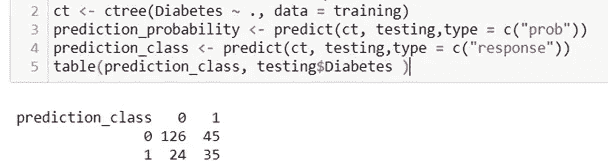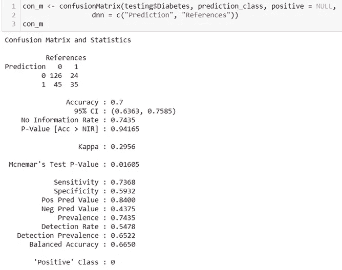

**第四模型朴素贝叶斯:**

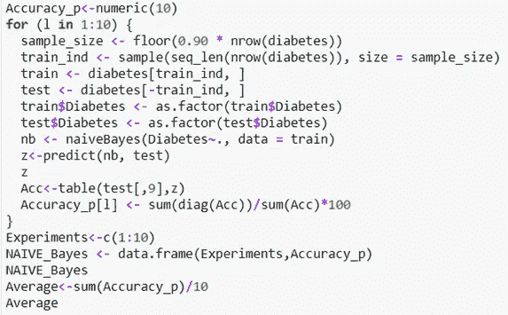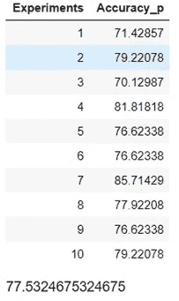

虽然这是一个基本模型，但它的表现很好，平均准确率为 77%

参考资料:

 [## 3.5 - R 脚本|统计 508

### 糖尿病数据集取自 Kaggle 上的 UCI 机器学习数据库:皮马印第安人糖尿病数据库 768…

online.stat.psu.edu](https://online.stat.psu.edu/stat508/lesson/3/3.5) 

[https://www . diva-portal . org/smash/get/diva 2:834649/full text 01 . pdf](https://www.diva-portal.org/smash/get/diva2:834649/FULLTEXT01.pdf)