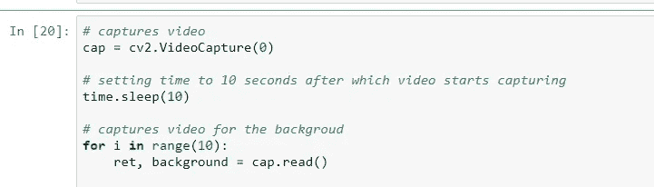
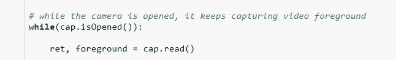
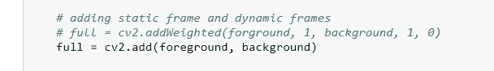

# 用 OpenCV 实现幻像投影

> 原文：<https://medium.com/analytics-vidhya/an-illusion-image-projection-with-opencv-6b6e6b3b46c?source=collection_archive---------12----------------------->

[源链接](https://www.google.com/search?q=astral+projection&tbm=isch&hl=en&chips=q:meditation+astral+projection,g_1:meditation:8014_9z1U-M%3D,g_1:body&rlz=1C1RLNS_enIN844IN844&hl=en&ved=2ahUKEwiXms6CxtvnAhWLD3IKHWqhCYwQ4lYoAHoECAEQFg&biw=1499&bih=694#imgrc=B21QfNPqhlMDqM)

**我热烈欢迎所有的读者！**

嘿，伙计们，来个很酷的项目怎么样？为什么不试试 OpenCV ( *开源计算机视觉*)，一个用于计算机视觉的库呢？我们现在也要这样做。有了 OpenCV，我们将会创造出很酷的东西。这个项目的主题是创建一个显示移动(动态)图像投影的错觉效果。这是通过组合静态帧和动态帧来实现的。我所说的帧是指在视频捕捉过程中创建的图像。

> **参考消息:灵感来源于**[**https://www . machine learning man . com/post/invisible-coat-of-Harry-Potter-with-python**](https://www.machinelearningman.com/post/invisible-cloak-of-harry-potter-with-python)

有三个主要步骤:

1.  创建静态框架(背景)
2.  创建动态框架(前景)
3.  添加静态和动态框架。

## 1.创建静态框架(背景):

第一步，我们必须创建一个用作背景的框架。这个帧是固定的，用作背景。背景框架是静态的，不可改变的。前景的任何变化都不会影响背景。

创建静态背景的示例代码

## 2.创建动态帧(前景):

在这一步，我们必须创建用于前景的连续帧。背景中的任何物体或主体，如果移动，就会看到物体或主体的痕迹。被移动的物体或主体的轨迹看起来像透明的反射，产生一种错觉效果。例如，在静态框架中，我们有一个表。从前景来看，如果桌子被移动或移走，桌子的痕迹可以被视为透明的反射。

创建前景的示例代码

## 3.添加静态框架和动态框架:

在这一步中，我们将使用 cv2.add()或 cv2.addWeighted()添加静态帧(背景)和动态帧(前景)。

添加前景和背景的示例代码

## 输出:幻觉效果的视频:

 [## LinkedIn 上的 sandeep Panchal:# opencv # deep learning #人工智能

### OpenCV 美得难以想象。只是随便玩玩 OpenCV。称之为星体投射或幻觉或鬼魂…

www.linkedin.com](https://www.linkedin.com/posts/sandeep-panchal-682734111_opencv-deeplearning-artificialintelligence-activity-6635488107187802112-sOTC) 

> **供参考:完整代码请访问** [**GitHub 资源库**](https://github.com/Sandeep-Panchal/Image-Projection-with-OpenCV)

# 帮我连接:

1.  **领英:**【https://www.linkedin.com/in/sandeep-panchal-682734111/】T2
2.  GitHub:[https://github.com/Sandeep-Panchal](https://github.com/Sandeep-Panchal)

感谢大家阅读这篇博客。非常感谢您的建议！