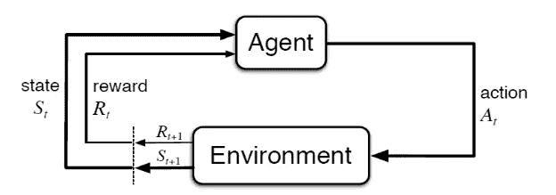
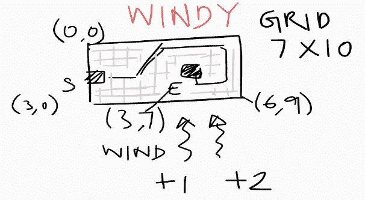
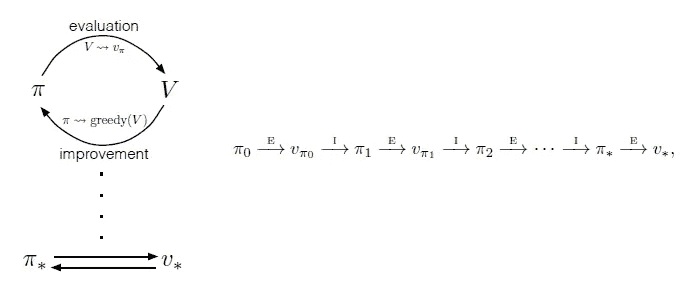

# 强化学习的图解概述

> 原文：<https://medium.com/analytics-vidhya/an-illustrated-overview-of-reinforcement-learning-ccc47ae43b6?source=collection_archive---------21----------------------->

强化学习(RL)是一种不同于传统机器学习(有监督和无监督)的学习范式。这里考虑的学习问题模仿人类使用试错法从交互中学习，并且在历史上被用于规划/决策相关的问题，如机器人和自动驾驶。在需要做出连续决策以优化指标的情况下，我们可以应用 RL。让我们考虑一个新闻推荐问题的例子。向用户呈现他们可能感兴趣的文章列表，用户决定是点击(并阅读)还是不点击。我们(称为代理)如何组织或排列文章以最大化点击率(CTR)？有没有一种策略(RL 术语中称之为策略)可以带来更好的相关性，从而提高 CTR？对这个问题使用监督学习将尝试对所有文章独立地学习 P(点击|文章)。对于 RL，在每一个位置，考虑到用户已经看过的文章的顺序，我们试图学习 P(点击|文章 1，文章 2，文章 3)。鉴于用户已经看过文章 1、2 和 3，我们通过推荐这篇文章来最大化我们期望收到的总的未来累积奖励(点击)。直觉上，考虑已经看过的文章的顺序是有意义的，因为成百上千的文章可能与不同主题的用户相关，如果我们最终显示一个主题的文章，我们可能会冒着用户疲劳并退出页面的风险。相反，RL 试图达到最佳策略，平衡用户感兴趣的主题的多样性，最大限度地提高用户未来的潜在点击量
今天，RL 已经被用于一些行业，取得了不同的成功，但尚未成为主流技术。人工智能已经成功地应用于游戏中，早期的胜利之一是 AlphaGo 的游戏，其中一个人工智能代理击败了人类专家。消费者互联网、量化交易、资源管理、广告和制造业是 RL 成功应用的其他领域。RL 被广泛应用于游戏的原因之一是因为我们能够通过游戏模拟收集大量数据。对于现实世界的问题，数据收集要昂贵得多，并且在某些情况下不可行，这是阻止 RL 广泛采用的原因之一。



建模 RL 问题

接下来，我们考虑称为马尔可夫决策过程(MDP)的强化学习问题的数学表示。MDP 是顺序决策的经典形式，其中行动不仅影响即时奖励，还影响后续情况或状态，并通过这些未来奖励。因此，MDP 涉及延迟奖励以及权衡即时和延迟奖励的需要。MDP 包括以下组件

*   **代理**是学习者和决策者。
*   **环境**包括代理与之交互的一切。
*   每当代理通过采取**动作**与环境交互时，环境通过改变其**状态**做出响应
*   对于所采取的每一个行动，代理都会收到一个标量**奖励**，表示所采取行动的良好性。奖励可以是即时的，也可以是延迟的。
*   我的环境中有哪些状态和动作？
*   我与环境的互动是连续的和无限的吗？还是互动有一个自然的结束状态？
*   有无限多(大量)的状态吗？
*   我们知道系统模型吗？或者我们是否知道我的环境对不同状态下的行为有什么反应？>
*   回报是延迟的还是即时的？代理包括试错法吗？有顺序决策吗？
*   我应该如何设计我的奖励计划？我的奖励应该基于什么标准？
*   你的经纪人应该有多有远见？
*   代理是否同时学习和执行在环境中采取行动的策略(策略)？
*   你的国家很复杂吗？



Windy Grid:经典的网格包括从源单元导航到目标单元(每个单元都有相关的成本),选择最小成本的路径。多风的网格是对这个经典设置的修改，当你在这个网格中导航时，向上的风可以移动+1 或+2 个单元格。

**风网格世界**是对著名的网格世界问题的修改。问题是通过在每个单元格中采取一系列动作(上、下、左、右)来导航 7 X 10 单元格的网格。目标是达到最终状态/单元— (3，7)。导致(3，7)的状态的动作得到奖励 0，并且每一个其他转换导致奖励-1。我们有额外的风的约束:在第 4-9 列有向上吹的风，根据代理移动的列，风将代理移动+1 或+2 步。找出从(3，0)可能到达(3，7)的最佳路径(最低成本)。
我们将使用 python [openAI gym](https://gym.openai.com/) 模拟风力发电环境。Gym 是 open AI 的一个 RL 工具包，它为研究人员和开发人员提供了数百个环境来开发新的 RL 算法。每个环境都是一个系统动态的定义，可用于模拟，并具有可视化环境的选项。环境提供了记录在一个状态中采取行动的回报的方法。在我们的例子中，重置环境将状态带到(3，0)，我们的开始状态。目标状态是(3，7)。我们有 70 种可能的状态，代理可以在任何时候。每个状态都表示为(行，列)索引，并存储为 2D 数组。在每种状态下，有 4 种可能的动作(0-向上，1-向右，2-向下，3-向左)

大多数当前的 RL 文献集中在不同的问题上，以展示各种 RL 技术，这使得比较更加困难。为了解决这个问题，我们将使用 windy grid world 来演示基于 DP、MC 和 TD 的算法。我们将学习 Q 函数和 V 函数以及最优策略 pi*

大多数当前的 RL 文献集中在不同的问题上，以展示各种 RL 技术，这使得比较更加困难。为了解决这个问题，我们将使用 windy grid world 来演示基于 DP、MC 和 TD 的算法。我们将学习 Q 函数和 V 函数以及最优策略 pi*

```
%**run** helper.py
**import** **gym**
**import** **gym_gridworlds**
env = gym.make('WindyGridworld-v0')
env.reset()
```

Out[59]:

```
(3, 0)
```

# 动态规划

DP 是一种基于模型的 RL 技术，它假设系统的完整知识是容易获得的。即转移概率和奖励/激励方案。在下面的代码中，我们尝试使用一般化的策略迭代来迭代求解贝尔曼方程。我们从随机策略开始，评估 wrt。敬它。基于作为评估的一部分而学习的价值函数，我们将把策略更新为 greedy wrt。价值函数。接下来，我们再次评估新策略以获得更新的值函数，并将策略更新为贪婪的当前值函数，并且这递归地进行，直到策略不改变(我们称之为收敛标准)。此时，我们有最优策略，因此可以评估一次以获得最优值函数和最优行动值函数。

```
**import** **numpy** **as** **np**  
    *#initialize*
    policy = np.ones([70, 4]) / 4
    V = np.zeros(70)
    Q = np.zeros([70,4])

    *#step1 : policy evaluation(complete)*
    overall = 0 
    **while** True :
        cnt = 0
        **while** True:
            gamma = 1
            cnt = cnt + 1
            *#theta = 1e-8*
            theta = 0.01
            delta = 0
            oldpolicy = policy
            Vtmp = np.zeros(70)
            **for** s **in** range(70):
                *## store old value of V[s] to calculate delta*
                v = V[s]
                v_new = 0
                **for** a **in** range(4):
                    env.S = (s/10,s%**10**)
                    *## Iterate over possible results of taking action a*
                    ns,r,done, info = env.step(a)
                    **if** ns == (3,7):
                        r = 0
                    v_new += policy[s][a]*(r+gamma*V[10 * ns[0] + ns[1]])
                delta = max(delta, abs(v-v_new))
                Vtmp[s] = v_new
            *#print delta*
            V =  Vtmp
            **if** delta < theta **or** cnt == 1:
                **break**

        *#step2 :Derive Q from V*
        **for** s **in** range(70):
            **for** a **in** range(4):
                q_a = 0
                env.S = (s/10,s%**10**)
                ns,r,done, info = env.step(a)
                **if** ns == (3,7):
                    r = 0
                q_a += (r + gamma*V[10 * ns[0] + ns[1]])
                Q[s][a] = q_a  

        *#step 3: policy improvement*
        policy = np.zeros([70, 4]) / 4   
        **for** s **in** range(70):
            Q_s = Q[s]
            argmax = np.argwhere(Q_s == np.amax(Q_s)).flatten().tolist()
            *## Create Stochastic policy if multiple actions yield best results*
            prob = 1.0/len(argmax)
            **for** index **in** argmax:
                policy[s][index] = prob

        *#step 4: check if policy converged*
        **if** np.array_equal(oldpolicy,policy):
            **print** "converged after ",overall," iterations"
            **break**
        **else**:
            None *#print "iterate"*
            overall = overall + 1
        oldpolicy = policyconverged after  127  iterations
```

上述代码完成了以下步骤(迭代逼近最优)
**步骤-0** :策略的初始化为等概率(即在每一个州，政策都提到采取任何有相同问题的行动。)，value-function(V)设置为 0。动作值函数(Q)设置为 0。
**第一步**:策略评估(PE)试图在策略初始化的假设下得出价值函数的估计值。Vπ(s)=∑aπ(s，a)∑s′Pass′[Rass′+γVπ(s′)]
**step-2**:从 V-function 得到 Q-function。qπ(s,a)=eπ{rt+γvπ(st+1)∣st=s,at=a}=∑s′pass′[rass′+γvπ(s′)]
**步骤 3** :策略改进(PI)基于作为步骤 1 和步骤 2 的一部分而估计的价值函数(v 和 q)贪婪地更新策略。π′(s)= argmaxaQ(s，a)
**第 4 步**:检查收敛—策略(prev iter) ==策略(current)？如果是，则停止循环并收工！融合了。如果没有，返回步骤，重复直到收敛。



下面的代码通过显示从开始到结束要遵循的最佳路径(以文本和视觉方式)来可视化最佳策略。还显示了发生的总成本。注意:箭头可能看起来很奇怪，但请注意，有风向上作用的影响，这使得代理一次移动多个单元。

```
visualize_path(Q,(5,5))output:
(5, 5) => (4, 6) => (2, 7) => (0, 8) => (0, 9) => (1, 9) => (2, 9) => (3, 9) => (4, 9) => (4, 8) => (3, 7)
-10 10
⏹ ⏹ ⏹ ⏹ ⏹ ⏹ ⏹ ⏹  ⮞ ⮟ 
⏹ ⏹ ⏹ ⏹ ⏹ ⏹ ⏹ ⏹ ⏹ ⮟ 
⏹ ⏹ ⏹ ⏹ ⏹ ⏹ ⏹ ⮞  ⏹ ⮟ 
⏹ ⏹ ⏹ ⏹ ⏹ ⏹ ⏹ ✌  ⏹ ⮟ 
⏹ ⏹ ⏹ ⏹ ⏹ ⏹ ⮞  ⏹ ⮜  ⮜ 
⏹ ⏹ ⏹ ⏹ ⏹ ⮞  ⏹ ⏹ ⏹ ⏹ 
⏹ ⏹ ⏹ ⏹ ⏹ ⏹ ⏹ ⏹ ⏹ ⏹
```