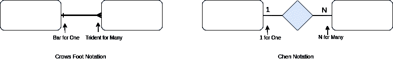
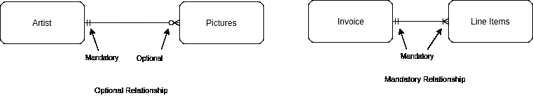
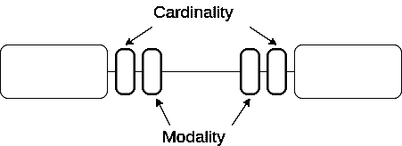

# 深入了解数据库关系中的基数和模态。

> 原文：<https://medium.com/analytics-vidhya/an-in-depth-look-at-database-relationships-cardinality-modality-a3d6bba0ee1e?source=collection_archive---------3----------------------->

> 设计强大数据库的指南。

在数据库设计中，基数和模态是两个建模概念，用于分析数据库中的实体、属性和关系结构。本文旨在让读者清楚地了解基数和模态是什么。

# 基数

基数是设计数据库时非常重要的概念，在创建 E/R 图时会用到。基数显示了一个关系中允许出现的最大数量，而不是最小数量。这通常表示为一对多。简单地说，基数指的是一个表中的一行和另一个表中的一行之间的关系，基数只有一个或多个选项。

举个例子:想象一个大学，有两张桌子:一张桌子给一个学生，一张桌子给一个系；然而，一个系可以有许多学生，而一个学生只能有一个系。这表明实体类型 A(部门)的一次出现可以与实体类型 B(学生)的一次或多次出现相关，但实体 B 只能与实体 A 的一次出现相关。这称为一对多关系，其他用例是，一个母亲可以有多个孩子，而一个孩子只能有一个母亲。一个博物馆可以有很多艺术品，但每件艺术品只能在一个博物馆。

除了一对多，还有其他类型的关系，每个国家只有一面国旗，每面国旗只属于一个国家。这里的关系是一对一的。

最后，在这种情况下，一本书可以有许多作者，而作者可以有许多本书。这是一种多对多的关系。

有四种基数状态。

一对一(1:1):实体 A 的出现最多只能与实体 B 的一次出现相关，实体 B 的出现最多只能与实体 A 的一次出现相关。例如，一个丈夫只能有一个妻子，一个妻子只能有一个丈夫(但在我国是一对多)。

一对多(1:N):实体 A 的一次出现可以与实体 B 的多次出现相关联，但是实体 B 的一次出现只能与实体 A 的一次出现相关联。例如，每只宠物都有一个主人，但是每个主人可以拥有一只或多只宠物。

多对多(M: N):实体 A 的一次出现可以与实体 B 的多次出现相关，而实体 B 的一次出现可以与实体 A 的多次出现相关。例如，在医患关系中，每个医生看很多病人，每个病人看很多医生。

多对一(M:1):因为关系是双向的，所以多对一关系与一对多关系相反。

绘制基数有不同的表示法；鱼尾纹和陈式批注出了许多。陈把数字 1 放在菱形旁边的关系线上代表一，N 或 M 代表许多。大多数现代建模者已经放弃了陈记数法，而倾向于用横杠来表示一和三叉戟，或称鱼尾纹记数法。

基数使用鱼尾纹和陈记数法。

# 形式

模态完全不同于基数。模态值显示为“0”，如果关系是可选的，或者当没有要求时，在模态值表示为“1”(或条)的情况下，则关系的发生是强制性的。简单地说，它描述了两个或多个实体之间的关系是否是强制性的。

例如，关系-实体对订单包含行项目，艺术家绘制图片(如下图)。我们知道包含行项目的订单基数是一对多的—一个订单可以包含许多行项目，但是一个行项目只能是一个订单的一部分。我们还知道，艺术家绘画的基数也是一对多的，但这两者之间有很大的区别。你不能没有至少一个行项目的订单，但许多艺术家从来没有画过画。

显示强制和可选关系的模态

因为没有订单就没有行项目，所以行项目事件必须链接到订单事件；换句话说，行项目在关系容器中的角色是强制性的。你能有一个没有行项目的订单吗？如果不是，那么订单在 Contain 中的角色也是强制性的。图片和艺术家也是如此。一个图片事件必须链接到一个艺术家事件，所以形态是强制性的。但是，艺术家事件不需要链接到任何图片事件，因此艺术家在关系绘制中的参与是可选的。

模态描述了实体在关系中的角色是强制的还是可选的。如前所述，按照惯例，强制模态由横条“1”(a 横条)表示，而可选模态由“O”表示。下图显示了基数和模态的适当位置。

有四种可能的模态情况。

强制-可选:实体 A 的每次出现必须与实体 B 的至少一次出现相关联，但是实体 B 的一次出现不需要与实体 A 的任何出现相关联。例如，账户不需要与任何订单相关联(它可能刚刚建立)，但是订单必须与账户相关联。

强制-强制:实体 A 的每次出现必须与实体 B 的至少一次出现相关，实体 B 的每次出现必须与实体 A 的至少一次出现相关。例如，订单必须与至少一个行项目相关，而行项目必须与订单相关。

可选-可选:实体 A 的出现不需要与实体 B 的任何出现相关联，实体 B 的出现也不需要与实体 A 的任何出现相关联。例如，在为汽车提供融资的银行中，银行可以但不需要为任何汽车提供融资，而汽车可能没有得到银行的融资。

可选-强制:因为关系是双向的，可选-强制关系与强制-可选关系相反。

在结论基数中，没有鱼尾纹可以表示一，对于情态，没有“O”可以表示强制。然而，这个酒吧并不是多余的，它传达了一个重要的信息。拥有这三个符号(条形、鱼尾纹和 O)可以告诉您建模者何时知道基数或模态，何时不知道。