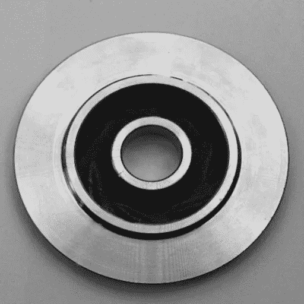
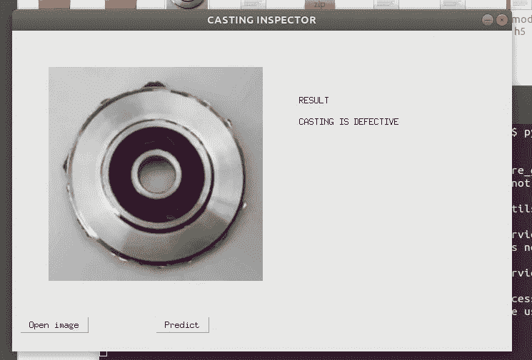
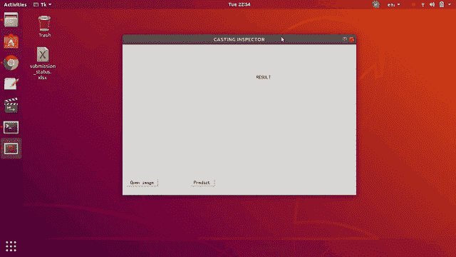

# 深度学习图像分类的工业案例研究

> 原文：<https://medium.com/analytics-vidhya/an-industrial-case-study-on-deep-learning-image-classification-c909d331fc31?source=collection_archive---------7----------------------->

图像分类的逐步指南

在这篇文章中，我将解释深度学习图像分类的一个端到端用例，以便在铸造厂自动对有缺陷和无缺陷的铸件进行分类。本问题陈述及数据集摘自[*https://www . ka ggle . com/ravi rajsinh 45/real-life-industrial-dataset-of-casting-product*](https://www.kaggle.com/ravirajsinh45/real-life-industrial-dataset-of-casting-product)*。*



铸件产品图片(潜水泵叶轮)，来源:[*https://www . ka ggle . com/ravi rajsinh 45/real-life-industrial-dataset-of-casting-product*](https://www.kaggle.com/ravirajsinh45/real-life-industrial-dataset-of-casting-product)*。*

**铸造工艺:**铸造是一种主要的制造工艺，在这种工艺中，熔融金属被倒入一个叫做模具的空腔中，冷却直至凝固成产品。

**铸造缺陷:**这些是在铸造过程中出现的铸造产品的缺陷，它们是不希望的。铸件中有许多类型的缺陷，如气孔、针孔、毛刺、缩孔、模具材料缺陷、浇注金属缺陷、冶金缺陷等。

铸造缺陷是不可取的，会给制造商造成损失，因此质量部门必须对产品进行目视检查，并将有缺陷的产品与合格的铸件分开。视觉检查是劳动密集型和耗时的，因此卷积神经网络(CNN)可以用于通过图像分类来自动化该过程。图一。显示了在这个项目中开发的铸造检查员应用程序。这篇文章的剩余部分解释了在这个案例研究中使用的逐步方法。



图一。在这项工作中开发的铸造检查员应用程序的屏幕截图。

# **第一步:使用 CNN 训练模型。**

**1.1 从网址:**[*https://www . ka ggle . com/ravi rajsinh 45/real-life-industrial-dataset-of-casting-product*](https://www.kaggle.com/ravirajsinh45/real-life-industrial-dataset-of-casting-product)*下载数据集，解压文件夹。在这个图像分类问题中有两类，即缺陷铸件和无缺陷(合格)铸件。数据集已经分为训练数据集和测试数据集。训练数据集包括 3758 幅有缺陷铸件图像和 2875 幅无缺陷铸件图像，测试数据集包括 453 幅有缺陷铸件图像和 262 幅无缺陷铸件图像。数据集中的每个图像都是形状为 300X300 像素的灰度图像。*

***1.2 训练模型:**我使用了稍加修改的 VGG16 算法来训练这些图像。在此之前，我尝试了 Resnet 50 和 Lenet 算法，但奇怪的是，结果并不令人满意。下面是我用来训练模型的代码，我在谷歌联合实验室 GPU 上用 1000 步训练了 100 个时期的模型。完成培训过程花了 12 个多小时。*

```
*from keras.models import Sequential
from keras.layers import Conv2D
from keras.layers import MaxPooling2D
from keras.layers import Flatten
from keras.layers import Dense# Initialising the CNN
classifier = Sequential()# Step 1 - Convolution
classifier.add(Conv2D(32, (3, 3), input_shape = (300, 300, 3), activation = 'relu'))# Step 2 - Pooling
classifier.add(MaxPooling2D(pool_size = (2, 2)))# Step 3 - Flattening
classifier.add(Flatten())# Step 4 - Full connection
classifier.add(Dense(units = 128, activation = 'relu'))
classifier.add(Dense(units = 1, activation = 'sigmoid'))# Compiling the CNN
classifier.compile(optimizer = 'adam', loss = 'binary_crossentropy', metrics = ['accuracy'])# Part 2 - Fitting the CNN to the images
from keras.preprocessing.image import ImageDataGeneratortrain_datagen = ImageDataGenerator(rescale = 1./255,
                                   shear_range = 0.2,
                                   zoom_range = 0.2,
                                   horizontal_flip = True)test_datagen = ImageDataGenerator(rescale = 1./255)training_set = train_datagen.flow_from_directory('/content/drive/My               Drive/casting/casting_512x512/CASTING/train', target_size = (300, 300), batch_size = 32, class_mode = 'binary')test_set = test_datagen.flow_from_directory('/content/drive/My Drive/casting/casting_512x512/CASTING/test', target_size = (300, 300),batch_size = 32,class_mode = 'binary')model = classifier.fit_generator(training_set,
                                 steps_per_epoch = 1000,
                                 epochs = 100,
                                 validation_data = test_set,        validation_steps = 1000)classifier.save("vggmodel.h5")
print("Saved model to disk")*
```

# ***第二步:使用训练好的模型对图像进行分类。***

*在训练模型之后，包含权重的文件在这个项目中生成，它被命名为“vggmodel.h5”。这个文件被发现有 1.01 GB 重，超出了我的预期，在本教程的最后，我提供了下载这个文件的链接。我们可以使用该文件来预测或分类铸件的任何其他图像。下面是用来预测图像的代码。*

```
*from keras.models import load_model
model = load_model('vggmodel.h5')import numpy as np
from keras.preprocessing import imagetest_image = image.load_img('/home/murali/ds/data/casting  problem/casting_data/casting_data/train/ok_front/cast_ok_0_46.jpeg', target_size = (300, 300))test_image = image.img_to_array(test_image)
test_image = np.expand_dims(test_image, axis = 0)
result = model.predict(test_image)
print(result)if result[0][0] == 1:
    prediction = 'CASTING IS OK'
    print(prediction)
else:
    prediction = 'CASTING IS DEFECTIVE'
    print(prediction)*
```

*然而，这种代码不能每次都方便地用于对每个图像进行预测。因此，我决定为基于 GUI 的应用程序编写代码，通过它用户可以方便地加载铸造图像，并可以通过点击按钮进行分类。下一段解释了这种 GUI 的构建。*

# ***第三步:使用 python 的 tkinter 库构建一个 GUI。***

*GUI 是通过使用最简单有效的 GUI 构建工具 *tkinter* python 库构建的。它有丰富的小部件集合，这使得这个过程更加容易。以下是用于构建 GUI 的代码的不同部分及其功能。*

***3.1 导入库***

```
*from tkinter import *
from keras.preprocessing import image
import numpy as np
from keras.models import load_model
# loading Python Imaging Library 
from PIL import ImageTk, Image   
# To get the dialog box to open when required  
from tkinter import filedialog*
```

*首先，我们将导入 tkinter 库，然后导入如上所示的其他库。这些用于 GUI 相关功能、图像处理目的，numpy 用于与图像相关的计算。ImageTk 用于在 GUI 中处理图像，filedialog 用于用户浏览图像等。*

***3.2 加载模型(重量文件)***

```
*model = load_model('vggmodel.h5')
print('Model Loaded Sucessfully')*
```

*上面的代码将加载预先训练好的模型，我添加了打印语句，以便用户了解进程的状态。*

***3.3 函数 *open_img()* 和 *openfilename()****

**openfilename()* 是一个允许用户从对话框中选择文件并返回文件名的函数。 *open_img()* 加载由 *openfilename()* 函数提供文件名的图像，并保存为“casting.jpeg”以备后用，最后使用 *place()* 函数*在 GUI 窗口的指定位置显示为标签。**

```
*def open_img(): 
    # Select the Imagename  from a folder  
    x = openfilename() 
    # opens the image 
    img = Image.open(x) 
    im1 = img.save("casting.jpeg")
    img = ImageTk.PhotoImage(img) 
    # create a label 
    panel = Label(root, image = img)   
    # set the image as img  
    panel.image = img 
    panel.place(bordermode=OUTSIDE, x=50, y=50)

def openfilename(): 
    # open file dialog box to select image 
    # The dialogue box has a title "Open" 
    filename = filedialog.askopenfilename(title ='Select Image') 
    return filename*
```

*3.4*预测()*功能。*

*这个函数用于预测使用模型的图像的分类，找到下面的代码同样适用。*

```
*def prediction():
    img ="casting.jpeg"    
    test_image = image.load_img(img, target_size = (300, 300))
    test_image = image.img_to_array(test_image)
    test_image = np.expand_dims(test_image, axis = 0)
    result = model.predict(test_image)

    if result[0][0] == 1:
        prediction = 'CASTING IS OK'        '

    else:
        prediction = 'CASTING IS DEFECTIVE'

    result = Label(root, text = prediction)   
    # set the image as img  
    result.place(bordermode=OUTSIDE, x=400, y=120)*
```

*首先， *open_img()* 先前保存的“casting.jpeg”将被加载并适当转换为 *test_image* ，可用于预测目的*。*预测结果作为标签打印在 GUI 窗口上。*

***3.4 GUI 窗口***

*GUI 窗口由以下代码生成:*

```
*# Create a window 
root = Tk()   
# Set Title as Image Loader 
root.title("CASTING INSPECTOR")   
# Set the resolution of window 
root.geometry("700x450")   
# Do't Allow Window to be resizable 
root.resizable(width = False, height = False) 

# Create a button and place it into the window using place layout 
btn_open_image = Button(root, text ='Open image', command = open_img).place(x = 10, y= 400) btn_predict = Button(root, text ='Predict', command = prediction).place(x = 200, y= 400) result_hd = Label(root, text = "RESULT")
result_hd.place(bordermode=OUTSIDE, x=400, y=90)
root.mainloop()*
```

**root* 是我们窗口的名称， *root.title* 将设置我们窗口的标题为“铸造检查器”， *root.geometry* 将设置 GUI 窗口的大小。 *root.resizable* 有助于限制调整大小选项。然后创建两个按钮，一个用于浏览和打开图像文件，另一个用于使用模型进行预测。按钮 *btn_open_image* 调用前面讨论的 *open_image()* 函数，其中按钮 *btn_predict* 将调用函数 *prediction()* ，该函数将预测图像所属的类。最后，铸造检查员的工作如下所示*

**

# ***结论***

*该帖子说明了深度学习图像分类的实施，作为工业环境中的用例。以下是该项目的未来范围*

1.  *该应用程序可以与相机集成，以捕捉铸造产品的实时图像。*
2.  *可以通过增加历元数和使用其他深度学习算法来训练模型以获得更高的准确性。*
3.  *该应用程序可以与一些致动器集成，以便一旦检测到有缺陷的铸件，就激活该机制来分离该有缺陷的铸件。*

*本项目中使用的代码可以在[https://github.com/muralimambekar/casting_inspector](https://github.com/muralimambekar/casting_inspector)上找到*

*模型(重量)文件可从以下网址下载*

*[https://drive . Google . com/file/d/1 r 0 fbt 0 VD-yffawzplx 84 xsknlf-G3Dc/view？usp =分享](https://drive.google.com/file/d/1r0FbT0vd-YfFaWzPLx84txsKnLF-G3Dc/view?usp=sharing)*

*步骤 3:使用 python 的 tkinter 库构建一个 GUI。*

*[https://github.com/muralimambekar/casting_inspector](https://github.com/muralimambekar/casting_inspector)*