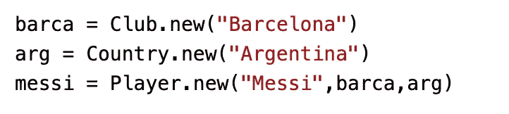
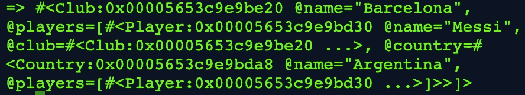
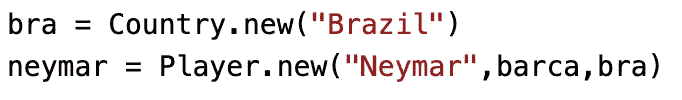
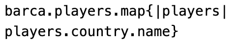

# 深入了解 Ruby 中的 Has-Many Through 概念。

> 原文：<https://medium.com/analytics-vidhya/an-insight-into-the-has-many-through-concept-in-ruby-49565cc8f984?source=collection_archive---------15----------------------->

如果你是编程新手，并且已经开始学习 Ruby 语言，你可能会觉得自己是世界上最好的程序员。Ruby 中使用的语法读起来和写起来就像英语一样不可思议，以至于学习它会很有趣(不是说学习*不有趣)。以这行代码为例:*

```
name = “Theodore”
```

您已经声明了一个变量“name ”,并将其设置为等于“Theodore”的值。够简单了吧？没有额外的语法，没有隐藏的技巧(直到你学习了变量作用域，我们今天不会深入学习)——只是给一个变量赋了一个值，这个值可以在程序的后面被调用。如此危险地容易理解，以至于你可能会放松警惕。

让我们更进一步。

```
class MyClass
   def initialize(name, gender)
      @name = name
      @gender = gender
   end
end
```

现在，如果您以前从未遇到过这种类型的代码，您可能不太理解上面的代码，但是相信我，理解它需要熟悉—语法非常简单明了。然而，如果您以前遇到过这种类型的代码，您肯定会知道这里发生了什么。我正在创建一个名为“MyClass”的类，它在实例化时接受两个参数“name”和“gender”。不过，很简单。我想说的是:当编程时，学习语法总是容易的部分，解决问题是程序员的关键。

在现实生活中，没有一个应用程序会脱离单个类(或对象)运行。对象通常会与其他对象相关联。显示对象之间这种关系的(许多)方法之一是 *has-many 到*概念。

假设我们有三种模式:*俱乐部*，*国家*，*玩家*。在足球界，一个俱乐部有很多球员，一个国家也有很多球员。一名球员*属于*一个俱乐部，而*属于*一个国家。那么，我们如何在代码中展示这一点呢？让我们首先创建我们的模型。

```
class Club
   attr_accessor :name
   def initialize(name)
     @name = name
   end
endclass Country
   attr_accessor :name
   def initialize(name)
     @name = name
   end
endclass Player
   attr_accessor :name
   def initialize(name)
     @name = name
   end
end
```

太好了。为了简单起见，每个类只通过它们的名字*初始化。记得我们的关系吗？*国家*和*俱乐部*职业都有-很多*玩家*实例。因此，那些类应该存储一个*播放器*实例的数组，对吗？*

```
class Club
   attr_accessor :name, :players
   def initialize(name)
     @name = name 
     @players = []
   end
endclass Country
   attr_accessor :name, :players
   def initialize(name)
     @name = name
     @players = []
   end
end
```

我们已经在 *Country* 和 *Club* 类中设置了一个实例变量" *players* "等于一个空数组。关于我们的玩家类，我们注意到了什么？是**把**所有的类连接在一起的模型。没有*玩家*模式，就没有*国家*和*俱乐部*的联系。这就是*有-多通过*的概念……俱乐部和国家*有-多*玩家*到*玩家。让我们修改我们的玩家表以在代码中反映这一点:

```
class Player
   attr_accessor :name, :club, :country
   def initialize(name, club, country)
     @name = name
     @club = club
     @country = country
     club.players << self    # *self refers to an instance of Player*
     country.players << self # *its added to the empty @players array* end 
end
```

现在，如果我们创建一些测试数据，并在 [repl.it](https://repl.it/) 中运行它，我们应该得到我们想要的结果，并在 Ruby 中有一个有效的 *has-many 到*程序。



创建我们的测试数据

我们期望什么

```
messi.club
```

回来吗？让我们试一试。



看起来很乱，但是很管用。它返回了整个对象。然而，我们想要一个更精确的答案，所以让我们稍微修改一下代码。我们只想要梅西效力的俱乐部*的**名字**:*

```
messi.club.name
```

这将返回:


太棒了。

如果我们想多走一步呢？如果我们想知道某个俱乐部的球员所代表的所有国家的名字，会怎么样呢？因此，在我们的例子中，如果我们希望所有的国家都在我们的“巴塞罗那”俱乐部中得到代表。让我们为巴塞罗那增加一名球员:



为“巴塞罗那”增加了另一名球员

我们想要《巴塞罗那》中玩家代表的所有国名。那么我们期望我们的返回值是多少呢？我们使用哪种方法来实现这一点？



这行得通吗？

让我们试着通过我们的@players 数组在我们的 *barca* 变量中映射*:*


嘣！我们通过@players 数组进行映射，过滤出每个球员的国家名称。

感谢阅读，希望你学到了新的东西。我出局了。