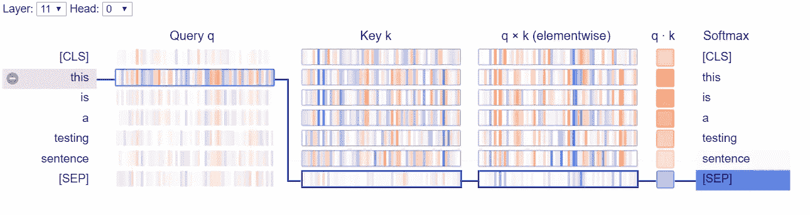

# 对伯特注意的一点看法

> 原文：<https://medium.com/analytics-vidhya/an-insight-to-bert-attentions-2e106f004dc0?source=collection_archive---------8----------------------->

当有人被要求从一本书里寻找某个问题的答案时，我们会有计划地搜索直接跳转回答，而不是阅读整本书。这可能会节省时间。机器中的类似方案有助于提高短语的定位和精确度，但需要耗费资源和时间。


注意机制现在普遍用于许多 NLP 任务中。注意力主要是指像人类这样的机器对数据的专注。就其对机器学习尤其是自然语言处理的贡献而言，2017 年非常关键。transformer 模型以不同的方式改变了放置 NLP 任务的方式。以前，对于像摘要和问题回答这样的 NLP 任务，常见的实现是基于点的注意(平面注意)。


BERT(双向编码器-解码器转换器)的所有 12 层都有多头注意力模块。我们有 12 个注意力中心，显示一个词对句子中其他词的注意力。这种分析不仅仅限于当前令牌，还包括特殊令牌{[CLS]，[SEP]}。

下图显示了注意力评分在热图中的应用。这个图是通过 [*工整的视觉*](https://github.com/cbaziotis/neat-vision) *映射出来的。*用硬颜色表示重要性较高的文本，反之亦然。

T he transformer 库有很多预先训练好的模型，可以从 [*huggingface*](https://github.com/huggingface/transformers) 库中找到。这些模型可用于多项任务，并可进一步针对任何下游任务进行微调。考虑到 BERT 复杂的结构，可视化学习到的重量是一场噩梦。幸运的是，我们有一个像 Tensor2Tensor 这样的工具，它是由 *Jesse Vig* 到 [*BertViz*](https://github.com/jessevig/bertviz) 进一步开发的。它用不同的颜色和粗细将每个单词的注意力线从左到右可视化。研究者可以选择一个层和注意力头来观察模型。我们将进一步探索和理解下面的各种模式。

# **伯特维兹:**

```
pip install regex
pip install transformersfrom bertviz.transformers_neuron_view import BertModel,BertTokenizer
model_version = 'bert-base-uncased'
model = BertModel.from_pretrained(model_version)
tokenizer = BertTokenizer.from_pretrained(model_version)
```

**1。神经元视图**

它用线条粗细显示了一个句子中的每个单词对其他每个单词的关注。该图描述了如何根据句子中的所有其他标记来评估注意力。这里粗线比细线代表更高的重量。在下图中可以看到进一步的提取，其中以前的查询和关键向量用于提取这些分数。


```
import sys!test -d bertviz_repo && echo “FYI: bertviz_repo directory already exists, to pull latest version uncomment this line: !rm -r bertviz_repo”!test -d bertviz_repo || git clone [https://github.com/jessevig/bertviz](https://github.com/jessevig/bertviz) bertviz_repoif not ‘bertviz_repo’ in sys.path:
sys.path += [‘bertviz_repo’]def call_html():
import IPython
display(IPython.core.display.HTML(‘’’
<script src=”/static/components/requirejs/require.js”></script>
<script>
requirejs.config({
paths: {
base: ‘/static/base’,
“d3”: “https://cdnjs.cloudflare.com/ajax/libs/d3/5.7.0/d3.min",
jquery: ‘//ajax.googleapis.com/ajax/libs/jquery/2.0.0/jquery.min’,
},
});
</script>
‘’’))from bertviz.neuron_view import show
sentence="This is a testing sentence"
call_html()
show(model, 'bert', tokenizer, sentence)
```



神经元可视化中的深层结构视图

**2。模型视图**

它为所有层和注意力头呈现一个图形。如果你仔细观察，你会发现在这个视图的最后一行中有一个和神经元视图中的图形一样的线条模式。

```
from bertviz import model_viewdef call_html():
import IPython
display(IPython.core.display.HTML(‘’’
<script src=”/static/components/requirejs/require.js”></script>
<script>
requirejs.config({
paths: {
base: ‘/static/base’,
“d3”: “https://cdnjs.cloudflare.com/ajax/libs/d3/5.7.0/d3.min",jquery: ‘//ajax.googleapis.com/ajax/libs/jquery/2.0.0/jquery.min’,},});</script>
‘’’))call_html()
model_view(attentions, tokens)
```


来自 BertViz 的模型视图

**3。头部视图**

这是一个有点复杂的可视化层的所有注意力头在同一时间。对于每一个令牌，可以看到我们都有对应头部的颜色。另一方面，我们有一个带有选择性标记的颜色条的可视化。

```
input_ =tokenizer.encode_plus(sentence,add_special_tokens=True,return_tensors=’pt’)output, loss, attentions = model(input_[‘input_ids’], token_type_ids = input_[‘token_type_ids’], attention_mask = input_[‘attention_mask’])tokens = tokenizer.convert_ids_to_tokens(input_[‘input_ids’][0])
call_html()
head_view(attentions, tokens)
```


**参考文献:**

所有代码都可以在官方资源库[这里](https://github.com/jessevig/bertviz)找到。