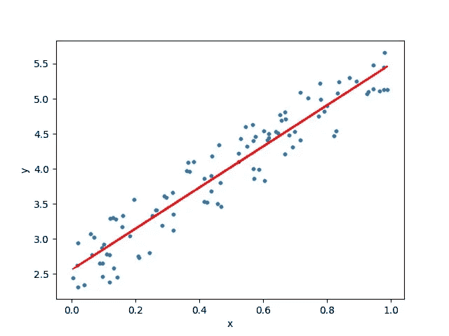

# 对机器学习中线性回归的理解

> 原文：<https://medium.com/analytics-vidhya/an-insight-to-linear-regression-in-machine-learning-a9a1585ae0b2?source=collection_archive---------19----------------------->

线性回归可能是机器学习中最著名和最简单的算法之一。(我假设如果你在寻找什么是线性回归，你熟悉机器学习。)

好了，直截了当地说，线性回归是一种统计方法，用于建模因变量与给定的一组自变量之间的关系。

# 回归的类型

*   简单线性回归
*   多元线性回归

# 简单线性回归

当只有一个输入变量(x)时，该方法被称为简单线性回归。线性回归模型用于显示或预测两个变量或因素之间的关系。被预测的因子(方程求解的因子)称为因变量。用于预测因变量的值的因素称为自变量。

## 多元线性回归

多元线性回归是线性回归分析最常见的形式。作为预测分析，多元线性回归用于解释一个连续因变量和两个或多个自变量之间的关系。

## 关于线性回归的更多信息

线性回归是一个有吸引力的模型，因为它的表示非常简单。

该表示是一个线性方程，它组合了一组特定的输入值(x ),其解就是该组输入值(y)的预测输出。因此，输入值(x)和输出值都是数字。

线性方程为每个输入值或列指定一个比例因子，称为系数，用大写希腊字母 Beta (B)表示。还添加了一个额外的系数，使线具有额外的自由度(例如，在二维图上上下移动)，通常称为截距或偏差系数。

例如，在一个简单的回归问题中(单个 x 和单个 y)，模型的形式将是:

y = B0 + B1*x

这里，y 是因变量，x 是自变量，B0，B1 是系数。

## 一个线性回归模型是如何“学习”的？

学习线性回归模型意味着用我们现有的数据来估计表示中使用的系数值。幸运的是，有许多技术可以达到这个目的。我在这里讨论几个..

## 1.简单线性回归

对于简单的线性回归，当我们只有一个输入时，我们可以使用统计来估计系数。

这要求你从数据中计算统计属性，如均值、标准差、相关性和协方差。所有数据都必须可用于遍历和计算统计数据。

作为 excel 中的一个练习，这很有趣，但在实践中并不真正有用。

## 2.普通最小二乘法

当我们有多个输入时，我们可以使用普通的最小二乘法来估计系数的值。

普通的最小二乘法寻求最小化残差平方和。这意味着给定一条穿过数据的回归线，我们计算每个数据点到回归线的距离，对其求平方，并将所有平方误差相加。这是普通最小二乘法试图最小化的量。

这种方法将数据视为矩阵，并使用线性代数运算来估计系数的最佳值。这意味着所有的数据都必须可用，并且必须有足够的内存来容纳数据和执行矩阵运算。

除非是作为线性代数的练习，否则自己实现普通的最小二乘法是不寻常的。更有可能的是，您将调用线性代数库中的过程。这个程序计算起来非常快。

## 3.梯度下降

当有一个或多个输入时，您可以通过迭代最小化训练数据上的模型误差来使用优化系数值的过程。

这种操作称为梯度下降，从每个系数的随机值开始。计算每对输入和输出值的误差平方和。学习率被用作比例因子，并且系数朝着最小化误差的方向被更新。重复该过程，直到达到最小平方和误差，或者不可能进一步改进。

使用这种方法时，您必须选择一个学习率(alpha)参数，该参数决定了在过程的每次迭代中要采取的改进步骤的大小。

梯度下降通常使用线性回归模型来教授，因为它相对容易理解。实际上，当您的数据集无论是行数还是列数都非常大，可能无法容纳在内存中时，这是非常有用的。

## 4.正规化

存在称为正则化方法的线性模型训练的扩展。这些方法寻求最小化训练数据上模型的平方误差的总和(使用普通的最小二乘法),并且降低模型的复杂性(如模型中所有系数总和的数量或绝对大小)。

线性回归正则化过程的两个常见示例是:

Lasso 回归:修改普通最小二乘法，使系数的绝对和最小化(称为 L1 正则化)。岭回归:修改普通最小二乘法，使系数的绝对平方和最小化(称为 L2 正则化)。

当输入值中存在共线性且普通最小二乘法会过度拟合训练数据时，这些方法非常有效。

下面我列举了线性回归如何工作的例子。

*   对数据集进行训练测试分割。

*   从库 Sklearn 导入线性回归

*   预测

谢谢你。