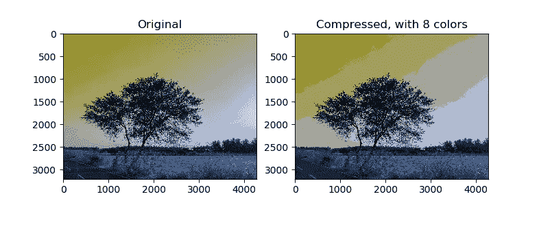

# ML 聚类算法的一个有趣的用例

> 原文：<https://medium.com/analytics-vidhya/an-interesting-use-case-for-the-ml-clustering-algorithm-7901278164e7?source=collection_archive---------2----------------------->


机器学习中的聚类算法是一种无监督算法，用于理解非结构化数据集。例如，它用于文档分类、客户细分等。除此之外，聚类还可以用于检测异常或离群值，以及用于监督学习的其他基本预处理步骤。

这些是集群的一些常见应用。该算法的另一个有趣的用例是查找图像的主色或调色板。让我们理解如何做到这一点。

## 寻找图像的调色板

通常，图像会有数百万种颜色，但它们遵循调色板或配色方案。因此，使用聚类，相似的颜色(按像素值排序，RGB)将被聚类在一起。之后，只需找到聚类中心，并将该颜色值应用于聚类的其余部分。

我使用了 K-Means 聚类算法来进行聚类。要处理图像并找到聚类质心，首先将图像加载到一个 Numpy 数组中，然后通过除以 255 来展平范围从 0 到 255 的颜色值。

```
im = cv2.imread("test_image.jpeg")
im_flat = np.divide(im, 255)
```

现在我们已经将图像加载到一个形状为(3204，4271，3)的 Numpy 数组中，我们需要通过整形将它转换为一个更小的数组，因为我们担心的是像素颜色值，而不是像素的位置。整形后数组变成(13684284，3)。

```
X = im_flat.reshape(-1, 3)
```

现在，对输入数组运行聚类算法应该可以得到所需的聚类中心。这里使用了 Scikit-learn 中的 K-Means 聚类 API。

```
K = 8

kmeans = KMeans(n_clusters=K, random_state=0, verbose=0, max_iter=5).fit(X)
```

在这种情况下，簇的数量被选择为 8。在运行该算法之后，属于一个聚类的像素值被赋予位于聚类中心的像素值。

```
X_recovered = kmeans.cluster_centers_[kmeans.labels_ , :].reshape(im.shape)X_recovered = X_recovered * 255
```



生成的图像与原始图像并排绘制，以显示差异。

这是我最近发现的聚类算法的一个有趣的用法。它可以用来寻找主色或找到调色板，并用它来着色其他图像。

我试用的 Jupyter 笔记本在这里有售[。](https://github.com/johnymephisto/Machine-Learning-and-Deep-Learning-Experiments/tree/master/Color%20Quantization%20using%20K-Means)

谢谢你。