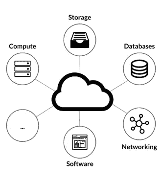
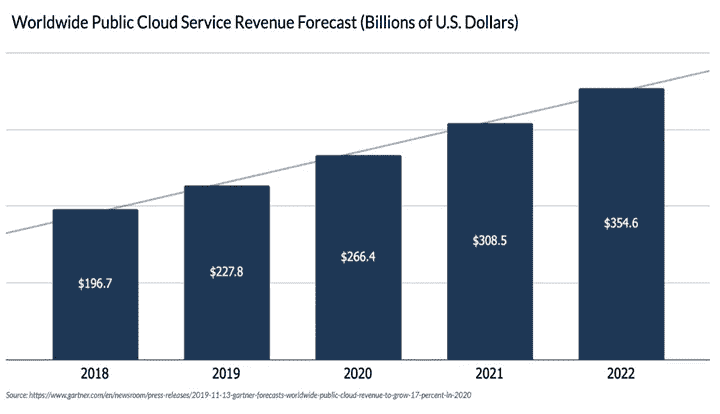
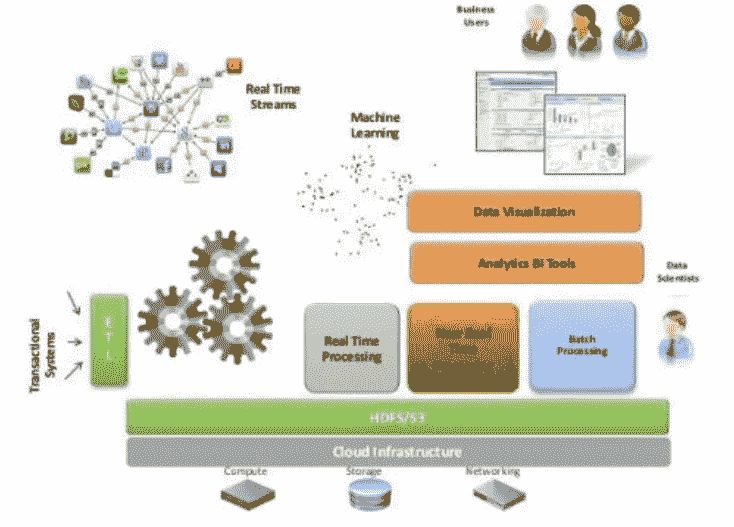
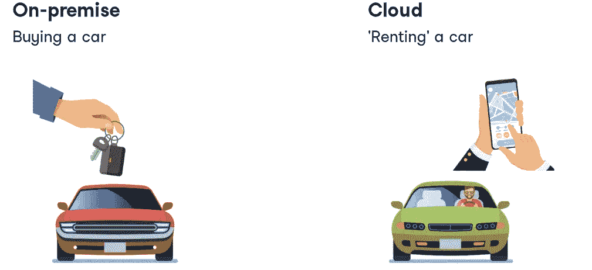
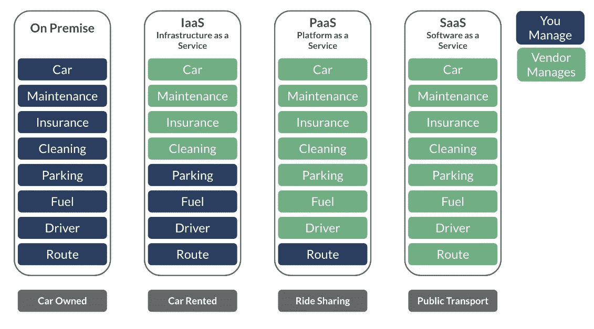
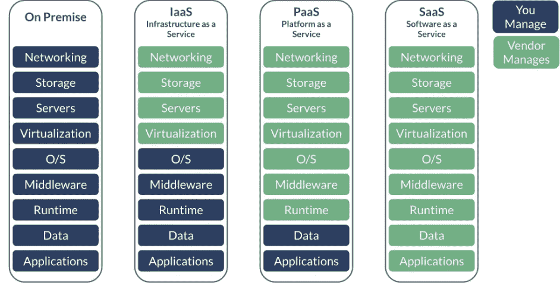
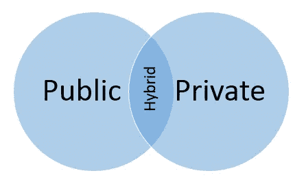

# 面向数据科学家和数据工程师的云计算介绍

> 原文：<https://medium.com/analytics-vidhya/an-intro-to-cloud-computing-for-data-scientists-and-data-engineers-96d85b4852de?source=collection_archive---------4----------------------->

关于什么是云有很多争论。许多人认为云是技术的集合。的确，有一组常见的技术通常构成了云环境，但这些技术不是云的本质。云实际上是一项服务或一组服务。这是云如此难以定义的部分原因。但是让我简单明了地告诉你。

> **云计算定义**

云计算是指通过互联网交付技术服务，包括计算、存储、数据库、网络、软件等等，采用现收现付的价格。

云计算主要使公司能够更快地部署他们的应用程序，而不需要过多的维护，这是由服务提供商管理的。这还可以根据业务的需要和要求，更好地利用计算资源。

> **云和云数据服务的重要性**

随着时间的推移，对云的需求不断增加，在过去五年中，云供应商产品的转变从根本上改变了公司购买、部署和运行大数据系统的方式。云供应商在其核心产品中吸收了更多后端数据存储和转换技术，现在正在强调他们的数据管道、分析和建模工具。这对部署、迁移或升级大数据系统的公司来说是个好消息。公司现在可以专注于从数据和机器学习(ML)中创造价值，而不是建立团队来支持硬件、基础设施和应用程序部署/监控。

> ***为什么数据科学家和数据工程师需要了解云及其数据服务？***

越来越多的应用程序工作负载正在迁移到不同的云平台。这可能是迁移到公共云、私有云或混合云(后者是公共云和私有云的混合)。大数据和分析应用程序工作负载也在移动。数据科学工程社区必须深入了解这些云，以便充分利用它们来更有效地开展分析工作，这一点非常重要。

迄今为止，数据科学家和数据工程师已经习惯于在裸机或物理环境中运行他们的数据处理和分析工作。但是，随着云基础架构最近的快速增长，这些人需要了解他们云中的新虚拟化基础架构，因为它现在是他们工作负载的基础并控制着他们的工作负载。

来源:kdnuggets

虽然互联网上充满了与云相关的术语，但这里有一些非常基本但重要的术语，人们绝对应该对此有所了解。了解这些关键术语将有助于您了解云计算的行业发展和未来趋势。

让我们看一看，了解一下基本情况。

**1。XaaS(一切即服务)**

这是一个通用术语，指的是通过互联网作为云支持服务提供的任何服务。有时它也被称为**【一切即服务】**。它包括 SaaS、DaaS、PaaS 和 IaaS 等。

**2。软件即服务(SaaS)**

SaaS 由软件应用程序组成，这些应用程序运行在由他人拥有和操作的远程计算机上。这种应用的一个很好的例子是 Google Docs，它是一个基于云环境的在线文字处理器。

SaaS 提供了几个关键优势，例如即时访问和使用应用程序，从任何连接的机器都可以访问，并且由于数据存储在云中，因此不可能丢失数据。

**3。平台即服务(PaaS)**

PaaS 主要是一个基于云的环境，提供支持构建和部署基于云的应用程序所需的一切。这是可能的，应用程序的开发者不必购买硬件、软件、管理甚至托管。

从 PaaS 获得的主要好处是应用程序可以非常快速地部署，而不用担心平台。此外，这些服务模型在很大程度上节省了成本，并抽象了底层的复杂性。

**4。基础设施即服务(IaaS)**

基础架构即服务(IaaS)向客户提供基本的基础架构服务。这些服务可能包括物理机、虚拟机、网络、存储或它们的某种组合。然后，您可以在托管基础架构的基础上构建您需要的任何东西。IaaS 实施用于取代内部管理的数据中心。它们允许组织以更低的成本获得更大的灵活性。

让我们以汽车为例来理解云服务模型。

使用汽车类比理解云服务模型

比较上面的图片和下面的图片，以便更好地理解

**5。公共云**

当大多数人想到云计算时，他们想到的是公共云服务模型。在公共服务模型中，提供服务的所有系统和资源都位于外部服务提供商处。该服务提供商负责管理用于提供服务的系统。客户端仅对安装在最终用户系统上的任何软件或客户端应用程序负责。与公共云提供商的连接通常通过互联网进行。

**6。私有云**

在私有云中，提供服务的系统和资源位于使用它们的公司或组织的内部。该组织负责管理用于提供服务的系统。此外，组织还负责终端用户系统上安装的任何软件或客户端应用程序。私有云通常通过本地局域网或广域网(WAN)来访问。在远程用户的情况下，通常通过互联网或偶尔通过使用虚拟专用网络(VPN)来提供访问。

**7。混合云**

术语混合云意味着使用私有云基础架构，以及使用本质上是公共的云服务。说实话，私有云不可能真正独立存在。大多数拥有私有云设置的企业最终都会访问公共云资源来完成各种日常任务。这就产生了混合云这个术语。

## 云的力量-

> **云服务:**

计算:提供大脑来处理你的工作量

**存储:**保存和存储数据

**数据库:**存储更多结构化的数据集

> ***云计算特点:***

**1。虚拟化-** 推动云计算的基础技术。

虚拟化是所有现代云环境的核心，它是下图所示的云基础架构。在任何云中提供灵活性、弹性、易管理性和可扩展性的单位是虚拟机，本质上是通过虚拟机提供的硬件独立性和可移植性。

**2** 。成本- 只有在你使用资源的时候才需要付费

现收现付

无资本支出:购买硬件和软件

管理现场基础设施

在某些情况下，非场所解决方案可能更具成本效益。最佳解决方案取决于使用案例。

**3。** **可靠性-** 在您的环境中建立可靠性可能会非常昂贵。它通常涉及多个系统，甚至多个数据中心位置。您必须进行灾难恢复(DR)和连续性规划和模拟。许多云提供商已经设置了多个位置，因此如果您使用他们的服务，您可以立即为您的环境增加可靠性。您可能需要请求让您的服务使用多个位置，但至少这是一种选择。

**4。Speed-** 立即访问现成的云资源

按需资源配置

快速建立时间

在几分钟内部署服务

**5。性能 *-*** 云系统中的性能不断被测量和监控。如果性能低于某一水平，系统可以自动调整以提供更多容量(如果需要的话)。服务级别协议(SLA)的存在也是一个好处。SLA 保证一定水平的性能。如果达不到这一水平，服务提供商通常必须满足某种程度的补偿。这种补偿通常以退款或费用减少的形式出现。因此，尽管性能本身无法保证，但可以保证降低性能不足的成本。

**6。可扩展性-** 根据需要轻松添加和删除资源

例如:电子商务网站

高峰时段需要更多资源

根据需要扩展资源

**7。敏捷性-** 云环境可以提供极大的敏捷性。需要时，您可以轻松地重新分配资源。这允许您向需要资源的系统添加资源，并从不需要资源的系统中取走资源。您还可以轻松添加系统来扩展容量。内部云环境允许您更好地利用内部基础架构资源。使用虚拟化的云基础架构可以帮助您提高基础架构的密度和利用率。因此，您不太可能让系统闲置。

**8。安全性-** 安全存储和管理您的数据

负责安全的外部方

对于高度监管行业的企业来说，风险尤其大

云变得越来越安全

在某些情况下，非前提解决方案可能是首选。最佳解决方案取决于使用案例。

如果你发现这篇文章有用，就给它鼓掌并与他人分享。

——*快乐学习*

— *谢谢*