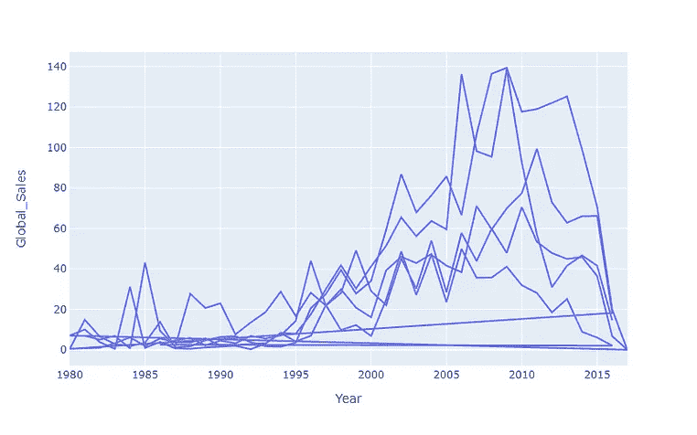

# Plotly Express 中自定义图表的介绍

> 原文：<https://medium.com/analytics-vidhya/an-intro-to-customizing-charts-in-plotly-express-e3c473740f66?source=collection_archive---------4----------------------->

Plotly Express 可能是我最喜欢的 python 中的数据 viz 工具，尤其是在学习了如何控制它以使它看起来更好之后。在这里，我将带你了解一些基础知识，帮助你掌握如何用 Plotly Express 制作漂亮的图表。

在我们开始之前，我们必须有一些数据来玩！为此，我使用了 Kaggle 的视频游戏销售数据。我在这篇文章中放弃了所有的空值，但是请记住，在实践中通常应该避免这样做！

```
import pandas as pd#Importing the initial dataframe
df1 = pd.read_csv("data/vgsales.csv").dropna()
df1.Year = df1.Year.astype("int")#First Modified Dataframe
df2 = df1.groupby("Genre").sum().drop(columns = ["Year", "Rank"]).sort_values(by = "Global_Sales").reset_index()#Second modified Dataframe
top_genres = ["Platform", "Role-Playing", "Shooter", "Sports", "Action"]
df3 = df1[df1.Genre.isin(top_genres)].groupby(["Genre", "Year"]).sum().drop(columns="Rank").reset_index()
```

太好了！现在，开始有趣的部分。如果你还没有安装包，这里有关于如何安装当前版本[的说明](https://pypi.org/project/plotly/)。如果有，太好了！你只需要跑`import plotly.express as px`就可以跟着跑了！

在整篇文章中，我们将使用(可怕的)饼图、条形图和折线图。每个的代码如下:

```
#Percentage of how many games are in each category
px.pie(df1, names = "Genre")#Total lifetime global profit per genre
px.bar(df2, x = "Genre", y = "Global_Sales") #Global profit over time for top 5 genres 
px.line(df3, "Year", "Global_Sales"
```



现在…正如你在这里看到的，这些都很乏味，甚至无法阅读。此外，甚至没有任何标题和轴名称只是使用的变量！幸运的是，这两个问题都很容易解决！


首先，让我们给饼图添加一个标题，然后切换到一个不同的调色板，因为默认颜色对眼睛来说有点刺眼。我们只需要加一个`title`，挑一个`color_discrete_sequence`！Plotly 中的谨慎颜色用于分类数据。

```
fig1 = px.pie(df1, names = "Genre", title = "Distribution of Video Game Genres", color_discrete_sequence=px.colors.qualitative.Set3)fig1.show()
```

接下来，让我们把全球销售图表做得更好。为此，我实际上想翻转图形，使条形水平，为此，我需要做的就是反转 x 和 y 变量，并添加`orientation = 'h'`！


标题设置与之前的饼图相同，但是标签最初并不明显！`labels`接受一个 dict 对象，每个键对应于用于 x 和 y 的列名！最重要的是，我们将使用对应于`Global_Sales`的连续色标，为此我选择了`"darkmint"`

```
fig2 = px.bar(df2, y = "Genre", x = "Global_Sales", title = "Total Global Sales per Video Game Genre",
       labels = {"Global_Sales": "Global Sales in Millions (USD)", "Genre": "Video Game Genre"},
       orientation = 'h',color = "Global_Sales", color_continuous_scale = "darkmint")fig2.show()
```

不完美，但肯定更容易阅读！另外，谁不喜欢水平条形图呢？当然不是我！

现在，你跟上了吗？什么事？太棒了。然后我们将进入最后的图表！

对于这个，我决定我不想使用任何内置的调色板，所以我把它设置成完全不同的颜色。为此，我将使用`color_discrete_sequence`,并向它传递一个颜色值列表！您可以使用命名的 CSS 颜色、十六进制、HSV/HSVA、HSL/HSLA 和 RGB/RGBA 颜色格式！(“A”代表 Alpha，用于声明颜色的透明度，0 代表完全透明，100 代表完全纯色)


此外，我决定将`template`设置为 Plotly 的内置主题之一。因为我们都知道黑色主题是最好的主题，我把它设置为`plotly_dark`

别忘了设置`title`和`labels`属性！这一次，我将`Genre`和`Year`单独留下，因为我不想让它太罗嗦。

```
line_colors = ["#7CEA9C", '#50B2C0', "rgb(114, 78, 145)", "hsv(348, 66%, 90%)", "hsl(45, 93%, 58%)"]fig3 = px.line(df3, "Year", "Global_Sales", height = 500, width = 800, color = "Genre", 
        title = "Global Profit for Top Video Game Genres Over Time",
        labels = {"Global_Sales": "Global Sales in Millions (USD)"},
        template = "plotly_dark",
        color_discrete_sequence=line_colors)fig3.show()
```

自己定制主题怎么样？你可以修改标题、背景颜色等等。现在，让我们使用`plotly_dark`主题作为我们的主模板，并对它做一些小的修改。使用`fig.update_layout()`我们可以将字典传递给它，以方便地修改或添加不同的特性。


一个又酷又新的修改图表！

使用`title`属性，我们可以设置传递给它一个带有`{'x': 5}`的字典来使它居中！接下来，我们可以将`font`属性设置为`{'family': 'courier'}`，这是我最喜欢的 web 保存字体之一。对于背景颜色，我们可以只传递`plot_bgcolor = "#232624"`，不需要字典！

```
line_colors = ["#7CEA9C", '#50B2C0', "rgb(114, 78, 145)", "hsv(348, 66%, 90%)", "hsl(45, 93%, 58%)"]fig3 = px.line(df3, "Year", "Global_Sales", height = 500, width = 800, color = "Genre", 
        title = "Global Profit for Top Video Game Genres Over Time",
        labels = {"Global_Sales": "Global Sales in Millions (USD)"},
        template = "plotly_dark",
        color_discrete_sequence=line_colors)fig3.update_layout(plot_bgcolor = "#23262F",
                  title = {'x':0.5}, 
                  font = {"family" : "courier"})fig3.show()
```

精彩！不过，如果你还没有注意到，悬停框看起来有点…暗淡，不符合我们的主题！别担心，这很容易解决！


默认的 Plotly Express 悬停框

有了`update.traces()`，我们可以用`customdata`和`hovertemplate`让它看起来好看又整洁！

对于`customdata`，我们需要导入 NumPy 并传递一个 ndarray 对象。在这种情况下，我们将从数据帧中添加每一列，并添加我们想要使用的额外数据。为此，我们将添加指定销售地点的销售信息。

```
import numpy as npfig3.update_traces(
    customdata = np.stack((df3.NA_Sales, df3.EU_Sales, df3.JP_Sales, df3.Other_Sales), axis = -1))
```

接下来，我们将开始填写`hovertemplate`的信息。它接受一个字符串，一些格式可以使用 d3-format 的语法和一些小的 HTML，您可以使用这个`%{variable}`格式的变量。我们可以从我们的图中传递像`x`和`y`这样的值，以及来自`customdata`的值！


我们将使用`<b>`将第一行**加粗**，使用`<i>`将所有位置词变为斜体，使用`<br>`添加换行符，然后使用方便的`%{variable}`标记插入数据，首先引用 x(年份)和 y(全球销售额)。对于全球销售，我使用 d3 格式的语法在数字前添加一个`$`，并使用`.2f`将变量限制为只有 2 个小数点。总而言之，小菜一碟，虽然有点累眼睛。

最后，有趣的是:让我们使用`hoverlabel`将字体变大一点，并将字体本身改为 Courier，以匹配图表的其余部分！

```
fig3.update_traces(
    customdata = np.stack((df3.NA_Sales, df3.EU_Sales, df3.JP_Sales, df3.Other_Sales), axis = -1),
    hovertemplate = """
<b>Total Sales during %{x}:<br></b>
%{y:$.2f}M <i>Global</i><br>
%{customdata[0]:$.2f}M <i>North America</i><br>
%{customdata[1]:$.2f}M <i>European</i><br>
%{customdata[2]:$.2f}M <i>Japan</i><br>
%{customdata[3]:$.2f}M <i>Other</i><br>""",

    hoverlabel = {"font_size" : 14, "font_family" : "Courier"}
)fig3.show()
```


我们最后的悬浮箱！太棒了。

欢迎到文末，你成功了！既然你在这里，我会传递一些有用的资源！

当然，Plotly 文档是给定的，但是这里还有很多其他方便的资源！和往常一样，记得谷歌！

*   [用](https://plotly.com/python/hover-text-and-formatting/#customizing-hover-text-with-a-hovertemplate) `[hovertemplate](https://plotly.com/python/hover-text-and-formatting/#customizing-hover-text-with-a-hovertemplate)`自定义悬停文本
*   [使用 coolors.co 生成彩色托盘](https://coolors.co/)
*   [所有命名的 CSS 颜色](https://www.quackit.com/css/color/charts/css_color_names_chart.cfm)
*   [定性的颜色](https://plotly.com/python/discrete-color/#color-sequences-in-plotly-express) ( [慎重的](https://plotly.com/python/discrete-color/#color-sequences-in-plotly-express))
*   [连续的 Plotly 颜色](https://plotly.com/python/builtin-colorscales/)