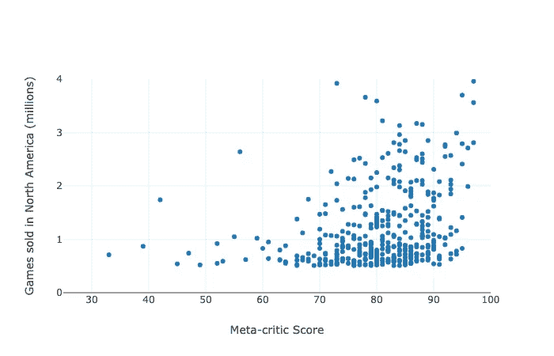
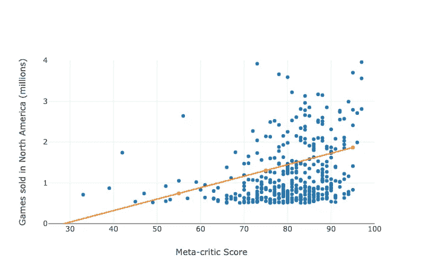
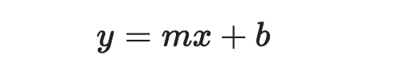
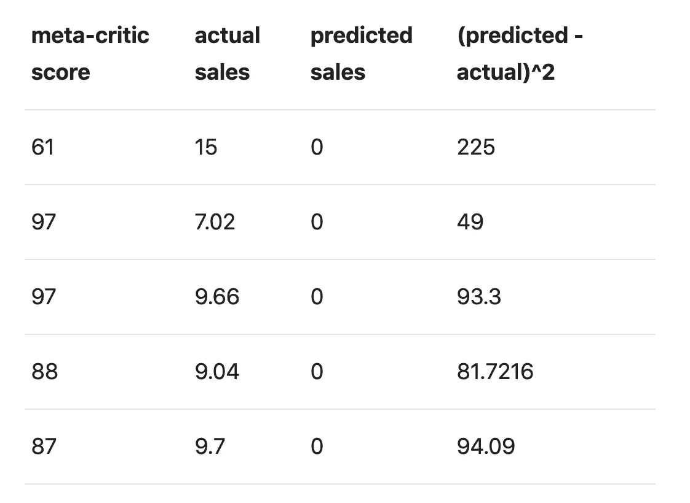
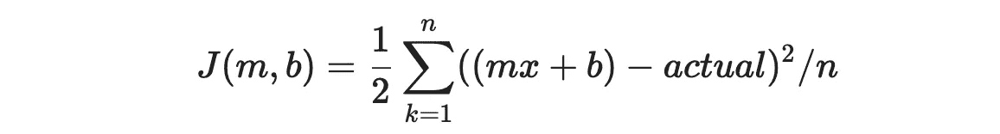
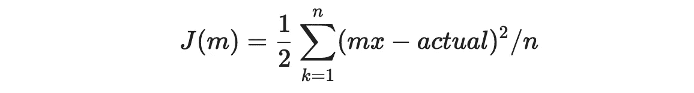
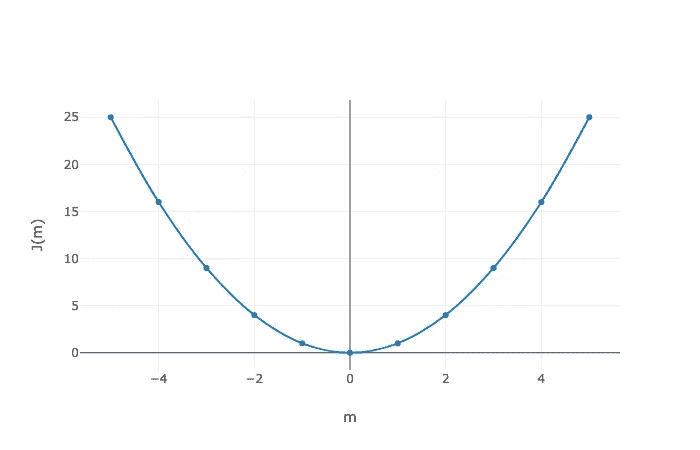
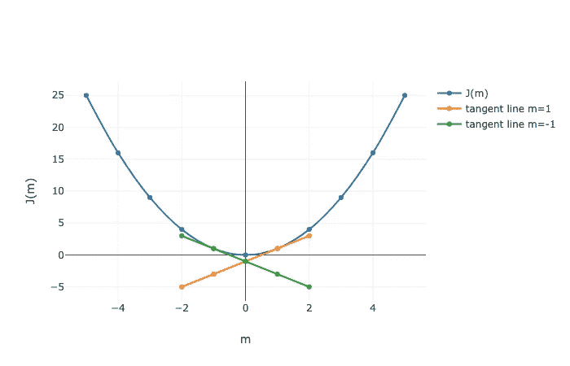
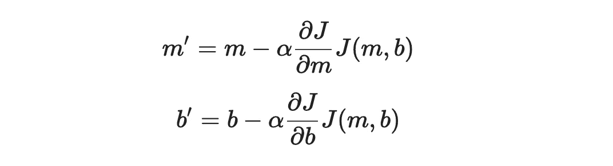

# 科特林程序员梯度下降介绍

> 原文：<https://medium.com/analytics-vidhya/an-intro-to-gradient-descent-for-kotlin-programmers-a98bb5dbd351?source=collection_archive---------7----------------------->

## 开放式学习练习

# 介绍

梯度下降是一种用于解决监督学习和深度学习问题的算法。在这里，我将试图给你一个想法，为什么算法的工作，以及你如何在 Kotlin 实现它。我还将展示使用[的算法，这是一个简单的 kaggle 数据集，涉及视频游戏销售和评级](https://www.kaggle.com/rush4ratio/video-game-sales-with-ratings)。

除了梯度下降的 Kotlin 实现之外，我在这里介绍的所有内容都包含在[吴恩达的优秀 Coursera 机器学习课程](https://www.coursera.org/learn/machine-learning)中。如果你真的想要对梯度下降有一个清晰明确的介绍，我推荐这个课程。在这里，我最感兴趣的是通过分享来巩固我所学到的东西。

# 我们的玩具问题

下面是 2010 年到 2016 年一堆电子游戏的剧情。在 X 轴上，我们有一个元评论家分数。在 y 轴上，我们看到的是北美的百万销量。从数据来看，meta-critic 评分和游戏销量之间似乎存在某种关系。我们的玩具问题是这样的:我们想写一个程序，可以根据 metric critic 评分预测视频游戏的销售。

如果我们在 excel 或 google sheets 中查看这个，我们只需在图表选项中勾选“绘制趋势线”复选框，就几乎可以解决我们的机器学习问题了。Excel 对于一些监督学习任务很好，但对于更难的问题就不行了，这就是梯度下降变得必不可少的地方。尽管梯度下降对于这个玩具问题来说可能有点过了，但我们还是要使用它，因为无论什么样的枯燥的学习算法，在 excel 中已经存在了几十年，大概都不能扩展到更有趣的当代 ML 问题。

无论如何，如果我们为上述数据画一条最佳拟合线，它看起来会是这样的:

如果你记得你的高中代数，像这样的线的方程看起来像这样:

因此，我们在这里的问题实际上是这样的:我们如何计算出给定上述视频游戏数据的`m`和`b`？或者，我们如何实现下面的 Kotlin 函数:

这确实是问题的症结所在，因为一旦我们实现了这个功能，编写一个可以根据 meta-critic 分数预测视频游戏销量的程序就变得很简单了:

我们想要的是学习参数使得预测值(由最佳拟合线给出)和所有实际值之间的差异最小化。这个差异*取决于*我们为`x`和`b`选择的值；这是这些变量的函数。这个函数被称为“成本函数”，所以我们问题的另一种表述方式是，我们试图找到最小化成本函数的`x`和`b`的值。

# 解决办法

为了开始理解我们如何解决这个问题，我们需要仔细看看成本函数。到底是什么？让我们从一个思维实验开始:假设我们选择 0 作为`x`和`b`的值。数据集的*实际值*和预测值之间会有什么差异？下表列出了前五个数据点，试图抓住这一点:

总结该表的一种方法是取预测值和实际值之间的平方差的平均值，然后除以 2。这就是我们的成本函数，我们称之为`J`。形式上，那是:

其中 n 是我们数据集中视频游戏的数量。(如果我们在上表中使用这个等式，我们将得到 54.31。)让我们暂时忽略`b`，改写我们的等式:

请记住:`x`和`actual`在这里不是变量，我们将能够从我们的数据中插入值，所以我们实际上只是在看一个二次函数，你可能还记得高中时的二次函数是这样的:

在这种情况下，x 轴是`m`，y 轴告诉我们`m`离它需要的位置有多远。该图告诉我们，`0`是我们对`m`的最佳选择，因为选择`0`实际上会最小化成本函数。对于我们的实际数据集来说，这是不正确的，但是梯度下降的基本思想仍然适用，并且这个图(可能)看起来更清晰。

在最高水平上，梯度下降的工作方式是我们猜测`m`的最佳值，然后我们通过称为“学习率”的少量修改我们的猜测，并重复直到我们不再变得更好。这就是这种算法的名字来源:我们减慢梯度下降的速度，直到达到最小值。

这样，我们可以开始填充更多的`findLearningParameters`函数:

第 5 行和第 7 行指出了一些需要解释的函数。你应该能猜到`cost`做了什么:它用前面提到的公式计算出我们对`m`和`b`的猜测有多差:

所以，实现是这样的:

我们使用成本函数的原因是为了监控梯度下降的进度。随着 for 循环的执行，`cost`应该会下降。

理解`updateGuess`的实现需要稍微了解一下基本的微积分。

如果我们看我们的图`m`和`J(m)`并且记住函数的导数给我们切线的斜率，我们就有了我们所需要的中心洞察力，使得梯度下降成为可能。那么，我们来问:如果我们计算这个函数的导数，并在这个图中为`m = 1`和`m=-1`画切线，会发生什么？

m=1 的切线有一个*正*斜率，这意味着`J(m)`在该点的导数将为正。m=-1 的切线有一个*负的*斜率，这意味着`J(m)`在该点的导数将是负的。如果 m=1，我们希望我们在`m`的下一个猜测更少，如果 m=-1，我们希望我们的下一个猜测更多。我们可以通过减去导数来轻松实现这一点，如果我们这样做，我们最终会得到梯度下降算法的核心:

我们这里有一些偏导数，因为我们正在处理多个变量，一般来说，如果我们在学习问题中有更多的功能/变量，可能会有比`m`和`b`更多的学习参数(例如，我们可能认为 game studio 是一个预测器/变量，可以告诉我们一些关于游戏销售的信息)。这个细节对于获得梯度下降的要点并不重要。科特林是这样的:

运行这段代码会得到`m`的`.0281`和`b`的`-.804`，这非常接近我们之前看到的最佳拟合线。

# 笔记

1.  这种关系没有我想象的那么牢固。他们说做游戏开发者很辛苦。也许这就是证据。也许数据不是很好。
2.  我打赌 excel 和 google sheets 使用线性回归的“正常方程”方法，而不是梯度下降，如果你正在处理一个小于 10k 特征的线性回归问题，这[显然是可以的。我也怀疑在没有任何扩展的情况下，它能处理多个变量。](https://www.coursera.org/learn/machine-learning/supplement/bjjZW/normal-equation)

*最初发表于*[T5【https://www.philosophicalhacker.com】](https://www.philosophicalhacker.com/post/gradient-descent-for-kotlin-programmers/)*。*