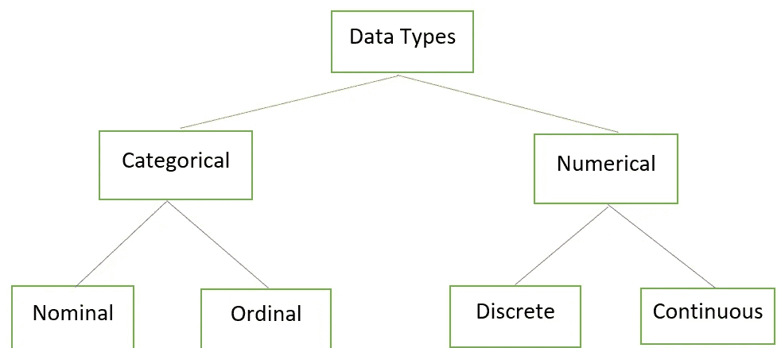
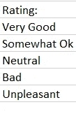
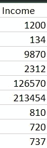
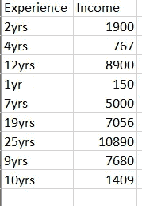
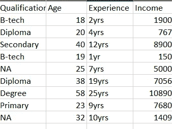
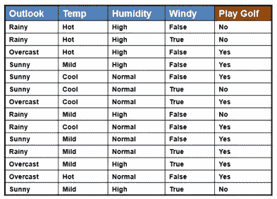
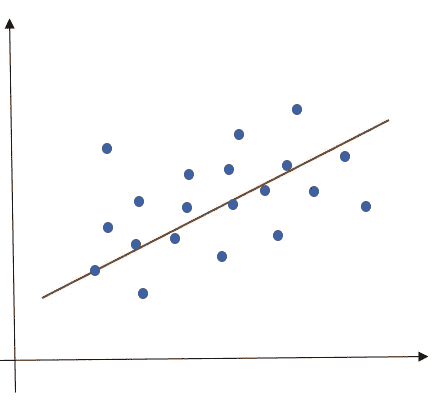
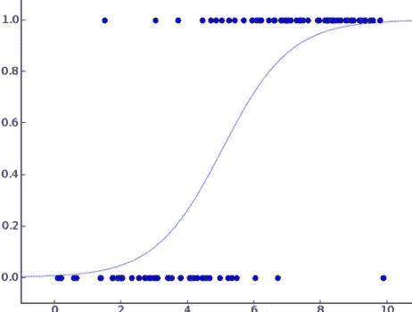
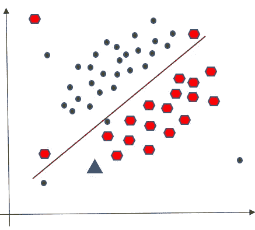

# 机器学习导论。

> 原文：<https://medium.com/analytics-vidhya/an-intro-to-machine-learning-e2d0fd390584?source=collection_archive---------17----------------------->

图片提供:[像素](https://www.pexels.com/photo/wall-e-toy-on-beige-pad-2103864/)

在本文中，我们将从机器学习的基础开始，然后我们将深入一些广泛使用的机器学习算法。那么，机器学习的热门话题是什么？🤨。读一读就知道这是怎么回事了。

首先，我们应该通过参考一些现实生活中的应用来理解什么是机器学习。假设你在任何著名的电子商务网站上搜索了一条牛仔裤，后来因为某些原因你决定不买它并关闭了你的购物应用程序，过了一段时间，如果你打开浏览器冲浪，你会发现你当时搜索的相同产品，而且你可能已经注意到购物网站或应用程序向你推荐了一些不知何故符合你口味的商品。那么你有没有想过这怎么可能？这是机器学习在为你创造奇迹🤗。

ML 的另一个主要实现是其在社交媒体服务中的应用，我们每个人都可能使用过 facebook，并目睹了 ML 的实时应用，即**人脸识别**:你上传一张你和朋友的合影，脸书立即识别出照片中的人。你想过这怎么可能吗？起初，它感觉有点令人毛骨悚然，但它也是一个 ML 应用程序，脸书首先使用一些级联检测照片中的人脸，后来它注意到他们的独特特征，然后将他们与你朋友列表中的人进行匹配。我想现在你可能已经稍微了解了 ML 及其应用，现在让我们深入研究一下理论定义。

来源:[吉菲](https://giphy.com/gifs/psa-facts-zagB8wzgm4Ce4)

**机器学习:**

机器学习这个名字是亚瑟·塞缪尔在 1959 年创造的。Tom M. Mitchell 提供了一个被广泛引用的、机器学习领域中所研究的算法的更正式的定义:“如果一个计算机程序在任务 *T* 中的性能(由 *P* 测量)随着经验 *E* 而提高，则称该程序从关于某类任务 *T* 和性能测量 *P* 的经验 *E* 中学习。”~ [维基百科](https://en.wikipedia.org/wiki/Machine_learning)

我把 ML 定义为让机器变得智能的一种方式，这是我们走向人工智能的一个非常重要的垫脚石。机器学习是数据科学的一部分。它从统计数据中提取面，并对数据应用算法。它是赋予机器学习和处理数据的能力，无需人工干预或任何显式编程。机器学习算法对提供的数据应用算法，收集见解，并使用收集的信息对以前未分析的数据进行预测。

在深入研究算法之前，我们需要用可用的“不同数据类型”的知识来装备自己。：

1.  **分类:**分类数据表示性别、水果种类等类别..，一般来说，我们用文本来表示(男，女)但也允许用数字表示(0-男，1-女)。

a) **名义:**这里我们用标签来表示我们的数据，它们不遵循任何顺序，也没有任何量化权重。在下图的水果属性中，水果可以按任何顺序放置。

b) **序数:**这里我们用标签来表示我们的数据，它们确实遵循一个顺序。这些是非数字的。在评级下方的图像中，属性表示客户对其所接受服务的评级。所以值是有序的。最上面的值代表高值，最下面的值代表低值。

2.**数字:**这里我们将处理数字数据，这些数字确实有数学意义。

a) **离散:**此处显示的数据只能用于计数，不能用于测量。例如，考虑抛硬币的情况，我们将计算抛硬币的总数 **n** 次，并且该计数也可以分成更小的比例。

b) **连续:**与离散数据相反，这里我们将测量数据而不是计数数据。例如，考虑一个人的体重，它将用单位来测量/表示，而不是计数。

— — — — —

来源:t [enor](https://tenor.com/view/sleepy-boo-rubbing-eyes-monster-inc-gif-8085382)

在讨论不同类型的最大似然算法之前，你需要先了解可用的不同类型的数据集。

> **数据集的类型:**

在处理算法时，首要任务是找到一个最佳且合适的数据集，因此在搜索数据集时，您需要准确了解所需数据集的类型。在某些情况下，您只需要一个变量，或者其他时候您可能会处理两个属性。所以数据集的知识很重要

1.  **单变量数据:**数据只包含一个变量。这种类型的数据不处理属性之间的关系，而是更关注数据集中的模式。

2.**双变量数据:**数据由两个变量组成。使用这种类型的数据集的目的是找到两个变量之间的关系。在下图中，您可以观察到二元数据集，它包含两个属性:经验和收入。利用这个我们可以发现一个人的经历和他的收入之间的关系。

3.**多元数据:**该数据涉及 2 个以上的属性。此类数据集用于深度探索性分析，使用超过 1 个参数来推断因变量的结果。在下面的例子中，您可以观察到多个属性可以决定一个人的收入，但在前面的双变量数据的情况下，我们只使用一个变量来决定收入。

> ***机器学习算法的类型***

根据学习的性质，有三类机器学习算法:

1.  **监督学习:**算法帮助你从一组给定的预测器(自变量)中预测一个目标/结果变量(因变量)。这里，一些数据已经标记了正确的答案，算法从标记的训练数据中学习，帮助您预测不可预见数据的结果。分类是监督学习的一个子类，其目标是基于过去的观察来预测新实例的分类类别标签(离散的、无序的值、组成员)。

**那么监督学习是如何工作的呢？**

考虑你的工作是预测你今天是否能打高尔夫球？。这里，首先创建一组带标签的数据。该数据包括以下属性:

独立变量/特征/输入:

*   展望。
*   温度。
*   湿度。
*   有风。

因变量/标签/输出:

*   打高尔夫。

来源:[谷歌](https://www.saedsayad.com/naive_bayesian.htm)

使用感官和观察大气，我们可以得出我们是否可以打高尔夫球的结论，这很简单，如果下雨，我们就不能打，如果风太大，球可能会失去抛射物，从而很难打。使用我们的智力，我们可以推断出许多这样的组合，但对于机器来说，它需要过去几个月的数据和统计。

我们要做的第一件事是，创建一个训练数据集。该训练数据集将包含自变量和因变量的所有属性。基于这个训练集，你的机器可能会看到温度、湿度、前景和打高尔夫球的机会之间是否有直接关系。

基于所提供的训练数据集，机器将推导出以下一些见解:

1.  如果下雨或者风很大，我们就不能打高尔夫球。但是，如果你观察数据集，即使下雨，高尔夫也是在一天进行的。但是如果你计算一下雨天打高尔夫和非雨天打高尔夫的比率，你会发现一般来说，高尔夫不是在雨天打的。

来源:[期限](https://tenor.com/search/rain-gifs)

2.如果你观察有风的柱子，除了一天以外，如果没有风，每天都打高尔夫。因此，机器可能会得出这样的结论:如果没有风，我们可以打高尔夫。

来源:男高音

监督学习的另一个例子是，如果我们为机器提供一组分类的狗和猫的图像，那么机器将根据这些训练数据对剩余的图像进行分类。

**监督机器学习技术的类型:**

最广泛使用的学习算法有:

*   线性回归。
*   逻辑回归。
*   随机福里斯特。
*   支持向量机。
*   朴素贝叶斯。
*   线性判别分析。
*   决策树。
*   k 近邻算法。
*   神经网络。

这些提到的算法主要分为两类:**&**回归分类。****

**— — — — —**

**R 这种技术用于预测、时间序列建模和寻找变量之间的关系。这里，我们将曲线/直线拟合到训练数据中的数据点，以使数据点和曲线/直线之间的距离最小化。**

**每种回归的一般形式是:**

*   ****线性回归:** Y = mX+c。**
*   ****多元回归:** Y = a + b1X1 + b2X2 + b3X3 + … + bnXn。**

**其中:**

*   **Y =您试图预测的变量(因变量)。**
*   **X =用于预测的变量(自变量)。**
*   **c =截距。**
*   **m =斜率。**

****

****线性回归****

****

****逻辑回归****

> ****回归技术的类型:****

**有不同种类的回归技术，这些技术主要分为两个不同的类别(目标变量的类型，预测值的数量)，有时甚至基于回归线的形状。**

1.  **线性回归。**
2.  **逻辑回归(广泛用于分类问题😝).**
3.  **多项式回归。**

**当变量间存在高度共线性时，使用一些不常用的算法，如逐步回归、岭回归、弹性网回归。**

**— — — —**

**分类:顾名思义，分类意味着通过将相似的输出归类到给定的各种类别中来集合它们。这里我们将预测**分类类别**标签的值。在分类中，我们将使用称为**分类器**的算法，将输入数据映射到特定的类别。**

**分类有三种类型:二元、多类和多标签:**

*   ****二元分类:**在这里，对于类别标签，我们将有两种可能的结果。性别——男性/女性。**
*   ****多类分类:**对两个以上的类进行分类，每个元组只分配一个类标签。温度——高/中/低。，水果类型——橘子/苹果/香蕉/芒果。**
*   ****多标签分类:**这里每个元组映射到一组目标标签。这种类型的分类广泛用于图像处理和识别，例如:假设你有一幅由房屋、人、鸟、草等组成的图像..，所以在多标签分类中，我们会检测上述所有标签。**

****

****分类****

**在上图中，可以清楚地看到蓝色圆圈和红色六边形两个类别。一条棕色的线将这两个类别分开，尽管它没有成功地将它们完全分开，因为一些红色的六边形出现在线的上面，一些蓝色的圆圈在线的下面。但是在所有可能将它们分开的线中，这条特别的线获得了更多的准确性。**

****

**现在考虑一个新的数据点(绿色三角形),它正落在线下，因此现在我们的分类模型将其归类为红色六边形。**

> ****分类算法的类型:****

1.  **朴素贝叶斯。**
2.  **K-最近邻居。**
3.  **决策树。**
4.  **随机福里斯特。**
5.  **支持向量机。**
6.  **逻辑回归。**

**— — — — — — — — — — — — — — — — — — — — — — — — — — — —**

****

**来源:[期限](https://tenor.com/search/the-end-gifs)**

**所以，伙计们，就这样了，现在，**非常感谢**的阅读。我会在另一篇文章中用代码解释上述所有算法。**

**请参考我的其他文章:**

*   **[**https://medium . com/analytics-vid hya/data-preprocessing-techniques-in-data-mining-4c 90666 F6 f7a**](/analytics-vidhya/data-preprocessing-techniques-in-data-mining-4c90666f6f7a)**