# AutoML 简介

> 原文：<https://medium.com/analytics-vidhya/an-introduction-to-automl-8356b6ceb091?source=collection_archive---------7----------------------->

## 自动化机器学习

## 谷歌、亚马逊& H2O.ai AutoML

# 用机器学习构建人工智能

或许，熟悉机器学习工作流程并开始意识到其中的一些困难的最快方法就是看看 Kaggle。

谷歌旗下的 Kaggle 拥有一个机器学习爱好者和专业人士社区，大量有用的公共数据集，免费的 GPU 计算，奖励机器学习竞赛的奖金和托管的机器学习“笔记本”。

这里有一个很好的机器学习笔记本的例子——它将 Python 代码与可读的图表、评论和解释结合在一起。

[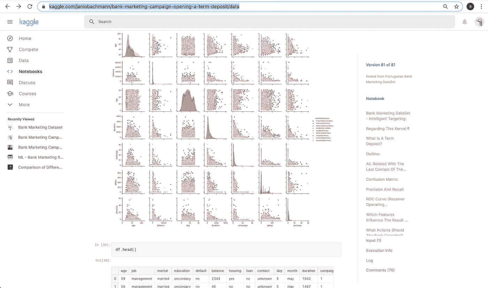](https://www.kaggle.com/janiobachmann/bank-marketing-campaign-opening-a-term-deposit/data)

贾尼奥·巴赫曼的《卡格尔笔记本》——展示数据探索的摘录

在我们测试 AutoML 解决方案时，我们将参考这个特定的笔记本，因此您可能需要创建一个副本并浏览它—单击上面的图像将直接带您到笔记本。即使你不懂 Python，也可以看评论，看分析。

对于给定的 Kaggle 挑战，看一看任何这样的数据科学笔记本，它可能包括以下许多内容:

*   **数据探索** —评估数据质量和“形状”的表格和图表。(见上图)
*   **数据准备** —一旦数据被可视化和探索，机器学习的数据预处理工作就可以开始了。这可以包括处理异常值、将分类值换算和映射到数值、修复错误。
*   **特征工程** —从原始数据集创建新特征。特征交叉、维数减少(例如通过主成分分析)、丢弃特征、缺失值的合并和插补。其中一些步骤甚至可能包括使用机器学习。
*   **模型选择&训练** —为任务和数据选择合适的候选模型，在工程数据上训练它们。
*   **评分&优化** —选择合适的评分者(如 AUC vs RMSE)，评分并调整超参数。模型排行榜，以及“获胜”模型和转换的选择和优化。

然而，Kaggle 并没有提供完整的图片。已经为您定义了业务问题和用例，提供了数据，重点是创建一个高评分模型，而不是部署和维护一个产品推理解决方案。

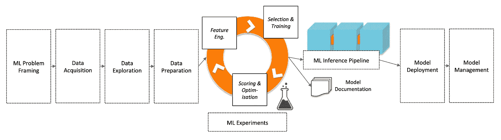

机器学习过程——端到端

所以，除了我们在 Kaggle 上看到的，我们还需要考虑这些重要的机器学习元素:

*   **机器学习问题框架** —确保您的用例或业务需求可以被框架为机器学习问题，并且使用机器学习来解决它们是合适的。
*   **数据获取** —您需要合适的用户选择、合适的系统和产品来捕获数据，将数据传输到需要的地方，将其存储在数据湖中，并将其移动到数据仓库。直到最近，机器学习还需要大数据。通过迁移学习，构建机器学习解决方案来解决小数据新用例的能力正在显现，这些小数据可能只有数百或数千个示例。但是你仍然需要高质量的，有标签的数据。
*   **ML 实验—** 形成一个迭代循环，包括**数据工程**、**模型选择&训练**、**评分&优化**
*   **机器学习推理管道** —生产机器学习解决方案通常比模型更复杂。另外，还需要包括为模型创建的数据转换。
*   **模型文档** —对于许多现实世界的应用程序，需要可解释性&可解释性来减轻无意歧视和偏见的风险，满足法律要求，通过理解模型行为来确保对服务的信任。
*   **模型部署** —一般来说，虽然机器学习部署可能很困难，但容器和云端点的使用使得部署和扩展推理更容易。值得注意的是，用于创建模型的系统和计算类型不一定适合支持具有相关低延迟和规模的生产推理。
*   **模型管理**—you 模型和机器学习推理的性能会随着时间的推移而下降。捕获维护和更新模型所需的数据，确保可以检测到性能和数据漂移，能够测试部署新模型都是机器学习生命周期的一部分。

从头到尾，构建新模型并将其投入生产的过程可能涉及许多团队—数据运营和工程、数据科学、开发和开发运维、产品。

考虑到最佳实践，跟上最新的研究、模型、特性工程技术，并且考虑到所涉及的资源、迭代的数量——一定程度的自动化是可用的吗？

答案是——是的。自动化在范围和功能方面各不相同，但“AutoML”几乎涵盖了上述所有领域。

# 定义 AutoML

我’我要去看看谷歌、亚马逊和 H2O.ai 提供的 AutoML 服务，用它们来定义 AutoML。然后，在下一节中，我将在每个系统中运行特色 Kaggle 笔记本所使用的银行数据，以深入了解不同的 AutoML 解决方案之间的差异。

# 谷歌的 AutoML

oogle 提供了一系列人工智能服务，但出于讨论的目的，我们将重点关注谷歌的 [AutoML](https://cloud.google.com/automl) 产品。

Google AutoML 视频、Google AutoML 视觉、Google AutoML 自然语言、Google AutoML 文本和文档实体提取、Google AutoML 情感分析、Google AutoML 翻译有效地允许您使用您的数据扩展现有 Google AI 服务的功能。迁移学习或神经架构搜索在幕后运行，根据您的数据根据您的用例调整推理。

我将把它称为“封闭的”AutoML，

**谷歌汽车——一个‘封闭’汽车的例子**

*   **数据采集** —您提供“干净”的数据。
*   基本的**数据探索** —在 Google AutoML 中，你可以从你的源数据中查看字段，获得一些关于缺失值、不同值、“可空”字段、目标相关性的基本统计数据。
*   基本**数据准备** —您可以通过 GoogleML 的基本 GUI 选择目标字段，从培训中删除列。帮助您标记数据的服务是可用的。您可以控制培训/验证/测试分割。
*   **ML 实验** —您可以从 GUI 启动训练，但不能影响模型选择。你无法接触到特征工程，看不到培训、优化、任何组装或堆叠。最终模型/管道的基本指标可用。
*   **ML 推理管道**。您无法访问管道组件&没有可解释性或其他生成的文档。
*   **车型部署**。生成的模型通常可以由 RESTful API 访问，并且可以部署在容器中。但是，你不拥有模型&你不能访问模型。

尽管如此，结果仍然令人印象深刻，而且很快就能实现。

谷歌的 AutoML 服务通常有一个相应的谷歌 API，你不能用你的数据定制模型，但有更多的功能可用。例如，在此将 AutoML Vision 与 Vision API [进行比较。](https://cloud.google.com/vision)

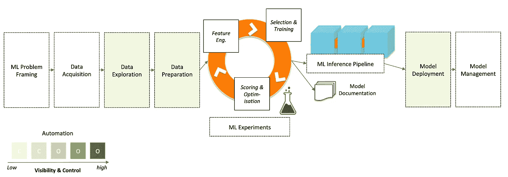

Google AutoML —“关闭的”AutoML

# 亚马逊的 AutoML

T21:他对亚马逊人工智能服务的追随符合我对‘封闭’自动驾驶的定义。Amazon understand&Amazon Translate 有一个“定制”功能，在前一种情况下，允许基于您的数据自动构建自然语言处理，在后一种情况下，允许处理领域或品牌特定语言。

Amazon Rekognition 为图像分类和对象检测提供了一个自动化的定制标签服务，提供了一个 GUI [界面](https://aws.amazon.com/blogs/machine-learning/announcing-amazon-rekognition-custom-labels/)来标记您的图像数据和一些基本的评估指标。在我的[‘在 AWS 上构建一个简单的人工智能照片分析应用’](/swlh/building-a-simple-ai-photo-analytics-app-on-aws-68d0b0f84c87)文章中，我使用了 Amazon Rekognition，这可以通过 AutoML 和 Rekognition 的自定义标签轻松扩展。

然而，亚马逊也提供 SageMaker [自动驾驶仪](https://aws.amazon.com/sagemaker/autopilot/)，它将自动化扩展到最初提供的初始超参数调整之外。当通过 SageMaker Studio(尚未在所有 AWS 地区提供)使用时，Autopilot 将模型开发自动化与直接访问自动生成的 Python 机器学习笔记本相结合。

这种在自动化机器学习过程的各个阶段查看和定制能力的增加提供了一个“开放”AutoML 的例子。

**SageMaker 自动驾驶仪——“开放式”自动驾驶仪的一个例子**

*   **数据采集** —您仍然提供“干净”的数据。
*   **数据探索**—sage maker Studio&auto pilot 自动创建一个*数据探索笔记本*，其中包括数据集样本、列分析、计数统计(针对字符串类型特征)、描述性统计(针对数值特征)以及一些推荐的手动检查&改进措施。
*   **数据准备**—SageMaker Studio&auto pilot 建立一个*候选生成* *笔记本*可以用来查看和修改已经为每个候选模型自动创建的转换。数据转换，如插补，一热编码，主成分分析，标准标量，建议。
*   **特征工程** — SageMaker Studio &自动驾驶仪的*候选生成* *笔记本*可以修改定制实验。
*   **选择&训练** —这是自动发生的。如果需要，可以使用*候选人生成笔记本*逐步完成自动生成的工作流程。
*   **评分&优化** —您可以选择您的评分算法，并通过 SageMaker 的*c*a*n 日期生成笔记本*调整超参数范围和优化
*   **ML 推理管道** —你可以访问 SageMaker Autopilot 的模型工件、数据处理器模型、调优细节和笔记本，这些都存储在 S3。
*   **模型部署—** 您可以完全控制模型部署&您可以在任何需要的地方导出和使用模型和管道。部署到 AWS 是由 SageMaker 半自动完成的。

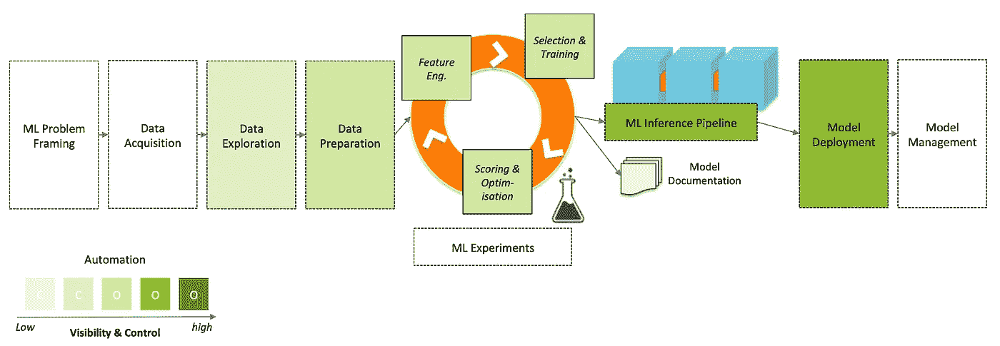

亚马逊 SageMaker auto pilot——“开放式”AutoML

像 Google AutoML 表一样，Autopilot 目前只能处理结构化数据。

# 3.H2O.ai 的 AutoML

带着“为每个人民主化人工智能”的使命，H20.ai 看起来非常致力于 AutoML。

与 SageMaker Autopilot 一样， [H20.ai 无人驾驶 AI](http://docs.h2o.ai/driverless-ai/latest-stable/docs/userguide/examples/credit_card/credit_card_default.html) 提供了对自动化机器学习过程每个部分的访问和控制。

H20.ai 提供了一个直观且完全集成的用户界面。它不完全是一个 IDE，尽管对 Python 和 R clients 的支持提供了对这两种环境中自动化的控制。

*与 Google AutoML 和 SageMaker Autopilot* 不同，无人驾驶 AI 可以在 NLP、时间序列和结构化/表格数据上运行自动化。无人驾驶人工智能支持深度学习模型的 Tensorflow，也可以使用你的转换、模型或评分“食谱”来运行自动化。

**H2O . ai——“开放”AutoML 的另一个例子**

*   **数据采集** —您仍然提供“干净”的数据，并提供到 Hadoop hdfs 文件系统或 S3 bucket、Azure、Hive、JDBC 等的连接选项。
*   **数据探索** —通过“AutoViz”为您的源数据提供广泛的可视化选项——峰值&倾斜直方图、箱线图、异常值、相关图、平行坐标图、雷达图、数据&“缺失”热图。数据集详细信息包含类型、统计信息、缺失值、唯一值和一列的前 20 行的摘要。
*   **数据准备** —可创建自定义配方，通过 GUI 创建新的数据集。可以确定测试/训练/验证分割，并设置目标变量。
*   **特征工程** —不仅生成特征，而且随着实验的进行，您可以实时跟踪它们的重要性和用途。
*   **选择&培训**——候选模型的范围根据你的初始实验设置而变化——精确度、时间、可解释性和评分者。您可以通过 GUI 准确地看到哪些模型将被包括在实验中，它还提供了一个实时仪表板，显示每个模型的性能。
*   **评分&优化** —您可以选择自己的评分算法。
*   **ML 推理管道** —低延迟，Python，R，C++，Java 代码生成。从实验中生成了全面的自动生成的人类可读文档。此外，提供了大量的可解释性、可解释性信息:“K-LIME、Shapley、可变重要性、决策树代理、部分依赖、个体条件期望、敏感性分析、NLP 令牌、NLP LOCO”以及对 LIME 和 Shapley 原因代码的支持。
*   **模型部署—** 评分管道手工部署。

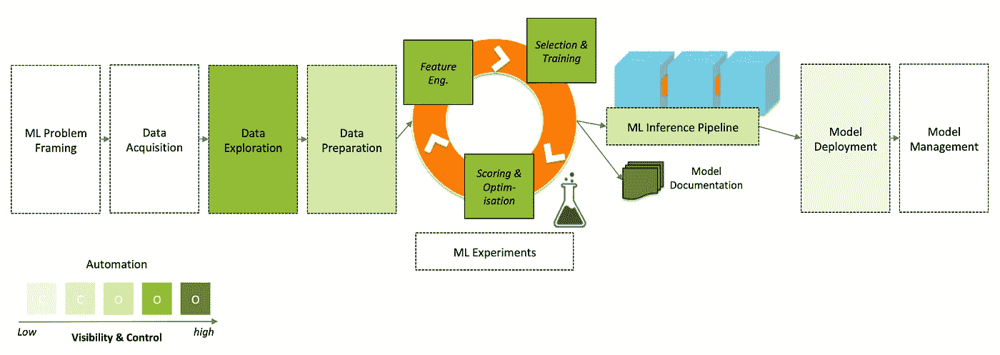

H20.ai 无人驾驶人工智能——“开放式”汽车

# 探索汽车

我现在将对上述每个 AutoML 解决方案进行一次简单的测试。我将使用 Google 在 AutoML 演示中使用的数据文件的子集。使用这个简单的数据集将允许与 Janio Bachman 的 Kaggle 笔记本进行直接比较，从而进行“手动”机器学习。

这绝对不是基准测试，而是为了说明各种 AutoML 解决方案之间的差异。

值得注意的是，这是一个小数据集，有 17 列，不到 12，000 行。没有任何丢失的值，就我们使用的预测目标而言，它很好地平衡了，即“存款”列，几乎对半分割。

所以这不是最难的数据集，因此有点不典型。

但这没什么——我只是想强调一下各种方法之间的一些差异和“AutoML”的潜力。

# Google AutoML 表格

那么让我们从 Google AutoML 表开始，我会一直关注 Google 演示。

按照这里的说明，但是不需要做任何与计费相关的事情，我创建了一个项目，一个 bucket 并上传了 csv 文件。

我选择“存款”作为目标预测变量。所有其他列都是“特征”,可以输入到模型中以帮助进行预测。

只需点击即可看到每个特征数据的可视化效果。显示了每个特征与目标变量的相关性。如果我愿意，我可以手动删除那些相关性低的列。

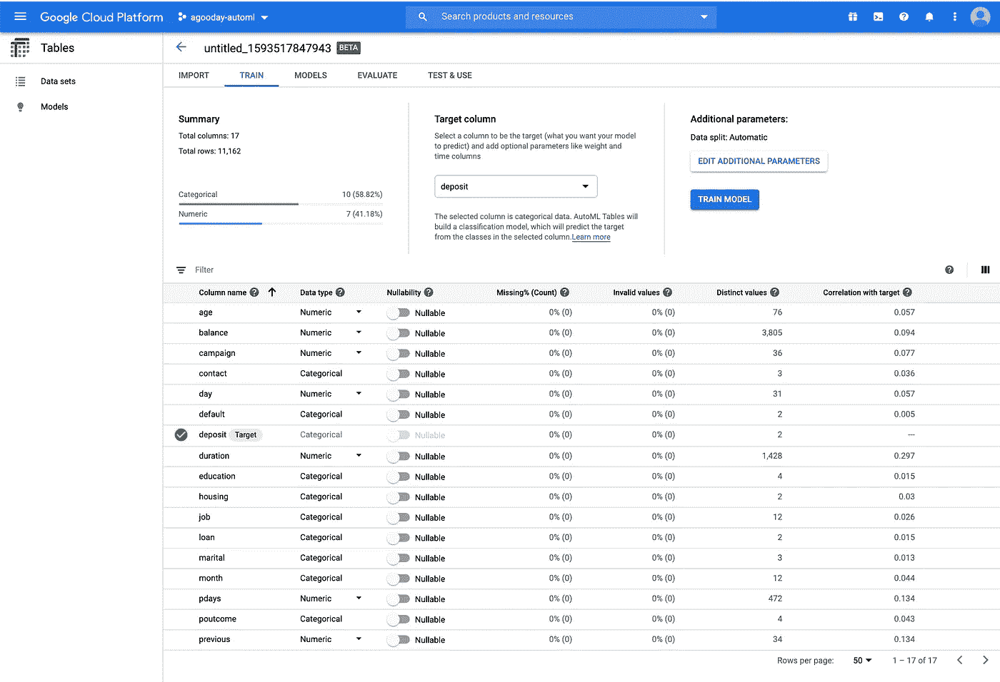

Google AutoML 表格—选择预测目标

Google 自动决定建立分类模型，这正是我们需要的。目标是计算出客户是否会存款，这是一个二元选择，是/否，因此我们希望建立一个“二元分类器”。

选择“列车模型”允许我指定 1 个节点小时的预算限制来运行工作，并取消选中任何不需要的功能列。

就这样，直到我收到一封电子邮件，确认培训已经完成。

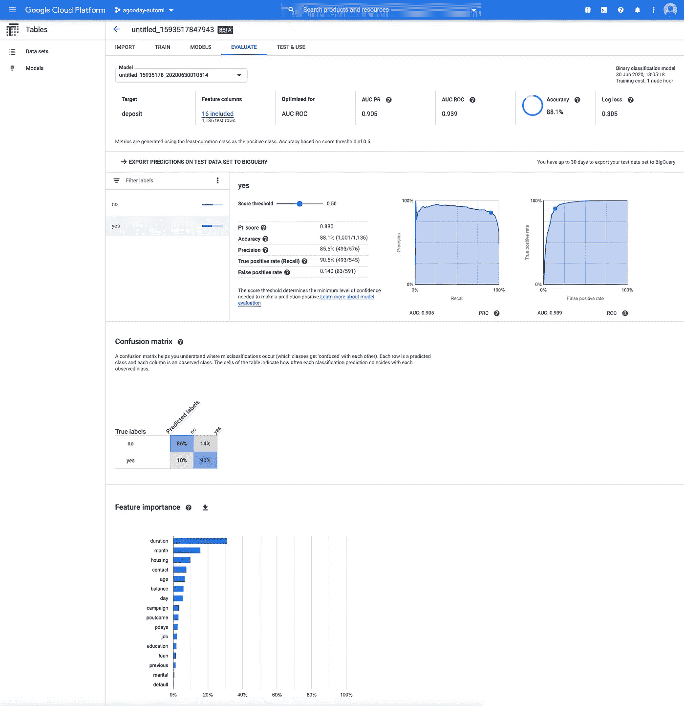

Google AutoML 表格—模型评估

谷歌已经自动将数据分为训练(80%)、验证(10%)和测试(10%)，这意味着模型可以通过验证集进行调整，然后用看不见的数据(测试集)进行检查。)

在评估选项卡上有许多有用的信息，因为这是一个分类问题，有 ROC/AUC 和精度/召回曲线、混淆矩阵和特征重要性。你可能会在 Kaggle 笔记本上找到这种东西，用来确定模型做得有多好。

在我们的例子中，模型似乎做得很好——但是好的定义将取决于假阴性或假阳性的成本，所以用例是有问题的。

我们还可以看到特征在模型分类决策中的重要性——所以这里也有一些基本的可解释性。

模特大赛 vs ka ggle 笔记本如何？

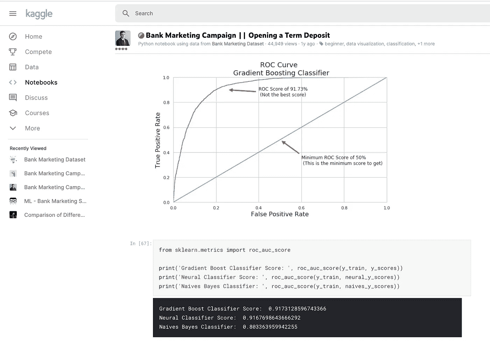

Janio Bachmann 的 Kaggle 笔记本电脑——展示模型性能

不错——我们的 ROC/AUC 得分更高，为 93.9。在第一和第三个最重要的特征上也有一致意见，尽管在任何其他特征上很少有一致意见。

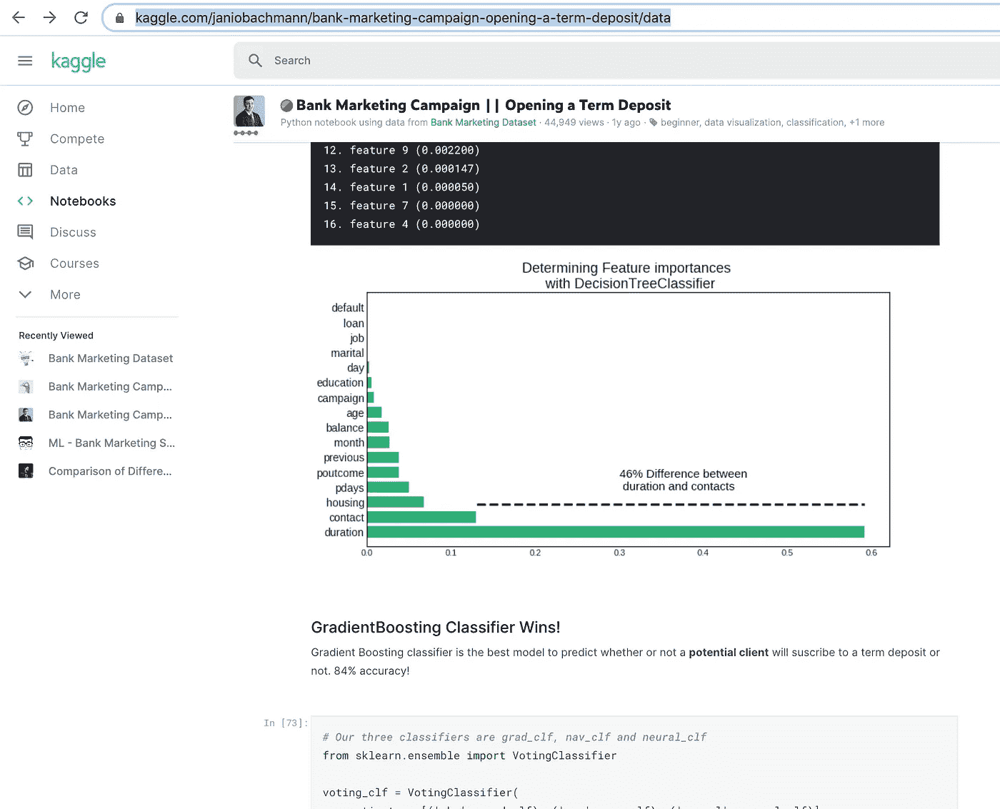

Janio Bachmann 的 Kaggle 笔记本——展示功能的重要性

在准确性方面，我们也以 88.1%比 84%领先

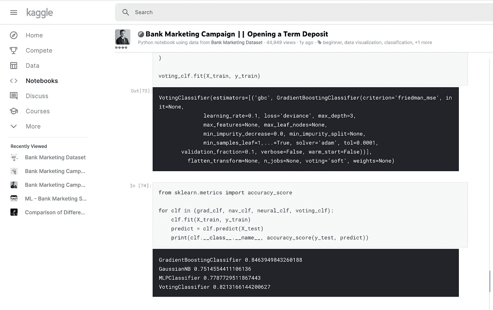

贾尼奥·巴赫曼的《卡格尔笔记本》——展现准确性

我们现在可以继续运行进一步的测试、批量预测，只需点击一下鼠标就可以将模型放到网上，或者将模型导出为 TensorFlow 包以在 Docker 容器中运行。

总之，我使用默认值、很少的数据科学技能和一些运气，特别是源数据的良好表现，创建了一个生产就绪模型，我可以在任何时候部署它。

但是我不知道这个模型是什么——它是基于树的吗？是系综，还是神经网络？它是如何做决策的？我将如何调整或改进模型？

# 亚马逊 SageMaker 自动驾驶仪

这给我们带来了亚马逊 SageMaker 的最新更新。通过使用 SageMaker AutoPilot 服务，我将能够解决上面的一些差距。我将知道发生了什么数据转换，哪些模型正在使用，并且能够修改它们。

SageMaker Studio 服务仍未在所有地区提供，因此我将在美国东部的“俄亥俄州”地区推出，使用美国东部的 S3 存储桶上传银行数据文件。

SageMaker Studio 的 JupyterLab 环境提供了一个机器学习 IDE。选择“创建亚马逊 SageMaker 自动驾驶实验”，你会发现已经与谷歌的 AutoML 有一些不同。

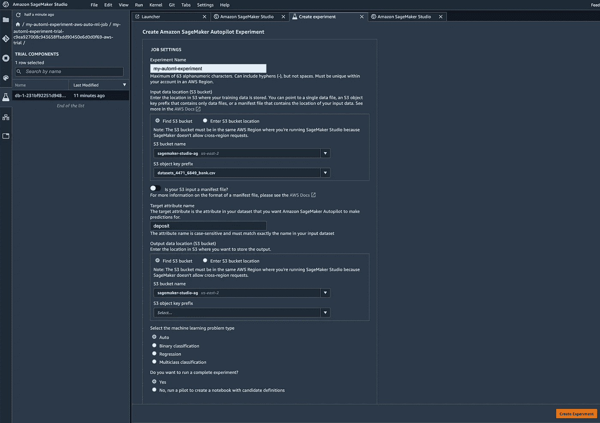

在 SageMaker 工作室启动自动驾驶实验

对自动生成的机器学习笔记本的访问以及由此产生的可见性是谷歌和 AWS 方法之间的一个巨大差异。

不幸的是，我们没有一个 GUI 来选择目标和特性列。以及返回错误消息需要多长时间——在我输入一个无效的目标名称后开始运行的许多分钟之后。一个在未来版本中解决的问题。

自动驾驶经历 4 个阶段:“分析数据”、“特征工程”、“模型调整”、“完成”。

如果你记得，我把谷歌限制在 1 小时。这不会是一个完全公平的测试，因为我没有以同样的方式限制亚马逊。

在同一个 bank data csv 上启动 Autopilot 两个小时后，特征工程已经完成，但是模型调优正在进行中(默认有 250 个调优作业。)

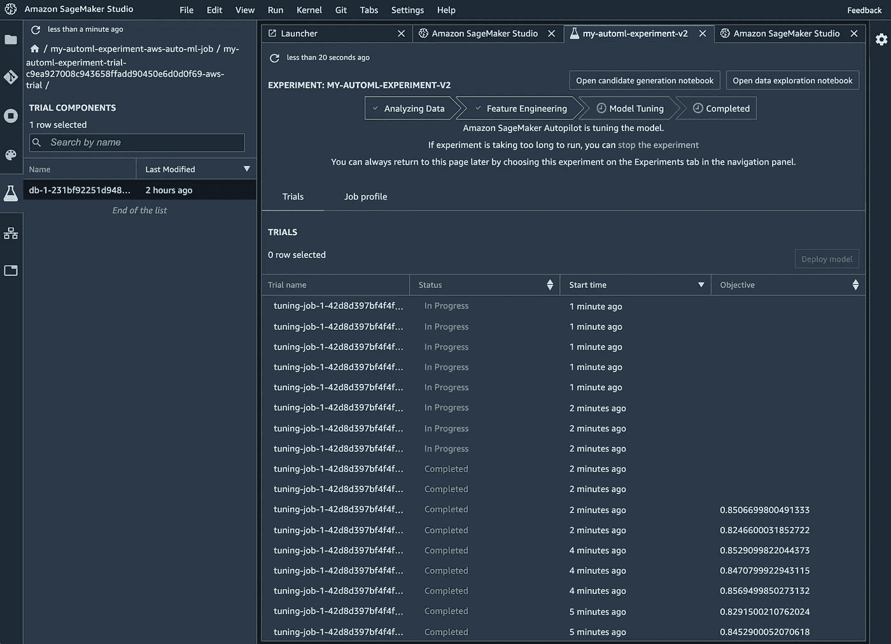

亚马逊 SageMaker —超参数调整

完成后，大约 30 分钟后，您可以查看一下指标。转到“实验”,控制并单击“在试用组件列表中打开”并添加指标。从这里开始，快速排序显示最佳模型提供了 85.964%的验证准确率。

乍一看，这很糟糕。它比 Kaggle 工作簿好，但比 Google AutoML 差，完成时间要长得多。另外，我们没有看到精确/召回曲线、ROC 分数、F1 分数、混淆矩阵，所以不可能立即进行比较。

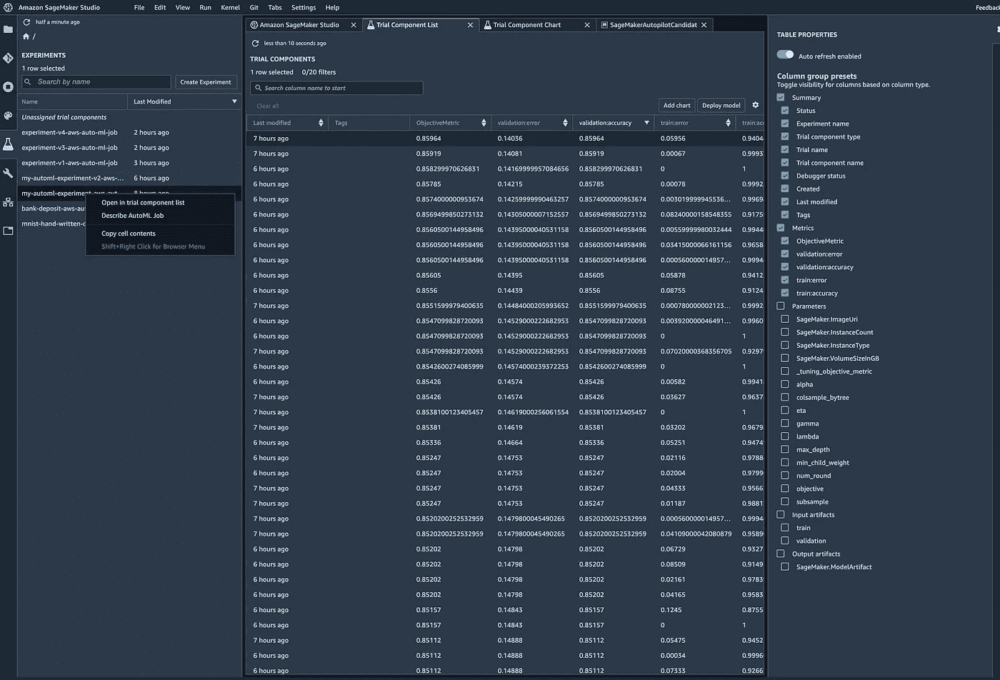

亚马逊 SageMaker——自动驾驶完成度和指标

但是，单击“打开候选人生成笔记本”,我们可以立即看到目标，确切地看到将使用哪些模型和转换。

** **提示** —在 Studio 中导入并保存候选人定义和数据探索笔记本，因为我稍后很难再次找到它们**

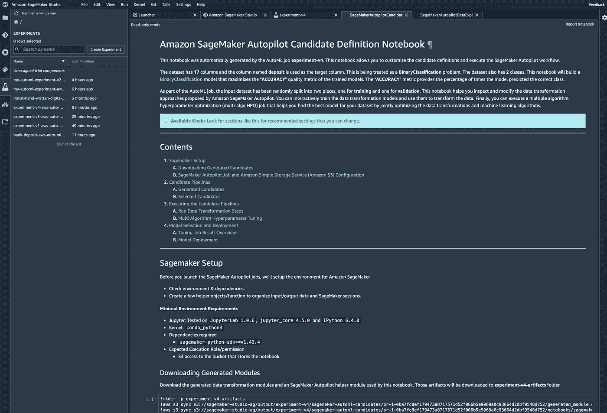

Autopilot 自动生成的 Python 笔记本。

还可以看到超参数调整范围，以及每个模型的转换策略。

所有这些都可以调整，您可以通过选择导入笔记本和数据科学内核来逐步完成笔记本的整个过程。

然而，如果您的工作室会话超时，事情会变得有点尴尬，我认为还有一些工作要做，使这成为一个真正独立的 GUI。

# H20.ai 无人驾驶 ai

M 从谷歌到 AWS，我们以易用性为代价获得了可见性和控制力的提升。特别是亚马逊的产品是一个对开发者更友好的用户界面。

从亚马逊转移到 H20.ai，我们有了一个更加精致、数据科学家友好的用户界面。我尝试了云版本——“水族馆”(运行在 AWS 上)，创建了一个新项目，并将相同的银行数据集加载到其中。

通过“AutoViz ”,可以立即获得源银行数据 csv 的数据可视化。

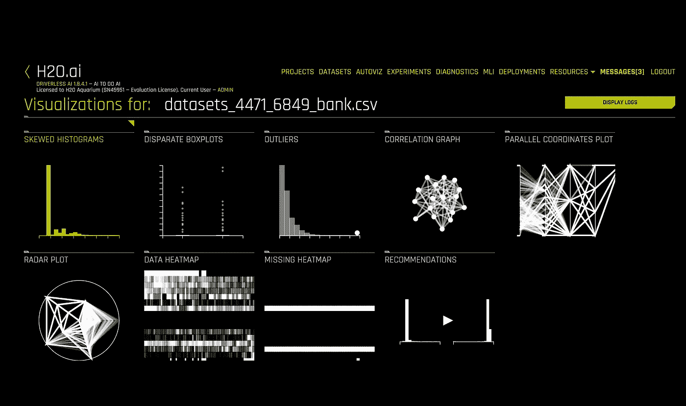

H20.ai 数据可视化

没有阅读内置的说明，或遵循任何教程，我能够创建一个训练/测试分裂在一次点击，然后选择目标'存款'栏。

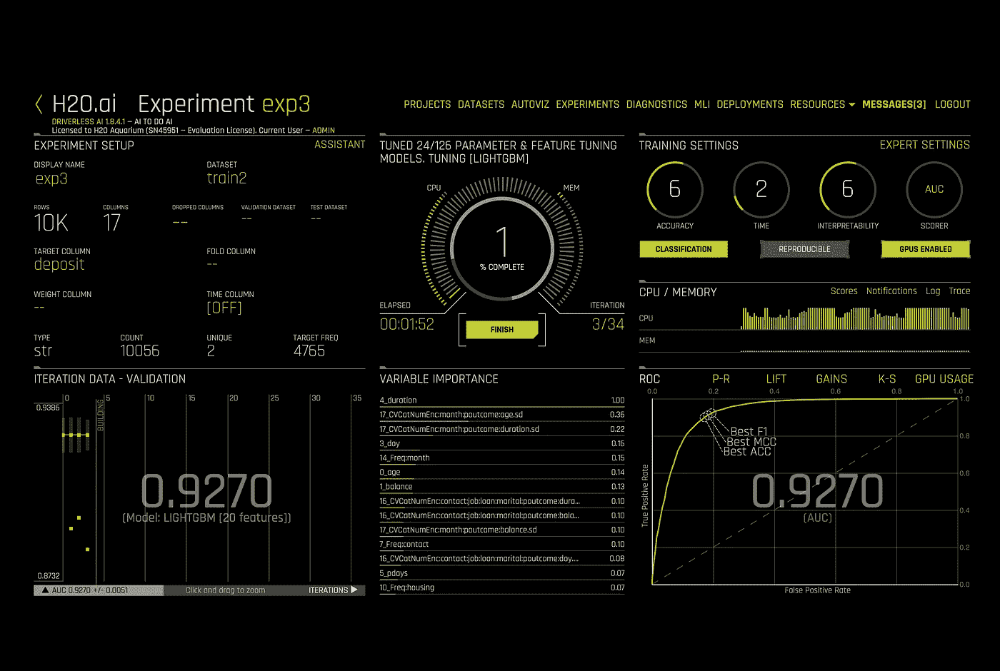

H20.ai 无人驾驶人工智能—建立一个实验

训练设置非常直观，在左侧，您可以看到模型中的各种权衡，以及与您的选择相对应的工程策略。

所以公平的说，这是一个非常直观的界面。

观看它也很有趣，因为它立即以超过 0.90 的 AUC 分数开始，立即将我们带到与 Kaggle notebook 类似的表现。

大约 30 分钟后，实验完成了。最终分数为 AUC 0.9295，Accuracy 0.8646，F1 0.8619，低于通过 Google AutoML 获得的分数，但高于 SageMaker 的准确度，也优于 Kaggle 笔记本。

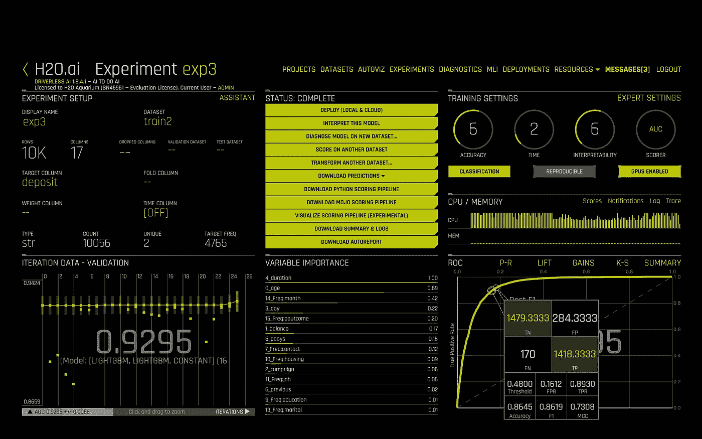

这是迄今为止我最喜欢的界面，提供了谷歌 AutoML 的简单性和亚马逊定制的强大功能。

# 其他自动服务

微软 Azure 提供许多可定制的人工智能服务:MCS 语音转文本、LUIS、QnA、语音翻译、表单识别器、异常检测器、个性化、说话者识别、自定义视觉和视频索引器。

我把以上所有的归类为“封闭的”汽车。

微软的 [AutoM](https://www.youtube.com/watch?v=n2q3vI1NBXA) 是一个“开放的”AutoML 解决方案，可以处理分类、回归和时间序列预测。

IBM [AutoAI](https://dataplatform.cloud.ibm.com/docs/content/wsj/analyze-data/autoai-overview.html) 也是一个“开放”的 AutoML 解决方案，包括对自动生成的 Python 笔记本的支持。

除了成熟的人工智能玩家之外，还有一些新的玩家，例如 [Kortikal](https://kortical.com/) 提供了“开放”的自动 ML。

# 结论

随着人工智能采用的第二波浪潮到达新的行业和用例，utoML 是一项新兴技术，随着它的改进，它将对人工智能的消费方式产生重大影响。

AutoML 将对企业如何招聘人工智能产生影响，甚至超越数据和开发团队。例如，在我的上一篇文章[“人工智能产品经理——进化还是革命”](/digital-diplomacy/ai-product-managers-evolution-or-revolution-729af7e99154)中，我将 AutoML 作为对产品角色如何变化的贡献。

我希望看到认知 API 的 AutoML 版本数量的增长。我也希望微软、AWS 和其他公司对最初的 AutoML 产品进行改进。

AutoML 的范围也可能扩大，一方面自动化更多的部署和实时管理，另一方面与数据源更无缝地集成。

“开放的”AutoML 看起来更有可能吸引那些积极从事机器学习的人，而且似乎比“封闭的”AutoML 更有可能解决现实世界的业务需求。

可能的情况是，如果自动化变得足够先进，对“开放”AutoML 提供的可见性和控制的需求将减少，我们将看到“封闭”AutoML 被企业采用。

