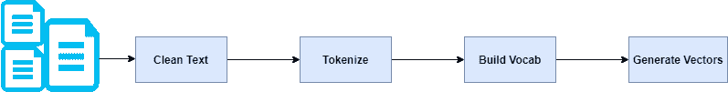

# 使用 Python 的单词包介绍

> 原文：<https://medium.com/analytics-vidhya/an-introduction-to-bag-of-words-using-python-25640f379f05?source=collection_archive---------6----------------------->

如果我们想在机器学习算法中使用文本，我们必须将它们转换成数字表示。计算机非常擅长处理数字，这不足为奇。


***为什么需要将文本转换成数值表示？***

举个例子:如果你有一套像黑、蓝、白、黄、绿这样的颜色。在这里，机器不可能比较这些颜色，比如哪个更大和更小(比如说黑色大于白色是无关紧要的)。因此，在这些情况下，有必要将这些文本转换成数字。

它遵循以下步骤:



要遵循的步骤

这里，生成的输出向量可以用作机器学习算法的输入。

让我们来看两句话:

```
1\. "John likes to watch movies. Mary likes movies too."2\. "John also likes to watch football games."
```

这两个句子也可以用单词集合来表示。

```
1\. ['John', 'likes', 'to', 'watch', 'movies.', 'Mary', 'likes', 'movies', 'too.']2\. ['John', 'also', 'likes', 'to', 'watch', 'football', 'games']
```

此外，对于每个句子，删除多次出现的单词，并使用单词计数来表示。

```
1\. {"John":1,"likes":2,"to":1,"watch":1,"movies":2,"Mary":1,"too":1}2\. {"John":1,"also":1,"likes":1,"to":1,"watch":1,"football":1,   "games":1}
```

假设这些句子是文档的一部分，下面是我们整个文档的组合词频。两个句子都考虑进去了。

```
{"John":2,"likes":3,"to":2,"watch":2,"movies":2,"Mary":1,"too":1,  "also":1,"football":1,"games":1}
```

来自文档中所有单词的上述词汇，以及它们各自的单词计数，将被用于创建每个句子的向量。

**向量的长度将始终等于词汇量。在这种情况下，向量长度是 10。**

为了在一个向量中表示我们的原始句子，每个向量都用全零初始化—**【0，0，0，0，0，0，0，0】**

接下来是与我们的词汇表中的每个单词进行迭代和比较，如果句子中有那个单词，就增加向量值。

```
John likes to watch movies. Mary likes movies too.
========================================================= 
[1, 2, 1, 1, 2, 1, 1, 0, 0, 0]John also likes to watch football games.
=========================================================
[1, 1, 1, 1, 0, 0, 0, 1, 1, 1]
```

例如，在句子 1 中，单词`likes`出现在第二个位置，并且出现了两次。因此，句子 1 的向量的第二个元素将是 2:**【1，2，1，1，2，1，1，0，0，0】**

向量总是与我们的词汇量成正比。

一个生成的词汇表很大的大文档可能会产生一个包含很多 0 值的向量。这被称为**稀疏向量**。稀疏向量在建模时需要更多的内存和计算资源。对于传统算法来说，大量的位置或维度会使建模过程非常具有挑战性。

# 编写我们的 BOW 算法

我们代码的输入将是多个句子，输出将是向量。

输入数组如下:

```
["Joe waited for the train", "The train was late", "Mary and Samantha took the bus","I looked for Mary and Samantha at the bus station","Mary and Samantha arrived at the bus station early but waited until noon for the bus"]
```

## 第一步:标记一个句子

我们将从删除句子中的停用词开始。

> **停用词**是不包含足够重要性的词，在没有我们的算法的情况下不能使用。我们不希望这些单词占用我们的数据库空间，或者占用宝贵的处理时间。为此，我们可以通过存储您认为是停用词的单词列表来轻松删除它们。
> 
> **记号化**是将一串字符串分解成单词、关键词、短语、符号和其他元素的行为，称为**记号**。记号可以是单个的单词、短语，甚至是整个句子。在标记化的过程中，一些类似标点符号的字符被丢弃。

```
def word_extraction(sentence):    
   ignore = ['a', "the", "is"]    
   words = re.sub("[^\w]", " ",  sentence).split()    
   cleaned_text = [w.lower() for w in words if w not in ignore]    
   return cleaned_text
```

## 第二步:对所有句子应用标记化

```
def tokenize(sentences):    
   words = []    
   for sentence in sentences:        
     w = word_extraction(sentence)        
     words.extend(w)            
   words = sorted(list(set(words)))    
   return words
```

该方法迭代所有句子，并将提取的单词添加到一个数组中。

该方法的输出将是:

```
['and', 'arrived', 'at', 'bus', 'but', 'early', 'for', 'i', 'joe', 'late', 'looked', 'mary', 'noon', 'samantha', 'station', 'the', 'took', 'train', 'until', 'waited', 'was']
```

## 第三步:建立词汇并生成向量

使用步骤 1 和 2 中定义的方法创建文档词汇表，并从句子中提取单词。

```
def generate_bow(allsentences):        
   vocab = tokenize(allsentences)    
   print("Word List for Document \n{0} \n".format(vocab)) for sentence in allsentences:        
    words = word_extraction(sentence)        
    bag_vector = numpy.zeros(len(vocab))        
    for w in words:            
      for i,word in enumerate(vocab):                
        if word == w:                     
         bag_vector[i] += 1                            
  print("{0}\n{1}\n".format(sentence,numpy.array(bag_vector)))
```

下面是我们代码的定义输入和执行:

```
allsentences = ["Joe waited for the train train", "The train was late", "Mary and Samantha took the bus","I looked for Mary and Samantha at the bus station","Mary and Samantha arrived at the bus station early but waited until noon for the bus"]generate_bow(allsentences)
```

每个句子的输出向量是:

```
Output:
--------------------------------------
Joe waited for the train train
[0\. 0\. 0\. 0\. 0\. 0\. 1\. 0\. 1\. 0\. 0\. 0\. 0\. 0\. 0\. 0\. 0\. 2\. 0\. 1\. 0.]
==================================================================
The train was late
[0\. 0\. 0\. 0\. 0\. 0\. 0\. 0\. 0\. 1\. 0\. 0\. 0\. 0\. 0\. 1\. 0\. 1\. 0\. 0\. 1.]
==================================================================
Mary and Samantha took the bus
[1\. 0\. 0\. 1\. 0\. 0\. 0\. 0\. 0\. 0\. 0\. 1\. 0\. 1\. 0\. 0\. 1\. 0\. 0\. 0\. 0.]
==================================================================
I looked for Mary and Samantha at the bus station
[1\. 0\. 1\. 1\. 0\. 0\. 1\. 1\. 0\. 0\. 1\. 1\. 0\. 1\. 1\. 0\. 0\. 0\. 0\. 0\. 0.]
==================================================================
Mary and Samantha arrived at the bus station early but waited until noon for the bus
[1\. 1\. 1\. 2\. 1\. 1\. 1\. 0\. 0\. 0\. 0\. 1\. 1\. 1\. 1\. 0\. 0\. 0\. 1\. 1\. 0.]
```

正如你所看到的，**每个句子都与我们在步骤 1 中生成的单词表进行了比较。基于该比较，向量元素值可以增加**。这些向量可以在 ML 算法中用于文档分类和预测。

我们编写了代码并生成了向量，但现在让我们多了解一下这个单词包。

# 洞察词汇袋

BOW 模型只考虑一个已知单词是否出现在文档中。它不关心它们出现的意义、上下文和顺序。

这提供了相似文档将具有彼此相似的字数的洞察力。换句话说，两个文档中的单词越相似，文档就越相似。

所以，这都是关于单词袋的理解！

# 弓的局限性

> **语义**:基本的 BOW 方法不考虑单词在文档中的含义。它完全忽略了使用它的上下文。根据上下文或邻近单词，同一个单词可以用在多个地方。
> 
> **矢量大小**:对于一个大文档，矢量大小可能会很大，导致大量的计算和时间。您可能需要根据与您的用例的相关性来忽略单词。

**感谢您阅读本文。显示的代码在我的**[**GitHub**](https://github.com/MachineLearnWithRosh/Bag-Of-Words)**上有。**

你可以在 Medium 和 [LinkedIn](http://www.linkedin.com/in/roshan-kumar-gupta-43a96bb2) 上关注我。

如有任何问题，您可以通过电子邮件(roshangg 96[at]Gmail[dot]com)联系我。