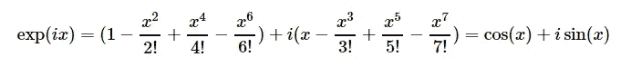
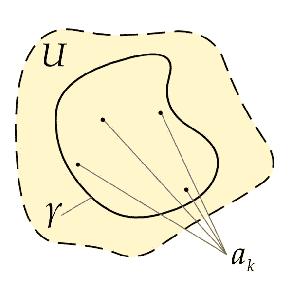
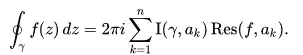

# 复分析与应用导论

> 原文：<https://medium.com/analytics-vidhya/an-introduction-to-complex-analysis-and-applications-7af32522123b?source=collection_archive---------3----------------------->

## 虚数如何产生实际影响。

图 1:一个复杂函数的表示。一旦你理解了什么是复杂函数，你就可以创建这些函数。颜色代表复变函数的自变量，而亮度/色调则由幅值来表示。图片引用:[知识共享。](https://commons.wikimedia.org/wiki/File:Color_complex_plot.jpg)

# 简介:

**让我们从简单的开始。**100 的平方根是多少？换句话说，什么数乘以本身等于 100？简单，答案是 10。

-1 的平方根是多少？

这并不明显。既然负数乘以负数是正数，我们怎么可能解出-1 的平方根呢？

答案是；**我们定义它。**这不仅仅是一个微不足道的定义。分配这个答案，**I**,‘虚部’是一个美丽而深刻的领域的开始步骤，被称为*复分析。*

那么，为什么要关心复分析呢？事实证明，尽管名字是“虚构的”，但磁场的影响肯定是真实的。从工程，到应用和纯数学，物理和更多，复杂的分析不断出现。此外，我们将讨论几个不可否认的例子，它们表明复分析确实是一个有用而重要的领域。

这篇文章甚至没有触及复分析领域的表面，也没有提供足够的介绍来真正深入这个主题。然而，我希望提供一些可能应用的简单例子，并希望给出一些背景。

**注意:**这些笔记中的一些是基于我在麦吉尔大学为一门关于[复变量的课程所做的辅导。](https://www.mcgill.ca/study/2020-2021/courses/math-316)

**你还在找理解复分析的理由吗？也许接下来的例子会启发你！**

# 历史:

首先，我将对复分析的历史做一个非常简要和广泛的概述。我还将强调一些对该领域的发展有重大影响的人的名字。请注意，这不是一部全面的历史，对复数的轻微提及或可能的暗示可以追溯到古希腊的[1 世纪。](https://en.wikipedia.org/wiki/Hero_of_Alexandria#Bibliography)

**约翰·伯努利，1702:** 用虚数单位解多项式方程的第一个参考文献。

亚伯拉罕·德莫佛，1730 年(T1):发展了一个利用复数解三角方程的方程，这个方程一直沿用至今，这就是 T2·德·莫伊弗尔方程。

**莱昂哈德·欧拉，** **1748:** 一个真正的数学天才。引入了欧拉恒等式。

**奥古斯丁·路易斯·柯西 1812:** 以他的“ [*定积分实录”引入了复分析的实际领域及其严肃的数学含义。*](https://www.jstor.org/stable/1967922#metadata_info_tab_contents)

**波恩哈德·黎曼 1856:** 写了他关于复分析的[论文](https://www.usna.edu/Users/math/meh/riemann.html)，巩固了这个领域作为一个值得研究的课题。还介绍了黎曼曲面和洛朗级数。

至于更现代的作品，亨利·庞加莱、理查德·戴德金德和费利克斯·克莱因已经大大拓展了这个领域。

# 基础知识:

我将首先介绍一些理解本文所需的关键概念。

我们在上面定义了虚数单位 *i* 。我们也定义了复平面ℂ。一个复数， **z，**有一个*实部*和一个*虚部*。即一个复数可以写成 **z=a+bi** ，其中 **a** 为实部， **b** 为虚部(a 和 b 都是实数)。你可能会注意到，只要设置 b=0，任何实数都可以包含在复数集中。

图 2:演示复杂平面的图像。图片引用:[知识共享。](https://commons.wikimedia.org/wiki/File:Argandgaussplane.png)

复平面ℂ是所有实数对(a，b)的集合，其中我们将两个复数的加法定义为(a，b)+(c，d)=(a+c，b+d)，乘法定义为(a，b) x (c，d)=(ac-bd，ad+bc)。因此，(0，1)是虚数单位 I，而(1，0)是通常的实数 1。以这种方式书写(a，b)等同于书写 a+bi，并且一旦我们根据上述定义了加法和乘法，我们就知道ℂ是一个*字段*。

**进一步的属性:**

如果 z=(a，b)是一个复数，那么我们说 Re(z)=a，Im(z)=b。这就是说 z 的实部是 a，z 的虚部是 b。

我们还定义了 z 的大小，记为|z|,这可以让我们了解一个复数有多大；

图 3:复数 z 的幅度。

如果 z1=(a1，b1)，z2=(a2，b2)，那么两个复数之间的距离也定义为；

图 4:两个复数之间的距离。

就像在ℝ一样，三角形不等式在ℂ.也成立

我们还定义了 z 的*复共轭*，记为 z *；

图 5:复共轭。

复共轭就派上用场了。注意 Re(z)=Re(z*)和 Im(z)=-Im(z*)。

复函数可以用类似于复数的方式定义，u(x，y)和 v(x，y)是两个实值函数。

图 6:一个我们如何编写任意复杂函数的例子。图片来源:作者。

就像实函数一样，复函数也可以有导数。*柯西黎曼*方程给了我们一个复函数可微的条件。主要是，对于如上用 u 和 v 分解的复函数 f，如果 u 和 v 是有实导数的实函数，则柯西黎曼方程组是一个必要条件；

图 7:柯西黎曼方程。图片来源:作者。

在定义域中所有点都满足这些方程的函数称为**全纯函数。**

例如，您可以很容易地验证以下是复平面ℂ上的全纯函数，因为它在所有点上都满足 CR 方程。

图 8:c 上的一个全纯函数。

全纯函数在复分析中经常出现，并且有许多惊人的性质。他们也有一个物理解释，主要是他们可以被视为是不变的某些变换。

图 6:柯西黎曼方程的图解。假设一个函数满足 CR，定义域中的一个向量 X 乘以一个复数 z 并被 f 映射，将等同于映射向量 X 乘以 z 的乘积.图片引用: [Creative commons。](https://commons.wikimedia.org/wiki/File:Cauchy-Riemann.png)

# 欧拉公式:

如果你关注数学迷因，你可能见过著名的简化；

图 9:著名的欧拉方程。图片来源:作者。

这是从*欧拉公式*推导出来的，我们只用几步就能证明。

首先，回想一下 cos(z)、sin(z)和 exp(z)的简单泰勒级数展开式。这些是你在早期微积分中学到的公式；主要是，

图 10:Sin、Cos 和 e 的泰勒展开式。

因此，使用 ix 的指数展开式，我们得到:

图 11:插入 ix 到指数扩展中。图片来源:作者。

我们可以将其简化并重新排列如下

图 12:重新安排和简化扩展。图片来源:作者。

就是这样！以上是欧拉公式，插入 x=pi 给出了著名的版本。

图 13:简化并代入 x=pi 后的最终结果。图片来源:作者。

# **残基:**

如果没有先决条件，留数会更难理解，但本质上，对于全纯函数 f，f 在 c 点的留数是 f 在 c 点周围的 Laurent 展开式(泰勒级数的复杂模拟)中的系数 1/(z-c)。这些在复分析中非常重要。存在几种类型的剩余，包括极点和奇点。

事实证明，残差可以大大简化，并且可以证明以下情况成立:

图 14:剩余公式。图片来源:作者。

**举例:**

假设我们想要找到 f(z)关于点 a=1 的剩余，我们将求解洛朗展开并检查系数:

图 15:一个函数，我们想要找到它的残数。图片来源:作者。

图 16:f(z)关于 a=1 的洛朗展开。图片来源:作者。

因此，关于点 a 的余数是 sin1，因为它是 Laurent 展开式中 1/(z-1)的系数。

# 轮廓整合:

上面的例子很有趣，但是它的直接用途并不明显。嗯，解复杂的积分是一个现实问题，在现实世界中经常出现。幸运的是，由于柯西，我们知道了残数理论，因此甚至可以用复分析来解决实积分。我不会包括所有的细节和证明，因为我要提供一个广泛的概述，但所有的定理都存在完整的证明。

图 17:展示复杂集成过程的概述的图像。ak 是包含在封闭路径 gamma 内的点，并且都位于复平面的开放部分内，u .图片引用:[创作共用:](https://commons.wikimedia.org/wiki/File:Residue_theorem_illustration.png)

**柯西积分公式:**

对于全纯函数 f 和复平面内的闭合曲线γ，ℂ，柯西积分公式表示:

图 18:封闭路径周围的柯西积分公式的结果。图片来源:作者。

也就是说，对于包含在区域内的任何闭合路径，积分都为零。

柯西剩余定理指出，在圆盘内全纯的每个函数完全由出现在圆盘边界上的值决定。

图 19:柯西留数定理。图片来源:作者。

图 20:柯西积分公式。I 是缠绕数的和，在本文中我们不会担心。围绕闭合路径的积分是关于包含在路径中的奇点的残差的和(乘以 2pi 和缠绕数)。图片来源:作者。

**举例:**

假设我们想解下面的线积分。

图 21:我们希望在复平面上的封闭圆盘上求解的积分。图片来源:作者。

图 22:求解这个积分的公式涉及到求它在 c 上的留数图片来源:作者。

由于很容易证明 f(z)有一个残数，主要是在点 **z=0** 它是一个“*极点*”，我们可以求这个残数等于 1/2。因此，上面的积分就是*π乘以 i* 。

# 求解实积分:

假设你被要求解下面的积分:

图 23:一个实值积分。

只使用常规方法，你可能不会有太多的运气。事实证明，通过使用复分析，我们可以很容易地求解这个积分。如果你愿意，可以看看这段[精彩视频中的细节。](https://www.youtube.com/watch?v=-u0MmAr5XTs)但它的长短句是，我们把 f(x)转换成 f(z)，并求解留数。然后我们简单应用留数定理，答案就蹦出来了；

图 24:上述积分的答案。

# 证明代数的基本理论:

证明是高等数学的基础。虽然不总是显而易见，但它们构成了我们知识的基础。

代数的基本理论指出，每个复系数的非常数单变量多项式至少有*个*个复根。

使用复分析，特别是[最大模数原理](https://en.wikipedia.org/wiki/Maximum_modulus_principle)，可以用几行简短的文字来证明。

# 工程:

事实上，复数在现实世界中有应用，尤其是在工程领域。

**电气:**

复数大量出现在电路和信号处理中。它们被用于希尔伯特变换、电力系统设计等等。

**核:**

复杂分析用于先进的反应堆动力学和控制理论以及等离子体物理学。

# 理论物理学:

它们在理论物理中也经常出现。你认为复数可能出现在[*万有理论*](https://en.wikipedia.org/wiki/Theory_of_everything)中吗？

**量子力学:**

复分析用于求解 CPT 理论(电荷、宇称和时间反转)，以及共形场论和 Wick 定理。

复变量也是量子力学的一个基本部分，因为它们出现在波动方程中。

**弦理论:**

事实上，复分析在弦理论中大量出现。特别是它们有助于定义共形不变量。我不太明白这一点，但似乎一些物理学家正在积极研究这个话题。

# 数据科学:

最后，数据科学和统计学。我最感兴趣的领域。我还没有在我的任何工作中发现复数的应用，但我毫不怀疑这些应用是存在的。一些应用已经实现，例如在深度神经网络中使用复数来表示[相位，以及在语音识别中使用复数分析来分析声波。](https://arxiv.org/pdf/1312.6115.pdf)

# 总结:

熟悉复变量的基础知识是值得的。已经有许多真实的应用程序，而且每天都在开发更多的应用程序。尽管有“虚构”这个不幸的名字，但它们绝不是“假的”或不合法的。复分析出现在科学和工程的许多分支中，它也能帮助巩固你对微积分的理解。虽然我们不知道复分析的下一个应用会是什么，但很明显它们肯定会再次出现。也许甚至在物理学的统一理论中？

**感谢阅读！**

问题、意见或建议？

# 来源:

[1]汉斯·尼尔斯·扬克(1999) *一个分析的历史*

[2] H. J. Ettlinger (1922) *数学年鉴*

[3]彼得·乌尔里希(2005) [*西方数学里程碑式的著作 1640–1940*](https://www.sciencedirect.com/science/book/9780444508713)

[4]翁贝托·博塔兹尼(1980) [*《高等微积分》。从欧拉到维尔斯特拉斯*](https://www.ams.org/journals/bull/1987-17-01/S0273-0979-1987-15559-5/S0273-0979-1987-15559-5.pdf) *的实复分析史。*

[5]詹姆斯·布朗(1995) [*复变函数及其应用*](https://math.unice.fr/~nivoche/pdf/Brown-Churchill-Complex%20Variables%20and%20Application%208th%20edition.pdf)

[6]M . Spiegel，S . Lipschutz，J . Schiller，D . Spellman(2009)*Schaum 的复变量大纲，第二版*

[7] R. B. Ash 和 W . P . Novinger(1971)[复变量。](http://Complex Variables)