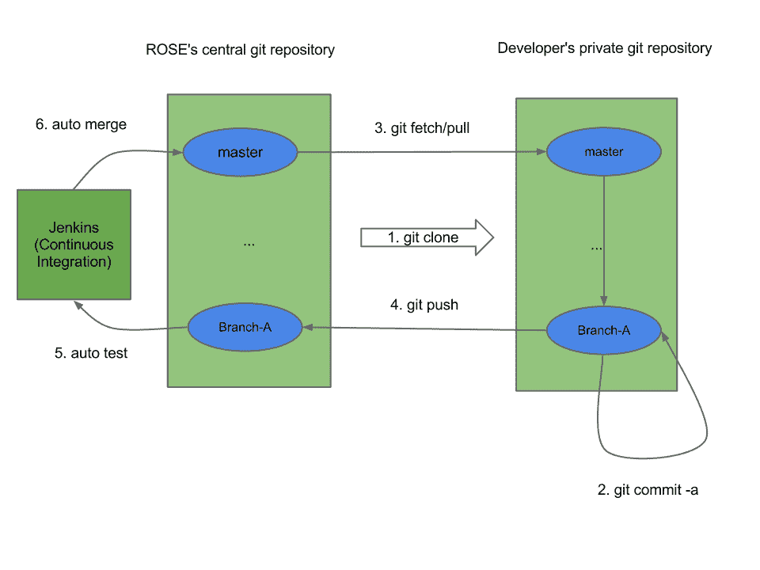
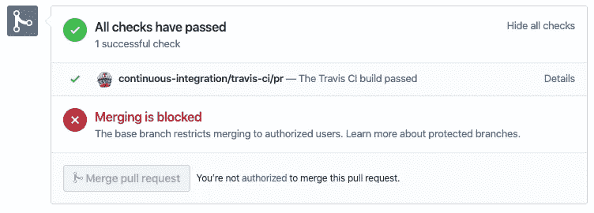
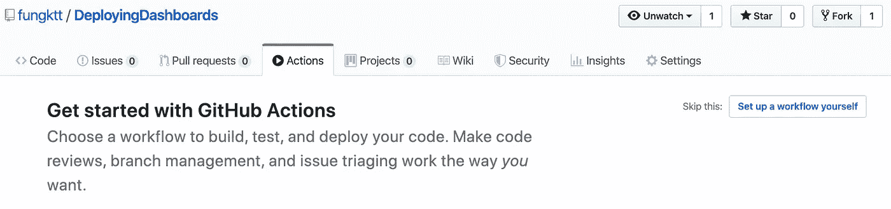
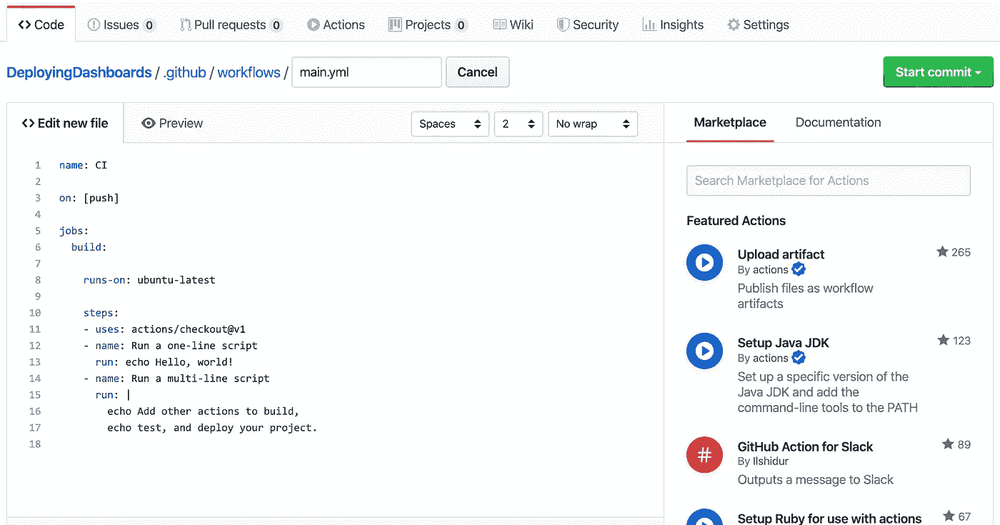

# Julia 的持续集成和 GitHub 动作介绍

> 原文：<https://medium.com/analytics-vidhya/an-introduction-to-continuous-integration-github-actions-for-julia-1a5a1a6e64d6?source=collection_archive---------6----------------------->


露丝·齐默曼在 [Unsplash](https://unsplash.com/s/photos/statistics?utm_source=unsplash&utm_medium=referral&utm_content=creditCopyText) 上拍摄的照片

# 问题是

在开源开发中，由于开发人员正在创建他们自己工作的并行分支，并且只在完成时才合并它们，所以未合并的复制分支上的代码将越来越不同于原始主分支上的代码。分支之间迫在眉睫的差异会给我们带来许多挑战，即引入错误，产生合并冲突，甚至使整个代码库完全停止，使开发和发布软件的整个过程变得极具挑战性。

开发人员需要测试这些提交，以确保它们正确有效地工作，没有任何错误，不破坏任何包，并且它们运行该项目全面支持的每一个平台。因此，这很可能需要很长的时间，变得非常乏味，并且不是项目的所有方面都被测试，给我们一个非常低的测试覆盖率，并且还可能导致协作中的问题。

随后，开发人员之间的同步将很快脱离轨道。因此，为了以更有效和一致的方式开发它，开发人员创造了一些策略来使集成变得非常简单和可重复。

# 什么是 CI，为什么

持续集成(Continuous Integration，简称 CI)是一种工作流策略，它确保在开源开发中，一个团队中的所有开发人员非常频繁地将所有修改与主分支的最新版本合并。提供 CI 的服务的一个例子是 GitHub，每个开发人员可以创建一个存储库的 fork(一个独立的副本),发出 Pull 请求，要求他们的工作(提交)被合并，用评论和建议进行评审，或者被关闭。这不仅使每个人更容易在过程的早期调试 bug，降低合并冲突的可能性(Git 无法解决的代码中的竞争变更)，而且还增强了开发人员之间解决问题的沟通。在这里，我们鼓励每个开发人员更频繁地将他们的代码与主分支集成在一起，而不是在集成之前长时间孤立地处理某些功能。本质上，这允许每个人以更频繁的时间间隔获得项目的最新版本，并因此减少冲突的机会和它被评审所花费的时间。此外，对每个人来说，测试他们所做的每一个小的改变都是有益的，以降低错误的风险，并在早期捕捉潜在的错误，以便它不会影响到后来所做的分支，以及跨多个平台进行自动测试，以捕捉早期未测试的平台上的意外问题，并为特定平台创建指令，通过自动化来增加测试覆盖率，其中一些可能会被手动测试遗漏， 并消除每次都必须手动测试编程的麻烦，这是通过持续部署来整理的。 每一个变化都会向团队发送一个通知，让其他开发人员可以很容易地交叉检查他们是否想留下评论或建议。

在大多数情况下，Cl 是由一个团队使用一个专用的服务器或 CI 服务与自动化测试同时进行的。在这里，代码将由服务器自动构建和测试，以检查它是否既能工作又能与主分支的代码集成。然后，服务器将给出一个包含构建结果的输出，其中包含关于分支是否通过了集成到主开发分支的所有需求的所有细节。

# CI/CD 管窥

由于 CI 为我们提供了关于在每个分支上进行的每个提交的构建和测试信息的所有细节，它帮助我们适应所谓的连续交付，即以这样一种方式开发软件的实践，即您可以在任何时候发布它。持续部署是持续交付的扩展，允许您放心地将新开发的功能部署到生产中。GitHub Actions 是一个可以免费学习更多 CD 知识的地方，它有交互式课程，任何人都可以学习更多关于 GitHub 存储库的工作流和测试自动化的知识，从中可以构建、测试和部署您的代码。



图 1:维基共享资源；根据 CC A-SA 3.0 获得许可，未转让

# GitHub 上的 CI！

开发人员为集成所做的是，他们在本地进行更改，并将这些更改推送到 GitHub，称为 commits，CI 在这里的角色是使用自动化测试来确定他们是否将与最新的主分支集成。首先，当一个活动发生时(例如，当有人打开一个 pull 请求时)，CI 服务器将解析 GitHub 上 Webhooks 发送的消息，并获取分支的最新副本，这样它就可以构建它并运行测试。完成后，GitHub 使用从 CI 服务器发回的信息来显示 pull 请求中的检查信息，以及一些链接，您可以单击这些链接返回查看更多详细信息，如下图所示:



图 GitHub 上 FluxML/Flux.jl 上的 Pull 请求#977 的截图

这使得每个人，无论他们是一个存储库的贡献者、成员或者所有者，对于哪些变更可以集成到主分支，哪些不可以(或者需要更多的变更)有一个更清晰的想法。在基本的 CI/CD 设置中，我们可以创建一个系统，允许 CI 提供者将主分支上的每个新提交部署到主分支上，例如 GitHub 操作。查看更多:[https://lab.github.com/github/hello-github-actions!](https://lab.github.com/github/hello-github-actions!)

# 为什么 CI/CD 对 Julia 很重要

既然我们都知道持续集成是每个人管理一个项目的工作流程的好方法，这个项目涉及多个同时在不同方面工作的人，我们可以谈谈为什么这对 Julia [package](https://pkg.julialang.org/docs/) 开发者来说是一件大事。当涉及到在 Julia [生态系统](https://github.com/JuliaLang)中开发包时，这变得特别方便。您可能会发现，与其他编程语言相比，CI/CD 可能更经常被 Julia 包开发人员使用，因为 Julia 有非常广泛的包集合，因此它使得每次管理、测试和审查如此大量的被合并到生态系统中的包变得非常困难。事实上，Julia 中的大多数包都有大量代码被重用和组合，除此之外，还存在代码冲突的风险，因此可能会破坏相关的包，或者更糟，破坏整个项目！由于这是用 Julia 编程语言开发包的一个如此重要的方面，开发人员已经创建了机器人来帮助自动化这个过程，并使测试更容易。这方面的一个例子是 [NewPkgEval.jl](https://github.com/JuliaComputing/NewPkgEval.jl) ，它评估包以确定对 Julia 的提交是否会破坏生态系统本身。还有一个名为 [Registrator.jl](https://github.com/JuliaRegistries/Registrator.jl) 的机器人，它自动创建 julia 包向通用注册中心的注册请求。

# 使用 GitHub 操作为 Julia repo 设置基本配置项脚本

假设您有一个包含您想要运行的 Julia 程序的存储库，您可以使用 GitHub 操作(如前所述)来帮助自动化您的 CI 工作流，并直接从 GitHub 部署代码。今天，我们不会深入探讨太多的细节，而是简单介绍一下让您入门和运行的基础知识。在 julia 中拥有 CI 工作流或流程的要素之一是这个名为 ["setup-julia"](https://github.com/marketplace/actions/setup-julia-environment) 的 GitHub 操作，它通过下载特定版本的 Julia 并将其添加到 PATH 中来帮助设置在操作中使用的 Julia 环境，这样只需调用`julia`就可以轻松运行脚本。

如果你去你的回购，你应该可以看到一个标签，称为“行动”。点击并选择右边的“自己设置工作流程”选项。



它的作用是在`.github`文件夹内的`workflows`文件夹内创建一个`.yml`文件。默认情况下，它被称为`main.yml`，但是您可以随意更改它的名称，同时保留最后的`.yml`扩展名。



完成后，您可以创建另一个名为`src`的文件夹，将 repo 中的所有内容(不包括新的`.github`文件夹)放入其中。没有必要这样做，但这可能会使回购更有条理，尤其是如果你有很多。

你现在可以返回到编辑`.yml`文件。首先，您可以将`name:`部分更改为您希望调用脚本的名称。之后，我们可以设置部署时间表。用以下代码替换`on:`部分:

```
on:
  schedule:
  - cron: "*/8 * * * *"
```

上面显示的示例允许文件每 8 分钟运行一次。请随意将该数字更改为任意数字。点击[此处](https://help.github.com/en/actions/automating-your-workflow-with-github-actions/events-that-trigger-workflows#scheduled-events-schedule)了解更多关于如何定制`cron:`的信息。

现在让我们继续并修改用于运行代码的`jobs`部分。将以下代码粘贴为模板，我们将在以后对其进行修改:

```
jobs:
  build: runs-on: ubuntu-latest

    steps:
    - uses: actions/checkout@v1
    - uses: julia-actions/setup-julia@v1
      with:
          version: '1.0.4'
    - uses: julia-actions/julia-buildpkg@master
    - run: julia --project file.jl
```

这里的`runs-on`值指定了操作将在哪个操作系统上运行。在本例中，使用了`ubuntu-latest`。可以将 runner 换成 Windows、macOS 等其他操作系统。点击[此处](https://help.github.com/en/actions/automating-your-workflow-with-github-actions/virtual-environments-for-github-hosted-runners#supported-runners-and-hardware-resources)了解更多信息。然后，您可以通过将`'1.0.4'`更改为您想要使用的版本来更改您的 Julia 版本，例如`'1.2.1'`。最后，记得将`file.jl`更改为启动该工作流的程序的路径。一个例子可能是`main.jl`或`src/main.jl`，如果你创建了一个`src`文件。

我们将使用的机器上的 Julia 不会安装所有的包。因此，请将下面两行添加到程序顶部的`using <Package>`上方，以安装我们需要的包(如果没有使用包，请随意跳过！):

```
import Pkg
Pkg.add(["package1", "package2", "package3"]) #list of package names
```

这里有一个例子:

```
import Pkg
Pkg.add(["OAuth", "HTTP", "JSON"])
using OAuth, HTTP, JSON
```

干得好！我们已经成功地为我们的程序创建了自动化！随意看看这个例子，看看这是怎么做的。

# 在你离开之前…

我只想说，我强烈推荐任何想加入软件开发行业的人来看看 CI/CD 是如何工作的，如果你还没有这样做的话。这实际上并不是一个非常复杂的想法:你只需要把你的头转过去。我知道乍一看不得不一天合并几次提交听起来有多烦人，也许是因为你不想被打扰，或者认为你的时间可以更有效地用于项目本身，但是试一试:这也是项目的一部分！它将立即改变工作环境，成为一个非常富有成效的。感谢阅读！

# 参考资料:

亚特兰蒂斯人。(未注明)。什么是持续集成。检索自[https://www . atlassian . com/continuous-delivery/continuous-integration](https://www.atlassian.com/continuous-delivery/continuous-integration)
cloud bees Inc .(未注明)。持续集成:什么是 CI？测试，软件&过程教程。检索自[https://codeship.com/continuous-integration-essentials](https://codeship.com/continuous-integration-essentials)数字海洋。(2019 年 9 月 18 日)。持续集成、交付和部署的介绍。检索自[https://www . digital ocean . com/community/tutorials/an-introduction-to-Continuous-Integration-delivery-and-deployment](https://www.digitalocean.com/community/tutorials/an-introduction-to-continuous-integration-delivery-and-deployment)
你应该使用持续集成的 7 个理由。(2015 年 2 月 3 日)。检索自[https://about . git lab . com/blog/2015/02/03/7-reasons-why-you-should-be-use-ci/](https://about.gitlab.com/blog/2015/02/03/7-reasons-why-you-should-be-using-ci/)
持续集成。(未注明)。检索自[https://www.thoughtworks.com/continuous-integration](https://www.thoughtworks.com/continuous-integration)
菲洛，w .(2016 . 8 . 7)。为什么持续集成如此重要？检索自[https://medium . com/the-making-of-why-Continuous-Integration-Is-so-important-7 bb 63 ba 5d c 57](/the-making-of-whereby/why-continuous-integration-is-so-important-7bb63ba5dc57)
什么是持续集成，如何从中受益？(未注明)。检索自[https://never code . io/blog/what-is-continuous-integration-and-how-to-benefit/](https://nevercode.io/blog/what-is-continuous-integration-and-how-to-benefit-from-it/)
关于合并冲突。(未注明)。检索自[https://help . github . com/en/github/collaboration-with-issues-and-pull-requests/about-merge-conflicts](https://help.github.com/en/github/collaborating-with-issues-and-pull-requests/about-merge-conflicts)
专业指南:持续集成持续交付。(未注明)。从[https://www.youtube.com/watch?v=xSv_m3KhUO8](https://www.youtube.com/watch?v=xSv_m3KhUO8)
GitHub 主办的跑步者虚拟环境中检索。(未注明)。检索自[https://help . github . com/en/actions/automating-your-workflow-with-github-actions/virtual-environments-for-github-hosted-runners](https://help.github.com/en/actions/automating-your-workflow-with-github-actions/virtual-environments-for-github-hosted-runners)
触发工作流的事件。(未注明)。检索自[https://help . github . com/en/actions/automating-your-workflow-with-github-actions/events-that-trigger-workflows](https://help.github.com/en/actions/automating-your-workflow-with-github-actions/events-that-trigger-workflows)
setup-Julia Action。(未注明)。从[https://github . com/market place/actions/setup-Julia-environment](https://github.com/marketplace/actions/setup-julia-environment)中检索