# 数据分散导论

> 原文：<https://medium.com/analytics-vidhya/an-introduction-to-data-scattering-8f18aec7488?source=collection_archive---------11----------------------->

来自 Unsplash

**简介**

关于平均值已经说了很多了。“很一般啊！”或者“高于平均水平！”经常被用来比较不同的值，并得出有助于决策的结论。但是我们能在多大程度上只依靠的“平均水平”？我们所说的平均值是多少？是不是不止一个平均值？一旦设定了平均值,“高于平均值”的定义是什么，或者一个值比另一个值“高于平均值”多少？

我们知道，数据科学是一个基于统计学、数学和计算的多学科领域。在这篇文章中，我们将涉及一些统计数字。任何数据科学家都必须掌握数据探索阶段的一些关键概念。本文旨在总结统计学的这一基本概念:汇总测度，具体来说就是 **变异的**系数。****

在整篇文章中，请注意粗体术语。它们将作为构建统计学中重要概念的基础，我们将在以后的文章中讨论这些概念。

**动机——算术平均的神话**

著名的“算术平均值”(在统计学中仅称为**平均值或均值**)的计算是非常常见的，甚至可以说是流行的，它包括对这些值求和并除以这些值的数量，用或表示。但是如果我们仅仅依赖于这个价值，我们可能会得出不反映现实的结论。让我们看一个例子。

假设有两个工人:John 和 Mary，他们每周工作五天，每天工作时间如下。让我们来看看每个人每周的平均工作时间。

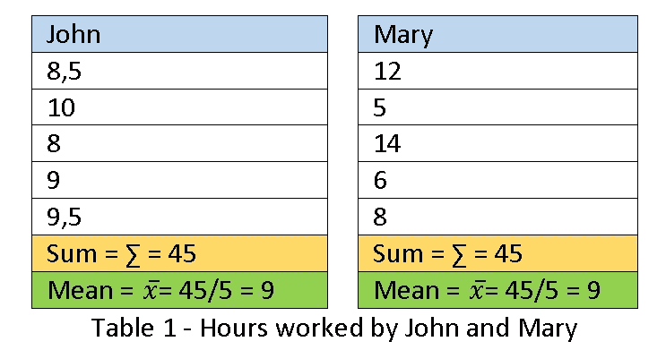

很容易注意到，9 小时的值*不是 Mary 每周工作时间的有效代表值，*但是可以真实地代表 John 的平均工作时间。根据要进行的分析，如果我们只使用值= 9，我们可能会得出错误的结论！约翰每天“大约”工作 9 个小时，而玛丽有一天只工作 5 个小时，但有一天她工作了 14 个小时！值 9 没有揭示玛丽工作条件中可能存在的独特性。

请注意，我们处理的是极少量的数据。例如，如果我们在几个月或几年的时间里与几千名工人打交道，我们如何分析每个工人的特点？答案是:我们有**汇总**数据！找到显示这些特性的系数！

为了总结数据，我们使用位置的**度量**(平均值、中值和众数)和离差的**度量**(振幅、平均偏差、方差和标准偏差)。

让我们来看看事实吧！

如果我们使用约翰和玛丽的小时值，并以**幅度**将它们分布在一个时间范围内，其中最高值是最大小时数，最小值是最小小时数，我们会得到如下图。

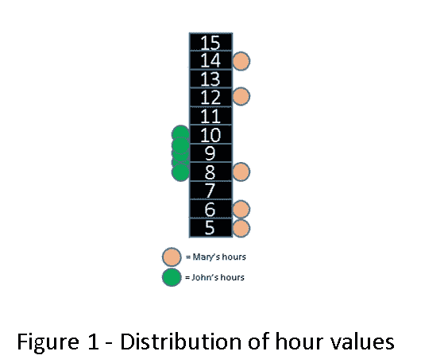

请注意，John 的时间集中在数字 9 附近(正好是我们的平均值)，而 Mary 的时间则分布在刻度上。这就是我们所说的**散射。玛丽比约翰分散得多。但是我们必须有机制来评估某些数据的分散性，而不必像上面那样单独地可视化这些值。我们用度量的离散度来做这件事。**

我们首先计算 John 和 Mary 的最高小时值和最低小时值之间的差异。对于约翰，我们将有:10–8 = 2，对于玛丽，我们将有 14–5 = 9。玛丽的变化比约翰大得多。对于这个差值(最大值—最小值)，我们称之为**振幅**。

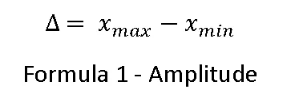

我们已经能够用一个指标来评估时间的变化。对于约翰，我们有∈= 2，对于玛丽，我们有∈= 9，这表明玛丽的变化比约翰大得多。

但是我们有一个问题！振幅忽略除最大值和最小值以外的所有值。想象下面的两个场景。

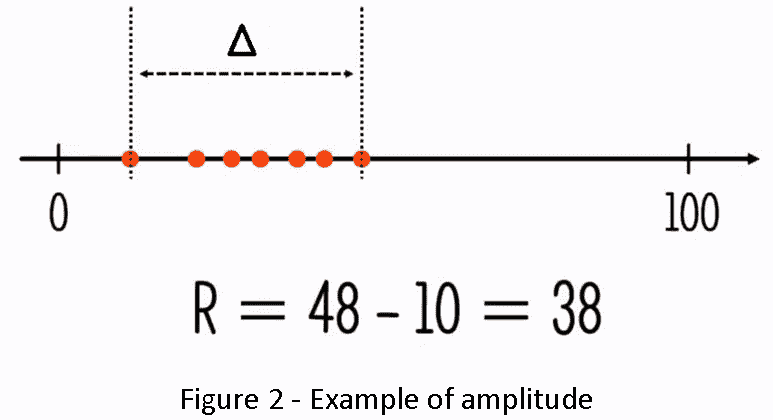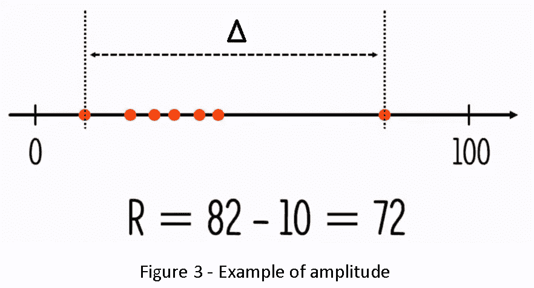

在图 3 中，振幅不再代表一个可靠的值，因为我们有一个曲线外的值，一个**异常值。**这甚至会对平均值产生很大影响，并忽略最大值和最小值之间的所有值。

为了解决这个限制，让我们做以下事情:测量每个值和平均值之间的距离。这样我们就可以测量两者的逐值变化。

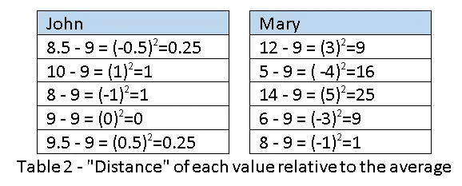

表 2 显示了每个值与平均值之间的差异。从这个结果我们会有一些负值。我们可以得到每个值的模来消除负值。但这将在未来的数学操作中给我们带来一些成本。然后，我们选择对每个值进行平方，以消除负值。

之后，我们对这些值求和并除以值的数量，在我们的例子中是 5(让我们称这个数量的值为 n)。

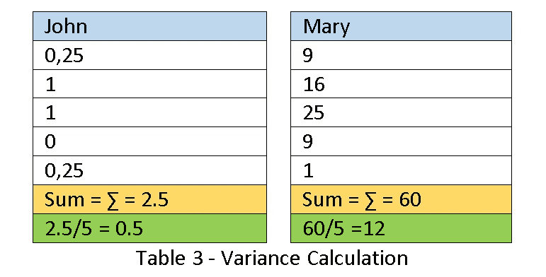

这些值我们称之为**方差(S2)** 。同样，我们可以看到玛丽的方差(S2 = 12)比约翰的方差(S2 = 0.5)高得多。到目前为止，我们所做的一切都可以用下面给出的方差公式来总结。

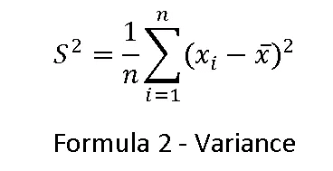

但我们还有另一个问题:如何解读这些数字？这意味着约翰的工时方差 S2 = 0.5，玛丽的工时方差 S2 = 12？这两个值本身并不能告诉我们太多。我们能得出的唯一结论是，玛丽的时间比约翰的时间变化大得多。

我们需要找到一个数字，它给出了数据集之间的绝对比较项。除了被告知一个比另一个变化更大，还要告诉我这个变化有多大。

提取方差的平方根我们得出一个著名的指标叫做**标准差**(用 **s** 表示)。

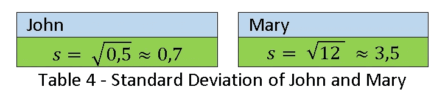

这已经是一个稍微重要一些的数字了。他告诉我们这些值离他的平均值有多远。高标准偏差意味着数据的高可变性。它是一个更接近待评估值的数字。更重要。标准差就是下面的公式。

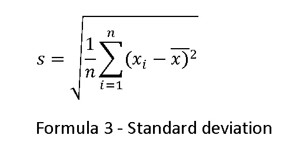

但是标准差仍然不是我们需要的数字。最后，我们还需要寻找最后一个值。如果我们将标准差除以 n(观察值的数量)会怎么样？然后我们将拥有:

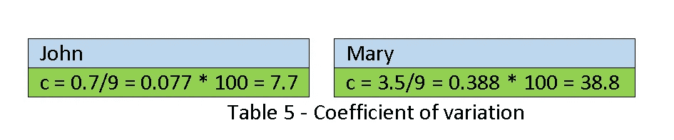

从上表中，我们得出结论，John 的值相对于平均值有 7.7%的变化。玛丽有 38.5%的变异。也就是说，John 的小时值比 Mary 的小时值更接近平均值。现在，对于任何数据集，我们都有了一个可靠的变异指标。变异系数是我们一直在寻找的指标。注意平均值的重要性，这是我们开始整个过程的地方。

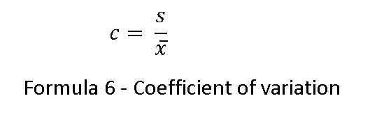

**结论**

在本文中，我们看到了一个评估数据样本分布的重要指标(变异系数)。从这个指标，我们可以推断采取什么样的行动来评估这些数据。由于相对于平均值有近 40%的变化，在数据评估过程中，Mary 的工作时间不能以与 John 的工作时间相同的方式进行评估。在数据分析的过程中，他们会采取不同的方向。

但是在大量的数据中，我们如何自动生成每个信息的变异系数呢？Python 编程语言在其 NumPy 库中有 *describe()* 命令*。*这个单一的命令给我们带来了所有数值字段数据样本的数值个数、均值、标准差、最低值、最高值甚至所有四分位数！这是开始数据探索的一个非常强大的命令。

读者可以通过 Python 获得这些值。我还建议在下次阅读时学习四分位数、频率表和直方图的概念。

下次见！

瓦格纳·比莱拉

计算机专业毕业，数学专业毕业，ITIL v3 *基础认证，Nova tendência Consultoria*系统分析师，喜欢数据科学。

**参考书目**

马科斯·纳西门托·马加良斯。**概率和统计的概念**。第 7 版。圣保罗:教育战略计划，2010 年。

分析 Vidhya。**2020 年成为数据科学家的综合学习路径课程**。可查阅[https://courses . analyticsvidhya . com/courses/a-comprehensive-learning-path-to-be-a-a-data-scientist-in-2020。【2020 年 5 月 2 日进入。](https://courses.analyticsvidhya.com/courses/a-comprehensive-learning-path-to-become-a-data-scientist-in-2020.)