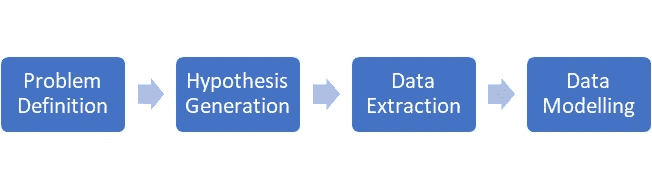

# 数据科学生命周期简介

> 原文：<https://medium.com/analytics-vidhya/an-introduction-to-data-science-lifecycle-c0b0d2c49ee5?source=collection_archive---------13----------------------->

数据科学的过程不仅仅是预测建模、数据清理和数据可视化。数据科学的最终目标是为组织和整个社会创造价值。首先定义目标或我们应该从数据科学过程中获得什么，然后提出假设以深入了解影响我们结果的各种因素，接下来是数据提取、数据预处理和建模。

下面是一个简单的流程图来总结这个旅程。让我们深入了解每一个细节。

数据科学生命周期

# 问题定义:

问题定义就像目标设定。就像生活一样，如果不定义成功/最终目标是什么，你就无法在数据科学项目中取得成功。有时，根据业务成果的不同，同一参数可能有不同的解释。

例如，如果花在应用程序上的时间对网飞来说更多，这意味着人们越来越喜欢你的应用程序。然而，对于亚马逊来说，同样的事情可能意味着加载页面需要时间，或者用户无法找到他们需要的产品或缓慢的支付网关，这可能导致客户流失。相同的参数对不同的业务会有很大不同的影响。

重要的是要记住，识别问题是解决问题的非常重要的一步。错误地定义问题会导致不必要的努力。数据科学家的工作是深入客户的细节，以识别业务问题，并将业务问题转化为数据问题，通常以等式的形式。

例如，假设我们的客户是一家银行，核心问题是提高存款金额。

**押金=∑客户 _ 余额*(1+投资回报率)——(成本 _ 营销+∑员工 _ 薪资)**

在哪里，

*   roi: %利率(例如 8% = 0.08)
*   employee_salary:每个员工的薪金
*   customer_balance:每个客户的余额
*   成本 _ 营销:获得新客户或保留现有客户的营销成本。

# 假设生成:

如果问题定义阶段是关于确定要解决什么问题，假设生成阶段是关于找出可以做什么来找到解决方案或查明问题的根本原因。一个问题可能有数百种假设，事实上这很常见。在数据科学生命周期的这个阶段，没有什么问题是愚蠢的。

根据问题的不同，假设被分成不同的部分。例如，零售链中的产品销售可以归因于人口统计、季节趋势、竞争对手甚至心理因素。这一步在查看数据之前完成，以避免人为偏见。

有一个零假设和一个替代假设，其中一个假设被数据和统计证明是正确的。

维基百科将无效假设定义为

> 在推断统计学中，零假设是一种一般性的陈述或默认立场，即没有新的事情发生，如群体之间没有联系，或两个测量的现象之间没有关系

维基百科将替代假设定义为

> 在统计假设检验中，替代假设是一种立场，表明某事正在发生，一个新的理论是正确的，而不是一个旧的理论。

验证假设有时就像看一个可视化图像一样简单，如下面的两个例子所示。

图(1):验证零假设的箱线图

图(2):直方图和条形图拒绝零假设

图(1)和图(2)的图像来源:[分析 Vidhya](https://courses.analyticsvidhya.com/courses/structured-thinking-and-communication-for-data-science-professionals)

# 数据提取:

下一步是数据提取。我们选择数据，如果它成功地检查了以下各点的所有方框

1.  **数据的清洁**:虽然我们在建模之前执行数据清洁，但是我们应该确保通过正确选择数据集来最小化这些工作。
2.  **历史数据的可用性**答:所需时间段的数据应该是可用的。
3.  **结构兼容性**:待执行的数据分析应与可用数据兼容。例如，如果大部分可用数据是主要由数字值构成的结构化表格，就不值得对一些社交媒体评论进行文本分析。
4.  **费用**:获取数据的金钱和时间不应超过组织期望从数据中获得的收益。
5.  **依赖**:数据源不应该不可靠。我们在可用数据上检查我们的模型的有效性，但是该模型是在真实世界的数据上部署的。我们的模型不应该基于与我们期望在现实世界中看到的不相似的数据来训练。

# 数据建模:

任何建模过程的第一步都是决定目标变量。如果目标变量是实值的(连续的),我们使用回归技术，如果目标变量是确定的类别，我们使用分类技术。对于回归和分类，我们使用评估标准来衡量有效性。你可以参考[这篇](https://www.analyticsvidhya.com/blog/2019/08/11-important-model-evaluation-error-metrics/)文章了解更多信息。

*   [每个人都应该知道的机器学习的 11 个重要模型评估指标](https://www.analyticsvidhya.com/blog/2019/08/11-important-model-evaluation-error-metrics/)

建模的下一步包括将可用数据采样到训练和测试数据集中。然后，我们训练该模型，并在测试集上测量其有效性。然后将模型投入生产，以收集数据见解或提供一种功能，如向用户提供[建议](https://en.wikipedia.org/wiki/Recommender_system)。下面是整个过程的流程图。

数据建模的过程

# 结论:

在本文中，我们看到了数据科学的过程以及该过程每个阶段所涉及的步骤。我们没有详细讨论数据提取和建模。这些都是庞大的主题，每个主题都需要一篇文章来涵盖细节。在本文中，我试图解释一个数据科学项目的完整生命周期。希望对你有所帮助。