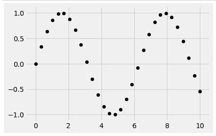
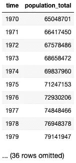
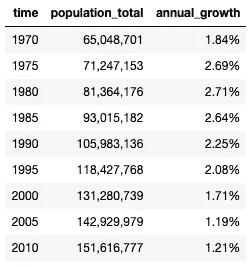
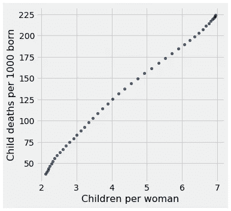

# Python 数据科学简介

> 原文：<https://medium.com/analytics-vidhya/an-introduction-to-data-science-with-python-bf26960f7afc?source=collection_archive---------24----------------------->

在大数据时代，聚合和可视化海量数据可以让我们发现无法预料的结论；这是数据科学的前提。

**什么是数据科学？**

数据科学允许我们通过跨学科的手段，包括科学方法、流程、算法和系统，从许多结构化和非结构化的数据集中提取知识和见解。

**用 Python 介绍数据科学**

在当今充满数据的世界中，数据科学应运而生，它将统计和计算工作结合起来，以解释数据并将其应用于日常场景。这可以包括机器学习、大数据、人工智能和数据挖掘。因此，数据科学在烘焙、金融、运输、电子商务、教育、卫生和其他行业变得越来越普遍。

Python 是一种通用的编码语言，可用于后端开发、软件开发和数据科学等领域。因为这种编程语言是可访问的、可移植的，并且可以在 Mac、Windows 或 Unix 上运行，所以 Python 在一些公司和大学中越来越受欢迎。事实上， [2019 年 Kaggle 机器学习和数据科学调查](https://www.kaggle.com/c/kaggle-survey-2019)报告称，87%的数据科学家经常使用 Python。

**使用 Python 进行数据科学**

Python 拥有几个专门的库，对于数据操作和分析特别有用，这使得它对于初学者和专业人士来说都是一个灵活且易于访问的选择。一些常用的 Python 库包括 Pandas(它允许在称为 Dataframes 的高层操作和构造数据)和 NumPy(它允许创建和操作多维数组)。其他用于数据可视化的专门库包括 Matplotlib(用于制作绘图)和 Seaborn(提供了创建引人注目的统计图形的接口)。最后，一个强大的机器学习库 Scikit-Learn 允许程序员实现各种算法来进行数据挖掘和分析。

**入门**

将数据加载到程序中是第一步。我们可以通过使用 Python Pandas 库中的 read_csv()函数来实现这一点。

```
import pandas as pd
data = pd.read_csv("file_name.csv")
```

将数据加载到程序中后，我们可以探索数据并挑出数据中的不规则之处。这称为清理数据。通过删除或替换具有空值的单元格甚至行中的值，我们可以使我们的图形更具代表性。例如，我们可以用特定列的平均值替换某个空值。

现在，我们如何找到这些值呢？我们可以进行数据辩论:收集关于数据集的有意义和精确的信息，以揭示更具体的信息。

```
data.describe()
data.isnull().sum() #to check for null values
df=data.dropna() #to drop the null values
df.isnull().sum() #to check that null values are dropped
```

这将输出某一列中 null 值的数量，这使我们能够了解每个特定列中存在的数据。

让我们将数据可视化。通过创建折线图、散点图、箱线图等，我们可以分析数据中出现的特定频率和模式。Python 库 Matplotlib 允许我们用不同的图形类型可视化数据集。例如，散点图使我们能够可视化两个变量之间的关系，并得出一个变量如何影响另一个变量的结论。它有助于以直观的方式显示非线性模式和数据流范围(最大值和最小值)。

下面的代码片段和散点图是正弦函数。正弦散点图显示 y 值在最小值和最大值之间波动。

```
import matplotlib.pyplot as plt
import numpy as np
x = np.linspace(0, 10, 30)
y = np.sin(x)
plt.plot(x, y, 'o', color='black');
plt.scatter(x, y, marker='o');
```



散点图通常用于确定两个变量之间的相关性，可视化两个数据集之间的相关性，或可视化成对的数值数据等。例如，下表显示了某个国家从 1970 年到 2010 年的人口数据。数据集来自皮尤研究中心。



我们可以计算每 5 年的人口年增长率。



为了从这个数据集中了解更多信息，如果我们观察两个特定变量——每名妇女的孩子数和每 1000 名新生儿的死亡率，我们可以使用散点图来可视化这两者之间的相关性。在我使用的示例数据中，我们看到以下散点图:



散点图直观地显示了这两个变量之间的正相关关系，这意味着，随着该人群生育率的增加，儿童死亡率也以线性方式增加。通过将特定变量与散点图进行比较，我们可以发现相关性，这种相关性可以从大约个数据集得出以前未发现的见解。

这仅仅是 Python 可能实现的大量数据科学应用的开始！我计划用 Python 探索预测、机器学习和分类，并在未来的博客中分享我的发现。