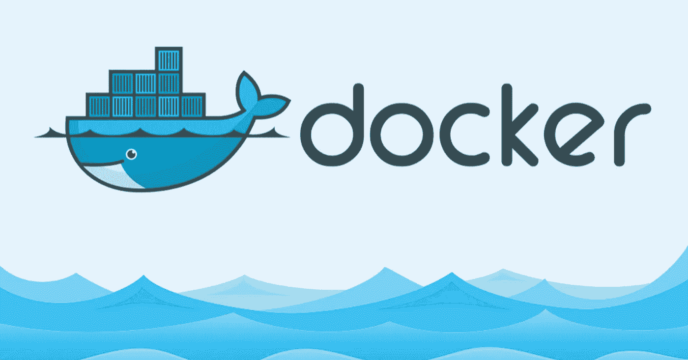
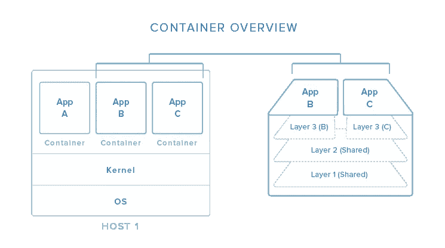

# Docker 简介

> 原文：<https://medium.com/analytics-vidhya/an-introduction-to-docker-17091465283a?source=collection_archive---------26----------------------->

Docker 是一个容器化平台，旨在简化和标准化各种环境中的部署，它在很大程度上促进了这种服务设计和管理风格的采用。大量的软件已经被创建来构建分布式容器管理的生态系统。

Docker 提供了管理容器生态系统的平台。Docker 使容器的创建和管理变得简单，并与许多开源项目集成。

上面的图片显示了容器如何隔离不同的应用程序并使用 docker 定义的操作系统资源。容器可以通过分层构建，多个容器共享底层，从而减少资源使用。

容器看起来类似于虚拟机，但它与 VM 有很大的不同，因为它不关心使用什么操作系统。启动时，虚拟机需要很长时间才能启动，因为客户操作系统需要从头开始，然后加载所有的二进制文件和库。这非常耗时，而且在需要快速启动应用程序时，成本会非常高。在 Docker 容器的情况下，由于容器运行在您的主机操作系统上，我们可以节省宝贵的启动时间。这是一个明显优于虚拟机的优势。

容器是高效的，因为它们共享相同的操作系统。然而，一些组织喜欢虚拟机而不是容器，因为它们可以有许多操作系统。对 Docker 的其他投诉包括:

1.  构建和部署缓慢且不可预测
2.  一些 Docker 的支持者提倡将数据放入容器中，这种做法会使数据难以备份或克隆
3.  它有一个敏感且不可预测的命令行界面
4.  安全性弱于虚拟机

Docker 允许将所有依赖项打包到应用程序中，这提供了从开发到部署的无缝过渡。Docker 设置的最初努力将很快补偿它的努力，并且它将允许我们随着项目的成熟而逐渐改进。

既然您已经读到这里，我希望这对您有所帮助。如有任何疑问，您可以通过[**LinkedIn**联系我](https://www.linkedin.com/in/vibhor-bhatia-26ab0710a/)

# 额外资源

这里是整篇文章中提到的一些有用的资源，查看一下可能会有帮助。

1.  【https://docs.docker.com/get-started/overview 
2.  [https://docs . Microsoft . com/en-us/virtual ization/windows containers/about/containers-vs-VM](https://docs.microsoft.com/en-us/virtualization/windowscontainers/about/containers-vs-vm)
3.  [https://www . digital ocean . com/community/tutorials/the-docker-ecosystem-an-introduction-to-common-components](https://www.digitalocean.com/community/tutorials/the-docker-ecosystem-an-introduction-to-common-components)
4.  https://www.docker.com/resources/what-container