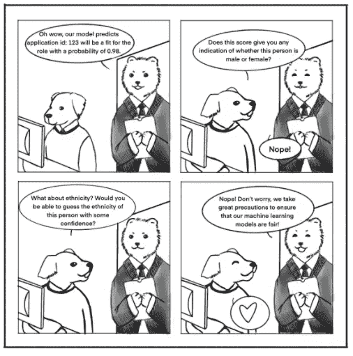
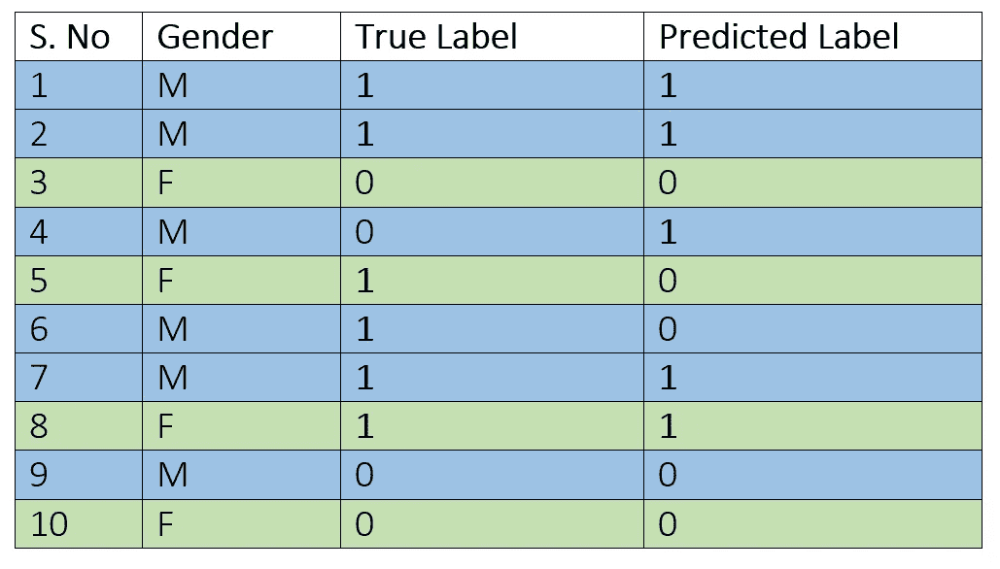
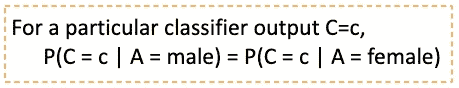
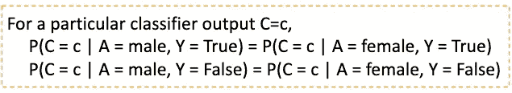
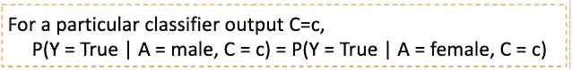
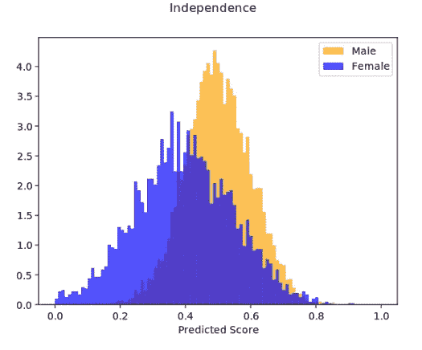
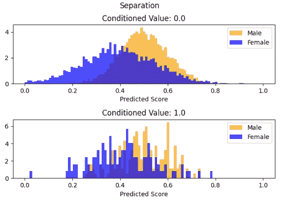
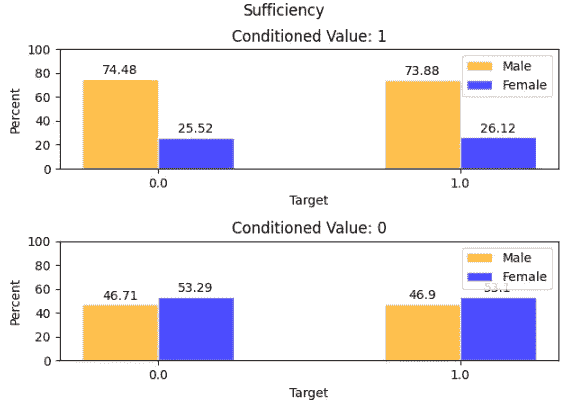

# 机器学习中的公平性导论

> 原文：<https://medium.com/analytics-vidhya/an-introduction-to-fairness-in-machine-learning-62ef827e0020?source=collection_archive---------4----------------------->

# 目标

# 介绍

机器学习(ML)支持的基本原则是“通过实例学习”。更清楚的是，一堆数据被输入到机器学习模型中，它试图揭示这些数据中的模式，以掌握手头的任务。然而，对于模型应该或者不应该寻找什么样的模式，没有给出明确的指示。一个直接的结果是，很多时候，模型最终学习了不需要的假设。具体来说，数据驱动的决策只有在数据基础上才是可靠的。

机器学习模型在敏感的决策过程中根深蒂固，如招聘决策、贷款审批、选择潜在客户等。最重要的是，这些模型没有偏见，公平地对待每个人。例如，来自 T2 国家妇女信息技术中心的数据显示，只有 26%的计算机职业由女性担任。此外，只有非洲裔美国妇女仅占这一数字的 3%。显然，基于这些数据的模型将会了解这些偏见，并且不必要地惩罚少数民族，尽管他们有资格扮演这个角色。因此，采用技术来测量和消除机器学习模型中的偏差的重要性怎么强调都不为过。

我读过很多关于机器学习模型中偏差测量方法的文章。然而，他们中没有一个人能够以易于理解的直观方式解释这些概念。这促使我写了这篇文章，希望打破其中的一些概念，并鼓励对这一领域的更多兴趣，因为它在不久的将来会非常流行。我们真的不希望机器学习延续我们的社会偏见——好事变坏事！

# 受保护/敏感属性

以下是评估偏见的一些最常见的属性:

*   性别
*   种族划分
*   宗教
*   年龄
*   婚姻状况
*   公民身份；公民资格

这些被称为敏感或受保护的属性，因为一个人的机器学习模型不应该对它们有偏见。根据您选择包含在模型中的特性，可能有更多的特性。这直接将我们带入代理属性的下一个重要概念。在训练之前简单地从你的数据中删除这些敏感的属性会使模型无偏吗？遗憾的是，答案是否定的。这是因为某些属性隐含着这些敏感属性中存在的偏见。例如，已经表明，邻里和邮政编码带有与种族相同的偏见，使它们成为种族的代理属性。此外，根据手头的问题，这些属性不能总是被删除。因此，为了验证他们的模型是无偏的，人们总是要进行公平性测试。

# 测量偏差

好了，现在是有趣的事情！我们实际上如何调查一个模型是否有偏差？衡量这一点有三个标准——独立、分离和充分。根据我的观点，理解这些标准的最好方法是使用一个直观的例子，而不是试图用一个通用的公式，特别是带有条件和独立符号的公式(yeesh！).鉴于我是一名应届毕业生，我决定将大学录取决定作为我的例子的基础。下面是我为了展示一些快速计算而生成的表格。

选择的敏感属性是性别，可以呈现男性和女性的值。标签 1 表示“你已经足够好了！”0 代表“你已经足够好了”。该模型试图复制申请人筛选流程，因此，预测标签描述了如果我们用该模型替换当前流程，谁将被接受或拒绝。

我还将陈述满足这些标准的等式，这些标准适用于二进制敏感属性，并且很容易扩展。将使用以下符号:

*   **一个**敏感/保护属性
*   **C** =C(X，A)是学习过的分类器
*   **Y** 目标变量

## 独立性-结果/选择的平等

*例:男女录取率应该是一样的！*

看上面的例子，我们可以算出，男性的录取率是 4/6 = 66.67%，而女性的录取率是 1/4 = 25%(用预测标签计算)。然而，为了满足独立性标准，男性和女性的选择率应该相同。此外，如果我们计算用于训练模型的数据的接受率，男性的接受率是 4/6 = 66.67%，女性的接受率是 2/4 = 50%。换句话说，为了满足独立性标准，大多数时候我们无法实现完美的模型(具有 100%准确性的模型)，因为训练数据不符合标准。

从统计学上来说，分类分数应该独立于敏感属性。对此的另一种解释是，在分类器分数和敏感属性之间应该没有交互信息。

通式，

## 分离-误差相等(给定阈值的结果相等)

*举例:尽管具备足够的录取资格(假阴性)，但男性和女性的拒绝率应该是一样的！*

这是对分离规则的一点放松，因为它没有提到假阳性率应该是相同的，但是它得到了概念的关键。该标准提倡“相似的人应该得到相似的对待”的概念，即一旦我们有了一组我们知道足够合格的候选人，在选择这些候选人的子集进行录取时就不应该有任何偏见。

将分离视为误差相等的度量是有用的。换句话说，每组预测假阳性和假阴性的机会应该是相同的。在上述数据中，男性的假阴性率= 1/4 = 25%，女性的假阴性率为 1/2 = 50%。因此，该模型不符合分离标准。

这个标准的一个优点是仍然有可能学习一个完美的模型。如果一个模型具有 100%的准确性，这意味着该模型满足分离标准。

通式，

分离可能比独立更可取的原因之一是因为在敏感特性和目标变量之间可能存在某种相关性。例如，某家公司可能会声明，根据某些衡量标准(CLV(客户终身价值)、违约率等)，从不同群体中选择不同比例的客户是一种业务需要(无法满足独立性标准)。然而，分离只允许与目标变量的程度相关，即在应被选择为客户的人群中不应有偏见。

## 充分性-选择反映每组相同的准确度(校准)

例:给定录取决定(预测变量)，男性和女性足够合格的机会应该是相同的！

该标准确保敏感属性和目标变量 Y 与上下文无关。换句话说，给定一个分数，真实变量为 1 的概率对于每个组应该是相同的。在我们的例子中，这意味着返回的候选人是否应该被接受的预测准确地反映了候选人的资格。如果男性和女性是一样的，那么我们可以有把握地说，我们的模型能够正确地学习什么是一个好的候选人，而没有性别偏见。

这个标准也有完美模型被学习的可能性。我们将在进行任何计算之前介绍充分性公式，因为充分性没有其他两个条件直观。

在示例数据中，

P(Y = 1 | c=1，A =男性)= = 75%；P(Y=1 | c=1，A =女性)= 1/1 = 100%

这些概率表明不符合充分性标准。这些数字让我们得出结论，与女性相比，该模型并不像预测男性的适当资格那样准确，这意味着该模型偏向于男性。纠正这一点符合学院的利益，因为它接受了更多合格的学生。

# 实用可视化

为了将这些概念带回家，我手工创建了一些图表来阐明这些标准在实践中的视觉效果。让我们再次假设这些结果来自一个二元分类器，其中受保护的属性是具有值男性和女性的性别。在大多数情况下，机器学习模型的输出返回分数表明其对正面类的偏好，即我们没有如上述示例中所示的预测标签，而是预测分数。我们希望确保基于上述标准的定义，受保护属性的每个值的这些预测分数的分布几乎是不可区分的。为了决定分布是否足够相似，您可以选择一个基于您想要满足的属性的统计测试。

为了使该模型满足独立性标准，预测分数的男性和女性分布应该非常相似。

分离要求我们对每个目标标签进行条件化，因为在我们的示例中有两个，所以我们得到两个不同的图形。为了满足分离，每个条件值内的男性和女性分布应该非常相似。

可视化充分性稍微复杂一些，因为它取决于预测分数，而预测分数是一个连续的随机变量。为了创建这个图表，我将分数分为 0 和 1 两类，0 表示较低的 50%分数，1 表示较高的 50%分数(分位数宁滨)。解释这个图表非常简单，它显示了当预测分数的装箱值分别为 0(低)和 1(高)时，具有真值 False 和 true 的男性和女性的百分比。

在这些图表中，很容易观察到这个模型偏向于男性。

# 公平的不可能性定理

我如何决定选择哪个标准？我能满足多个吗？这是理解了这三个标准后，脑海中浮现的一些问题。首先要认识到的是，只有三个标准中的一个可以得到满足，除非是敏感属性和目标变量之间没有任何相关性的情况(也称为退化/冗余情况)。我将不包括这篇文章的证明，因为我认为它对于理解如何测量模型中的偏差并不重要。然而，鉴于这一结果，数据科学家根据他们试图解决的问题选择正确的标准来满足要求变得非常重要。

# 接下来呢？

太好了！现在，您已经对机器学习模型中的测量偏差有了基本的了解，您可能想知道如何在这一领域取得进一步的进展？我已经编辑了一个资源列表，虽然是随机的，但应该可以帮助你确保你的机器学习模型的公平性！

*   一门关于机器学习公平性的伯克利课程
*   在我看来，介绍这个话题的最好的书是[公平和机器学习](https://fairmlbook.org/)
*   [监督学习中的机会均等](https://arxiv.org/abs/1610.02413)，一篇深入研究每一项标准的研究论文
*   AIF360 ，一个用于检测和减少偏差的 API，有 Python 和 R 两种版本
*   [Fairlearn](https://github.com/fairlearn/fairlearn) ，另一个用于偏差评估的 Python 包

*我非常感谢我在 Vanguard 的导师 Geoffrey Schneider 给了我宝贵的反馈，也非常感谢 Belinda Li 在文章开头画了这幅漫画。*