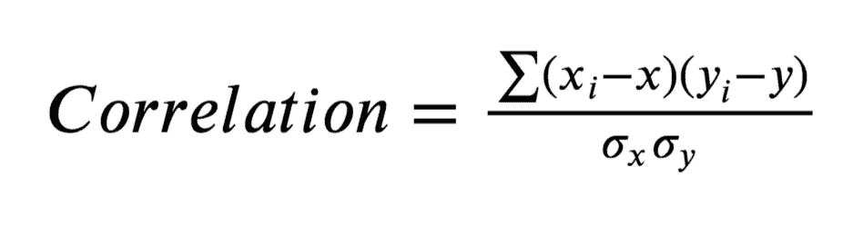
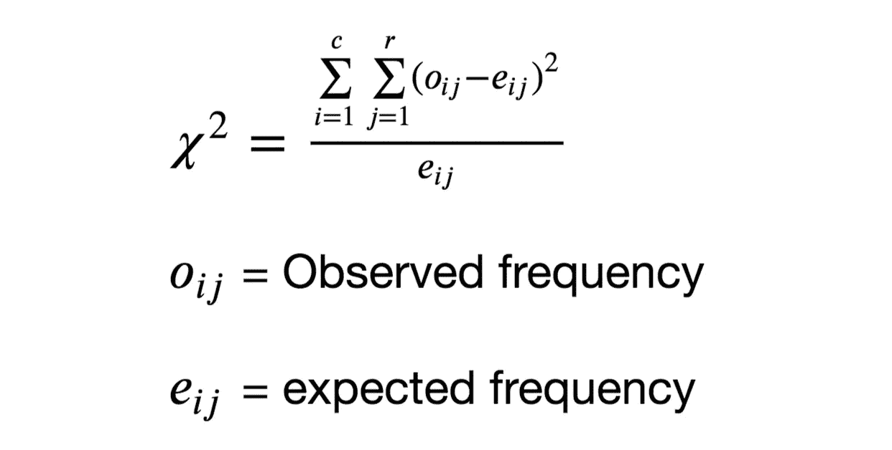
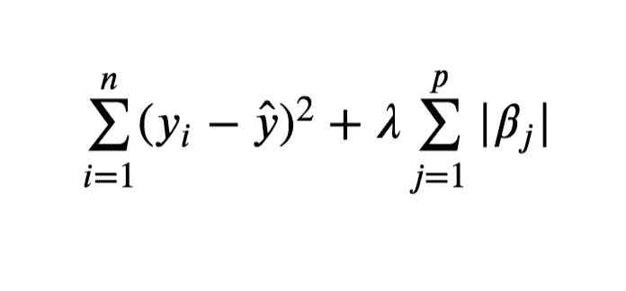

# 机器学习中的特征选择技术

> 原文：<https://medium.com/analytics-vidhya/an-introduction-to-feature-selection-in-machine-learning-9d6f2d5e47?source=collection_archive---------14----------------------->

## 面临过拟合和低精度的问题？特征选择来拯救

亨特·哈里特在 [Unsplash](https://unsplash.com?utm_source=medium&utm_medium=referral) 上的照片

# 降维

*   降维是减少数据集中可用特征集的过程。
*   该模型不能直接应用于整个要素集，这可能会导致虚假预测和概化问题，进而使模型变得不可靠。
*   为了防止这些问题，应用了降维。

# 需要降维

降维可以防止过度拟合。

*   过度拟合是指模型记忆了数据而无法进行归纳。灵活的模型(如决策树)和高维数据也可能导致过度拟合。
*   由于泛化的问题，过度拟合的模型不能应用于现实世界的问题。

# 降维的类型

*   **特征选择**:特征选择方法试图通过丢弃最不重要的特征来减少特征。
*   **特征提取**:特征提取方法试图通过组合特征并将其转换为指定数量的特征来减少特征。

# 特征选择

1.  过滤方法
2.  包装方法
3.  嵌入式方法
4.  特征重要性

# 导入所需的库

# 加载预处理的数据

训练数据已经过预处理。所涉及的预处理步骤是，

1.  老鼠归罪
2.  对数变换
3.  平方根变换
4.  顺序编码
5.  目标编码
6.  z 分数标准化

关于上述步骤的详细实现，请参考我的 Kaggle 数据预处理笔记本:

[笔记本链接](https://www.kaggle.com/srivignesh/data-preprocessing-for-house-price-prediction)

# 特征选择

# 1.过滤方法

过滤方法选择独立于所用模型的特征。它可以使用以下方法来选择一组有用的特征，

*   数字列的相关性
*   类别列的 Chi2 关联

# 在 sci-kit learn 中选择 K 最佳

**F _ 回归:**

F_Regression 用于数值变量。f _ 回归由两个步骤组成:

*   使用每个特征与目标计算相关性。
*   然后，这种相关性被转换成 F 值，再转换成 p 值。

相关公式

**Chi2:**

*   Chi2 用于测试分类变量之间的关联。

Chi2 公式

# 2.包装方法

包装器方法利用估计器来选择一组有用的特性。可用的技术有，

*   递归特征消除
*   递归特征消除交叉验证

# 递归特征消除(RFE)

*   提供给 RFE 的估计器将权重分配给特征(例如，系数)，RFE 递归地消除被分配了低权重的特征子集。
*   用初始特征集训练估计器。估计器可能具有 coef_ 或 feature _ importances _ 等属性。利用估计量属性，我们可以找到每个特征的权重。
*   从当前要素集中移除权重最小的要素。在移除的集合上重复该过程，直到最终达到要选择的指定数量的特征。

# 递归特征消除交叉验证

*   RFECV 与 RFE 非常相似，但它在每个训练阶段都使用交叉验证，并最终输出要选择的最佳列数。

# 3.嵌入式方法

嵌入式方法在训练过程本身中选择特征。

*   当特征的重要性低时，特征的系数变为零，因此该特征不用于进行预测。

# 套索回归

套索代表最小绝对收缩和选择操作符

套索成本函数

λ =惩罚(调谐参数)

当λ = 0 时，没有参数被消除，当λ = 1 时，它等于线性回归。

*   通过最小化该成本函数来找到参数估计。
*   当系数估计值小于λ/2 时，系数变为零。

# 4.特征重要性

在将模型拟合到为每个特征分配权重的整个特征集之后，计算特征重要性。

*   该模型可能具有诸如 coef_ 或 feature_importances_ 之类的属性，这些属性有助于选择特征子集。使用这种方法，最不重要的特征被删除。

# 从 sci-kit 学习中的模型中选择

**在我的 Kaggle 笔记本里找到这个帖子:**[https://www . ka ggle . com/srivignesh/feature-selection-techniques](https://www.kaggle.com/srivignesh/feature-selection-techniques)

**参考文献:**

[1] M. Ramaswami 和 R. Bhaskaran，[教育数据挖掘中的特征选择技术研究](https://arxiv.org/pdf/0912.3924.pdf) (2009)

*在*[*LinkedIn*](https://www.linkedin.com/in/srivignesh-rajan-123569151/)*，*[*Twitter*](https://twitter.com/RajanSrivignesh)*上联系我！*

## 谢谢你！