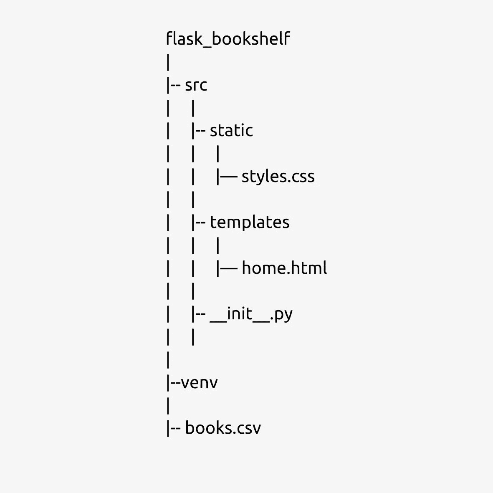
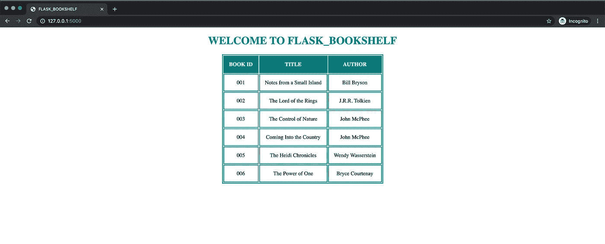

# Flask 简介:一个微观框架

> 原文：<https://medium.com/analytics-vidhya/an-introduction-to-flask-a-micro-framework-f8b3d789e2a3?source=collection_archive---------23----------------------->


你好。考虑使用 python 开发 web 应用程序？也许你一定在寻找一个框架，或者如果你没有意识到的话，一个*框架*是一段代码，它使开发者的生活变得更容易。它让开发人员专注于应用程序的高级功能，并通过提供一些可重用或可扩展的代码来自行处理低级功能。在本文中，我将讨论一个这样的框架，它是为用 python 创建 web 应用程序而设计的，名为 **FLASK** 。

# **什么是烧瓶？**

根据 Flask 的官网介绍，这是一个 python 微框架。就 micro 而言，这并不意味着它的功能更少，或者整个应用程序应该适合一个单独的 python 文件(尽管我们将看到这是可能的)。这是一个高度可扩展的框架，社区提供了许多扩展，但其思想是保持核心简单。默认情况下，Flask 不包含数据库抽象层、表单验证等功能。但是这些可以通过使用扩展来添加。

在本文中，我们将了解如何开始使用 Flask，并创建一个非常基本的图书列表应用程序。(姑且称之为 Flask _ 书架)

在跳转到应用程序之前，我将首先讨论一些基本概念，如在您的计算机上安装 Python，创建虚拟环境(建议更好地管理项目的依赖关系)以及安装 Flask。让我们一个一个来看:

# **安装 Python**

您可以访问 python 的官方网站([https://www.python.org/downloads/](https://www.python.org/downloads/))下载与您正在使用的 OS 对应的最新稳定版 python 安装程序并进行安装。

使用 ***python —版本*** 验证是否安装成功。

# **创建并激活虚拟环境**

虚拟环境是一组 python 库，每个项目一个。建议在虚拟环境中工作，因为不同的项目可能需要不同版本的 python 或 python 依赖项，并且在一个项目中使用一个版本的库可能会破坏其他一些项目的兼容性。

请注意，我在整篇文章中都使用 python 3，默认情况下，python 3 使用“venv”模块来创建虚拟环境。但是如果你使用 python 2，你必须安装一个额外的名为“virtualenv”的模块来创建一个虚拟环境。您可以查看[烧瓶安装](https://flask.palletsprojects.com/en/1.1.x/installation/)的官方文件，了解更多详细信息。

要遵循的步骤:

*   创建项目目录。在这里我把它命名为*烧瓶 _ 书架*

```
$ *mkdir flask_bookshelf*
```

*   将您的工作目录更改为刚刚创建的目录

```
$ *cd flask_bookshelf*
```

*   创建一个名为“venv”的虚拟环境。你想叫它什么都可以。

```
$ *python3 -m venv venv*
```

(注意，它将在根目录下创建一个 venv 目录)

*   激活环境

```
$ *source venv/bin/activate* **or** $ *. venv/bin/activate*
```

(现在，您会注意到＄( venv)出现在终端的开头，这意味着您处于 venv 激活的虚拟环境中)

# **安装砂箱**

在这里，我使用 PIP 来安装 flask，因此，按照步骤，确保 PIP 安装在您的计算机上。在激活的 venv 中运行以下命令

```
$ *pip install Flask*
```

好吧！我们现在已经准备好了设置，让我们花一点时间来了解我们正在构建什么，我们的*烧瓶 _ 书架*将会是什么样子，我们可以用它做什么。

我们的应用程序将是一个非常基本的图书列表应用程序。为了简单起见，我不打算将它与任何数据库连接，而是使用一个 CSV 文件来存储我们的图书详细信息。在后面的另一篇文章中，我可能会讨论如何将 Flask 应用程序连接到任何 SQL 或 NoSQL 数据库，但是对于这篇文章，我们不使用任何数据库。我也不打算在本文中讨论如何添加、删除或修改书籍的细节。但是我向您保证，在阅读完本文之后，您将对 flask 应用程序的工作原理有一个清晰的概念。

我们将为我们的应用程序创建以下两个端点，这将基本上在网页上显示相同的内容:

```
GET /GET /home
```

我们的项目结构将如下所示:



项目结构

这是 Flask 的基本结构。这里，我们在 src 中有两个目录，即静态目录和模板目录。Static 保存所有静态文件，如样式表、资产(图像、视频、字体等。)在项目中使用等。而 templates 目录保存了将在浏览器上呈现的所有 HTML 页面。

现在让我们开始编码。

在根目录中创建一个名为“src”的目录。基本上，这将容纳我们的整个应用程序。

在 src 目录中创建 *__init__。py* 文件包含以下内容。它将告诉 python src 是一个包，并且它将作为我们应用程序的工厂。

```
# __init__.pyfrom flask import Flaskapp = Flask(__name__) @app.route(‘/’)def home(): return “WELCOME TO FLASK_BOOKSHELF”
```

这是最基础最完整的 Flask app 的样子。要进行验证，请使用以下命令运行此命令:

```
$ *export FLASK_APP=src*$ *export FLASK_ENV=development*$ *flask run*
```

您将在终端中看到类似这样的内容:

```
** Serving Flask app “src” (lazy loading)*** Environment: development*** Debug mode: on*** Running on http://127.0.0.1:5000/ (Press CTRL+C to quit)*** Restarting with stat*** Debugger is active!*** Debugger PIN: 272–048–342*
```

现在，在您的浏览器中进入[*http://127 . 0 . 0 . 1:5000/*](http://127.0.0.1:5000/)*，您将看到欢迎消息，这意味着您的应用程序正在成功运行。*

*现在让我们来理解这段代码和我们用来运行这段代码的命令。*

*   *首先，我们在代码的第一行导入了 FLASK 类*
*   *我们创建了 FLASK 类的一个实例。第一个参数是应用程序的模块或包的名称。这是必要的，这样 Flask 就知道在哪里寻找模板、静态文件等。这就是为什么我们在这里使用了 *__name__* 。*
*   *然后我们使用 *route()* decorator 来设置 URL，这将触发我们的方法 *home()* ，在 flask 中，我们称之为视图。*

*为了运行这个应用程序，我们使用了三个命令。在前两个命令中，我们设置了两个环境变量 FLASK_APP 和 FLASK_ENV。(我使用导出来设置变量，因为我使用的是 Mac OS，对于 windows 使用 set 也是一样)*

*   *设置 FLASK_APP env 变量将确保终端查看我们分配给它的模块/包中的 Flask App 实例。*
*   *FLASK_ENV 是另一个变量，将其设置为“development”将在运行应用程序时启用调试模式。通过在调试模式下运行，您不需要在每次更改时重启或重新运行应用程序，您只需要重新加载浏览器，更改就会自动反映出来。*

*因此，从这里开始，您可以让它保持原样，并遵循其余的编码。*

*设置完这些环境变量后，我们使用*烧瓶运行*来运行应用程序。默认情况下，它在端口 5000 运行服务器。*

*目前，我们的应用程序只显示欢迎信息。让我们修改我们的 *home()* 方法来呈现一个 HTML 模板( *src/templates/home.html* )以显示可用书籍的列表，从一个 CSV 文件( *books.csv* )中读取它。*

```
*# __init__.pyimport csvfrom flask import Flask, render_templateapp = Flask(__name__) def get_books(): books = [] with open(‘books.csv’) as book_file: reader = csv.reader(book_file) for row in reader: books.append(row) return books @app.route(‘/’)def home(): books = get_books()    return render_template(“home.html”, books=books)*
```

*现在请注意，我已经从 python 导入了 csv 模块来读取 *books.csv* 文件。为此，我创建了一个方法 *get_books()* ，它返回一个图书列表(实际上是一个列表列表，其中每个列表包含 book_id、标题和作者)。这是我们的 csv 文件的样子:*

```
*001,Notes from a Small Island,Bill Bryson002,The Lord of the Rings,J.R.R. Tolkien003,The Control of Nature,John McPhee004,Coming Into the Country,John McPhee005,The Heidi Chronicles,Wendy Wasserstein006,The Power of One,Bryce Courtenay*
```

*现在在 home 方法中，我们返回一个叫做 *render_template()* 的东西。Flask 提供了一个方法，它从 template 文件夹中获取一个模板名或一个模板列表，并在调用时将其呈现到浏览器中。在这里，我们通过*home.html*得到渲染。我们还可以向它传递一些关键参数，这些参数将在模板的上下文中可用。这里我把书作为关键论点。我们将看到如何在我们的模板中使用它。*

*所以，现在我们需要我们的模板*home.html*。让我们来创造它。*

```
*<!-- home.html --> <!DOCTYPE html><html lang="en"><head> <meta charset="UTF-8"> <meta name="viewport" content="width=device-width, initial-scale=1.0"> <link rel="stylesheet" href="{{ url_for('static', filename='styles.css') }}"> <title>FLASK_BOOKSHELF</title></head><body> <center> <div> <h1>WELCOME TO FLASK_BOOKSHELF</h1> <table> <tr> <th>BOOK ID</th> <th>TITLE</th> <th>AUTHOR</th> </tr>  <tr> <td>{{ book[0]}}</td> <td>{{ book[1]}}</td> <td>{{ book[2]}}</td> </tr>  </table> </div> </center></body></html>*
```

*仔细研究后，你可能会发现它与普通的 HTML 文件有点不同。例如，我使用了*{ % for books in books % } { % end for % }*来循环从视图中作为参数传递的图书列表。另外，我已经使用了 *{{ book[i] }}* 来访问 book 变量。这实际上是一个 Jinja2 模板特性，flask 使用它来呈现模板。你可以在这里阅读更多关于它的信息。*

*现在只需在浏览器中重新加载页面，瞧！我们在页面上展示了我们的书单。但是看起来很简单。让我们通过添加一个样式表(src/static/styles.css)来使它更吸引人一些。*

```
*/* styles.css */ h1 { color: teal;}table, th, td { border: 2px solid teal; text-align: center;}th, td { padding: 15px;}th { background-color: teal; color: white;}*
```

*重新加载页面，你会看到一个更好更干净的页面。我在这里没有添加很多样式，只是想展示我们如何使用静态目录来添加样式到我们的模板中。我们目前的产量:*

**

*我们的烧瓶 _ 书架运行的输出*

*看起来我们已经完成了图书列表应用程序，但是等等，我们要创建两个端点。记得吗？不要担心，因为我们将为两个端点显示相同的视图，我们不需要做太多，只需在当前路线 *'/'* 下添加 *@app.route('/home')* ，现在 Flask 将为两条路线呈现相同的 *home()* 视图。 *__init__。py* 现在看起来像这样:*

```
*# __init__.py import csvfrom flask import Flask, render_templateapp = Flask(__name__)def get_books(): books = [] with open(‘books.csv’) as book_file: reader = csv.reader(book_file) for row in reader: books.append(row) return books @app.route(‘/’)@app.route(‘/home’)def home(): books = get_books() return render_template(“home.html”, books=books)*
```

*恭喜你！我们已经完成了最基本的图书列表 flask 应用程序。让我们总结一下我们在整个过程中学到的东西:*

*   *使用 python3 中的 venv 模块创建和激活虚拟环境。*
*   *安装烧瓶。*
*   *为我们的应用程序创建端点。*
*   *在 flask 应用程序中使用模板。*
*   *在 flask 应用程序中使用静态文件。*
*   *运行 flask 应用程序*

*我们的应用程序非常简单，它只是显示了 flask 应用程序的基本结构，但是使用 flask 可以做更多的事情。有很多事情，比如将我们的应用程序连接到数据库，添加认证，使用 Blueprint 模块化项目结构，添加更多的端点来更新、删除或添加我们列表中的书籍等。我可能会在以后的文章中讨论其中的一些，但是如果你想自己学习，你可以随时查看官方的 [flask 文档](https://flask.palletsprojects.com/en/1.1.x/)。*

*感谢您的阅读。请在评论中告诉我你的反馈。*