# 生成性深度学习导论

> 原文：<https://medium.com/analytics-vidhya/an-introduction-to-generative-deep-learning-792e93d1c6d4?source=collection_archive---------3----------------------->

## 生成式深度学习算法入门指南

**生成**和**判别**模型是在分类任务中被广泛研究的两种不同的方法。他们遵循彼此不同的路线来达到最终的结果。**判别模型**广受欢迎，相对而言更常用于执行任务，因为当提供大量数据时，它们会给出更好的结果。所有流行的算法，如 SVM**，KNN** 等。以及流行的网络架构如 **Resnet、Inception** 等。到这下面来。

**辨别**模型的任务很简单，如果向它显示来自不同类别的数据，它应该能够区分它们。例如，如果我向模型展示一组**狗和猫的图像**，它应该能够通过使用辨别特征如**眼睛形状、耳朵大小**等来说出什么是狗，什么是猫。

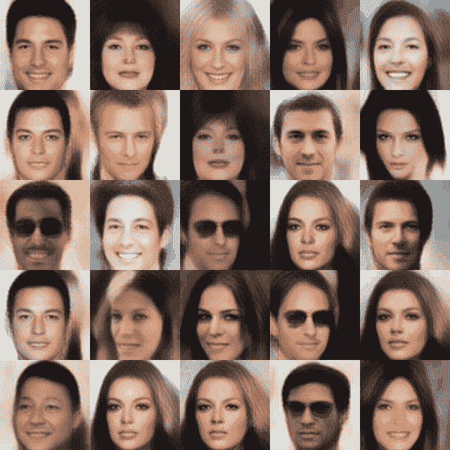

**另一方面，创成式**模型要执行更复杂的任务。它必须理解从中获得数据的分布，然后需要使用这种理解来执行分类任务。此外，创成式模型具有**创建数据**的能力，该数据类似于它接收的训练数据，因为它已经学习了提供数据的分布。例如，如果我向一个生成模型显示一组狗和猫的图像，现在该模型应该完全理解属于某个类的特征是什么，以及如何使用它们来生成类似的图像。利用这些信息，它可以做很多事情。它可以比较属性来对图像进行分类，类似于判别算法如何对图像进行分类。它可以**生成**一个新的图像，该图像看起来像它已经被提供用于训练的类图像之一。

> 人类的行为不像纯粹的辨别者，我们拥有巨大的生殖能力

生成算法的进步很重要，因为人类不仅仅像纯粹的鉴别者一样行动，我们有巨大的生成或想象能力。如果我们给出某些属性，例如**道路上的蓝色汽车**，我们可以立即在脑海中生成一幅图像，我们正在考虑为机器提供这种智能。

在下面的内容中，我们将讨论两个著名的生成算法**变分自动编码器**和**生成敌对网络**

# 自动编码器

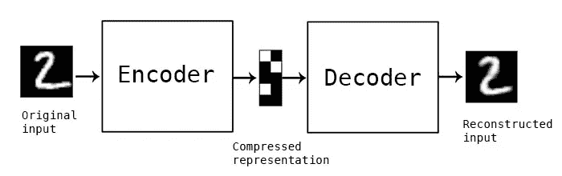

自动编码器是一种人工神经网络，用于以无监督的方式学习有效的数据编码。自动编码器的目的是学习一组数据的表示(编码)，通常用于**维数减少。**

作为人类，我们非常擅长使用一些属性来**可视化**。例如，如果我们把一个人描述为高大、白皙、魁梧、没有胡子，旁遮普语，你可以基于这些属性创建一个可视化。自动编码器试图实现同样的事情。如果我展示一个人的图像，它会学习识别这个人所需的所有属性(称为**潜在属性**)，然后可以使用它们来可视化/重建这个人。

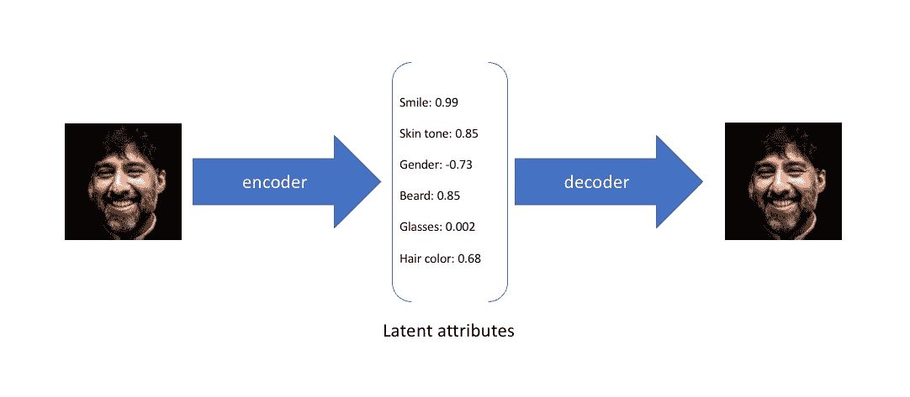

自动编码器由 3 个组件组成

1.  **编码器**
2.  **瓶颈**
3.  **解码器**

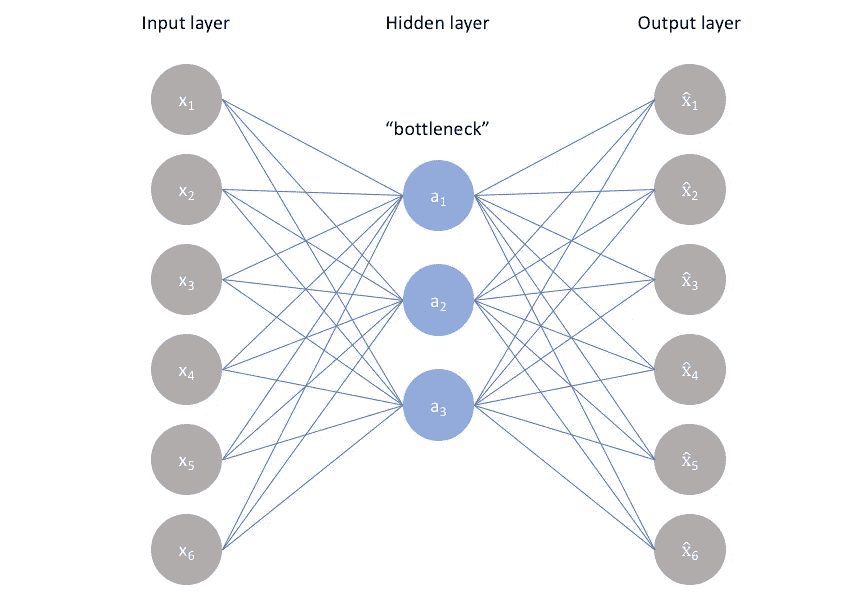

**编码器**类似于任何分类神经网络，如 **Resnet** 等。没有预测 softmax 层。如果我们看到下图中的 VGG 网络，如果我们移除最后的 softmax 层，我们得到的最后 1000 个值可以被认为是图像的 1000 个潜在属性。

**解码器**与编码器相反，它从编码器的输出中提取潜在属性，并试图重建图像。这是通过使用去卷积层来完成的，去卷积层可以对输入进行去采样

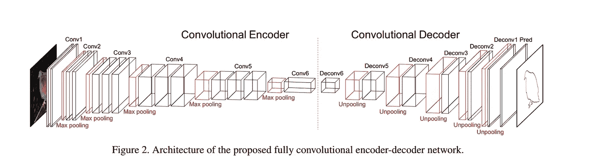

**瓶颈**是由编码器输出并由解码器上采样的潜在向量。它包含解码器产生的**潜在属性**，如身高、体重等。如上所述。

使用**反向传播**一起训练编码器和解码器的网络，以减少重建的损失，例如像素之间的均方误差。

**自动编码器的应用:-**

1.  **图像去噪**:自动编码器可以用来去除图像中的噪声。由于 autoencoder 学习的是潜在表示而不是噪声，因此它可以消除噪声并给出清晰的图像。通过在输入端提供有噪声的图像来训练它，并且我们试图在输出端使用合适的图像来最小化重建误差
2.  **推荐系统** :-网飞电影推荐挑战赛获胜者使用深度自动编码器
3.  **压缩** :-正如我们已经看到的，autoencoder 将输入转换为其潜在空间属性，并将其转换回来，它可以通过使潜在空间比输入小得多来用于压缩。
4.  **维度减少** :-自动编码器可以类似于 **PCA** 使用，通过将输入映射到潜在属性并使用它们进行建模来减少特征空间。
5.  **数据生成** :-自动编码器的一种变体，称为**可变自动编码器**，可以用来生成类似于它被训练的分布的数据，我们将在下面讨论。

# 变分自动编码器

上面我们已经看到了如何使用自动编码器将输入压缩成潜在变量。我们还没有用上述方法解决的一个问题是，网络可以学习一个有效但不能很好概括的表示。这是深度神经网络中的经典问题，被称为**过拟合**。如果神经网络有足够的能力，它可以记住输入数据并将其映射到潜在属性，而不需要创建一个总的理解，在这种情况下,**潜在属性不具备良好的属性**,就像我们上面讨论的那样，它们可能是无意义的，任务仍然执行，即重建，但潜在属性没有任何意义。你可以把这比作一个学生，他把课本上的所有答案都抢过来了，如果直接从课本上给出答案，他可以解决问题，但是即使问题有一点点变化，他也会完全犹豫。我们尝试使用**变型自动编码器**来解决这个问题，与普通自动编码器相比，变型自动编码器更通用。

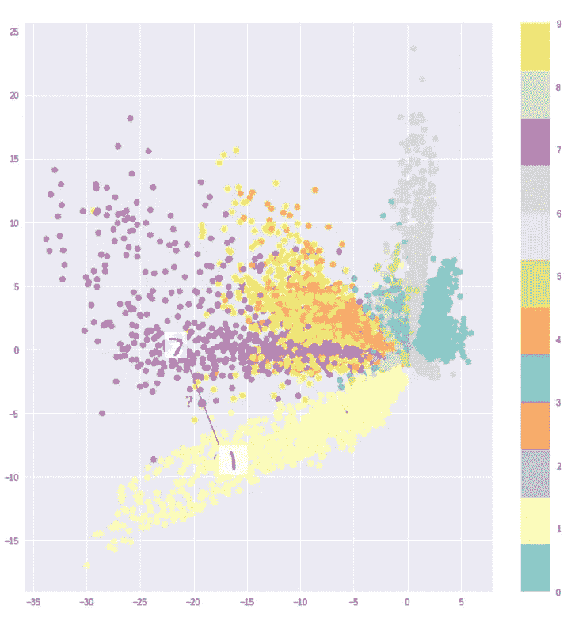

上图是使用 Vanilla Autoencoder 训练的 MNIST 数据。正如我们所看到的，形成了不同的簇，这正是我们要求自动编码器做的。现在，如果我们观察该图，我们可以清楚地看到，群集**不是连续的**，它们之间有间隙。因此，如果我们从间隙中取出一个点，并将其传递给解码器，它可能会给出一个与任何类都不相似的输出。我们不希望这种情况发生，我们希望空间是连续的，输出有意义。我们通过使用 **VAE** 实现这一点。

我们希望 VAE 拥有以下两个属性

1.  **连续性** :-潜在空间空间中的两个接近点应该给出相同的输出，如果不是这样，则意味着有很高的方差，因此是过拟合和无泛化
2.  **完整性** :-潜在空间的一个点应该映射到一个有意义的输出，而不应该给出一个未知的图像作为输出

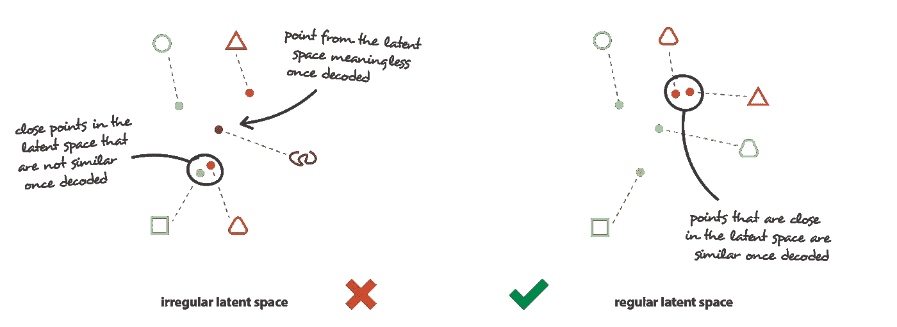

为了实现这个 VAE **编码器**部分连同一组潜在属性一起输出对应于潜在空间中每个属性的一组**均值和方差**。普通的自动编码器将输入编码成一组单一的潜在属性，但是 **VAE** 将每个潜在属性编码成具有均值和方差的分布。每次图像通过时，一组潜在属性根据它们的平均值和方差被**采样**，并被传递给解码器。解码器的工作类似于解码器现有的普通自动编码器，即它**对潜在属性进行上采样**以恢复输入图像。

遵循上述方法的优点在于，由于输入被映射到潜在属性的**分布**，在潜在空间中靠近的**点默认被映射到类似的输出**。我们在每个潜在空间属性的分布上强加了一些约束,使得它按照我们的期望进行调整

I)分布遵循正态分布，每个属性**的**方差**接近 1** 。这可以防止星系团变得非常紧密，因此有助于使潜在空间连续，如果不是这样，VAE 可以将星系团推向非常紧密的群体，就像一个单点，这将辜负我们对连续性的期望。

ii)我们试图保持所有集群的**均值**接近 0**，这样我们可以确保从一个集群到另一个集群的平滑过渡，并且在集群之间没有间隙，因为这将使所有集群彼此更加接近。这样，潜在空间中的任何一点都映射成有意义的输出。**

**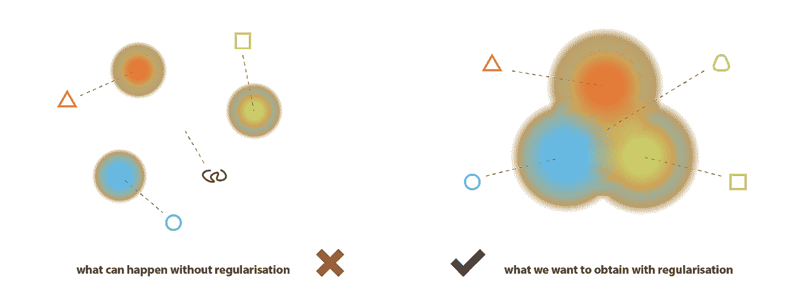**

**这些是 VAE 遵循的步骤**

> **编码器接收输入并输出对应于每个潜在属性的一组均值和方差**
> 
> **从每个均值和方差中随机抽取一个潜在属性，并将其传递给解码器**
> 
> **解码器获取随机采样的潜在属性，对其进行上采样以尝试通过最小化重构损失来重构输出**

# **损失函数**

**VAE 损失函数由两部分组成**

**1) **重建损失** :-类似于普通 AE，我们使用 MSE 或交叉熵**

**2) **正则化损失**:我们试图对每个潜在属性的输出概率分布进行建模，使其接近标准正态分布。我们通过减少输出概率分布和标准正态分布之间的 KL 散度来做到这一点。**

****损失=重建 _ 损失+c * KL _ 损失****

****KL 散度**用来衡量两个概率分布之间的散度。值越低，两个分布之间的匹配越好。 **c** 是**超参数**，需要调整，用于平衡重建损失和正则化损失的重要性。**

**现在我们开始学习如何使用 VAE 来**生成新数据**，类似于 VAE 的训练数据和**应用。一旦我们把 VAE 训练到一个很好的程度，我们就应该发展出一个连续完整的潜在空间。现在，我们可以从潜在空间中选取任何一点，并将其传递给解码器，它将**生成一个新的图像**到目前为止完全看不到，但看起来仍然属于 VAE 接受训练的数据分布，即它看起来像一类训练数据，这很棒，因为现在网络可以自己生成数据。****

****VAE 的应用** :-**

1.  **生成类似于训练 VAE 的数据分布的新数据**
2.  **向现有图像添加伪像。例如，如果我们知道不戴太阳镜的图像和戴太阳镜的图像，我们可以取它们之间的差异，并用它来给任何新图像添加太阳镜**

**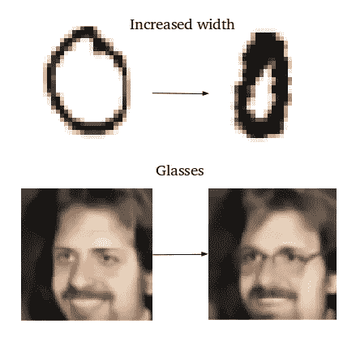**

# **生成敌对网络**

**GAN 的是另一套生成算法，也是深度学习产生如此多炒作的主要原因之一。已经使用 GAN 进行了多种应用，并且已经研究了多种架构，这导致 GAN 领域的快速发展，其可以产生很酷的结果，这可以使人怀疑它是真实图像还是由 GAN 产生的图像。例如，下面是从未在现实世界中存在过的人的面孔。看起来挺**酷**对。可以去[**https://thispersondoesnotexist.com**](https://thispersondoesnotexist.com)。这个网站每次刷新都给出一个逼真的假人。**

**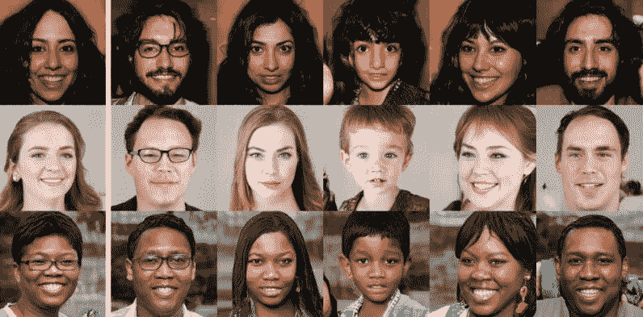**

**最近，三星发表了一篇论文，其中一个神经网络只需拍摄一张照片，就可以生成一个小视频 gif。通过这一点，他们让蒙娜丽莎 T20 活了下来。想想未来有什么可能。你可以让你死去的祖先和你说话。神圣**牛逼****

**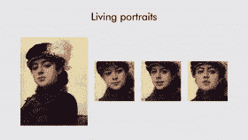**

**到目前为止，我们曾经相信我们可以相信我们看到或听到的任何事情，因为它们发生在现实中，即视频新闻必须是真实的。不再是了。现在，逼真的假视频或音频的人可以生成如下。现在连视频新闻都信不过了。**

**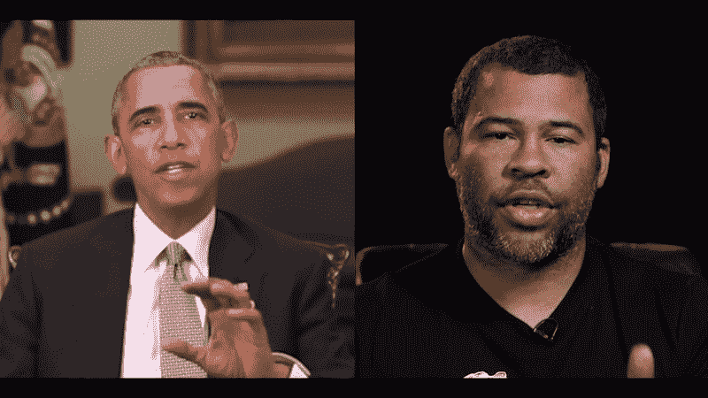**

**您也可以使用 GAN 进行域转移。如果你有一匹马的图像，你可以用 GAN 把它想象成斑马的样子。**

****

**你可以重新想象自己在电影中扮演一个主角，就像下面的**把他变成了莱昂纳多·迪卡普里奥**。这是**dubssmash**的下一关。**

**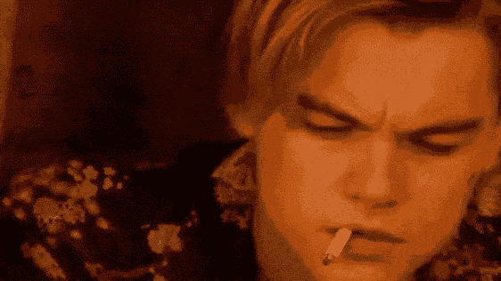**

**可能性是无限的。你可以创作一部完整的电影，而不需要任何真实的演员阵容。从现实世界中提取一个场景，并将其转换为动画。创建假的人，作为穿上电子商务网站的衣服的模型。**

## **甘的工作**

**现在我们将探究所有这些魔法背后的理论。GAN 由两个神经网络(上面的 VAE 只有一个神经网络)组成，它们相互配合工作，即**发生器**和**鉴别器**。他们表现得像师生，暴徒警察。生成器的任务很简单，顾名思义，它生成数据，例如必须看起来像真实世界数据的图像。鉴别器的任务是查看来自发生器的数据，并将其与真实世界的数据进行鉴别，即它应该查看发生器生成的数据，并说它是**假的**。**

**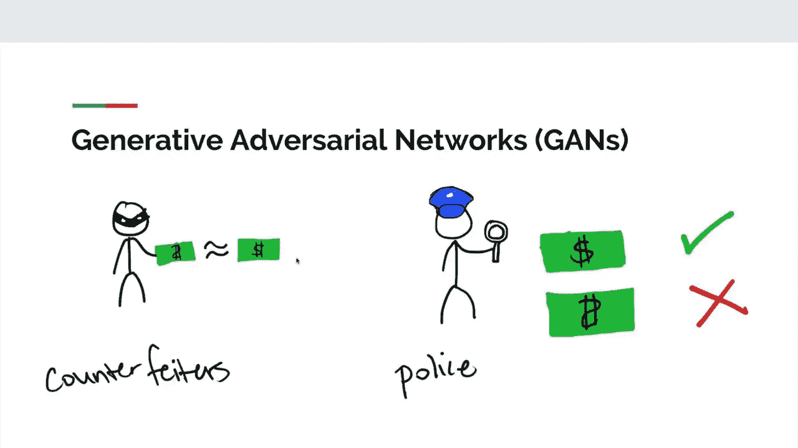**

**现在**猫捉老鼠游戏**开始。由于鉴别器说数据是假的，所以生成器试图改进自己，以便生成鉴别器不能判断真假的更真实的数据。一旦发生这种情况，鉴别器知道它不能正确地鉴别，所以它会努力提高自己，下次它会判断得更好。现在球在生成器的球场上，这种试图压倒对方的游戏继续进行，直到一个阶段到来，此时鉴别器完全搞不清来自生成器的数据是真是假。现在发电机赢了，我们一直支持发电机。但是记住英雄和反派一样好。《复仇者联盟》的结局之所以如此成功，是因为灭霸是一个如此险恶的恶棍。因此，我们希望鉴别器是最好的，发电机需要在其峰值时击败鉴别器，因为这样胜利就更甜蜜了。**

**有多种架构和相当多的复杂损耗函数来使 GAN 工作，我们将看到最成功的架构之一 **DCGAN** (深度卷积 GAN)，它首次将卷积层用于 GAN。**

**前面说过 GAN 由两个神经网络**鉴别器**和**发生器**组成。这些神经网络的架构类似于 **VAE** 中的**编码器**和**解码器**。鉴别器是我们相当熟悉的神经网络，图像作为输入，使用卷积层进行采样，最后我们应用 softmax 来获得输出类，在这种情况下，我们只有 2 个类**假或非假**。因此，像 Resnet、Inception 这样的常见架构可以用来建模 DCGAN 的鉴别器。鉴别器是通过提供真实图像作为真实类别类别和由生成器给出的虚假图像作为虚假类别类别来训练的。所以这是一个 2 类分类问题。**

**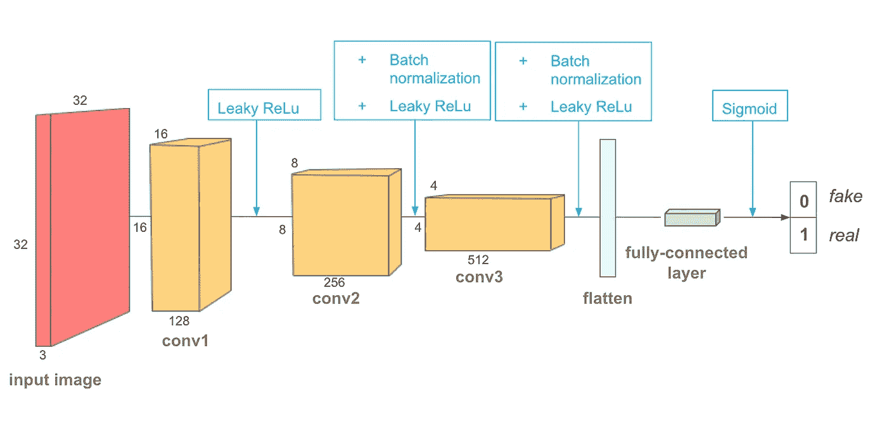**

****发生器**架构看起来与鉴别器的架构相反。它获取一个线性向量，并对其进行上采样，类似于 VAE 的**解码器。线性向量是通过随机抽样产生的，就像在 VAE，我们可以把它看作潜在空间的属性。不同的随机采样产生不同的输出。****

**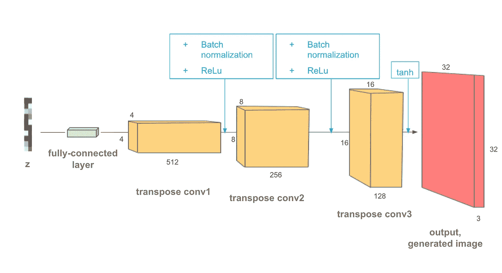**

**在一场**极小极大**游戏中，鉴别器和生成器同时接受训练。鉴别器试图减少鉴别损失，例如交叉熵损失，而生成器试图通过增加误差来对抗它。不像分类、检测等一般任务。由于有两个对立的当事方参与，损失不会不断减少。此外，我们不希望鉴别器从一开始就压倒生成器，反之亦然，因为在这种情况下，这将是一场一边倒的游戏，两个网络整体上不会学习，因为没有竞争，所以我们从两者都同样愚蠢的阶段开始，即认为生成器生成随机图像，而鉴别器随机将图像分类为假或真。网络通过相互竞争慢慢改进，直到达到一个阶段，发电机完全欺骗了鉴别器。**

**训练 GANs 是一门艺术，在稳定同时训练两个网络的过程中有很多技巧，但这是另一篇文章的内容。**

**关于我:-我是三星研发中心的高级研究工程师，我的工作领域是计算机视觉、移动物体检测和识别。你可以通过【https://www.linkedin.com/in/anilmatcha/】**联系我****