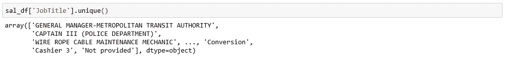
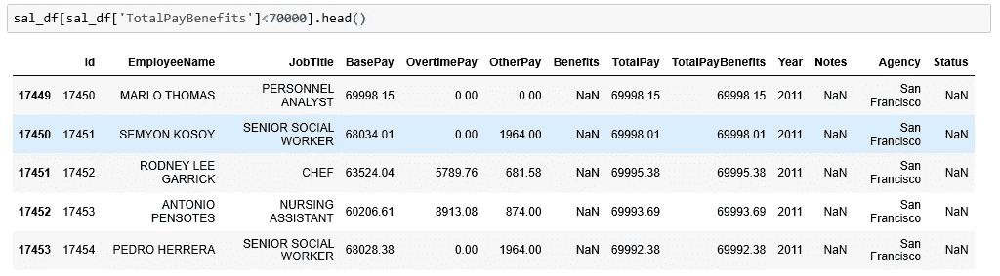

# Python 中的“大熊猫”简介

> 原文：<https://medium.com/analytics-vidhya/an-introduction-to-giant-pandas-in-python-e015f01bbe66?source=collection_archive---------16----------------------->

萨法尔·萨法罗夫在 [Unsplash](https://unsplash.com?utm_source=medium&utm_medium=referral) 上拍摄的照片

如 [上所述【https://pandas.pydata.org/](https://pandas.pydata.org/)*pandas*是一个 BSD 许可的库，为 [Python](https://www.python.org/) 编程语言提供高性能、易于使用的数据结构和数据分析工具。It 有助于关注业务问题，而不是编程。它简单易学，易于使用，易于维护。

Pandas 数据结构:它有两个主要的数据存储结构。
1。系列
2。数据帧

**Series:**Series 非常类似于 NumPy 数组(构建在 NumPy 数组对象之上)，能够保存任何类型的数据(整数、字符串、浮点、python 对象等)。).轴标签统称为*索引*。

让我们从几个例子开始

进口熊猫和熊猫

*使用列表创建系列*

序列使用列表

*使用 numpy 数组创建序列*

使用 numpy 数组的系列

*使用字典创建系列*

使用字典的系列

数据帧是熊猫的工作母机，直接受到 R 编程语言的启发。DataFrame 可以被认为是 NumPy 数组的一般化，或者是 Pyhton 字典的专门化。多个系列对象的集合也称为 DataFrame。我们会试着用几个例子来理解它。

让我们从导入数据开始

正在导入。csv 数据转换成名为 sal_df 的数据帧

**数据的属性**

获取数据帧的索引

数据框架.索引

获取数据帧的列标签

数据框架.列

从数据帧中获取元素总数

DataFrame.size

为了得到数据帧的维数

数据框架.形状

# 索引和数据选择

函数 *head* 返回数据帧的前 n 行。默认情况下， *head()* 返回前 5 行

DataFrame.head()

函数 *tail* 根据位置返回对象的最后 n 行。默认情况下， *tail()* 返回前 5 行

DataFrame.tail()

函数 sample 从 dataframe 中返回任意*随机* n 行，默认情况下， *sample()* 返回 1 行。

DataFrame.sample()

要访问标量值，最快的方法是使用 at 和 iat 方法

DataFrame.at[]

DataFrame.iat[]

通过标签访问一组行和列。可以使用 loc[ ]

DataFrame.loc[]

按列名选择

DataFrame['列名']

按列名列表选择

DataFrame[['列名 1 '，'列名 2']]

我个人最喜欢的是用点(。)批注但不被专家建议

DataFrame.column 名称

# 数据帧的简明摘要

info()返回数据帧的简明摘要

DataFrame.info()

我们还可以使用 dtypes 获取每一列的数据类型，dtypes 返回一系列数据类型。

DataFrame.dtypes

## 从列中获取唯一值

1.  使用 *unique()，*在建系列中

DataFrame['列名']。唯一()

2.使用 numpy *unique()*

numpy . unique(data frame[' column _ name '])

如果我们检查输出的*类型*，两者都是 ndarray，唯一的区别是 *np.unique()* 排序，而 *unique()* 未排序。

类型()

计算每列中唯一值的数量

DataFrame['列名']。努尼克

## 数据的条件选择

数据的条件选择

对于两种情况，我们可以使用带括号的|和&:

多重条件

## 检测缺失值

使用 Dataframe.isnull.sum() 检查每列中缺失值的计数

DataFrame.isnull()。总和()

> 这是对 Python 中熊猫库的介绍，我会在下一个故事中介绍更高级的内容。感谢阅读！