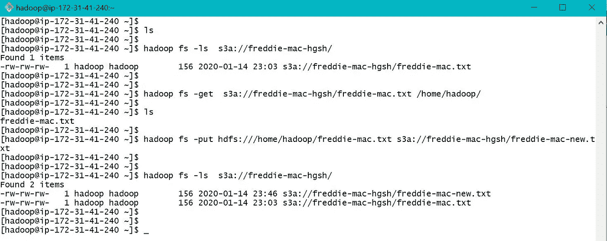
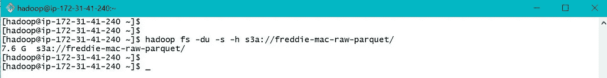
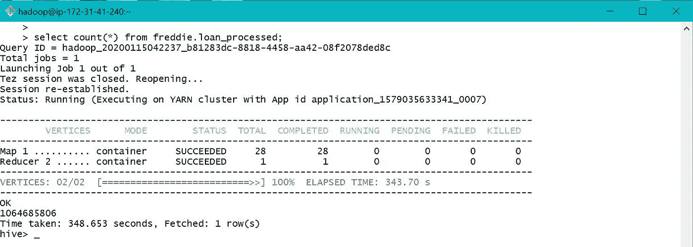
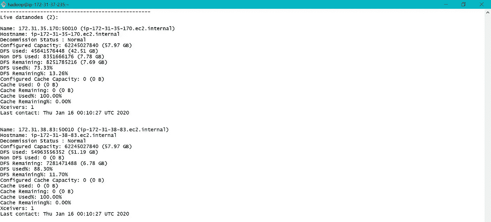
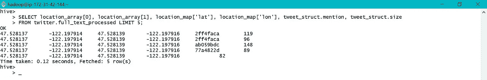
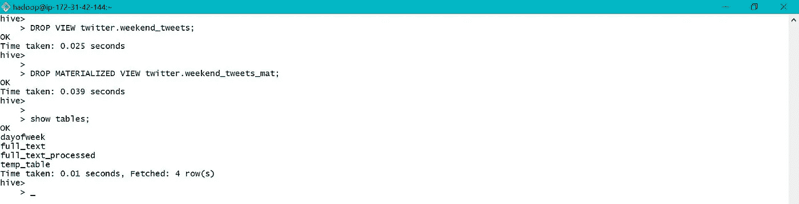

# EMR AWS 中的 Hadoop 介绍。

> 原文：<https://medium.com/analytics-vidhya/an-introduction-to-hadoop-in-emr-aws-701c7b3c6b34?source=collection_archive---------0----------------------->

大数据是机器学习不可或缺的一部分，在这里，我们将使用 EMR 处理存储在 S3 的*房地美月度贷款*数据集。Hive 用于处理数据，并将处理后的数据存储在 S3 中，用于进一步的机器学习过程。样本数据集有近 10 亿条记录。下面是要执行的活动的图示。

# **内容:**

1.  启动 EMR 集群并了解文件系统。
2.  在 PC、S3、EMR 本地和 hdfs 之间传输数据。
3.  在 hive 中创建表，预处理并将数据加载到 Hive 表中。
4.  数据分析和优化。
5.  克隆现有的表。
6.  复杂和字符串数据类型。
7.  使用视图。
8.  EMR 集群启动期间的引导。
9.  HDFS 与关系数据库之间的数据传输。

# 使用的工具/软件:

1.  存储— AWS S3。
2.  处理— AWS EMR。
3.  语言— FS Shell 和 HQL。

## ***1。启动 EMR 集群，了解文件系统:***

请按照[链接](https://youtu.be/6gMaphVxzsU)启动一个 EMR 集群，并使用 Git Bash(之前安装在本地 PC 上)和。pem 文件(在用户创建期间从 AWS 下载)。请启用 EMR 的端口 22 进行访问。

一旦 EMR 启动并连接，下面是进一步玩 EMR 的屏幕。

EMR CLI

在 EMR 中，我们有本地和 Hadoop 文件系统。下图显示了本地和 HDFS 文件夹中的默认文件夹和新建文件夹。

EMR 本地

从上面的屏幕截图来看，EMR 本地文件夹是/home/hadoop/。我们可以看到，测试文件夹 freddie-local 是在默认文件夹/home/hadoop/中创建的。

EMR HDFS

从上面可以看出，EMR 默认的 HDFS 文件夹是/user/hadoop/，因为测试文件夹 *freddie-hdfs* 是在/user/hadoop/位置创建的。默认配置单元文件夹是/user/hive/warehouse/。在 hive 中创建的所有表都将数据存储在默认文件夹/user/hive/warehouse/中，除非在表创建步骤中指定了不同的位置参数。要访问 EMR Local，请仅使用 linux cli 命令，而要访问 EMR HDFS，我们需要添加“hadoop fs”和“-”，如上所示。

在 AWS 中，EMR 中使用“hive”命令来启动 Hive CLI，如下所示。我们也可以使用 Hue 来处理 Hive。请按照[链接](https://youtu.be/-9P608eaAkA)启动 Hue 并访问 Hive。

EMR 配置单元 CLI

我们现在已经准备好使用 CLI 和 Hue 来玩 Hive 了。在这个故事中，我们将使用 Hive CLI 与 HDFS 进行交互。

## 2. ***在 PC、S3、EMR 本地和 hdfs 之间传输数据:***

a. *PC 到 EMR 本地* —可使用以下命令在 PC 和 EMR 本地之间传输数据。用于将本地 PC 连接到 EMR 集群。pem 文件是必需的，应在用户创建期间创建。这里我们将把一个测试文件 freddie-mac.txt 从桌面转移到 EMR 本地。

桌面到 EMR 本地

b. *S3 到 EMR 本地**—**“AWS S3 CP**”和**“curl”**可用于在 S3 和 EMR 本地之间移动数据，如下所示。这里我们将把文件 *freddie-mac.txt* 从 S3 桶 *freddie-mac-hgsh* 转移到 EMR 本地文件夹*即/home/hadoop/。**

**

*S3 到 EMR 本地— 1*

*我们还可以使用“ **hadoop fs -get** ”来拉取和“ **hadoop fs -put** ”来推送 **S3 和 EMR local** 之间的数据，如下所示。*

**

*S3 到 EMR 本地— 2*

**Curl* 也可用于从 S3 下载数据到 EMR 本地，如下所示。*

**

*S3 到 EMR 本地— 3*

*c.*EMR Local to HDFS—*****Hadoop fs-put**和 **hadoop fs -get** 可用于在 EMR Local 和 hdfs 之间移动数据，如下图所示。***

******

***hdfs 本地的 EMR。***

***d. *S3 到 EMR Hdfs—*“**Hadoop fs-CP**”可用于在 S3 和 EMR Hdfs 之间移动数据，如下所示。***

******

***EMR hdfs 到 S3。***

***e.*浏览 S3 和 Hdfs 中的文件—***【Hadoop fs-cat】**可用于浏览 S3 和 EMR Hdfs 中的数据，如下。这里*头*连同 *"|"* 字符用来限制行数。***

******

***浏览 S3 数据。***

***数据从 EMR 本地复制到 hdfs 并浏览，如下所示。***

******

***浏览 Hdfs 数据。***

## ***3. ***在 hive 中创建表格，预处理并加载数据到 Hive 表格:******

***在 hive 中，我们可以创建外部和内部表。对于外部表，删除表时不会删除数据。它唯一被删除的模式。对于内部表，删除表时，数据和模式都会被删除。***

***在配置单元中创建表时，/user/hive/warehouse/是存储表数据的默认位置。但是在创建表时，我们也可以为存储或引用的表数据指定不同的位置。数据位置可以是 EMR HDFS/用户/*或 S3 中的任何文件夹。***

***在目前的项目中，我们在 S3 存储了拼花地板格式的原始数据。我们需要在 S3 处理和存储最终数据，用于进一步的机器学习过程。因此，我们不需要将表数据存储到 hdfs 中，即使在我们终止 EMR 集群之后，我们的数据也应该保留。因此将创建一个外部表，并将位置用作 S3 存储桶。***

***使用房地美[参考文档](http://www.freddiemac.com/fmac-resources/research/pdf/user_guide.pdf)(月度性能数据文件)创建相应的模式。收集了原始数据文件并存储在 S3。最后三个字段*步骤修改标志*、*延期付款修改*和*估计贷款价值(ELTV)* 从原始输入文件中排除。***

***请参考以下使用存储在 S3 的原始数据创建外部表格的屏幕截图。***

******

***S3 实木复合地板文件的大小。***

******

***创建新数据库之前清空配置单元仓库文件夹。***

******

***创建数据库弗雷迪。***

******

***数据库创建后的配置单元仓库文件夹。***

******

***用原始数据创建表格。***

******

***原始文件记录计数。***

***请参考以下创建外部表的屏幕截图，以在 S3 中存储已处理的数据并将数据加载到表中。***

******

***创建已处理表以存储 S3 的已处理数据。***

******

***将数据加载到已处理的表中。***

******

***已处理的文件记录计数。***

******

***原始和处理过的文件。***

******

***启用标题并查看已处理的文件。***

***因为表位置是作为 S3 存储桶之一提供的，所以 o/p 被写入 S3 存储桶，而不是默认位置/用户/配置单元/仓库/***

******

***在 o/p S3 时段中创建的已处理数据。***

***完成上述处理后，将终止 EMR 集群，并在稍后启动新的集群进行进一步分析和处理。***

## ***4. ***数据分析与优化:******

***如前所述，启动了一个新的 EMR 集群。使用了两个独立的 GIT bash CLI，一个连接 hadoop，另一个连接 hive。一旦连接到 hive，将使用之前在 S3 创建的已处理数据创建一个新的数据库和一个表。***

******

***新集群启动。***

******

***使用已处理的 S3 数据创建新的数据库和表。***

***a.Data is 有 2000 年到 2017 年的记录，如下图。***

******

***我们数据中不同年份的数量。***

***b.选择 2007 年贷款 ID F107Q1287729 的所有月度绩效数据。***

******

***2007 年贷款 F107Q1287729 的月度执行数据。***

***c.对于上述所有查询，数据都是从 S3 获取的，因为指定的表数据位置是 S3 存储桶。除了使用 S3，我们还可以通过创建如下所示的另一个表来将数据移动到 hive 中，以便进一步处理。***

******

***使用默认位置在 hdfs 中创建新表。***

******

***描述格式化— pg1***

******

***描述格式化— pg2***

******

***在默认配置单元数据位置创建了名为 loan_monthly 的新文件夹。***

***d.查找 2010 年 9 月*当前贷款拖欠状态= 0* (拖欠少于 30 天)的贷款 id 计数。***

******

***在特定年份特定条件下计数不同。***

***e.优化配置单元查询的一种方法是创建分区表。表分区是根据对表执行的常见查询类型创建的。如果不小心做到这一点，代价可能会更大。这里我们假设我们的数据主要是基于日期或年份进行查询的。因此创建了一个用于优化的分区表。这是动态分区，因为分区是根据每行的特定数据字段创建的。***

******

***创建分区表之前的默认配置单元仓库文件夹。***

******

***创建按年份分区的分区表。***

******

***创建表后的配置单元仓库。***

******

***当我们使用 describe 时，分区列 period_year 显示为一列。***

******

***加载查询停滞，主要是由于内存错误。***

***访问 YARN 后，发现好像没有分配给作业的容器。***

******

***纱线应用错误。***

******

***HDFS 记忆报告 pg-1***

******

***HDFS 记忆报告 pg-2***

******

***S3 的实际文件大小与 HDFS 的文件大小***

***由于我的 EMR 集群内存有限，删除了表 loan_monthly 并创建了一个新的外部表 loan_monthly，数据位置为 S3 存储桶。使用外部表将数据加载到分区表 loan_by_yearly 中。与[链接](https://youtu.be/Pe6T3uheXYA)一起，下面是在加载数据时描绘纱线和集群节点的一些屏幕打印。***

******

***新创建的外部表 loan_monthly。***

******

***将数据加载到分区表中。***

******

***总共分配了 8 个集装箱。7 个用于任务，1 个用于切换。***

***因为我们在创建 EMR 集群时只分配了两个核心节点，所以在将数据加载到分区表时只使用了其中的两个。***

******

***将数据加载到分区表期间的 EMR 集群节点矩阵。***

******

***数据已加载到分区表中。***

***子文件夹是基于 *period_year* 的值创建的，分区是基于该值完成的。***

******

***根据年份在 hive 仓库中创建的文件夹。***

***当查看或使用表时，用于对表进行分区的参数显示为一列，但实际上并没有添加到数据文件中。***

******

***分区表中的 10 行。***

***在执行与之前相同的查询后，只花费了 52 秒，而不是 575 秒，在这种情况下，效率提高了近 10 倍。***

******

***在特定年份特定条件下计数不同。***

***数据直接从 EMR hdfs 复制到 S3，供下次启动 EMR 时使用。***

******

***在 EMR hdfs 和 S3 之间移动文件。***

***稍后，当一个新的 EMR 集群启动时，使用 S3 位置的数据创建一个新的分区表，如下所示。这被称为静态分区。***

******

***S3 的分区数据。***

******

***创建分区表。***

******

***将分区数据添加到表 pg-1 中。***

******

***将分区数据添加到表 pg-2。***

***恢复的分区表中的记录总数等于已处理的表中的记录数，即 1064685806，如第 3 节所示。***

******

***已还原分区表的记录计数。***

***同样，从上面可以看出，已分区表和未分区表中计数所用的总时间几乎相同，因为分区是基于年份进行的，而我们的计数查询不是特定于年份的。***

******

***还原的分区表中的记录很少。该表具有分区字段 period_year。***

## ***5. ***克隆一个已有的表:******

***像这样的*可以用来编目或克隆一个现有的表。这里只创建模式，没有数据传输。数据需要显式地装载到新克隆的表中。*如果不存在*用于避免在创建新的数据库或表格时出现错误，如果存在同名的旧数据库或表格。****

******

***创建表之前的配置单元仓库。***

******

***使用 LIKE 编目的表。***

******

***在配置单元仓库中创建新的空文件夹。***

## ***6. ***复杂和字符串数据类型:******

***Hive 支持复杂的数据类型，如数组、映射和结构。使用 Kinesis Firehose 收集的 Twitter 数据已经存储在 S3。这些数据用于演示创建表、加载和查询复杂数据。***

***在 hive 中创建一个临时表来访问原始 twitter 数据。数据也可以从 S3 加载到 hive 表中，如下所示。使用*加载*命令，将数据从源位置移动(而不是复制)到目标位置。***

******

***创建表并从 S3 加载数据。***

***通过处理字符串数据在临时表中创建复杂数据，如下所示。如果在同一个表中使用不同的复杂数据类型，所有这些类型都必须使用相同的终止符。这里“|”在数组、映射和结构中用作终止符。***

******

***将数据加载到临时表中以创建复杂数据。***

******

***查看创建的复杂数据。***

***创建具有复杂数据类型的表，并将处理后的数据复制到复杂表数据文件夹。*由“|”终止的集合项*用于表定义，因为数据是在上一步中相应创建的。***

******

***创建具有复杂数据类型的表。***

******

***描述具有复杂数据类型的表。***

******

***将创建的数据移动到复杂表数据文件夹。***

***复杂数据从配置单元表中访问，如下所示。***

******

***访问配置单元表中的复杂数据。***

***Explode 函数也可用于仅访问数组和映射，如下所示。***

******

***仅使用 explode 函数来扩展数组和映射。***

***当与其他列一起使用分解功能时，侧视图需要如下使用。虽然 *la* 和 *lm* 这两个词没有在任何地方使用，但是需要用侧视来定义。***

******

***仅对于阵列和映射，使用侧视图进行分解。***

## ***7. ***用视图工作:******

***视图是保存的查询，可以像查询表一样进行查询。如果一个复杂的查询被反复使用，它可以被保存为一个视图以节省时间。视图在数据库中显示为表格。***

***默认情况下，非物化视图是在 hive 中创建的，它不保存底层查询数据。视图的操作与我们的外部查询中的操作合并到一个集合中，以便在执行之前由 hive 进行优化。但是在物化视图中，查询数据被保存到数据库中，使得查询速度更快。因此，随着底层数据的变化，非物化视图会自动更新，而物化视图需要重建。***

****Order By* 是一种开销很大的操作，不应在视图内部使用。如果需要，排序应该始终包含在对视图执行的操作中。***

***根据 S3 的数据创建表 *dayofweek* 。***

******

***为星期几创建表。***

******

***将数据从源加载到配置单元表中。这里 S3 被用作来源。***

******

***查看表 dayofweek 的数据。***

***非物化视图和物化视图是使用如下所示的已处理数据和星期数据创建的。非物化视图的视图创建时间很快，而物化视图的查询时间很快。***

******

***创建和查询非物化视图。***

******

***创建和查询物化视图。***

***这两个视图在数据库中都显示为表，但数据文件夹只为物化视图创建。***

******

***视图在数据库中显示为表格。***

******

***仅为实体化视图创建数据。***

***视图也可以修改，如下表所示。***

******

***描述原始视图的格式。***

******

***更改基础视图查询。***

******

***描述已修改视图的格式。***

******

***删除视图。***

## ***8.***EMR 集群启动时的引导:******

***配置单元查询可以保存到 S3，并且在 EMR 集群启动期间，可以在引导操作中使用相同的脚本位置。这将执行所有相应的脚本，同时自动启动集群。***

## ***9.***HDFS 与 RDBMS 之间的数据传输:******

***在 Linux 中执行的 sqoop 用于 HDFS 和 RDBMS 之间的数据传输，包括导入和导出。***

***更多细节有待更新。你的想法会得到赞赏。***

***谢谢你，艾比。***