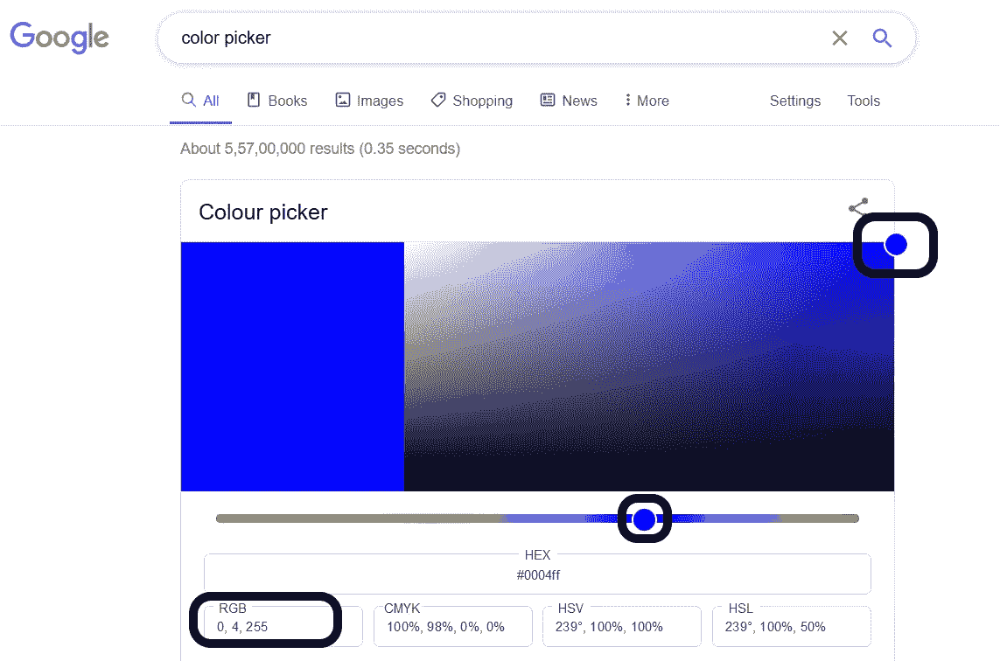
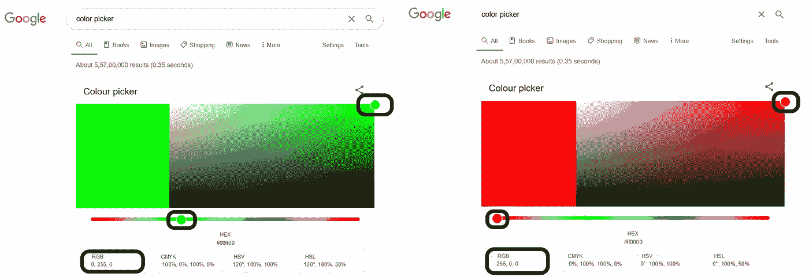
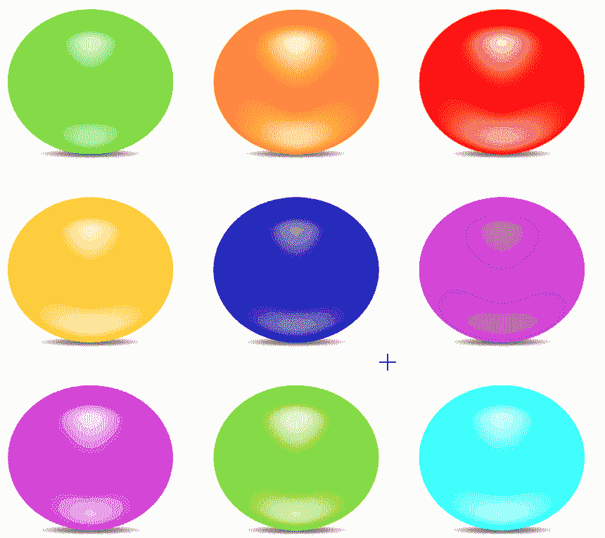

# 使用 OpenCV 进行图像分析的介绍

> 原文：<https://medium.com/analytics-vidhya/an-introduction-to-image-analysis-using-opencv-2ce8db47e05c?source=collection_archive---------27----------------------->

# 了解图片的数组值

**简介:**

我们都知道计算机把任何图像都当成数字来读。对于那些对这是如何发生的感到好奇的人来说，请阅读接下来的几行，图像后面会有一个清晰的解释

我们在相机中捕捉数字图像以矩阵的形式存储。有两种最常见的数字图像是“灰度图像”和“彩色图像”

灰度图像只有两个通道:亮和不亮，而彩色图像有三个通道，红色、绿色和蓝色，如下图所示

图片来源:[苏米特萨哈](https://towardsdatascience.com/@_sumitsaha_)

**矩阵值:**

现在，我们知道计算机正在以矩阵格式读取图像，让我们现在探索每种颜色的值是什么。

说到 OpenCV，图像中的所有像素都是按照蓝、绿、红的顺序读取的。每种颜色可以容纳的最大值是 255，最小值是 0。白色的值是(255，255，255 ),黑色的值是(0，0，0 ),你只需在谷歌搜索中输入“颜色选择器”就可以查看。将鼠标移到颜色面板上，可以找到每种颜色的值。

蓝色的 BGR 值

从图中可以发现，所选颜色的 B、G、R 值为 255，4，0，同样，在接下来的两幅图中，B、G、R 值为 0，255，0 和 0，0，255，分别表示绿色和红色。B、G 和 R 的不同组合产生不同的颜色。

请注意，还有其他颜色空间，如 HSV(色调、饱和度、值)、CMYK(青色、品红色、黄色、暗色调或黑色)和 HSL(色调、饱和度、明度)。现在我们知道了计算机是如何解释不同的颜色的，让我们使用一个简单的 python 代码来找出一张照片的颜色值，如下所示。编码是这样进行的，当光标在屏幕上的颜色上移动并左击时，它显示颜色组合。找到编码部分[这里](https://www.transportpythonified.com/2020/08/an-introduction-to-image-analysis-using.html)

寻找色彩空间值

**结论:**

上述球的 B、G、R 值用黑色字体标注。从上图中，你可以看到每种颜色的颜色组合是如何不同的。如果您有兴趣了解上图中数字生成背后的 python 代码，请在查找色彩空间组合中找到代码