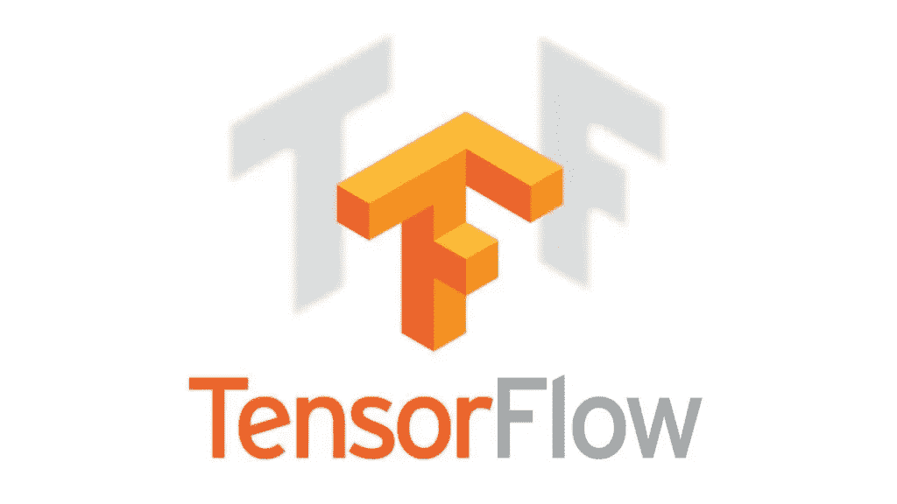
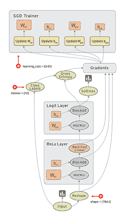
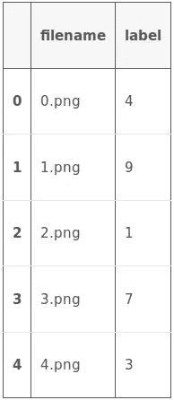
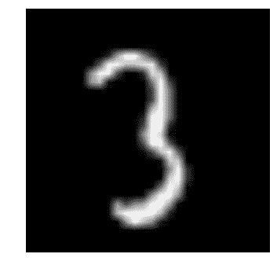
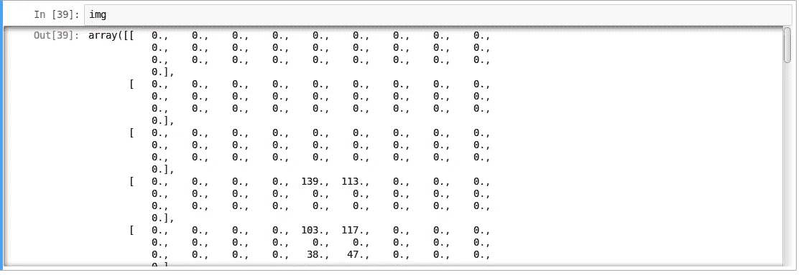
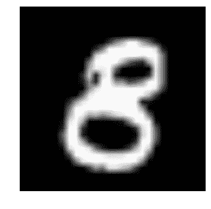

# 使用张量流实现神经网络的介绍

> 原文：<https://medium.com/analytics-vidhya/an-introduction-to-implementing-neural-networks-using-tensorflow-4082c036d40c?source=collection_archive---------1----------------------->

如果你一直在关注数据科学/机器学习，你就不能错过围绕深度学习和神经网络的嗡嗡声。组织正在尽可能地寻找具有深度学习技能的人。从举办竞赛到开放采购项目和支付高额奖金，人们正在尝试一切可能的事情来挖掘这个有限的人才库。自动驾驶工程师正在被汽车行业的大佬们追逐，因为该行业正处于过去几十年来面临的最大破坏的边缘！

如果你对深度学习提供的前景感到兴奋，但还没有开始你的旅程——我在这里可以实现它。从这篇文章开始，我将撰写一系列关于深度学习的文章，涵盖流行的深度学习库及其实际实现。

在本文中，我将向您介绍 TensorFlow。读完这篇文章后，你将能够理解神经网络的应用，并使用 TensorFlow 解决现实生活中的问题。本文将要求您了解神经网络的基础知识，并熟悉编程。尽管本文中的代码是用 python 编写的，但我还是把重点放在了概念上，并尽可能保持语言无关性。

我们开始吧！



*   什么时候应用神经网络？
*   用神经网络解决问题的一般方法
*   了解图像数据和流行的库来解决它
*   什么是张量流？
*   一个典型的张量流“流”
*   在 TensorFlow 中实现 MLP
*   张量流的局限性
*   TensorFlow 与其他库
*   从这里去哪里？

# 什么时候应用神经网络？

神经网络成为焦点已经有一段时间了。关于神经网络和深度学习的更详细的解释[请阅读这里的](https://www.analyticsvidhya.com/blog/2016/08/evolution-core-concepts-deep-learning-neural-networks/)。它的“更深入”版本正在许多领域取得巨大突破，如图像识别、语音和自然语言处理等。

出现的主要问题是什么时候应用神经网络，什么时候不应用神经网络？这个领域现在就像一座金矿，每天都有许多新发现被发现。要成为这股“淘金热”的一部分，你必须记住几件事:

*   **首先，神经网络需要清晰、翔实的数据(大多是大数据)来训练。**试着想象小时候的神经网络。它首先观察它的父母如何走路。然后它试着自己走路，每走一步，孩子就学会如何完成一项特殊的任务。它可能会跌倒几次，但在几次不成功的尝试后，它学会了如何走路。如果你不让它走路，它可能永远也学不会走路。你能给孩子提供的接触越多越好。
*   使用神经网络处理图像处理等复杂问题是谨慎的。神经网络属于一类叫做表示学习算法的算法。这些算法将复杂的问题分解成更简单的形式，以便它们变得可以理解(或“可表示”)。把它想象成吞咽前的咀嚼食物。这对于传统的(非表示学习)算法来说会更加困难。
*   **当你有合适类型的神经网络来解决问题时。每个问题都有它自己的曲折之处。所以数据决定了你解决问题的方式。例如，如果问题是序列生成，递归神经网络更适合。然而，如果是图像相关的问题，你可能会更好地采取卷积神经网络的变化。**
*   **最后同样重要的是，** **硬件** **需求对于运行深度神经网络模型是必不可少的。**神经网络很早以前就被“发现”了，但近年来大放异彩，主要原因是计算资源更好、更强大。如果你想用这些网络解决一个现实生活中的问题，准备买一些高端硬件吧！

# 用神经网络解决问题的一般方法

神经网络是一种特殊类型的机器学习(ML)算法。因此，作为每一个最大似然算法，它遵循通常的数据预处理，模型建立和模型评估的最大似然工作流程。为了简洁起见，我列出了一个如何处理神经网络问题的待办事项列表。

*   检查神经网络是否比传统算法更好(参考上一节中的清单)
*   调查哪种神经网络架构最适合所需的问题
*   定义你所选择的语言/库的神经网络架构。
*   将数据转换为正确的格式，并分批进行分割
*   根据您的需要预处理数据
*   扩充数据以增加规模并制作更好的训练模型
*   向神经网络输入批次
*   培训并监控培训和验证数据集的变化
*   测试您的模型，并保存它以供将来使用

在这篇文章中，我将重点讨论图像数据。因此，在我们深入研究张量流之前，让我们先了解这一点。

# 了解图像数据和流行的库来解决它

图像通常被排列成三维阵列，其维度是指高度、宽度和颜色通道。例如，如果你现在给你电脑截图，它会先被转换成一个三维数组，然后再进行压缩。jpeg 或。“png”文件格式。

虽然这些图像对人类来说很容易理解，但计算机却很难理解它们。这种现象被称为“语义鸿沟”。我们的大脑可以在几秒钟内看到图像并理解完整的画面。另一方面，计算机认为图像只是一组数字。所以问题是我们如何向机器解释这个图像？

在早期，人们试图像“模板”一样将图像分解为机器“可理解”的格式。例如，一张脸总是有一个特定的结构，这个结构在每个人身上都有所保留，比如眼睛的位置，鼻子或者我们脸的形状。但是这种方法会很繁琐，因为当需要识别的物体数量增加时，“模板”就不适用了。

快进到 2012 年，一种深度神经网络架构赢得了 ImageNet 挑战赛，这是一项从自然场景中识别物体的著名挑战。在所有即将到来的 ImageNet 挑战中，它继续统治着它的主权，从而证明了解决图像问题的有用性。

那么人们通常使用哪种库/语言来解决图像识别问题呢？我最近做的一个调查显示，大多数流行的深度学习库都有 Python 接口，其次是 Lua、Java 和 Matlab。举几个例子，最受欢迎的库是:

*   [咖啡馆](http://caffe.berkeleyvision.org/)
*   [深度学习 4j](http://deeplearning4j.org/)
*   [张量流](https://www.tensorflow.org/)
*   [theno](http://www.deeplearning.net/software/theano)
*   [火炬](http://torch.ch/)

现在，您已经了解了图像的存储方式以及常用的库，让我们看看 TensorFlow 提供了什么。

# 什么是张量流？

让我们从官方定义开始，

> *“tensor flow 是一个使用数据流图进行数值计算的开源软件库。图中的节点表示数学运算，而图边表示它们之间通信的多维数据阵列(也称为张量)。灵活的架构允许您使用单个 API 将计算部署到台式机、服务器或移动设备中的一个或多个 CPU 或 GPU。”*



如果这听起来有点可怕，不要担心。这是我的简单定义——把张量流看做一个扭曲的 numpy。如果你之前做过 numpy，理解 TensorFlow 将是小菜一碟！numpy 和 TensorFlow 的一个主要区别是 TensorFlow 遵循一种惰性编程范式。它首先构建一个所有要完成的操作的图，然后当一个“会话”被调用时，它“运行”这个图。它通过将内部数据表示改为张量(也称为多维数组)来实现可伸缩性。建立一个计算图可以被认为是张量流的主要组成部分。要了解更多关于计算图的数学构成，请阅读本文。

很容易把 TensorFlow 归为神经网络库，但不仅仅是这样。是的，它被设计成一个强大的神经网络库。但它有能力做的远不止这些。你可以在其上建立其他机器学习算法，如决策树或 k-最近邻。你可以在 numpy 中做任何你平常会做的事情！它被恰当地称为“类固醇上的 numpy”

使用张量流的优点是:

*   **它有一个直观的构造**，因为顾名思义它有*“张量流”。*您可以轻松地将图表的每个部分可视化。
*   **轻松在 cpu/gpu 上训练分布式计算**
*   **平台灵活性**。你可以在任何你想去的地方运行这些模型，无论是在移动设备、服务器还是个人电脑上。

# 一个典型的张量流“流”

每个库都有自己的“实现细节”，即遵循其编码范式的编写方式。例如，当实现 scikit-learn 时，首先创建所需算法的对象，然后在训练中构建模型并在测试集上获得预测，如下所示:

```
# define hyperparamters of ML algorithm
clf = svm.SVC(gamma=0.001, C=100.)
# train 
clf.fit(X, y)
# test 
clf.predict(X_test)
```

正如我前面所说，TensorFlow 遵循一种懒惰的方法。在 TensorFlow 中运行程序的通常工作流程如下:

*   **构建计算图，**这可以是 TensorFlow 支持的任何数学运算。
*   **初始化变量，**编译先前定义的变量
*   **创建会话，**这是魔法开始的地方！
*   **在会话中运行图形，**编译后的图形被传递给会话，并开始执行。
*   **关闭会话，**关闭会话。

TensoFlow 中使用的少数术语；

```
placeholder: A way to feed data into the graphs
```

*   占位符:将数据输入图表的一种方式

```
feed_dict: A dictionary to pass numeric values to computational graph
```

让我们写一个小程序将两个数相加！

```
# import tensorflow
import tensorflow as tf

# build computational graph
a = tf.placeholder(tf.int16)
b = tf.placeholder(tf.int16)

addition = tf.add(a, b)

# initialize variables
init = tf.initialize_all_variables()

# create session and run the graph
with tf.Session() as sess:
    sess.run(init)
    print "Addition: %i" % sess.run(addition, feed_dict={a: 2, b: 3})

# close session
sess.close()
```

# 在 TensorFlow 中实现神经网络

注意:我们可以使用不同的神经网络架构来解决这个问题，但是为了简单起见，我们决定采用前馈多层感知器进行深入实施。

让我们先回忆一下我们对神经网络的了解。

神经网络的典型实现如下:

*   定义要编译的神经网络架构
*   将数据传输到您的模型
*   在引擎盖下，数据首先被分批次，以便能够被摄取。这些批次首先经过预处理、扩充，然后输入神经网络进行训练
*   然后，该模型得到增量训练
*   显示特定时间步长数的精确度
*   训练后，保存模型以备将来使用
*   在新数据上测试模型，并检查其表现如何

这里我们解决我们的深度学习实践问题——[识别数字](https://datahack.analyticsvidhya.com/contest/practice-problem-identify-the-digits/)。让我们看一下我们的问题陈述。

我们的问题是图像识别，从给定的 28×28 图像中识别数字。我们有一个图像子集用于训练，其余的用于测试我们的模型。所以首先，下载训练和测试文件。数据集包含数据集中所有图像的压缩文件，并且 train.csv 和 test.csv 都具有相应的 train 和 test 图像的名称。数据集中不提供任何附加特征，只提供原始图像。“png”格式。

如你所知，我们将使用 TensorFlow 来制作一个神经网络模型。所以你应该首先在你的系统中安装 TensorFlow。根据您的系统规格，参考[官方安装指南](https://github.com/tensorflow/tensorflow/blob/master/tensorflow/g3doc/get_started/os_setup.md)进行安装。

我们将遵循如上所述的模板。用 python 2.7 内核创建一个 Jupyter 笔记本，按照下面的步骤操作。

*   让我们导入所有需要的模块

```
%pylab inline

import os
import numpy as np
import pandas as pd
from scipy.misc import imread
from sklearn.metrics import accuracy_score
import tensorflow as tf
```

*   让我们设置一个种子值，这样我们就可以控制模型的随机性

```
# To stop potential randomness 
seed = 128 
rng = np.random.RandomState(seed)
```

*   为了安全起见，第一步是设置目录路径！

```
root_dir = os.path.abspath('../..')
data_dir = os.path.join(root_dir, 'data')
sub_dir = os.path.join(root_dir, 'sub')

# check for existence
os.path.exists(root_dir)
os.path.exists(data_dir)
os.path.exists(sub_dir)
```

*   现在让我们阅读我们的数据集。这些是流行的。csv 格式，并有一个带有适当标签的文件名

```
train = pd.read_csv(os.path.join(data_dir, 'Train', 'train.csv'))
test = pd.read_csv(os.path.join(data_dir, 'Test.csv'))

sample_submission = pd.read_csv(os.path.join(data_dir, 'Sample_Submission.csv'))

train.head()
```



*   让我们看看我们的数据是什么样的！我们读取并显示我们的图像。

```
img_name = rng.choice(train.filename)
filepath = os.path.join(data_dir, 'Train', 'Images', 'train', img_name)

img = imread(filepath, flatten=True)

pylab.imshow(img, cmap='gray')
pylab.axis('off')
pylab.show()
```



上面的图像表示为 numpy 数组，如下所示



*   为了便于数据操作，让我们将所有图像存储为 numpy 数组

```
temp = []
for img_name in train.filename:
    image_path = os.path.join(data_dir, 'Train', 'Images', 'train', img_name)
    img = imread(image_path, flatten=True)
    img = img.astype('float32')
    temp.append(img)

train_x = np.stack(temp)

temp = []
for img_name in test.filename:
    image_path = os.path.join(data_dir, 'Train', 'Images', 'test', img_name)
    img = imread(image_path, flatten=True)
    img = img.astype('float32')
    temp.append(img)

test_x = np.stack(temp)
```

*   由于这是一个典型的 ML 问题，为了测试我们模型的正常运行，我们创建了一个验证集。让我们对训练集和验证集采用 70:30 的分割大小

```
split_size = int(train_x.shape[0]*0.7)

train_x, val_x = train_x[:split_size], train_x[split_size:]
train_y, val_y = train.label.values[:split_size], train.label.values[split_size:]
```

*   现在我们定义一些辅助函数，我们稍后会在程序中用到

```
def dense_to_one_hot(labels_dense, num_classes=10):
    """Convert class labels from scalars to one-hot vectors"""
    num_labels = labels_dense.shape[0]
    index_offset = np.arange(num_labels) * num_classes
    labels_one_hot = np.zeros((num_labels, num_classes))
    labels_one_hot.flat[index_offset + labels_dense.ravel()] = 1

    return labels_one_hot

def preproc(unclean_batch_x):
    """Convert values to range 0-1"""
    temp_batch = unclean_batch_x / unclean_batch_x.max()

    return temp_batch

def batch_creator(batch_size, dataset_length, dataset_name):
    """Create batch with random samples and return appropriate format"""
    batch_mask = rng.choice(dataset_length, batch_size)

    batch_x = eval(dataset_name + '_x')[[batch_mask]].reshape(-1, input_num_units)
    batch_x = preproc(batch_x)

    if dataset_name == 'train':
        batch_y = eval(dataset_name).ix[batch_mask, 'label'].values
        batch_y = dense_to_one_hot(batch_y)

    return batch_x, batch_y
```

*   现在是主要部分！让我们定义我们的神经网络架构。我们定义了一个具有 3 层的神经网络；输入、隐藏和输出。输入和输出中神经元的数量是固定的，因为输入是我们的 28 x 28 图像，输出是代表类的 10 x 1 向量。我们在隐藏层取了 500 个神经元。这个数字可以根据您的需要而变化。我们也给剩余的变量赋值。阅读关于神经网络基础的[文章，深入了解其工作原理。](https://www.analyticsvidhya.com/blog/2016/03/introduction-deep-learning-fundamentals-neural-networks/)

```
### set all variables

# number of neurons in each layer
input_num_units = 28*28
hidden_num_units = 500
output_num_units = 10

# define placeholders
x = tf.placeholder(tf.float32, [None, input_num_units])
y = tf.placeholder(tf.float32, [None, output_num_units])

# set remaining variables
epochs = 5
batch_size = 128
learning_rate = 0.01

### define weights and biases of the neural network (refer [this article](https://www.analyticsvidhya.com/blog/2016/03/introduction-deep-learning-fundamentals-neural-networks/) if you don't understand the terminologies)

weights = {
    'hidden': tf.Variable(tf.random_normal([input_num_units, hidden_num_units], seed=seed)),
    'output': tf.Variable(tf.random_normal([hidden_num_units, output_num_units], seed=seed))
}

biases = {
    'hidden': tf.Variable(tf.random_normal([hidden_num_units], seed=seed)),
    'output': tf.Variable(tf.random_normal([output_num_units], seed=seed))
}
```

*   现在创建我们的神经网络计算图

```
hidden_layer = tf.add(tf.matmul(x, weights['hidden']), biases['hidden'])
hidden_layer = tf.nn.relu(hidden_layer)

output_layer = tf.matmul(hidden_layer, weights['output']) + biases['output']
```

*   此外，我们需要定义神经网络的成本

```
cost = tf.reduce_mean(tf.nn.softmax_cross_entropy_with_logits(output_layer, y))
```

*   并设置优化器，即我们的反向传播算法。这里我们使用 [Adam](https://arxiv.org/abs/1412.6980) ，它是梯度下降算法的一个高效变体。tensorflow 中还有许多其他的优化器(参见[这里](https://www.tensorflow.org/versions/r0.11/api_docs/python/train.html#optimizers))

```
optimizer = tf.train.AdamOptimizer(learning_rate=learning_rate).minimize(cost)
```

*   在定义了我们的神经网络架构之后，让我们初始化所有的变量

```
init = tf.initialize_all_variables()
```

*   现在让我们创建一个会话，并在会话中运行我们的神经网络。我们还在我们创建的验证集上验证我们的模型的准确性

```
with tf.Session() as sess:
    # create initialized variables
    sess.run(init)

    ### for each epoch, do:
    ###   for each batch, do:
    ###     create pre-processed batch
    ###     run optimizer by feeding batch
    ###     find cost and reiterate to minimize

    for epoch in range(epochs):
        avg_cost = 0
        total_batch = int(train.shape[0]/batch_size)
        for i in range(total_batch):
            batch_x, batch_y = batch_creator(batch_size, train_x.shape[0], 'train')
            _, c = sess.run([optimizer, cost], feed_dict = {x: batch_x, y: batch_y})

            avg_cost += c / total_batch

        print "Epoch:", (epoch+1), "cost =", "{:.5f}".format(avg_cost)

    print "\nTraining complete!"

    # find predictions on val set
    pred_temp = tf.equal(tf.argmax(output_layer, 1), tf.argmax(y, 1))
    accuracy = tf.reduce_mean(tf.cast(pred_temp, "float"))
    print "Validation Accuracy:", accuracy.eval({x: val_x.reshape(-1, input_num_units), y: dense_to_one_hot(val_y)})

    predict = tf.argmax(output_layer, 1)
    pred = predict.eval({x: test_x.reshape(-1, input_num_units)})
```

这将是上述代码的输出

```
Epoch: 1 cost = 8.93566
Epoch: 2 cost = 1.82103
Epoch: 3 cost = 0.98648
Epoch: 4 cost = 0.57141
Epoch: 5 cost = 0.44550

Training complete!
Validation Accuracy: 0.952823
```

*   为了用我们自己的眼睛测试我们的模型，让我们想象它的预测

```
img_name = rng.choice(test.filename)
filepath = os.path.join(data_dir, 'Train', 'Images', 'test', img_name)

img = imread(filepath, flatten=True)

test_index = int(img_name.split('.')[0]) - 49000

print "Prediction is: ", pred[test_index]

pylab.imshow(img, cmap='gray')
pylab.axis('off')
pylab.show()Prediction is: 8
```



*   我们看到我们的模型性能相当不错！现在让我们创建一个提交

```
sample_submission.filename = test.filename

sample_submission.label = pred

sample_submission.to_csv(os.path.join(sub_dir, 'sub01.csv'), index=False)
```

搞定了。我们刚刚创建了我们自己训练过的神经网络！

# 张量流的局限性

*   即使 TensorFlow 很强大，它仍然是一个低级的库。例如，它可以被认为是一种机器语言。但是对于大多数目的，你需要模块化和高级接口，比如 keras
*   它仍在开发中，所以更多的精彩即将到来！
*   这取决于你的硬件规格，越多越好
*   仍然不是许多语言的 API。
*   TensorFlow 还有很多东西还没有包含进来，比如 OpenCL 支持。

上面提到的大部分都在 TensorFlow 开发者的视野之内。他们已经制定了一个路线图，用于指定未来应该如何开发这个库。

# TensorFlow 与其他库

TensorFlow 建立在与使用数学计算图的 ano 和 Torch 相似的原理上。但是有了分布式计算的额外支持，TensorFlow 在解决复杂问题方面表现得更好。此外，TensorFlow 模型的部署已经得到支持，这使得它更容易用于工业目的，从而与 Deeplearning4j、H2O 和 Turi 等商业库展开竞争。TensorFlow 有 Python，C++和 Matlab 的 API。最近对 Ruby 和 r 等其他语言的支持也有所增加。因此，TensorFlow 正试图拥有一个通用的语言支持。

# 从这里去哪里？

所以你看到了如何用 TensorFlow 建立一个简单的神经网络。这段代码是为了让人们理解如何开始实现 TensorFlow，所以要有所保留。请记住，要解决更复杂的现实生活问题，您必须稍微调整一下代码。

上述许多功能都可以抽象出来，形成无缝的端到端工作流。如果您使用过 scikit-learn，您可能会知道高级库如何抽象“幕后”实现，以便为最终用户提供更简单的界面。尽管 TensorFlow 已经抽象出了大部分实现，但高级库正在出现，如 TF-slim 和 TFlearn。

# 有用的资源

*   [TensorFlow 官方知识库](https://github.com/tensorflow/tensorflow)
*   Rajat Monga (TensorFlow 技术负责人)[“tensor flow for every one”](https://youtu.be/wmw8Bbb_eIE)视频
*   [专门资源的精选列表](https://github.com/jtoy/awesome-tensorflow/#github-projects)

# 结束注释

我希望这篇文章对你有所帮助。现在，是你尽可能多的练习和阅读的时候了。祝你好运！如果你遵循不同的方法/包/库来开始学习神经网络，我很乐意在评论中与你互动。如果你有更多的建议，请在下面留言。为了获得在神经网络中工作的专业知识，不要忘记尝试我们的深度学习实践问题— [识别数字](https://datahack.analyticsvidhya.com/contest/practice-problem-identify-the-digits/)。

*原载于 2016 年 10 月 3 日*[*www.analyticsvidhya.com*](https://www.analyticsvidhya.com/blog/2016/10/an-introduction-to-implementing-neural-networks-using-tensorflow/)*。*