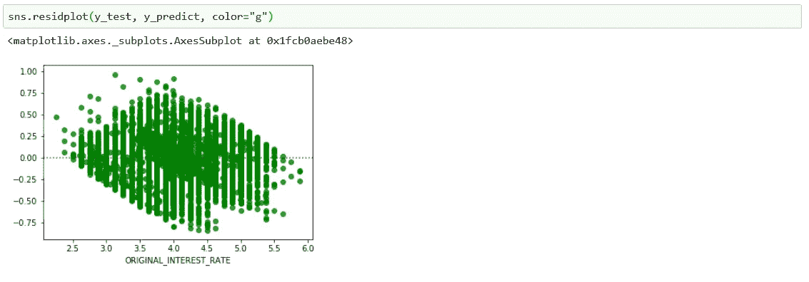

# 用 Scikit-Learn 介绍机器学习。

> 原文：<https://medium.com/analytics-vidhya/an-introduction-to-machine-learning-with-scikit-learn-9f72812dd413?source=collection_archive---------14----------------------->

**照片由** [**安迪·凯利**](https://unsplash.com/@askkell?utm_source=medium&utm_medium=referral) 拍摄

这个故事代表了一个简单的途径，使用 **Scikit-Learn 框架**和使用**批量推理**来构建一个**回归 ML 模型**。

这里，一个住房贷款利率预测器是使用房地美单户住房贷款数据建立的。使用 Scikit-Learn 可以使用类似的方法构建任何回归模型。

# 使用的工具/软件:

1.  服务— Jupyter 笔记本。
2.  存储—电脑。
3.  语言— Python。

# 构建 ML 模型所遵循的清单:

1.  纵观全局。
2.  导入和选择有效数据。
3.  数据分析和可视化。
4.  数据准备管道。
5.  尝试不同的模型并选择一个模型。
6.  超参数调整、特征选择和最终流水线。
7.  最终模型培训和评估。
8.  解决方案演示。
9.  批量部署和监控。

# 1.纵观全局。

**纵观全局。**

> 这里建立的 ML 模型将预测新住房贷款申请的准确利率， ***帮助*** 精算师快速做出&准确的最终利率决定。这将有助于金融机构获得更多的业务，使家庭贷款收购过程更简单和准确。
> 
> 由于精算师需要确定每个新申请的确切利率，这里的问题被归类为*监督多元单变量回归。*监督*作为历史数据具有利率标签，*多重*作为使用多个输入特征，*单变量*作为模型将预测每个贷款申请的单个输出。*
> 
> *用于模型评估的性能测量是 RMSE，因为它对较大的误差给予较大的权重。最后，批量转换用于预测新应用的速率。*

# *2.导入和选择有效数据。*

> *静态采集数据使用网络抓取技术从*房地美*网站下载。从 2015 年*到 2017 年*的样本采集数据用于建立模型，从 2018 年*到 2018 年*用于验证。因此，现在使用*2015–2017*数据，一旦我们都设定了最终模型，将使用 *2018* 。*
> 
> *总行数为 *150000* ，等于*2015–2017*年样本文件中每笔贷款的 *27 个属性*的收购贷款总数。在 *27 个* *属性*， *2 个是日期，13 个是分类，12 个是连续*。每年的数据每月都有。*
> 
> *一旦数据被下载，只有符合用户指南的有效记录被选择用于进一步分析，产生 *149919* 行数。日期列类似 ***到期 _ 日期*** *，*分类列 ***产品 _ 类型*** *，* ***贷款 _ 序列号*** *，* ***超级 _ 确认 _ 标志*** *和****pre _ harp _ 贷款 _ 序列号****

**请访问 [***用户指南***](http://www.freddiemac.com/fmac-resources/research/pdf/user_guide.pdf)**&[***GIT 链接***](https://github.com/abhilash499/Scikit-Learn-Regression) 了解*导入数据脚本*和*抄书分析。*****

# *******3。数据分析和可视化。*******

## ****3.1 分类属性:****

> ****在 12 个分类属性中，有 9 个用于我们来自初始数据分析的模型。****
> 
> ******唯一值**和**计数**被检查以确保数据干净并符合用户指南。****
> 
> ******还为分类属性**绘制了关系、分布和比较图**。******

********

******带状和箱形地块。******

## ******3.2 数值属性:******

> ****对所有数值属性的汇总计算如下。****
> 
> ******关系、分布和相关性**也被绘制成数字属性**。******

********

******散点图、LM 图和分布图。******

********

******相互关系的热度图。******

## ****3.3 拆分数据:****

> ****数据(2015-2017 年)现在分为训练集和测试集，80%作为训练集，20%作为测试集。在最终的推理管道建立之前，测试数据将保持不变。在这种情况下使用随机分裂，但是我们也可以基于某些特征使用分层分裂。列车数据有 119935 行。****

********

******随机列车试裂。******

# ****4.数据准备。****

****Scikit 学习管道用于每个后续步骤。****

## ****4.0 设置数据和变量。****

> *******Train*** 和 ***Train_Labels*** 数据是从上面拆分步骤中创建的 ***Train 数据*** 中提取的。像 ***num_cols*** ， ***cat_cols*** 和 ***Index*** 这样的变量被设置为在管道中使用。****

********

******设置数据和变量。******

## ****4.1 **创建邮政编码和分类字典。******

> ****输入数据中有三位数的邮政编码。提取所有可用的不同后代码，计数至 *885* 。基于*****100 个地点******5 公里*** ***半径 **L *纬度*** *在 885 个中，有 883 个只是聚集在一起，因为我们的纬度和经度确定算法无法定位两个邮政编码。在预处理期间，这两个邮政编码将被分配给**其他**类别，以便它们可以被一键编码器使用。**********

******

***美国无团簇。***

******

*****US 聚类成 10 个聚类。*****

***最终的字典被保存以用于后面的预处理步骤。*聚类脚本*请访问 [***Git 链接***](https://github.com/abhilash499/Scikit-Learn-Regression) 。***

## ***4.2 **准备数值变量。*****

> ***由于此处所有数值变量都不为空，因此仅使用 StandardScaler 在管道中执行缩放。***

******

*****数值流水线。*****

## ***4.3 准备分类变量。***

> ***作为分类预处理的一部分，构建管道以从首次付款日期开始 **a.** 提取**月**。 **b.** 估算 **PPM** 标志，用 Y 表示任何不可用的值。 **c.** 将 **MSA** 分类为 1 表示任何可用的 MSA 代码，0 表示其他**。d.** 用之前创建的字典中的集群替换**邮政编码**。字典中不存在的任何邮政编码被分配给群 10。 **e .对所有分类变量执行一次热**编码。***

******

*****分类管道。*****

## ***4.4 定义完整的管道和预处理数据。***

> ***定义完整的管道，并对训练数据进行预处理，如下所示。***

******

*****全预处理管道。*****

# ***5.尝试不同的模型并选择一个模型。***

******

*****RMSE 在训练后对所有训练数据进行评分，并使用来自同一训练集的少量记录进行测试。*****

******

*****RMSE 评分和 STD 采用交叉验证。*****

> ***从上面来看，线性回归和树是过度拟合的，而森林稍好一些。因此将尝试使用 XGBoost 作为最终模型并继续。***

# ***6.超参数调整、特征选择和最终流水线。***

## ***6.1 使用默认参数定义最终模型。***

******

*****用一些参数定义最终回归模型。*****

## *****6.2** 最终模型**超参数调谐。*****

> ***执行五次独立的随机搜索以获得最终的超参数值。***

******

*****XGBoost 随机搜索参数。*****

> ***以下参数是通过随机搜索最终选定的。***

******

*****最终 XGBoost 参数。*****

## *****6.3 特征重要性使用随机森林。*****

> ***使用随机森林计算特征重要性。一旦计算出特征重要性，它们就与各自的特征名称相关联，如下所示。***

******

*****使用随机森林随机搜索最佳特征。*****

******

*****特征重要性与特征名称。*****

> ***Tuned XGBoost 将使用计算出的特性重要性从 175 个原始特性中选择适当数量的特性。***

## ***6.4 最终管道和特征选择。***

> ***创建特征选择类以在管道中使用，如下所示。***

******

*****特征选择类。*****

> ***使用以下管道进行特征选择。***

******

*****特征选择管道。*****

> ***最终选择前 155 个特征用于使用调整后的 XGBoost 模型进行预测。***

******

*****选择顶级功能。*****

# ***7.最终模型训练、评估和保存。***

> ***最终模型用训练数据训练，并用测试数据验证。***

******

*****用训练数据训练模型。*****

******

*****用测试数据预测。*****

******

*****试验和预测数据的残差图。*****

> ***最后，根据所有可用数据(即 2015 年至 2017 年的数据)对模型进行训练，并进行筛选以进行推理。***

******

*****最终模型腌制备用。*****

# ***8.解决方案演示:***

1.  ****决定利率最重要的因素是信用评分，并且是负相关的。****
2.  ****单位数量与费率成正比。****
3.  ****原贷款期限与利率成正比。****
4.  ****以下是决定房屋贷款利率的 19 大特征。它可能是直接相关的，也可能是反向相关的，这可以通过仔细观察 LM 图来确定。****

******

*****决定房屋贷款利率的 19 大特征。*****

****OCCUPANCY_STATUS I =投资物业，首付款日期 3 月，邮政编码 7(指办公区域)调用更多费率。****

****5。下面也是关于聚集邮政编码的顶级场所的细节。****

******

***邮政编码簇 7 代表官方区域。***

***除此之外，通过仔细观察图表和数据，可以获得更多的观察结果。***

# ***9.批量部署和监控:***

> ***一旦保存了模型，就为批量推理做好了准备。作为批量推断的一部分，将下载 2018 年的数据，并使用最终管道进行推断。***

******

*****已保存的模型被加载用于推理。*****

> ***残差图绘制如下。结果表明，该模型的预测率范围为+- 0.75。例如，对于 5%的实际利率，最小预测利率为 4.25%，最大预测利率为 5.75%。对于许多应用来说，预测的速率在+-0.25 之内，因为图表在轴附近非常密集。***
> 
> ***由于我们的目的是帮助精算师快速做出决定，这可能有助于节省一些时间。***

******

*****RMSE 与 2018 年数据残差图。*****

> ***在推断过程中，由于出现了三个新的销售者名称和服务者名称，因此出现了错误。2015–2017 年的数据中没有这些卖家名称和服务商名称。因此，在最终管道被调用之前，这些在有效数据选择部分被删除。要包含这些新名称，需要执行一键编码，即重新训练最终管道。***

***这标志着使用 Scikit Learn 介绍 ML 管道的结束。使用 **PySpark** 处理所有可用数据可以探索更多，比 **Scikit Learn 更快。风险预测器**也可以使用近**20 年的性能数据构建。*****

***请访问 [***Git 链接***](https://github.com/abhilash499/Scikit-Learn-Regression) 获取所有 Python 脚本。***

***这种方法可能不是计算房屋贷款利率的完美方式。此示例仅用于演示 Scikit Learn ML 构建回归模型的步骤，可以作为构建 ***真实风险模型*** *的起点。****

***感谢阅读。欢迎提问和建议。***

***问候，***

***阿比。***