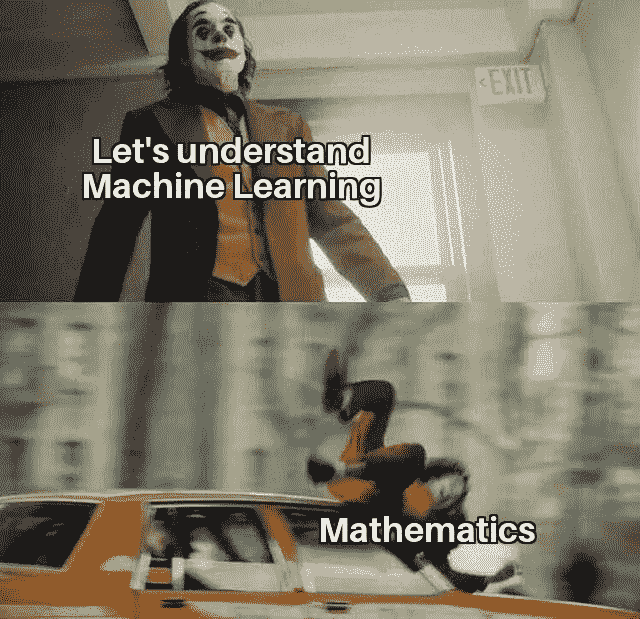
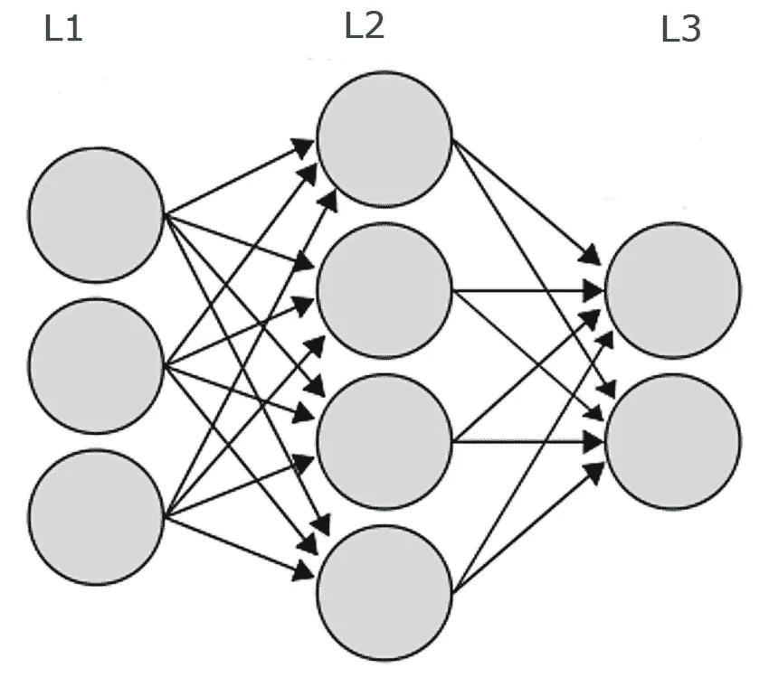
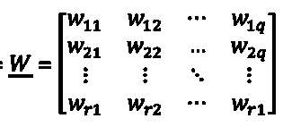
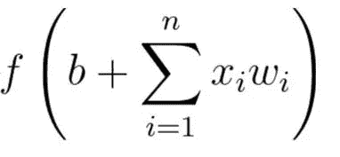
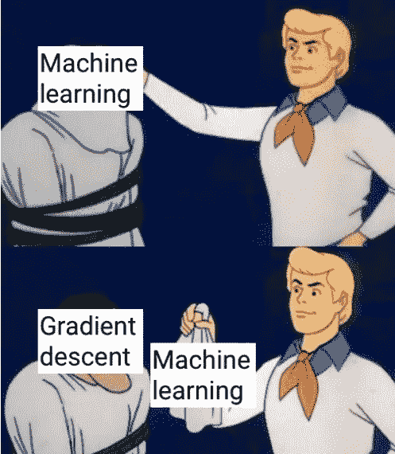

# 神经网络背后的数学导论

> 原文：<https://medium.com/analytics-vidhya/an-introduction-to-mathematics-behind-neural-networks-135df0b85fa1?source=collection_archive---------9----------------------->

来源:互联网

自从工业革命以来，机器一直在帮助我们。它们不仅影响我们的生产力，而且是决定一个国家经济的主要因素。在过去的几个世纪里，它们经历了一系列的改进，自从它们第一次出现以来，已经经历了各种各样的畸变。但有一件事基本保持不变，那就是它明显依赖于人的大脑来执行命令。在过去的几年里，人们正在进行研究以使机器具有智能。于是，“人工智能和机器学习”这个术语就应运而生了。我之前的博客“[对机器学习这个术语的简要介绍](/analytics-vidhya/a-brief-introduction-to-the-term-machine-learning-40e0e995b722)”给了你非常清晰的见解。

神经网络已经发展成为人工智能的一个密切的附属部分。在博客“[神经网络:模仿人脑的艺术](/analytics-vidhya/neural-networks-an-art-to-mimic-human-brain-7c5fcbe5c921)”中给出了神经网络的定义和工作原理。在这一节中，我将详细解释这些网络背后的数学原理。从我的角度来看，这相当于知道这些网络到底是什么，以及它到底是如何工作的，人们应该对其背后的数学有一个清晰的概念。这肯定会让你灵活地尝试不同的东西来获得我们想要的结果。

来源:互联网

> 神经网络基本上是各层的密集互连，这些层进一步由称为感知器的基本单元组成。感知器由输入端、处理单元和输出端组成。感知器的输入端连接到前面的感知器的输出端。

单个感知器接收来自前一层的一组 n 输入值。它根据权重向量 w 计算向量输入值的加权平均值，并向结果添加偏差。该计算的结果通过非线性激活函数传递，该函数形成该单元的输出。下图给出了 n 输入求和的综合概念，乘以相应的权重。在获取输出ŷ之前，加权和通过一个激活函数。在某些情况下，在激活阶段之前，偏差与加权和一起被添加。

单一感知器(来源:互联网)

现在让我们利用从单个感知器到多个感知器的密集堆栈的场景，这些感知器共同构成一个层。下图显示了一个三层网络。

在这个图中，L1、L2 和 L3 代表一个三层的级联，其中每一层都是一堆相互堆叠的感知机。对于数学建模，让我们对所有值进行矢量化，包括输入、输出和中间权重。保持 L2 作为参考层，输入向量来自 L1 层的输出。而 L2 的输出向量作为 L3 的输入。

在过渡到层的一般符号时，我们使用向量 X 来指示输入向量，其中 X=[x1，x2，x3]。输出向量ŷ构成 L2 层中四个感知器单元的各自输出，其中ŷ = [y1，y2，y3，y4]。转到权重，权重是在网络内转换输入数据的参数。每层由唯一的权重矩阵 W 表征。这里，L2 具有权重矩阵 W，并且矩阵的每个元素被表示为 W[r，q]，其中 r，q 分别表示行和列。

W 的分量是将输入元素连接到给定层中相应感知器的权重。第一个索引 r 表示将进入 L2 层的输入向量 X 的元素。第二个指数 q 代表 L2 层中的感知器，其中输入正进入。

输入向量与相应权重的加权平均值可以数学建模为相应向量的点积。使用点积，我们将输入矩阵 X 乘以权重矩阵 W 的转置。转置是为了匹配点积的 W 和 X 的维数。在此过程之后，我们使用矩阵加法添加偏置向量。这些步骤统称为 ***正向传播*** 。这个数学方程式是:

现在，正向传播过程中还有最后一步，即通过激活函数进行非线性转换。让我们了解非线性变换的概念及其在正向传播过程中的作用。

传统的机器学习算法仅仅基于连接输入和输出标签的关系是线性的假设。他们强调在推导方程时引入线性。但事实证明这是一种偏差。所有普遍现象实际上都是非线性的。单独的线性变换不能捕捉复杂的关系。因此，我们在网络中引入了一个新的组件，它对数据施加非线性。这个架构的新成员被称为**激活功能**。

> 激活函数决定了深度学习模型的准确性，也决定了训练模型的计算效率。激活函数对神经网络的收敛能力也有重要影响，即找到最佳的权重和偏差。没有它们，我们的神经网络就会变成线性函数的线性组合。使用了不同的激活功能，其中广泛使用的有 *relu* 、*s 形*、 *tanh* 和 *softmax* 。

来源:互联网

前向传播后，每个神经层给出一个输出向量ŷ，作为输入向量传递给下一层，这个过程一直持续到最后一层。现在在网络的最后一层，我们产生整个网络的输出。在初始前向传播过程中(即第一次迭代通过网络)，我们随机初始化权重和偏差。这些值被视为神经网络算法的参数。现在，我们必须根据数据集调整这些参数，或者通常我们可以称之为“*问题陈述*”。权重和偏差的调整是在另一组称为 ***反向传播算法的帮助下完成的。***

我们在网络末端有输出向量ŷ。来自网络的这个特定输出的误差是相对于实际预期输出来计算的，因为它毕竟是一个监督学习。测量所有数据点的误差之和，得出总误差。最终目标是通过调整构建的网络中的权重和偏差，使总误差尽可能低。为了建立数学模型，我们构造了损失函数，这是一个将总误差与网络的权重和偏差联系起来的数学方程。损失函数将一组参数映射到标量值上，该标量值表示这些参数完成期望结果的程度。如果你的预测很差，那么你的损失函数将输出一个更高的数字。如果他们很好，它会输出一个较低的数字。损失函数的一般方程由下式给出:

y:实际产量

ŷ:预测产量

n:总数据点

其中ŷ由下式给出:

上式中的 f(z)是应用于输入向量加权和的激活函数。从上面的等式中，我们可以得出这样的概念，即*损失函数清楚地将模型引起的总损失与一组参数联系起来，这些参数是权重和偏差*。我们的任务仍然是找到损失函数产生最小值标量的最佳参数。这项任务通常委托给一种叫做**梯度下降**的优化算法。

> “梯度下降是一种一阶迭代优化算法，用于寻找可微分函数的局部最小值。为了使用梯度下降找到函数的局部最小值，我们采取与函数在当前点的梯度(或近似梯度)的*负值*成比例的步骤。”维基百科说，这是一个精致的定义。

在反向传播过程中，模型会尝试更新参数，以使整体预测更加准确。前向传播从“从左到右”或从网络的起点到终点，而反向传播从“从右到左”或从网络的终点到起点。

# 神经网络是如何学习的？

学习过程只不过是改变 **W(权重)**和 **b(偏差)**参数的值，从而最小化损失函数。从数据集中，取每个点，向前传播并获得损失。关于错误的信息通过网络反向传播，从而可以改变参数。

对于每次迭代，我们将获得损失函数相对于我们的网络的每个参数的偏导数的值，其可以使用链式法则分解如下。

上述等式中每个术语的详细定义如下。

为了使用获得的梯度下降来学习模型系数，我们简单地通过在每次通过时向梯度的相反方向迈一步来更新权重 **W** 。当我们到达全局最小值时，算法的这种运动终止，全局最小值是具有零梯度的点。涉及权重更新的等式是:

=W−α(∂Loss(y,ŷ)/∂W)其中α是学习率，∂Loss(y,ŷ)/∂W 是损失函数相对于权重的偏导数。

培训是一个反复的过程。为了获得更好的结果，我们执行多次训练迭代。训练迭代减少了神经网络的总误差。随着权重的更新，神经网络产生更理想的输出。神经网络的总误差应该随着它的训练而下降。试图找到损失函数的最优最小值的梯度下降的图形表示如下所示。将最优最小值对应的权值和偏差作为网络的最终模型参数。

来源:梯度下降 3D——由
Christopher Gondek 可视化

为了进一步优化梯度下降算法，已经发展了广泛的优化技术。我们还可以灵活地微调算法运行的速度。除此之外，我们还必须确保梯度不会停留在局部最小值，而不是全局最小值。我将在接下来的博客中深入探讨所有这些话题。

来源:互联网

> 在这篇博客中，我向你展示了发生在神经网络内部的数学，以及它到底是如何工作的。理解这一过程的基础会非常有帮助。我希望这篇博客对你有所帮助，并激励你深入主题。