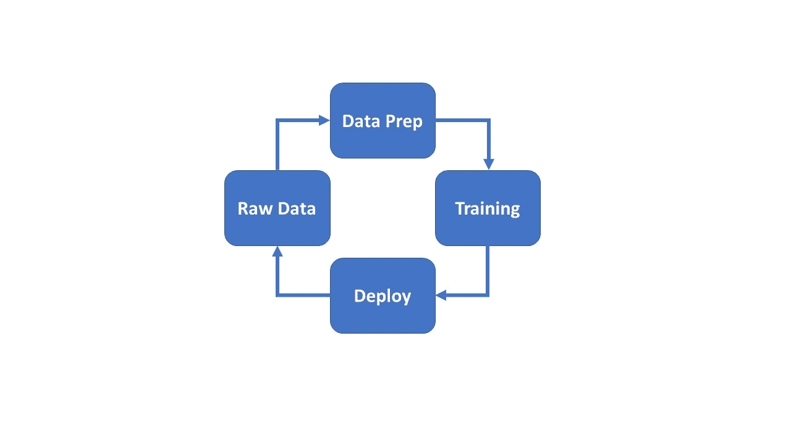

# MLFlow 简介

> 原文：<https://medium.com/analytics-vidhya/an-introduction-to-mlflow-3679575f4eed?source=collection_archive---------23----------------------->

MLFlow 是一个开源平台，用于管理完整的端到端机器学习生命周期。有四个主要组件和功能。

1.  物流跟踪——记录实验数据和结果。可以比较不同参数的结果。
2.  MLFlow 项目——将代码打包成一种格式，能够在许多平台上重复使用和再现。它可以与其他数据科学家共享，并可以转移到生产中。
3.  MLFlow 模型—在不同的服务环境中管理和部署机器学习模型
4.  MLFlow 模型注册—在中央存储库中存储、注释和管理 MLFlow 模型的整个生命周期，还包括模型版本控制。

# 为什么是 MLFlow？

机器学习的目标与传统软件不同，以前的部署环境、库和工具较少。机器学习的目标是优化指标(例如，准确性)，并不断进行实验来改善它们，这一步是非常迭代的。质量取决于输入数据和调谐参数。为了获得最好的结果，许多库的比较和组合也是必要的。因此，MLFlow 提供了一个平台来获取机器学习生命周期中所需的任何东西。

# 机器学习生命周期

图 1:机器学习生命周期

ML 生命周期的四个阶段是:

*   数据准备—有不同的工具和语言来执行数据准备。比如 Scikit learn，pandas，spark SQL，Python，Java，Scala 之类的语言。所有工具都有不同的调整参数。
*   培训—可能需要一个以上的库来进行更好的组合和对比，以获得更好的结果。库会有不同的调优参数。当所有可能的调整参数都经过试验后，最佳模型就出来了。
*   部署——如果上面准备的模型按照需求以适当的速度产生了准确的结果，那么我们就在真实的系统中实现该模型。使用 docker、spark 等。
*   原始数据—收集数据的数量和质量将决定输出的效率。

# MLFlow 克服了机器学习工作流程中的挑战—

*   机器学习需要对大范围的数据集进行实验，数据的规模通常很大。
*   要获得优化的结果，需要进行大量的参数调整实验。
*   由于没有中央存储，很难管理如此大量的数据。
*   即使我们手动维护代码版本和参数的跟踪，也很难复制代码，我们需要捕获谁；以便得到完全相同的结果。

对于任何库，MLflow 都允许人们训练、重用和部署模型，并将它们打包到可重复的步骤中，这些步骤可以被其他数据科学家用作黑盒，甚至不必知道他们正在使用哪个库。