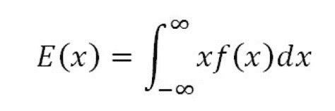
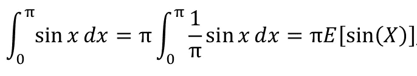
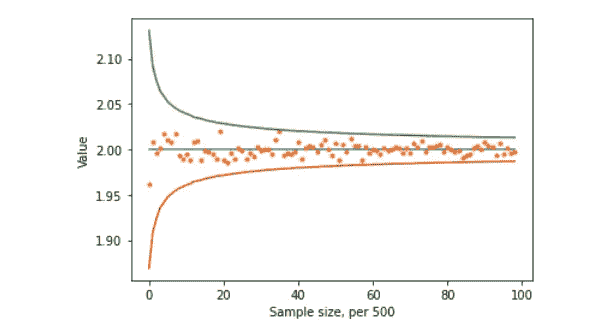
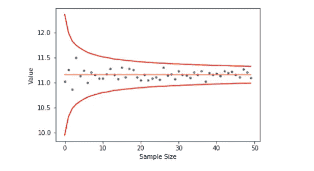

# 蒙特卡洛介绍:估计积分和期权价格的有用工具

> 原文：<https://medium.com/analytics-vidhya/an-introduction-to-monte-carlo-a-useful-tool-to-estimate-integrals-and-option-prices-5331076222a0?source=collection_archive---------26----------------------->

通常在数值分析中，找到问题的精确解是非常复杂的。幸运的是，通常不需要精确的答案，估计可以使问题变得更简单，从而得到一个*接近*的答案。一种这样的技术是通过蒙特卡罗，它依赖于从概率分布中重复采样随机值来执行估计。有了足够的样本，估计值会收敛到基于大数定律的平均值。

[](https://www.investopedia.com/terms/l/lawoflargenumbers.asp) [## 大数定律定义

### 概率和统计中的大数定律表明，随着样本量的增加，其平均值越来越接近…

www.investopedia.com](https://www.investopedia.com/terms/l/lawoflargenumbers.asp) 

蒙特卡罗的一个很好的用例是估计积分。回想一下，具有概率密度函数 f(x)的随机变量 E(x)的期望值可以定义为:



积分界限取决于概率函数的范围

因此，如果给我们一个想要估计的积分，我们可以很容易地把它转换成期望值而不是积分。例如，如果我们想计算 sin(x)从 0 到 *π* 的积分，我们可以将这个计算重写为:



1/ *π* 是概率密度函数，是均匀分布

我们可以通过对均匀分布重复采样来建立蒙特卡罗估计。如果我们将从 0 到 *π* 的样本均匀地输入到 sin(x)中，并取这些值的平均值，这将给出积分的估计值。蒙特卡洛听起来很复杂，但实际上，它归结为从一个分布中取样，反复代入一个方程，然后取平均值。以下代码片段显示了此处的计算:

```
import numpy as np
import matplotlib.pyplot as plt
from scipy.stats import uniform
msin_estimates = [None]*99
msin_std = [None] *99for i in range(1,100):
    #sample uniformly numbers from 0 to pi
    unif_array = uniform.rvs(size = i*500)*np.pi
    # Plug into equation above
    sin_val = np.sin(unif_array)*np.pi
    # Calculate the mean which we use as the estimate
    msin_estimates[i-1] = np.mean(sin_val)
    msin_std[i-1] = np.std(sin_val)/np.sqrt(i*500)
```

现在，让我们把它画出来。我们可以把这些值和积分的实际值 2 画出来。此外，让我们绘制标准偏差图，以表明随着样本量的增加，随着平均值向实际值收敛，标准偏差也向 0 收敛。

```
## Graph Generation
import matplotlib.pyplot as pltplt.plot([2]*99)
plt.plot(msin_estimates, '.')
plt.plot(2+np.array(msin_std)*3)
plt.plot(2+np.array(msin_std)*-3)plt.xlabel('Sample size, per 500')
plt.ylabel('Value')
```



蒙特卡洛的另一个应用是金融中的期权定价，其中模拟股票价格的随机波动，并使用 Black-Scholes 公式计算看涨和看跌期权的价格，确定期权的价值，公式如下:

[](https://www.macroption.com/black-scholes-formula/) [## 布莱克-斯科尔斯公式(d1，d2，买入价格，卖出价格，希腊)

### 本页解释了 d1、d2、看涨期权价格、看跌期权价格的布莱克-斯科尔斯公式，以及…

www.macroption.com](https://www.macroption.com/black-scholes-formula/) 

让我们用以下信息估计一个欧式看跌期权的价格

*   股票波动率为 30%
*   无风险利率为 10%
*   平均股票回报率为 15%
*   目前的股价是 100 美元
*   欧式看跌期权的执行价格是 110 美元
*   合同期限为 6 个月

首先，我们使用两个辅助函数:terminal_value_of_share 模拟随机行走，我们模拟 Z，它来自正态分布并给出 Z 得分，这意味着估计值与其平均值相差多少标准差。由此我们可以代入等式，得到贴现看跌期权的价格，它也是无风险利率的一个因素。

```
def terminal_value_of_share(risk_free_rate, S_0, sigma,Z, T):
    return S_0*np.exp((risk_free_rate-sigma**2/2)*T+sigma*np.sqrt(T)*Z)def discounted_put_payoff(S_T, K, risk_free_rate, T):
    return np.exp(-risk_free_rate*T)*np.maximum(K-S_T,0)
```

对于这种估计，我们对正态分布进行抽样，估计股票的最终价值，并由此得出看跌合约的价格。我还直接从布莱克-斯科尔斯方程计算了分析价格，看看它们是如何比较的。

```
from scipy.stats import norm
import math
risk_free =.1
S_0 = 100
sigma = .3 strike = 100
T = .5
current_time = 0put_estimates = [None] *50
put_std = [None]*50for i in range(1,51):
    norm_array = norm.rvs(size=1000*i)
    term_val= terminal_value_of_share( risk_free, S_0 ,sigma, norm_array, T)
    put_val = discounted_put_payoff(term_val, strike, risk_free, T)
    put_estimates[i-1] = np.mean(put_val)
    put_std[i-1] = np.std(put_val)/np.sqrt(i*1000)d_1 = (math.log(S_0/strike) + (risk_free +sigma**2/2)* (T))/(sigma*math.sqrt(T))
d_2 = d_1 -sigma*math.sqrt(T)analytic_putprice = -S_0*norm.cdf(-d_1) + strike*math.exp(-risk_free*(T-current_time))*norm.cdf(-d_2)
```

根据理论值绘制看跌价格估计值:

```
plt.plot(put_estimates, '.')
plt.plot([analytic_putprice]*50)
plt.plot(analytic_putprice + 3 *np.array(put_std), 'r')
plt.plot(analytic_putprice -3 *np.array(put_std), 'r')plt.xlabel("Sample Size")
plt.ylabel("Value")
plt.show()
```



如您所见，估计值再次收敛到理论值。我给出的例子计算起来很简单，但是在处理难以计算精确解的问题时，蒙特卡罗变得不可或缺。