# 多标签文本分类介绍

> 原文：<https://medium.com/analytics-vidhya/an-introduction-to-multi-label-text-classification-b1bcb7c7364c?source=collection_archive---------0----------------------->

Pierre Bamin 在 [Unsplash](https://unsplash.com?utm_source=medium&utm_medium=referral) 上拍摄的照片

机器学习问题可以分为有监督学习和无监督学习。分类是监督问题的主要部分。分类是根据不同的参数将数据分组的过程。现在，让我们研究不同种类的分类问题。

**二进制 vs 多类 vs 多标签**

分类问题可以是二元的、多类的或多标签的。在二元分类问题中，目标标签只有两个可能的值。例如，垃圾邮件检测算法预测给定的电子邮件是否是垃圾邮件。二元和多类分类的区别在于多类分类有两个以上的类标签。多标签分类问题有两个以上的类别标签，并且实例可能属于多个类别。多标签分类器不是互斥的。换句话说，多类分类问题只给一个实例分配一个标签，而多标签分类问题可以分配一个或多个标签。

在本文中，我们正在使用这个[数据集](https://www.kaggle.com/blessondensil294/topic-modeling-for-research-articles)将研究文章分类到不同的主题中。现在，让我们来研究这些数据。首先，让我们导入所有的库和数据集。

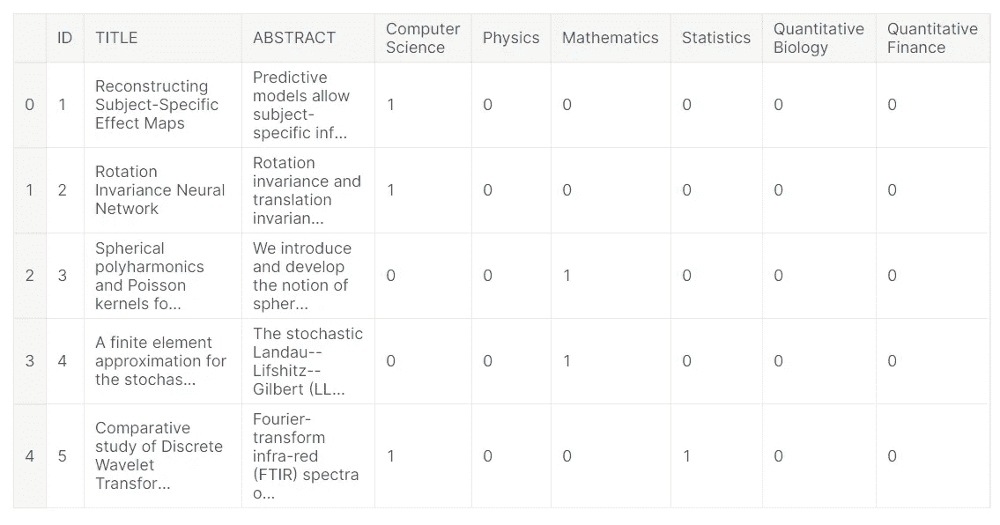

火车 _ 数据.头

该数据集由数千篇研究文章的标题和摘要组成。训练数据包含来自 6 个不同主题的研究文章——计算机科学、物理学、数学、统计学、定量生物学和定量金融学。我们的目标是在这些给定的主题下标记看不见的文章。现在，让我们进一步探索我们的数据集。现在让我们看看商品的标签数量。

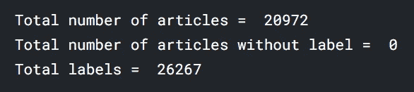

我们在训练数据中有超过 20，000 篇文章。所有的文章都至少有一个主题。有些文章不止一个主题。由于我们的数据集包含带有多个标签的文章，我们正在处理多标签分类问题。让我们画一张图来看看阶级分布。

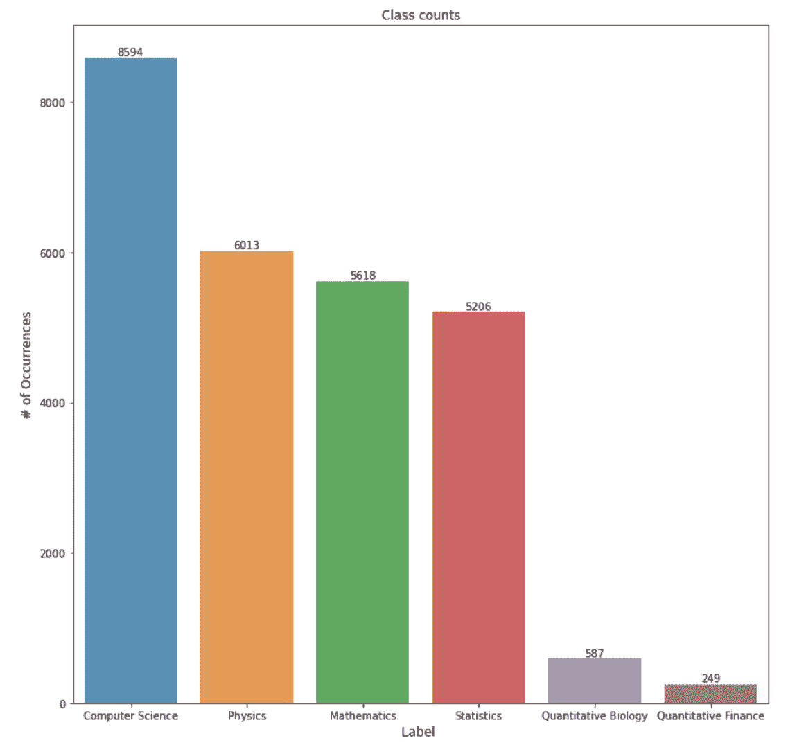

等级分布图

从剧情中可以明显看出，最热门的话题是计算机科学。数据是阶级不平衡的。数量生物学和数量金融主题下的文章数量太低。到目前为止，我们还没有使数据平衡。现在让我们分析每篇文章的标签数量。

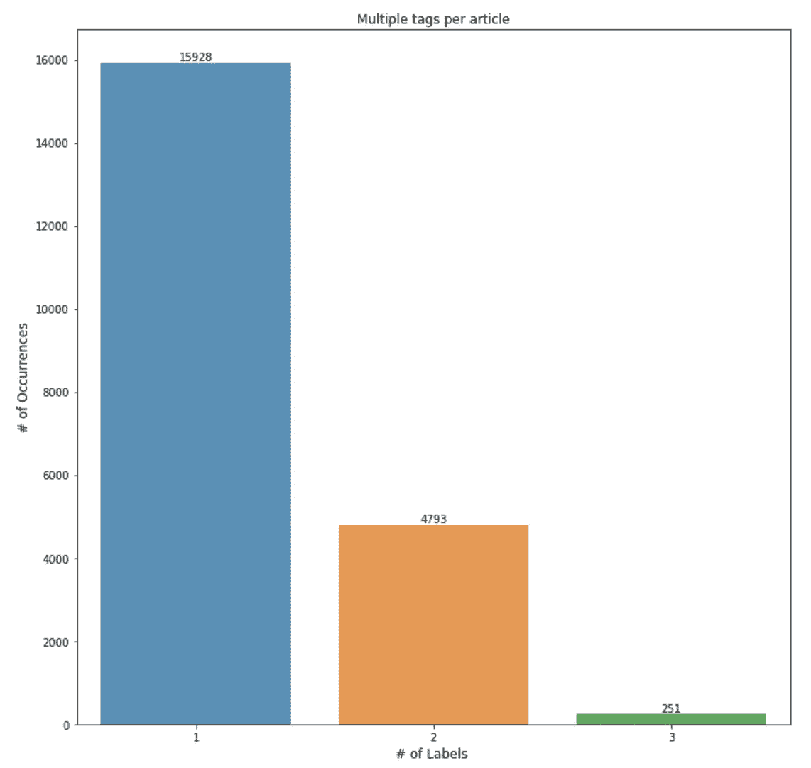

为每篇文章绘制标签

大多数文章只有一个标签。但是，有两个和三个标签的文章。现在，让我们从数据预处理开始。我们将把标题和摘要这两列合并成一个新的列“文本”。

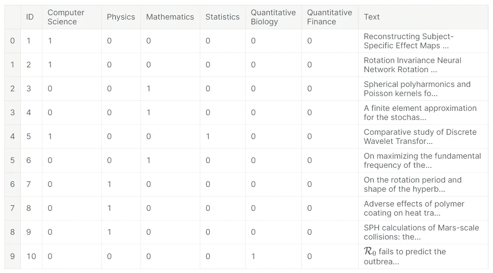

我们必须删除文章中所有的停用词和特殊字符。我们还使用了一个雪球梗。词干分析器将一个单词的所有不同形式转换成一个单词。

**多标签分类**

现在，让我们转向分类部分。多标签分类问题使用像问题转换和算法适应这样的技术。问题转化法将分类问题转化为若干个单标签问题。在问题适应方法中，一些算法适合于执行多标签分类。在本文中，我们将讨论问题转换方法。让我们来看看其中的一些方法。

*   **二元关联:**二元关联将一个具有 L 个标签的多标签分类问题转化为 L 个独立的单标签二元分类问题。在这种方法中，每个分类器预测一个类的成员。所有分类器的预测的联合被作为多标签输出。

让我们看一个例子。设 X 为输入，y1、y2、y3 和 y4 为以下数据集中的标注。

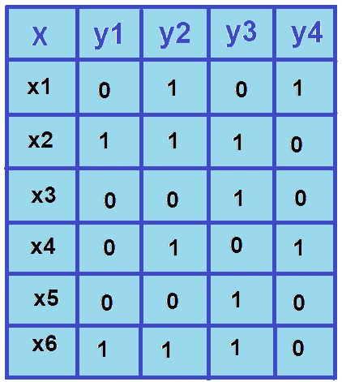

作者图片

由于有 4 个标签，二元相关性使用 4 个独立的二元分类器。每个分类器都是数据集中每个标签的二元分类器。

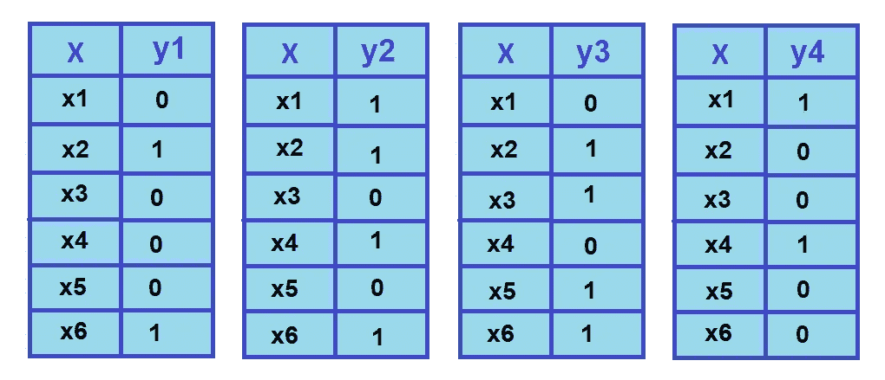

作者图片

如上图所示，多标签分类问题转化为更简单的二元分类问题。由于这是一种简单的方法，二元相关性非常流行。但是，二元相关性的主要缺点是它忽略了类之间可能的相关性。现在，让我们用这种方法对文章进行分类。

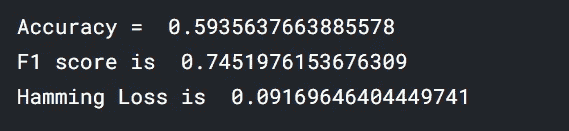

*   **分类器链:**这种技术类似于二元相关性。但是它考虑了标签相关性。该方法使用分类器链，其中每个分类器使用所有先前分类器的预测作为输入。分类器的总数等于类的数量。

由于我们的样本数据集有四个类，这种方法将创建 4 个分类器。初始分类器用类别标签 y1 训练数据。这个分类器的输出作为下一个分类器的输入，依此类推。由于这种方法使用标签相关性，所以它给出了比二进制相关性更好的结果。

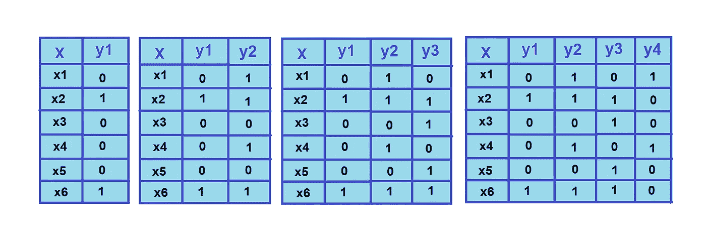

作者图片

现在，让我们应用分类器链对我们的研究文章进行分类。

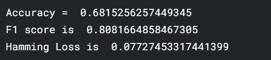

*   **标签电源组:**

label powerset 背后的思想是将多标签分类转化为多类问题。在这种方法中，在训练数据集中的所有唯一标签组合上训练分类器。

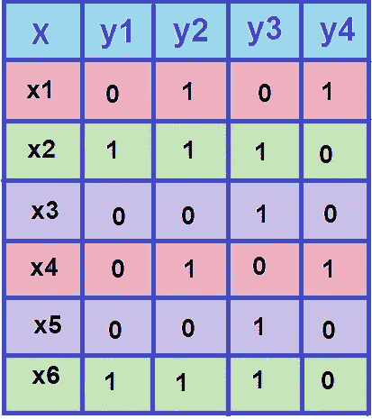

作者图片

考虑上面的图像。项目 x1 和 x4 具有相同的标签集。类似地，x2 和 x6 可以归类为单个标签。项目 x3 和 x5 也共享同一组标签。因此，标签幂集将给定的多标签分类问题转化为单个多类分类问题。

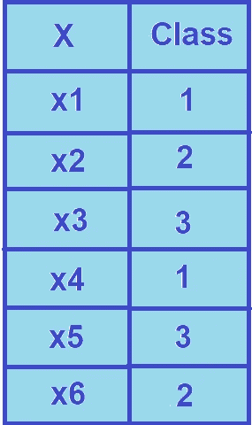

作者图片

随着类别标签数量的增加，唯一标签组合的数量也会增加。这将使使用这种方法变得昂贵。另一个缺点是，它只预测在训练数据集中看到的标签组合。

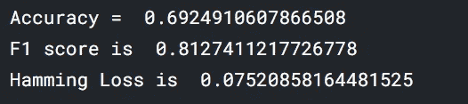

**结论**

我们已经讨论了执行多标签文本分类的问题转换方法。有几种方法来处理多标签分类模型。我们可以使用像 MLkNN 或集成方法这样的适应算法来生成更好的模型。我们也注意到数据是不平衡的。我们可以通过应用 MLSMOTE 等技术来平衡输入数据，从而进一步改进我们的模型。使用像 LSTM 这样的深度学习技术也是一个好主意。

**参考**

*   [https://towards data science . com/journey-to-the-center-of-multi-label-class ification-384 c 40229 BFF](https://towardsdatascience.com/journey-to-the-center-of-multi-label-classification-384c40229bff)
*   [https://www . analyticsvidhya . com/blog/2017/08/introduction-to-multi-label-class ification/](https://www.analyticsvidhya.com/blog/2017/08/introduction-to-multi-label-classification/)